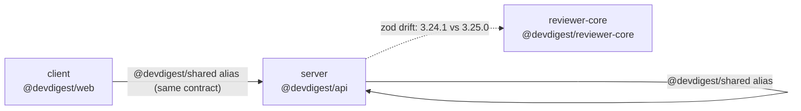
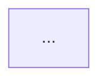

# Dependency Checker

A read-only audit of every dependency in the repo — what depends on what, how
big it is, and what to fix first. This skill **reports and recommends only**.
It never runs `pnpm remove`, `pnpm update`, `pnpm add`, or edits any
`package.json` — those are follow-up actions for the developer to run
themselves after reviewing the report.

---

## When to Run

- Before a major dependency version bump, or before adding a new dependency to
  a package that already has a heavy `node_modules`.
- Quarterly hygiene pass, or when asked "why is `node_modules` so big".
- When duplicate/unused/drifted dependencies are suspected across packages.
- Explicit triggers: `/dependency-checker`, "check our dependencies", "audit
  deps", "draw the dependency graph".
- **NOT** a substitute for `pnpm audit` or the `security` skill — this skill
  covers size, drift, unused deps, and cross-package coupling, not CVE
  scanning. Mention `pnpm audit` results if already known, but don't treat
  this skill as a security scanner.

---

## Scope

This repo is **not a monorepo workspace** — six independent packages, each
with its own `package.json` and `pnpm-lock.yaml`:

| Folder | Package | Notes |
|---|---|---|
| `server/` | `@devdigest/api` | Fastify API, port 3001 |
| `client/` | `@devdigest/web` | Next.js web app, port 3000 |
| `reviewer-core/` | `@devdigest/reviewer-core` | Review pipeline, hermetic |
| `e2e/` | `@devdigest/e2e` | Browser e2e, devDependencies only |
| `evals/` | `@devdigest/evals` | Skill/agent eval harness |
| `mcp-server/` | `@devdigest/mcp-server` | MCP server |

Always list which of these packages were actually analyzed in the report's
own **Scope** section — don't silently skip any without saying so.

---

## Step 1 — Gather External (npm) Dependencies

For each package in scope:

1. Read `dependencies` and `devDependencies` from its `package.json` (or use
   data already supplied in the conversation — see **Working With Pre-Gathered
   Data** below).
2. Get installed size per dependency: `du -sh <pkg>/node_modules/<dep>`, or in
   bulk: `du -sh <pkg>/node_modules/* | sort -rh | head -20`.
3. Check real usage before calling anything "unused": `grep -rl "from ['\"]<dep>" <pkg>/src` (also check `require(`, and note that a CLI/build-only tool like
   `tsx` or `typescript` legitimately has no `src/` import — don't flag those).
4. Build a single name → version table across **all** packages in scope to
   spot drift: same dependency name, different resolved version ranges.

## Step 2 — Gather Internal (path-alias / cross-package) Dependencies

**Hard rule: this repo has no pnpm workspace. Never describe cross-package
sharing as `workspace:*`, a "workspace package", or "monorepo package".** Say
"path alias" or "cross-package import" instead.

Internal dependencies come in two forms — find both, and report them
separately from npm dependencies:

1. **Declared path aliases** — e.g. `@devdigest/shared` (tsconfig alias into
   `server/src/vendor/shared`), `@devdigest/ui` (alias into
   `client/src/vendor/ui`). These are the sanctioned way to share code.
2. **Ad hoc relative imports crossing a package boundary** — e.g. a file in
   `server/src/` importing `../../../reviewer-core/src/pipeline.js` by
   relative path instead of through `reviewer-core`'s public entry point.
   Search with `grep -rn "from ['\"]\.\./\.\./" <pkg>/src` and inspect hits
   that resolve outside `<pkg>/`.

**Any relative import that reaches into another package's internals,
bypassing its public entry point, is P0** — it silently couples two packages
that have independent lockfiles and independent versions of their shared
dependencies (e.g. two different resolved `zod` versions), so a change in one
can break the other with no version constraint to catch it.

`server/src/vendor/` and `client/src/vendor/` are do-not-touch zones (see root
`CLAUDE.md`). Flag misuse of what's imported from them — never propose editing
vendor code itself as the fix.

## Step 3 — Size Analysis

- Per-package total: `du -sh <pkg>/node_modules` for each package in scope.
- Per-package top offenders: `du -sh <pkg>/node_modules/* | sort -rh | head -N`.
- Always render this as a **table** (package | dependency | installed size).
  A prose summary like "client's node_modules is large" is not sufficient —
  name the specific heavy dependencies.

## Step 4 — Severity Tiers

Use exactly these four labels, always uppercase, no synonyms:

- **P0** — cross-package relative import bypassing a public entry point;
  known critical/high CVE (from `pnpm audit` if already known); version drift
  on a dependency that crosses a package boundary as a shared contract (e.g.
  `zod`, since it validates data passed between packages).
- **P1** — a dependency declared in `package.json` but never imported under
  `src/`; non-security version drift on a dependency shared across packages
  that isn't a cross-boundary contract; a dependency whose installed size is
  disproportionate to how little of it is actually used.
- **P2** — devDependency drift on tooling versions (`typescript`, `vitest`,
  `tsx`, `@types/node` differing by patch/minor across packages); missing or
  inconsistent `engines` / package-manager version pinning.
- **Info** — large-but-justified dependencies (e.g. `next`, `playwright`) —
  flagged for awareness only, no action implied.

Every finding must name the exact package plus the exact dependency or file —
never generic advice like "consider optimizing dependencies". If a fix means
removing or upgrading something, phrase it as a recommendation for the
developer to confirm and run themselves, not as something already done.

## Step 5 — Draw the Schematic (Mermaid)

Produce one `flowchart` per report:

- One node per package in scope.
- Solid, labeled edges for internal cross-package dependencies (label the
  edge with the alias or import path, e.g. `@devdigest/shared` or
  `relative import → pipeline.js`).
- A visually distinct edge style (e.g. dotted) or a separate subgraph for
  external npm dependencies that appear with **drifted** versions across ≥2
  packages — this is what makes version drift visible at a glance, not just
  buried in a table.
- Read `.claude/skills/mermaid-diagram/SKILL.md` for styling conventions
  (node shapes, direction, labeling) rather than improvising a new style.

Minimal template to fill in:



## Step 6 — Report Template

Fill in this exact skeleton — do not improvise a different structure:

```markdown
## Dependency Check: <repo/branch>

### Scope
<packages analyzed, and any explicitly excluded with a reason>

### Dependency Graph


### Size Breakdown
| Package | Dependency | Installed Size |
|---|---|---|
| ... | ... | ... |

### Findings & Priorities

#### P0
- `<package>/<file or package.json>` — <specific finding>

#### P1
- ...

#### P2
- ...

#### Info
- ...

### Summary
1. <most important actionable takeaway, naming a specific package/dependency>
2. ...
(3-5 takeaways total, ordered by priority — P0s first)
```

---

## Working With Pre-Gathered Data

If the data this skill needs (package.json contents, `du -sh` sizes, grep
results for imports/usage) is already present in the conversation, use it
directly to produce the report. Do not ask for tool access, do not re-fetch
data that's already been given, and do not stall waiting for a live repo —
treat supplied data as ground truth for the report.

---

## Anti-Patterns

- Calling a path-alias or relative cross-package import a `workspace:*` link,
  or calling any of these six folders a "workspace package" — this repo has
  no pnpm workspace.
- A finding with no named package/dependency/file — "consider optimizing
  dependencies" is not a finding.
- Presenting a removal or upgrade as already performed instead of a
  recommendation to confirm and run.
- Skipping the size table in favor of a prose size summary.
- Silently dropping `e2e`, `evals`, or `mcp-server` from scope without saying
  so in the Scope section.
- Proposing an edit inside `server/src/vendor/` or `client/src/vendor/` as the
  fix — these are do-not-touch zones; flag the importer instead.
- Actually running `pnpm remove` / `pnpm update` / `pnpm add`, or editing a
  `package.json` — this skill has no `Write`/`Edit` tool access by design.
- Asking for tool access or re-fetching data that the conversation already
  supplied.
