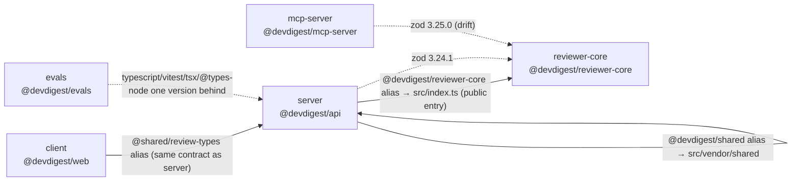

# Worked Example

A full report run against the real repo state (dates and exact byte counts
will drift — this shows the *shape* to reproduce, not numbers to copy). The
`zod`/`tsx`/`typescript`/`vitest`/`@types/node` drift and the `du -sh` sizes
below were true at the time this example was captured; the P0 finding is an
**illustrative counterexample** (marked below) since no live boundary-breaking
import currently exists in this repo — the good pattern (`@devdigest/reviewer-core`
resolving through the package's public `src/index.ts`) is shown for contrast.

---

```markdown
## Dependency Check: dev-digest (feature/lab06)

### Scope
Analyzed: server, client, reviewer-core, evals, mcp-server.
Excluded: e2e (devDependencies only, no `node_modules` currently installed
locally — nothing to size).

### Dependency Graph


### Size Breakdown
| Package | Dependency | Installed Size |
|---|---|---|
| client | node_modules (total) | 629M |
| evals | node_modules (total) | 332M |
| server | node_modules (total) | 235M |
| reviewer-core | node_modules (total) | 156M |
| mcp-server | node_modules (total) | 83M |

### Findings & Priorities

#### P0
- **[Illustrative — not a current violation]** If any file under `server/src/`
  imported `../../reviewer-core/src/pipeline.js` by relative path instead of
  via the declared `@devdigest/reviewer-core` alias (which correctly resolves
  to `reviewer-core/src/index.ts`, its public entry point), that would bypass
  the package boundary and silently couple `server` to reviewer-core internals
  with no version constraint to catch drift. Current usage (e.g.
  `server/src/modules/skills/service.ts:2`,
  `server/src/modules/reviews/run-executor.ts:5`) correctly goes through the
  alias — flagging this pattern here so it's caught if introduced later.

#### P1
- `zod` is `^3.24.1` in `server/package.json`, `client/package.json`, and
  `reviewer-core/package.json`, but `^3.25.0` in `mcp-server/package.json`.
  `zod` is the cross-package validation contract (`@devdigest/shared`
  exports Zod schemas) — recommend aligning `mcp-server/package.json` to
  `^3.24.1` (or bumping all four together) rather than leaving one package
  ahead.

#### P2
- `evals/package.json` pins `typescript@^5.6.0`, `vitest@^2.1.0`,
  `tsx@^4.19.0`, and `@types/node@^22.0.0` — one minor/patch version behind
  the same devDependencies in `server`, `client`, `reviewer-core`, and
  `mcp-server` (`typescript@^5.7.2`, `vitest@^2.1.8`, `tsx@^4.19.2`,
  `@types/node@^22.10.0`). Recommend bumping `evals/package.json` to match.

#### Info
- `client/node_modules` at 629M is the largest by a wide margin, mostly
  attributable to Next.js's own toolchain (`next`, its SWC binaries) — expected
  for a Next.js app, no action recommended.

### Summary
1. Align `zod` to a single version across `server`, `client`, `reviewer-core`,
   and `mcp-server` (currently `mcp-server` alone is on `^3.25.0`) — it's the
   shared validation contract, so drift here is the highest-leverage fix.
2. Bump `evals/package.json`'s `typescript`, `vitest`, `tsx`, and
   `@types/node` to match the other five packages to remove tooling drift.
3. Keep using the `@devdigest/reviewer-core` and `@devdigest/shared` path
   aliases (not `workspace:*`, which doesn't exist here) for any new
   cross-package code sharing — never a relative import that reaches past a
   package's public entry point.
4. No dependency was found declared-but-unused in this pass; re-run after any
   large dependency addition to catch that early.
```
