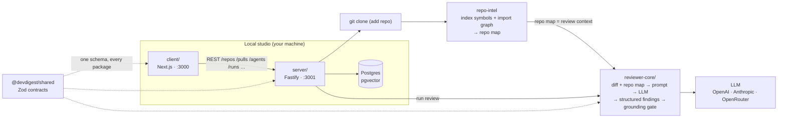

# DevDigest — starter

Local-first AI pull-request review. This is the **fully functional AI Harness**: 

Several standalone packages (no monorepo workspace — each has its own
`package.json` and lockfile; cross-package code is shared through tsconfig path
aliases, not published modules):

| Folder           | Package                     | What it is                                            | Port |
|------------------|-----------------------------|-------------------------------------------------------|------|
| `server/`        | `@devdigest/api`            | Fastify API + Drizzle/Postgres (pgvector)             | 3001 |
| `client/`        | `@devdigest/web`            | Next.js 15 web app (the studio)                       | 3000 |
| `reviewer-core/` | `@devdigest/reviewer-core`  | Pure review engine: diff → prompt → LLM → findings    | —    |
| `e2e/`           | `@devdigest/e2e`            | Deterministic browser e2e (agent-browser)             | —    |
| `server/src/vendor/shared` | `@devdigest/shared` | Zod contracts shared across every package             | —    |

`repo-intel` (the codebase indexer that powers the **Indexed** badge and feeds
project context into reviews) lives inside the server at
[`server/src/modules/repo-intel`](server/src/modules/repo-intel). Only
**Postgres** runs in Docker; the API and web app run on the host via `pnpm dev`.

## Architecture



The review flow end to end: **add a repo** → server clones it and `repo-intel`
indexes it (the **Indexed** badge) → **import PRs** from GitHub → open a PR and
**Review** → `reviewer-core` assembles a prompt from the diff + the repo map,
calls the LLM, validates every finding against the diff (the **grounding gate**
drops hallucinated line references), and persists structured findings with a
severity and score. All local; the only outbound calls are to GitHub (PR data)
and the LLM (via OpenRouter).

Each package has its own README with deeper diagrams:
[`client`](client/docs/README.md) (UI route map) ·
[`server`](server/docs/README.md) (API map) ·
[`reviewer-core`](reviewer-core/docs/README.md) (review pipeline) ·
[`e2e`](e2e/docs/README.md).

## What works

Everything below is implemented and running in the app today.

### Core loop
- **Local launch** — one command brings up Postgres (Docker) + API + web.
- **Settings** — store your LLM API keys (OpenAI / Anthropic / OpenRouter) and GitHub token; pick per-feature models.
- **Add repository** — paste a repo URL; the server clones and `repo-intel` indexes it (symbols + import graph → repo map, the **Indexed** badge).
- **Import pull requests** — sync open + recently merged/closed PRs with diff, commits, body, and linked issue; local-first, and a banner flags when GitHub sync is failing so a stale list is never mistaken for live data.
- **View diff** — GitHub-like diff in the browser, with per-finding badges and deep links.
- **Agents** — built-in General + Security reviewers; create/edit your own (model + system prompt + skills + context), with config version history.
- **Run a review** — single or multi-agent analysis returning structured findings (severity + score), with the grounding gate (drops hallucinated line refs) and repo-map context.

### Review experience
- **Findings workflow** — severity filter and per-finding accept / dismiss that feeds every downstream metric.
- **Run cost** — per-run cost/model badges driven by configurable model pricing.
- **Smart Diff** — files grouped by risk, finding-line highlights, and finding → diff deep-links.
- **PR Intent layer** — classifies a PR's intent, scope, and risk areas before review to keep the reviewer on-topic.
- **Blast Radius** — deterministic impact map from the import graph, with an optional one-call AI explanation.

### PR understanding & history
- **Why+Risk Brief** — an LLM "read this first" card per PR, with an oversized-PR caveat and a timeline across the PR's commits.
- **git-why blame drawer** — per-line history (who/which PR/why), including historical refs beyond the current checkout.
- **Prior PRs per file** — each reviewed file links to the PRs that touched it.
- **Project Context Folder** — curated project docs injected into reviews.
- **Onboarding generator** — generates a newcomer tour of the codebase.

### Skills Tab
- **Skills** — reusable prompt fragments with editor, version history/restore, and usage stats; agents compose an ordered skill list (drag to reorder → controls prompt assembly).
- **Conventions extractor** — mines the repo for team conventions into editable records.
- **Import** — bring skills in by URL, file drag-and-drop, or from a community catalog (source-tagged).

### Multi-agent & collaboration
- **Multi-agent review** — parallel fan-out across agents from a Configure Run page, with per-agent cost/duration estimates.
- **Cross-agent grouping & conflicts** — findings on the same file:line are grouped; disagreements surface as explicit conflicts.
- **Compose Review** — curate merged findings and post them as a real GitHub PR review.

### Observability & performance
- **Run Trace / Live Log** — every run persists a full trace (config, prompt assembly, context pulled, token/cost stats), streamed live over SSE.
- **Per-agent Stats tab** — runs, findings, accept/dismiss rates, cost, latency, severity breakdown, and a recent-runs trend for one agent.
- **Agent Performance dashboard** — a global "which agents earn their keep" screen: summary cards (runs, cost + period delta, pooled accept rate, most-active agent), an accept-rate-sorted table with expandable trends and deep links into each agent's Stats tab, and cost breakdowns by agent and by model. Period presets (30d / 7d / 1d) + custom UTC range; read-only over saved runs.

### Memory
- **Structured memory records** — decisions, conventions, preferences, facts, and learnings with scope and confidence, managed in a `/memory` UI.
- **Review injection** — curated memory is injected into local reviews with strict provenance handling for untrusted sources.
- **Learn from findings** — one click turns a review finding into a memory record.

### CI, MCP & CLI
- **Export to CI** — a wizard generates a GitHub Actions workflow bundle (with the headless `agent-runner`) for an agent, commits it, tracks installations, and supports clean removal.
- **CI Runs** — runs executed in GitHub Actions are ingested back and shown alongside local runs.
- **MCP server** (`mcp-server/`) — exposes DevDigest data (repos, PRs, findings) as MCP tools for AI assistants.
- **CLI** — `devdigest review` runs a review from the terminal.

### Eval pipeline
- **Three content tiers + static gate** (`eval:quality` / `eval:skills` / `eval:agents` / `eval:workflow`) test skills, subagents, and workflow behavior like code.
- **Eval Dashboard** — case editor, metric trend charts, LLM-assisted case generation, and "create eval from finding" to turn review mistakes into regression cases; `reviewer-core` also has a mutation-testing suite.

## Prerequisites

- **Node** ≥ 22 · **pnpm** ≥ 10 (`npm i -g pnpm`) · **Docker** (for Postgres)

## Quick start (from zero)

```sh
./scripts/dev.sh
```

This script:
1. starts Postgres (`docker compose up -d`) and waits until it's healthy,
2. creates `server/.env` and `client/.env` from `.env.example` if missing,
3. installs deps in `server/` and `client/` (only when `node_modules` is absent),
4. applies DB migrations and seeds demo data,
5. launches the API (`:3001`) and the web app (`:3000`).

Open **http://localhost:3000**. Press **Ctrl-C** to stop the dev servers —
Postgres keeps running (`docker compose down` to stop it).

Flags: `--no-seed` · `--no-client` · `--db-only` · `--help`.

> Add your keys in `server/.env` (`OPENAI_API_KEY` / `ANTHROPIC_API_KEY`,
> `GITHUB_TOKEN`) or via the Settings UI at runtime.

## Manual steps (what the script does)

```sh
docker compose up -d                                   # Postgres + pgvector

cd server && pnpm install
pnpm db:migrate          # apply migrations (NOT run automatically on boot)
pnpm db:seed             # idempotent demo data (optional)
pnpm dev                 # API on :3001

cd ../client && pnpm install && pnpm dev               # web on :3000
```

## Useful scripts

`server/`: `dev` · `build` · `db:migrate` · `db:seed` · `db:generate` · `test` · `typecheck`
(unit/integration split: `pnpm exec vitest run --exclude '**/*.it.test.ts'` / `pnpm exec vitest run .it.test`)
`client/`: `dev` · `build` · `start` · `test` · `typecheck`

## Testing & CI

One test suite per package, each gated by its own GitHub Actions workflow with a
path filter — full strategy in **[`TESTING.md`](TESTING.md)**.

| Suite | Workflow | Needs Docker |
|-------|----------|--------------|
| client (vitest + jsdom) | `client.yml` | no |
| server unit (hermetic) | `server-unit.yml` | no |
| server integration (real Postgres) | `server-integration.yml` | yes |
| reviewer-core (engine) | `reviewer-core.yml` | no |
| web e2e (agent-browser, real stack) | `e2e-web.yml` | yes |

Server tests split by filename: `*.it.test.ts` are DB-backed (testcontainers
Postgres); everything else is hermetic. The browser e2e flows live in
[`e2e/`](e2e/docs/README.md) and run deterministically (no LLM).

## Troubleshooting

- **`relation ... does not exist` / API errors on first run** — migrations weren't
  applied. The server does **not** migrate on boot: run `cd server && pnpm db:migrate`.
- **Port 5432 already in use** — another Postgres is running. Stop it, or change the
  host port in `docker-compose.yml`.
- **`vector` type errors** — the pgvector extension is enabled by migration `0000`;
  make sure migrations ran against the Dockerized DB, not a different one.
- **Reset everything** — `docker compose down -v` drops the volume, then re-run
  `./scripts/dev.sh`.
