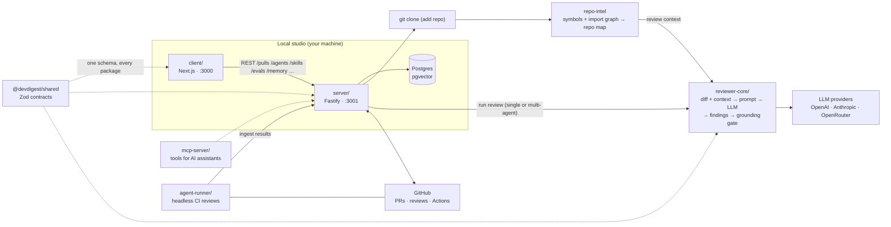
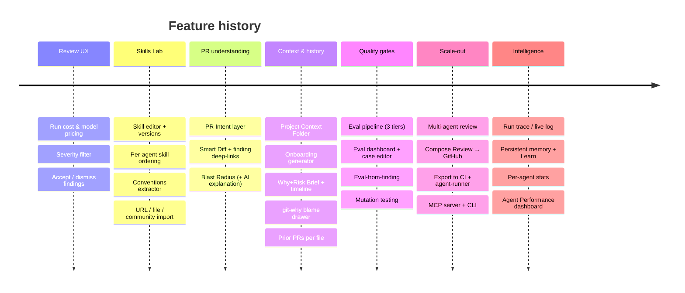
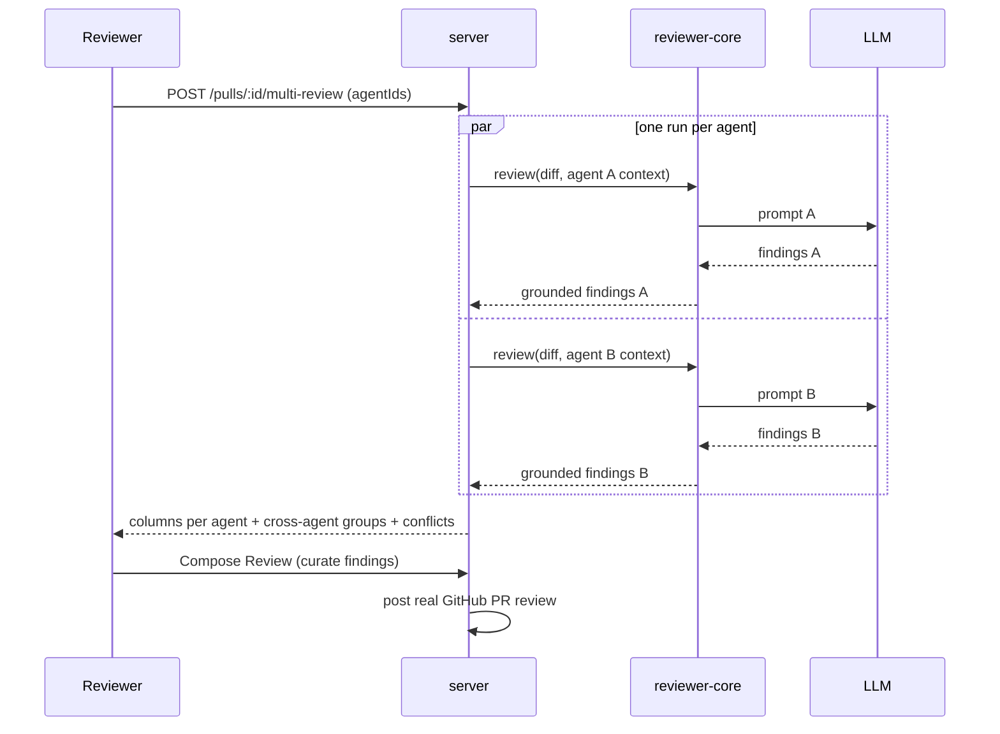
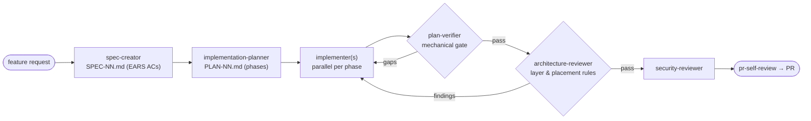

# DevDigest

Local-first AI pull-request review studio. DevDigest imports pull requests from
GitHub, reviews them with configurable LLM agents, and turns everything around
that loop into a product: a skills lab for prompt engineering, multi-agent
reviews with conflict detection, an eval pipeline that gates agent quality,
persistent reviewer memory, CI export, and performance analytics over every
run. Everything runs on your machine; the only outbound calls are to GitHub
(PR data) and your LLM provider.

## Packages

Standalone packages — no monorepo workspace; each has its own `package.json`
and lockfile. Cross-package code is shared through tsconfig path aliases, not
published modules.

| Folder           | Package                     | What it is                                                    | Port |
|------------------|-----------------------------|---------------------------------------------------------------|------|
| `server/`        | `@devdigest/api`            | Fastify API + Drizzle/Postgres (pgvector) — the orchestrator  | 3001 |
| `client/`        | `@devdigest/web`            | Next.js 15 web app — the studio UI                            | 3000 |
| `reviewer-core/` | `@devdigest/reviewer-core`  | Pure review engine: diff → prompt → LLM → grounded findings   | —    |
| `evals/`         | `@devdigest/evals`          | Eval harness for skills, subagents, and workflow behavior     | —    |
| `mcp-server/`    | `devdigest-mcp`             | MCP server exposing DevDigest data to AI assistants           | —    |
| `agent-runner/`  | —                           | Headless review runner bundled into exported CI workflows     | —    |
| `e2e/`           | `@devdigest/e2e`            | Deterministic browser e2e (agent-browser, no LLM)             | —    |
| `server/src/vendor/shared` | `@devdigest/shared` | Zod contracts shared across every package (mirrored to client) | —  |

`repo-intel` (the codebase indexer that powers the **Indexed** badge and feeds
the repo map into reviews) lives inside the server at
[`server/src/modules/repo-intel`](server/src/modules/repo-intel).
Only **Postgres** runs in Docker; API and web run on the host via `pnpm dev`.

## Architecture



The core loop: **add a repo** → server clones it and `repo-intel` indexes it →
**import PRs** → open a PR and **run a review** → `reviewer-core` assembles a
prompt from the diff, the repo map, project context, skills, conventions, and
memory, calls the LLM, validates every finding against the diff (the
**grounding gate** drops hallucinated line references), and persists structured
findings with severity and score.

Each package has its own README with deeper diagrams:
[`client`](client/docs/README.md) (UI route map) ·
[`server`](server/docs/README.md) (API map) ·
[`reviewer-core`](reviewer-core/docs/README.md) (review pipeline) ·
[`evals`](evals/README.md) (eval tiers) ·
[`e2e`](e2e/docs/README.md).

## What has been built

The repo started as a minimal import-a-PR-and-review-it tool. Everything below
was added on top, feature by feature (specs for the later work live in
[`specs/`](specs/), with matching plans in [`plans/`](plans/) and verification
reports in [`verifications/`](verifications/)).



### Review experience

- **Structured findings** with severity (CRITICAL / WARNING / SUGGESTION),
  score, category, rationale, and suggestions; severity filtering; per-finding
  **accept / dismiss** actions that feed every quality metric downstream.
- **Smart Diff** — the diff view understands findings: badges on annotated
  lines, deep links from a finding straight to its diff location.
- **PR Intent layer** — a cheap classifier extracts the PR's intent, in/out of
  scope, and risk areas before the review, keeping the reviewer on-topic.
- **Blast Radius** — deterministic impact map of a change computed from the
  `repo-intel` import graph, with an optional one-call AI explanation.
- **Model pricing** — configurable per-model pricing powers all cost math.

### PR understanding & context

- **Why+Risk Brief** — an LLM-generated "read this first" card per PR (with an
  oversized-PR caveat and a **timeline** of briefs across the PR's commits).
- **git-why blame drawer** — per-line history: who changed this line, in which
  PR, and why — including historical refs beyond the current checkout.
- **Prior PRs per file** — every reviewed file links to the PRs that touched it.
- **Project Context Folder** — curated project docs injected into reviews.
- **Onboarding generator** — generates a newcomer tour of the codebase.

### Skills Lab

- **Skills** — reusable prompt fragments with a full editor, version history,
  restore, and stats. Agents compose an ordered list of skills (drag to
  reorder — order controls prompt assembly).
- **Conventions extractor** — mines the repo for team conventions and turns
  them into reviewable, editable convention records.
- **Import** — bring skills in by URL, file drag-and-drop, or from a community
  catalog (source-tagged, metadata-preserving).
- **Agents** — build reviewers from model + system prompt + skills + context
  docs, with config version history and per-agent gates for CI.

### Multi-agent review



- **Parallel fan-out** — run several agents on one PR from a Configure Run
  page (with per-agent duration/cost estimates from history).
- **Cross-agent grouping & conflicts** — findings on the same file/line are
  grouped; disagreements between agents surface as explicit conflicts.
- **Compose Review** — curate the merged findings and post them as a real
  GitHub pull-request review.

### Observability & performance

- **Run Trace / Live Log** — every run persists a full trace document (config,
  prompt assembly, context pulled, token/cost stats) streamed live over SSE.
- **Per-agent Stats tab** — runs, findings, accept/dismiss rates, cost,
  latency, severity breakdown, and a recent-runs trend for one agent.
- **Agent Performance dashboard** — a global screen answering "which agents
  earn their keep": summary cards (total runs, total cost with period delta,
  pooled accept rate, most-active agent), an accept-rate-sorted table with
  expandable trends and deep links into each agent's Stats tab, and cost
  breakdowns by agent and by model. Period presets (30d / 7d / 1d) plus a
  custom UTC date range; both surfaces share one aggregation, so their numbers
  always agree. Read-only over saved runs — never triggers a model call.

### Memory

- **Structured memory records** — decisions, conventions, preferences, facts,
  and learnings with scope and confidence, managed in a `/memory` UI.
- **Review injection** — curated memory is injected into local reviews
  (trusted slot), with strict provenance handling for untrusted sources.
- **Learn from findings** — one click turns a review finding into a memory
  record, so accepted knowledge compounds across sessions.

### CI, MCP & CLI

- **Export to CI** — a wizard generates a GitHub Actions workflow bundle
  (including the headless `agent-runner`) for any agent, commits it to the
  target repo, tracks installations, and supports clean removal.
- **CI Runs** — runs executed in GitHub Actions are ingested back and appear
  alongside local runs (`source: ci`).
- **MCP server** (`mcp-server/`) — exposes DevDigest data as MCP tools so AI
  assistants can query repos, PRs, and findings.
- **CLI** — `devdigest review` runs a review from the terminal.

### Eval pipeline

Prompt artifacts (skills, subagents, workflow instructions) are tested like
code — three content tiers plus a static gate, each with its own CI workflow:

| Tier | Command | Checks |
|------|---------|--------|
| static | `pnpm eval:quality` | SKILL.md structure gate, no model needed |
| skills | `pnpm eval:skills` | skill content against graded cases |
| agents | `pnpm eval:agents` | subagent tool-use behavior |
| workflow | `pnpm eval:workflow` | live-harness end-to-end workflow behavior |

Plus an **Eval Dashboard** in the studio: case editor, metric trend charts,
LLM-assisted case generation, and a "create eval from finding" flow that turns
review mistakes into regression cases. `reviewer-core` additionally has a
mutation-testing suite. See [`evals/README.md`](evals/README.md).

### Spec-driven development workflow

Features are built through a subagent pipeline checked into `.claude/`:



Artifacts land in [`specs/`](specs/), [`plans/`](plans/), and
[`verifications/`](verifications/). Domain skills (onion-architecture,
ui-architecture, drizzle-orm-patterns, …) encode the project's rules, and the
eval pipeline above gates changes to any of these prompt artifacts.

## Prerequisites

- **Node** ≥ 22 · **pnpm** ≥ 10 (`npm i -g pnpm`) · **Docker** (for Postgres)

## Quick start (from zero)

```sh
./scripts/dev.sh
```

This script:
1. starts Postgres (`docker compose up -d`) and waits until it's healthy,
2. creates `server/.env` and `client/.env` from `.env.example` if missing,
3. installs deps in `server/` and `client/` (only when `node_modules` is absent),
4. applies DB migrations and seeds demo data,
5. launches the API (`:3001`) and the web app (`:3000`).

Open **http://localhost:3000**. Press **Ctrl-C** to stop the dev servers —
Postgres keeps running (`docker compose down` to stop it).

Flags: `--no-seed` · `--no-client` · `--db-only` · `--help`.

> Add your keys in `server/.env` (`OPENAI_API_KEY` / `ANTHROPIC_API_KEY`,
> `GITHUB_TOKEN`) or via the Settings UI at runtime.

## Manual steps (what the script does)

```sh
docker compose up -d                                   # Postgres + pgvector

cd server && pnpm install
pnpm db:migrate          # apply migrations (NOT run automatically on boot)
pnpm db:seed             # idempotent demo data (optional)
pnpm dev                 # API on :3001

cd ../client && pnpm install && pnpm dev               # web on :3000
```

## Useful scripts

`server/`: `dev` · `build` · `db:migrate` · `db:seed` · `db:generate` · `test` · `typecheck`
(unit/integration split: `pnpm exec vitest run --exclude '**/*.it.test.ts'` / `pnpm exec vitest run .it.test`)
`client/`: `dev` · `build` · `start` · `test` · `typecheck`
`evals/`: `eval:quality` · `eval:skills` · `eval:agents` · `eval:workflow`

## Testing & CI

One test suite per package, each gated by its own GitHub Actions workflow with
a path filter — full strategy in **[`TESTING.md`](TESTING.md)**.

| Suite | Workflow | Needs Docker |
|-------|----------|--------------|
| client (vitest + jsdom) | `client.yml` | no |
| server unit (hermetic) | `server-unit.yml` | no |
| server integration (real Postgres) | `server-integration.yml` | yes |
| reviewer-core (engine) | `reviewer-core.yml` | no |
| web e2e (agent-browser, real stack) | `e2e-web.yml` | yes |
| evals static gate | `evals.yml` | no |
| eval content tiers | `eval-skills.yml` · `eval-agents.yml` · `eval-workflow.yml` | no |

Server tests split by filename: `*.it.test.ts` are DB-backed (testcontainers
Postgres); everything else is hermetic. The browser e2e flows live in
[`e2e/`](e2e/docs/README.md) and run deterministically (no LLM). Agent and
workflow eval tiers run on a non-Anthropic model in CI and are intentionally
`continue-on-error` — see [`evals/README.md`](evals/README.md).

## Troubleshooting

- **`relation ... does not exist` / API errors on first run** — migrations weren't
  applied. The server does **not** migrate on boot: run `cd server && pnpm db:migrate`.
- **Port 5432 already in use** — another Postgres is running. Stop it, or change the
  host port in `docker-compose.yml`.
- **`vector` type errors** — the pgvector extension is enabled by migration `0000`;
  make sure migrations ran against the Dockerized DB, not a different one.
- **Reset everything** — `docker compose down -v` drops the volume **and every
  imported repo/review**, then re-run `./scripts/dev.sh`.
