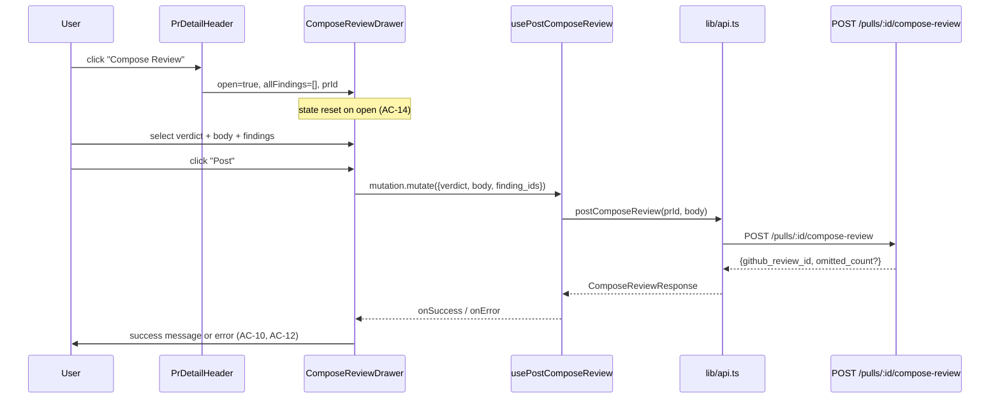

# Compose Review — client component (`ComposeReviewDrawer`)

## Overview

The Compose Review feature adds a 560 px slide-over drawer to the PR detail page
that lets the user post a human-curated GitHub PR review: a verdict (Approve /
Comment / Request Changes), an optional review body, and a curated selection of
AI findings that become inline GitHub comments. It is triggered by a "Compose
Review" primary button next to `RunReviewDropdown` in `PrDetailHeader` and is
colocated as a PR-page-local component.

The server-side endpoint, scope guard, and diff pre-filter logic are documented in
[`../../server/docs/compose-review.md`](../../server/docs/compose-review.md).

## Route wiring



## Wiring into `PrDetailHeader`

`ComposeReviewDrawer` is a prop-down component hosted by `PrDetailHeader`
(`client/src/app/repos/[repoId]/pulls/[number]/_components/PrDetailHeader/PrDetailHeader.tsx`):

- `PrDetailHeader` imports `ComposeReviewDrawer` and holds a `composeOpen: boolean`
  state (`PrDetailHeader.tsx:39`).
- When `prId` is resolved, a "Compose Review" primary `<Button>` appears in the
  actions row next to `RunReviewDropdown` (`PrDetailHeader.tsx:110-114`). The button
  is absent when `prId` is null (AC-1).
- `allFindings: FindingRecord[]` — all findings from all completed review runs on
  this PR — is passed down from `page.tsx` through `PrDetailHeaderProps`
  (`PrDetailHeader.tsx:24`).
- `ComposeReviewDrawer` is rendered after the header's closing div, conditional on
  `prId` (`PrDetailHeader.tsx:137-144`).

## `ComposeReviewDrawer` component

**File:** `client/src/app/repos/[repoId]/pulls/[number]/_components/ComposeReviewDrawer/ComposeReviewDrawer.tsx` (331 lines)

**Props (`ComposeReviewDrawer.tsx:17-22`):**
```typescript
interface ComposeReviewDrawerProps {
  prId: string;
  open: boolean;
  onClose: () => void;
  allFindings: FindingRecord[];
}
```

**Internal state:**
- `verdict: 'APPROVE' | 'COMMENT' | 'REQUEST_CHANGES' | null` — starts `null`; the
  Post button is disabled until a verdict is chosen (AC-3).
- `body: string` — starts empty on every open (AC-4).
- `selectedIds: Set<string>` — re-initialized on each open (`ComposeReviewDrawer.tsx:50-61`):
  findings with `accepted_at !== null && dismissed_at === null` are pre-checked (AC-5).
  Re-initialization ensures re-opening starts fresh even if finding actions happened
  between opens (AC-14).
- `postedReviewId: string | null` — set on success; disables the Post button and shows
  the confirmation message.
- `errorMsg: string | null` — set on error; displayed above the footer; re-enables Post.

**Keyboard dismiss (`ComposeReviewDrawer.tsx:64-72`):** an `Escape` key listener is
registered while `open === true` and cleaned up when `open` changes. Required by
SPEC-04's non-functional accessibility note.

**Render when `!open`:** returns `null` immediately — no DOM overhead (AC-1,
`ComposeReviewDrawer.tsx:75`).

**Drawer shell:** the `Drawer` primitive from `@devdigest/ui` with `width={560}`
(`ComposeReviewDrawer.tsx:122`). Title and subtitle are i18n strings from
`compose.reviewDrawer`.

**Verdict selector (`ComposeReviewDrawer.tsx:143-188`):** three `<button>` elements
for `APPROVE`, `COMMENT`, and `REQUEST_CHANGES`. The selected button gets
`border: "2px solid var(--accent)"` and `fontWeight: 600`; unselected buttons use
a weaker border. No verdict is pre-selected (AC-3).

**Findings list (`ComposeReviewDrawer.tsx:248-289`):** `allFindings` is sorted so
pre-selected findings (accepted, not dismissed) appear first in a stable initial
order. Each row is a `<label>` wrapping a checkbox — toggling calls `setSelectedIds`
with an updated `Set`. The inline comments counter (`ComposeReviewDrawer.tsx:231-246`)
shows the live `selectedIds.size` and updates immediately on every toggle (AC-7).

**Success state (`ComposeReviewDrawer.tsx:291-311`):** when `postedReviewId` is set,
renders a confirmation box. If `mutation.data?.omitted_count > 0`, shows the
`postedWithOmissions` i18n key with the count of skipped findings; otherwise shows
`postedWithId` (AC-10, AC-11).

**Error handling (`ComposeReviewDrawer.tsx:108-116`):** the `onError` callback checks
for the `github_unavailable` error code and maps it to a settings-directing message;
other errors fall back to `err.message`. Does not call `notify.error` internally —
following the `useReclassifyIntent` precedent (AC-12, AC-13).

## Data hooks and API

**`usePostComposeReview(prId)` (`client/src/lib/hooks/reviews.ts:257-261`):**

```typescript
export function usePostComposeReview(prId: string | null) {
  return useMutation<ComposeReviewResponse, Error, ComposeReviewBody>({
    mutationFn: (body) => postComposeReview(prId!, body),
  });
}
```

Does not call `notify.error` internally — error handling is the drawer's
responsibility via the `onError` callback.

**`postComposeReview(prId, body)` (`client/src/lib/api.ts:232-237`):**

```typescript
export function postComposeReview(
  prId: string,
  body: ComposeReviewBody,
): Promise<ComposeReviewResponse> {
  return api.post<ComposeReviewResponse>(`/pulls/${prId}/compose-review`, body);
}
```

All HTTP calls go through `lib/api.ts`; no inline `fetch` in the component.

## Related files

| File | Lines | Purpose |
|------|-------|---------|
| `client/src/app/repos/[repoId]/pulls/[number]/_components/ComposeReviewDrawer/ComposeReviewDrawer.tsx` | 1–331 | Main drawer: verdict selector, body textarea, findings checklist, success/error states. |
| `client/src/app/repos/[repoId]/pulls/[number]/_components/ComposeReviewDrawer/index.ts` | 1–2 | Barrel re-export of `ComposeReviewDrawer` and `ComposeReviewDrawerProps`. |
| `client/src/app/repos/[repoId]/pulls/[number]/_components/PrDetailHeader/PrDetailHeader.tsx` | 1–147 | Hosts the "Compose Review" trigger button (`lines 110–114`) and mounts the drawer (`lines 137–144`). |
| `client/src/lib/hooks/reviews.ts` | 257–261 | `usePostComposeReview` — TanStack mutation hook; no internal `notify.error`. |
| `client/src/lib/api.ts` | 232–237 | `postComposeReview` — typed fetch function for `POST /pulls/:id/compose-review`. |
| `client/src/vendor/shared/contracts/review-api.ts` | 67–81 | `ComposeReviewBody` and `ComposeReviewResponse` Zod types (client copy; mirrors server). |
| `client/messages/en/compose.json` | — | i18n strings: `title`, `subtitle`, `verdicts.*`, `reviewBody`, `post`, `posting`, `cancel`, `postedWithId`, `postedWithOmissions`, `findingsCount`, `inlineComments`, etc. |
