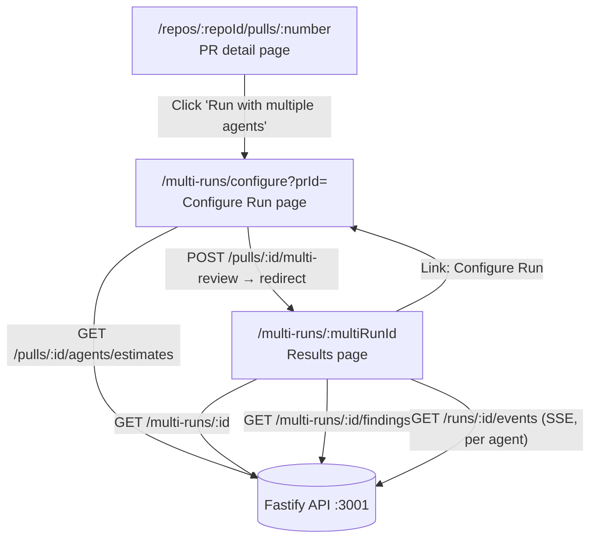

# Multi-Agent Review — client routes and components

## Overview

The multi-agent review feature adds two Next.js routes under `app/multi-runs/`:
a **Configure Run** page where the user picks a PR and selects agents, and a
**Results** page that shows per-agent findings side-by-side plus a cross-agent
"Where agents disagree" conflicts view. It also promoted two previously
route-local components (`RunTraceDrawer`, `FindingCard`) to `components/` because
the Results page needs them alongside the existing PR detail page.

## Route map



## Configure Run page (`/multi-runs/configure`)

**Files:**
- `client/src/app/multi-runs/configure/page.tsx` — thin RSC; awaits async
  `searchParams` (Next.js 15 async API) and renders `ConfigureRunView`.
- `client/src/app/multi-runs/configure/_components/ConfigureRunView/ConfigureRunView.tsx`

**Props:** `initialPrId?: string` — pre-seeds the PR selector when the page is
opened with `?prId=<uuid>` from the PR detail page.

**Two-step flow (`ConfigureRunView.tsx:202-473`):**

1. **PR selection** — repo picker (only shown when the workspace has more than one
   repo) + PR dropdown. Changing the repo resets both the PR and agent selections.
   A muted warning appears (non-blocking) when the selected PR is merged or closed.

2. **Agent cards** — rendered only after a PR is selected. Calls
   `useAgentEstimates(selectedPrId)` (`lib/hooks/multi-runs.ts:18-24`), which hits
   `GET /pulls/:id/agents/estimates`. Each card shows:
   - Agent name.
   - `last_finding_summary` — the most recent review summary for this agent
     (rendered as plain text; never `dangerouslySetInnerHTML`).
   - Estimated duration and cost averaged over the last 10 completed runs; shows
     "No history" when `has_historical_data` is false.
   - A checkbox + full-card click target for selection.
   - A "Select all" checkbox with indeterminate state when partially selected.

**Footer aggregate estimates (`helpers.ts:1-38`):**
- `computeAggregateDuration` — `max(estimated_duration_ms)` over selected agents,
  reflecting parallel execution.
- `computeAggregateCost` — `sum(estimated_cost_usd)` over selected agents.
- Returns `null` (not shown) when no agent has historical data.

**Submit (`ConfigureRunView.tsx:290-297`):** calls `useRunMultiReview().mutateAsync`
which POSTs `{ agentIds }` to `/pulls/:id/multi-review`, then navigates to
`/multi-runs/${res.multi_run_id}`.

## Results page (`/multi-runs/:multiRunId`)

**Files:**
- `client/src/app/multi-runs/[multiRunId]/page.tsx` — thin RSC; awaits async
  `params` and renders `MultiRunResultsView`.
- `client/src/app/multi-runs/[multiRunId]/_components/MultiRunResultsView/MultiRunResultsView.tsx`

**Data fetching (`MultiRunResultsView.tsx:30-44`):**
- `useMultiRun(multiRunId)` — polls `GET /multi-runs/:id` for agent statuses and
  totals.
- `useMultiRunFindings(multiRunId)` — fetches `GET /multi-runs/:id/findings` for
  per-agent findings lists and cross-agent groups.

**Live SSE streaming (`MultiRunResultsView.tsx:36-62`):** while any agent has
`status === "running"`, the component subscribes to `useRunEvents(activeRunIds)`
which opens one SSE connection per active run (`GET /runs/:id/events`). The last
event `kind` for each run is stored in `sseStatuses` and passed to the view
components for live status text. When all SSE streams close (all agents done or
failed), the component invalidates the `["multi-run", multiRunId]` TanStack Query
key to fetch final statuses.

**View modes (`MultiRunResultsView.tsx:65`):** the user toggles between `"columns"`
and `"tabs"` via buttons in `MultiRunHeader`. Both modes receive the same
`agents[]`, `agentFindings[]`, and `sseStatuses` props.

### Sub-components of the Results page

**`MultiRunHeader`** (`_components/MultiRunHeader/MultiRunHeader.tsx:20-80`):
Breadcrumb with PR number, a "Configure Run" link back to the configure page
(pre-fills `?prId=<prId>`), Columns/Tabs toggle buttons, and a summary line
showing total agent count, wall time, and cost when all agents are complete.

**`ColumnsView`** (`_components/ColumnsView/ColumnsView.tsx:16-100`):
Horizontal-scrollable grid of agent columns. Each column shows the agent name,
live SSE status or final status badge, score, finding count, a compact list of
finding titles (file + title), and a "View trace" button that opens
`RunTraceDrawer`. Builds a `run_id → findings[]` map in a `useMemo` by matching
`agent_id + agent_name` between `agents[]` and `agentFindings[]`.

**`TabsView`** (`_components/TabsView/TabsView.tsx:15-169`):
Tab bar (one tab per agent) with a summary card for the active agent and a full
`FindingCard` list (from `components/FindingCard`). Duration and cost appear in
the summary card when the agent is done. Failing agents show their `error` string.

**`ConflictsSection`** (`_components/ConflictsSection/ConflictsSection.tsx:29-108`):
"Where agents disagree" panel below both view modes. Renders every `FindingGroup`
from `GET /multi-runs/:id/findings`. A toggle switch filters to conflict-only
groups. A group is a conflict when `isConflict` returns true — defined as two or
more distinct verdict values across `agent_verdicts`, where `null` maps to
`"did_not_flag"` and any non-null finding maps to its `severity` string
(`ConflictsSection.tsx:21-27`).

## Shared components promoted from the PR detail route

`RunTraceDrawer` and `FindingCard` were previously colocated under
`app/repos/[repoId]/pulls/[number]/_components/`. They are now at:

- `client/src/components/RunTraceDrawer/`
- `client/src/components/FindingCard/`

**Why they moved:** the Results page (`TabsView`, `MultiRunResultsView`) consumes
both components. Once a component is used by two or more routes it belongs in
`components/` per the project's placement decision tree. The PR detail route
imports them from the new shared location (`pulls/[number]/page.tsx:18`,
`FindingsPanel/FindingsPanel.tsx:9`).

### `RunTraceDrawer` (`components/RunTraceDrawer/RunTraceDrawer.tsx`)

A 720 px side drawer with two tabs — Trace and Live log.

**Props (`RunTraceDrawer.tsx:19-29`):**
```typescript
interface RunTraceDrawerProps {
  runId: string;
  agentName?: string | null;
  prNumber?: number | null;
  findings?: FindingRecord[];
  running?: boolean;   // defaults false; true → starts on Live log tab + streams SSE
  onClose: () => void;
}
```

- When `running=true`, the Live-log tab streams SSE via `useRunEvents([runId])`.
- The Trace tab loads the persisted single-document run trace via `useRunTrace(runId)`
  once `stillRunning` becomes false.
- The footer "Copy raw output" button copies `trace.raw_output` to the clipboard,
  with a 1.5 s visual confirmation (`RunTraceDrawer.tsx:54-59`).
- Default export (not named export) so the PR detail page can import it directly.

The Results page (`MultiRunResultsView`) opens the drawer without `findings` or
`running` props — it passes only `runId` and `agentName`, which is sufficient for
viewing historical traces.

### `FindingCard` (`components/FindingCard/FindingCard.tsx`)

Renders one `FindingRecord` with severity badge, category tag, file:line link,
confidence number, markdown rationale, optional suggestion, and accept/dismiss/
reply/create-eval-case actions.

**Props (`FindingCard.tsx:29-47`):**
```typescript
function FindingCard({
  f: FindingRecord;
  focused?: boolean;
  defaultExpanded?: boolean;
  onAction?: (action: FindingActionKind, reply?: string) => void;
  onCreateEvalCase?: (kind: "must_find" | "must_not_flag", name: string) => void;
  pending?: boolean;
  evalCasePending?: boolean;
  repoFullName?: string | null;
  headSha?: string | null;
}): JSX.Element
```

`TabsView` passes the full prop set to each card, mirroring the wiring in
`FindingsPanel`. It calls `useFindingAction()`, `useTurnFindingIntoEvalCase()`,
`useActiveRepo()`, and `usePullDetail(prId)` unconditionally before its early-return
guard (`TabsView.tsx:36-40`), then threads `pending`, `evalCasePending`,
`repoFullName` (`activeRepo?.full_name`), `headSha` (`pr?.head_sha`), `onAction`,
and `onCreateEvalCase` into each card (`TabsView.tsx:142-164`). On a successful
action, `onAction` invalidates the `["multi-run-findings", multiRunId]` query key.
`TabsViewProps` carries two required props to support this — `prId` and `multiRunId`
— threaded in from `MultiRunResultsView.tsx:158-165`.

## Data hooks (`lib/hooks/multi-runs.ts`)

| Hook | Query key | Enabled when |
|------|-----------|--------------|
| `useAgentEstimates(prId)` | `["agent-estimates", prId]` | `prId != null` |
| `useRunMultiReview()` | mutation (no cache key) | always |
| `useMultiRun(multiRunId)` | `["multi-run", multiRunId]` | `multiRunId != null` |
| `useMultiRunFindings(multiRunId)` | `["multi-run-findings", multiRunId]` | `multiRunId != null` |

All four call functions from `lib/api.ts` (lines 202–225). Pass `null` to disable
a query before the ID is known (lazy-fetch-on-open pattern).

## Related files

| File | Lines | Purpose |
|------|-------|---------|
| `client/src/app/multi-runs/configure/page.tsx` | 1–13 | Thin RSC; reads `searchParams.prId`; renders `ConfigureRunView`. |
| `client/src/app/multi-runs/configure/_components/ConfigureRunView/ConfigureRunView.tsx` | 1–473 | Two-step configure UI: PR picker + agent cards + aggregate estimate footer. |
| `client/src/app/multi-runs/configure/_components/ConfigureRunView/helpers.ts` | 1–38 | Pure `computeAggregateDuration` (max) and `computeAggregateCost` (sum). |
| `client/src/app/multi-runs/[multiRunId]/page.tsx` | 1–13 | Thin RSC; reads `params.multiRunId`; renders `MultiRunResultsView`. |
| `client/src/app/multi-runs/[multiRunId]/_components/MultiRunResultsView/MultiRunResultsView.tsx` | 1–184 | Orchestrator: data fetching, SSE fan-in, view mode toggle, drawer state. |
| `client/src/app/multi-runs/[multiRunId]/_components/MultiRunHeader/MultiRunHeader.tsx` | 1–80 | Breadcrumb, Configure Run link, Columns/Tabs toggle, summary line. |
| `client/src/app/multi-runs/[multiRunId]/_components/ColumnsView/ColumnsView.tsx` | 1–100 | Horizontal per-agent column grid; inline finding title list + View trace button. |
| `client/src/app/multi-runs/[multiRunId]/_components/TabsView/TabsView.tsx` | 1–169 | Tab-per-agent view; renders full `FindingCard` list for the active tab. |
| `client/src/app/multi-runs/[multiRunId]/_components/ConflictsSection/ConflictsSection.tsx` | 1–108 | "Where agents disagree" panel; toggle for conflicts-only filter; `isConflict` predicate. |
| `client/src/components/RunTraceDrawer/RunTraceDrawer.tsx` | 1–107 | Shared trace + live-log drawer; consumed by PR detail page and Results page. |
| `client/src/components/FindingCard/FindingCard.tsx` | 1–196 | Shared finding card; consumed by PR detail `FindingsPanel` and multi-run `TabsView`. |
| `client/src/lib/hooks/multi-runs.ts` | 1–56 | TanStack Query hooks: `useAgentEstimates`, `useRunMultiReview`, `useMultiRun`, `useMultiRunFindings`. |
| `client/src/lib/api.ts` | 199–225 | API fetch functions: `fetchAgentEstimates`, `triggerMultiReview`, `fetchMultiRun`, `fetchMultiRunFindings`. |
