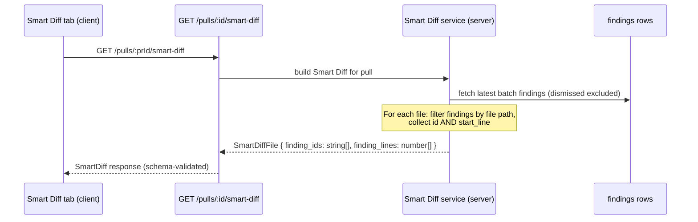
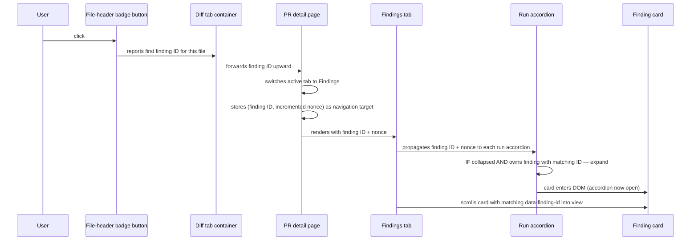
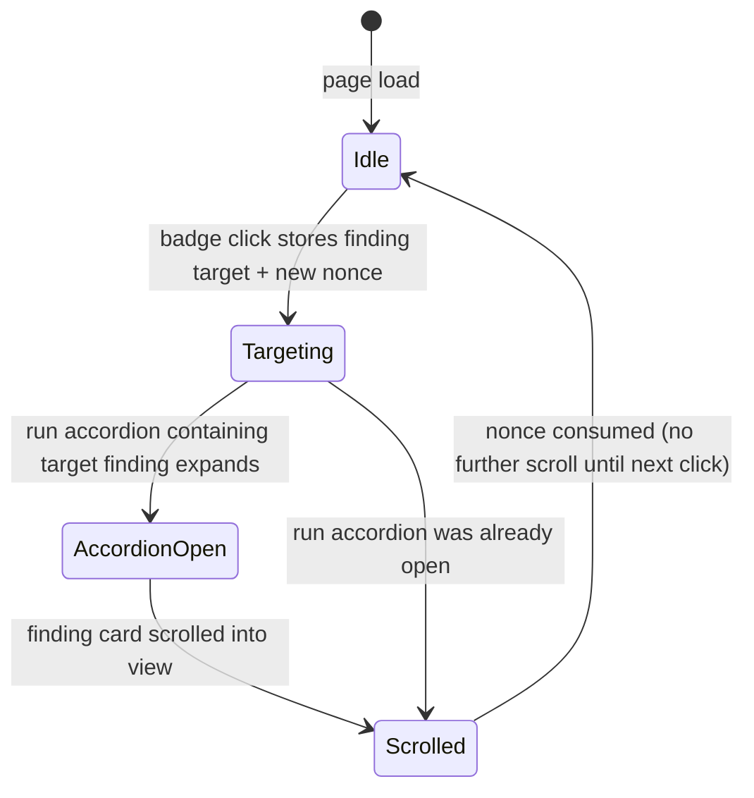

# Spec: Smart Diff findings badge deep-links to specific finding | Spec ID: SPEC-01 | Status: draft

## Problem and why

On the PR detail page the Files-changed (Smart Diff) tab shows a per-file "N findings" badge. Clicking the badge today opens the file's diff accordion and scrolls to the flagged diff line. The badge never navigates the reviewer to the Findings tab, so finding details (severity, rationale, suggestions, accept/dismiss actions) are one extra click and a manual scroll away. The Smart Diff API payload carries only `finding_lines` (line numbers), not finding IDs, so even if the badge were to navigate away it could not yet target a specific finding card.

The net effect is a dead navigation that breaks the natural review workflow: a reviewer who notices "2 findings" in a file must context-switch manually rather than being taken directly to the relevant finding detail.

## Goals / Non-goals

**Goals**

- Add `finding_ids: string[]` (the IDs of the matching findings from the latest review batch, in the same order as `finding_lines`) to the `SmartDiffFile` contract — on both the server Zod schema and its client mirror — in a fully backward-compatible, additive way.
- Change the "N findings" badge in the Smart Diff file header so that clicking it switches the PR detail page to the Findings tab and scrolls to (and visually highlights) the first finding whose ID appears in `finding_ids` for that file.
- If the target finding lives inside a collapsed run accordion, that accordion must expand automatically before the scroll occurs.
- Replace the current in-diff scroll behavior entirely. The badge no longer opens the file accordion or scrolls to a diff line.

**Non-goals**

- Targeting any finding other than the first one (first in `finding_ids` order) when a file has multiple findings. Multi-finding navigation from the badge is out of scope.
- Showing a badge in the "Original order" (non-Smart Diff) view — the plain unordered diff view receives no finding data and this spec does not change that.
- Changing how findings are surfaced in the Findings tab beyond the existing per-finding focused visual state already present on finding cards.
- Any change to how the findings list filters, sorts, or paginates findings.
- Server-side persistence changes beyond adding `finding_ids` to the computed response shape (no migration needed — this is a computed field, not stored).

## User stories

- As a reviewer scanning the Smart Diff, WHEN I see a "2 findings" badge on a file header, I want clicking it to take me directly to the first finding for that file, so I can immediately see the severity, rationale, and take an action without manually locating it.
- As a reviewer, WHEN I click the badge, I want the target finding to be visible (its accordion expanded) and clearly indicated (scrolled into view), so I know I arrived at the right place.

## Acceptance criteria (EARS)

**AC-1** WHEN a user clicks the "N findings" badge on a Smart Diff file header, the system shall switch the PR detail page to the Findings tab by updating the `?tab=` query parameter to `findings`.

**AC-2** WHEN the Findings tab is activated as a result of a badge click, the system shall scroll the page to the finding card whose `data-finding-id` attribute matches the first entry in `finding_ids` for that file, and that card shall be visible on screen without further user interaction.

**AC-3** IF the run accordion that contains the target finding card is collapsed at the time of navigation, THEN the system shall expand it before scrolling to the card.

**AC-4** WHEN the same badge is clicked a second time while the Findings tab is already active, the system shall still scroll to the target finding (i.e. repeated clicks always retrigger the scroll even if the target and tab have not changed).

**AC-5** IF a `SmartDiffFile` entry carries an empty `finding_ids` array, THEN the badge is not rendered for that file and no navigation occurs.

**AC-6** WHEN the user clicks the findings badge, the system shall not open the file's diff accordion and shall not scroll to any diff line (the previous in-diff scroll behavior is replaced in its entirety).

**AC-7** WHEN the Smart Diff endpoint returns a `SmartDiffFile` that omits the `finding_ids` field (old server, new client — backward-compatibility window), the system shall treat `finding_ids` as an empty array and shall not render a findings badge for that file.

**AC-8** The system shall populate `SmartDiffFile.finding_ids` using the same file-path scope, dismissed-finding exclusion, and latest-batch-window filter already applied to `finding_lines`, so that for any given file the count of IDs in `finding_ids` equals the count of line numbers in `finding_lines`.

## Edge cases

- **File with findings, all dismissed:** `finding_ids` is empty (dismissed findings are excluded by the existing batch filter, same logic as `finding_lines`). Badge is not rendered (AC-5).
- **Finding deleted between Smart Diff load and badge click:** the target finding card is no longer in the DOM. The system shall still switch to the Findings tab (AC-1) but the scroll silently no-ops rather than throwing an error.
- **Finding is inside a risk-group section that is itself collapsed (diff tab only):** this is irrelevant — the badge navigates to the Findings tab, which is a separate tab. The collapsed state of any section within the diff tab has no bearing on the Findings tab layout.
- **Findings tab already active when badge is clicked:** navigation only changes the target and nonce, not the tab (already correct). Scroll must still occur (AC-4).
- **Multiple runs for the same file:** `finding_ids` reflects the latest batch only (same scope as `finding_lines`). The first ID in that array is the badge's scroll target regardless of which run produced it.
- **Tab query parameter already set to another value when badge is clicked:** the system replaces it with `findings`.
- **`SmartDiffFile` returned with `finding_ids` present but `finding_lines` absent (or vice versa):** schema validation at the API boundary rejects the malformed response; the diff tab falls back to the unordered plain view (existing fallback behavior).

## Non-functional

- **Accessibility:** The badge button must retain its existing `aria-label` (e.g. "2 findings") and must remain keyboard-focusable. The new behavior must be achievable with Enter/Space from a keyboard — no mouse-only dependency.
- **Performance:** No additional network request is introduced for the badge click. `finding_ids` is computed server-side as part of the existing Smart Diff endpoint response — cost is a cheap in-memory join already happening for `finding_lines`. The client-side scroll requires only a single DOM attribute lookup; no re-renders or extra fetches are needed.
- **Backward compatibility:** Old servers that do not yet return `finding_ids` must not break the Smart Diff tab (AC-7). The client-side schema must treat the field as optional, defaulting to an empty array, so that an absent field in the server response is transparently coerced to no-badge behavior.

## Architecture & workflows

### Data flow: adding `finding_ids` to the Smart Diff response

### Interaction flow: badge click → finding navigation

### State machine: finding targeting in FindingsTab

## Service contracts

### `SmartDiffFile` (additive extension)

The `SmartDiffFile` schema in the shared Zod contract gains one new optional field:

| Field | Type | Semantics |
|---|---|---|
| `finding_ids` | `string[]` | Optional (defaults to `[]`). The UUIDs of findings from the latest review batch that are anchored to this file (dismissed findings excluded). Parallel to `finding_lines` — entry `[i]` in `finding_ids` corresponds to entry `[i]` in `finding_lines`. |

The field is marked optional on the client-side Zod schema to preserve backward compatibility with servers that do not yet return it (AC-7). The server schema may declare it required once all clients have been updated.

No new API endpoints. No changes to request shape. The change is a pure additive extension to the existing `GET /pulls/:id/smart-diff` response.

### Cross-tab navigation signal

The PR detail page coordinates badge-click navigation through local state — not through a URL parameter or a new API. The signal carries two values:

| Concept | Type | Purpose |
|---|---|---|
| Target finding ID | `string \| null` | The finding UUID to scroll to. Null when no badge has been clicked. |
| Navigation nonce | `number` | Increments on every badge click, even for the same finding ID, to ensure the scroll fires on repeated clicks (AC-4). |

This mirrors the existing target/nonce pattern already used within the Findings tab for Timeline → run-accordion navigation (verified in `FindingsTab.tsx:69-72`).

### Cross-component interface contracts (behavior, not implementation detail)

The following behavioral contracts must hold at the boundaries between the diff tab, the PR detail page, and the Findings tab. The exact mechanism (props, context, state) is left to the implementation planner.

| Boundary | Contract |
|---|---|
| Smart Diff file-header badge → diff tab container | When the badge is clicked, the diff tab container receives the first finding ID from that file's `finding_ids` and forwards it upward for cross-tab navigation. |
| Diff tab container → PR detail page | The PR detail page receives a (finding ID, nonce) pair; a new nonce is generated on every badge click, including repeated clicks on the same badge. |
| PR detail page → Findings tab | The Findings tab receives the target finding ID and nonce. It is responsible for expanding the containing run accordion (if collapsed) and scrolling the target finding card into view. |
| Findings tab → run accordions | Each run accordion is told the target finding ID. If any of its findings matches, it must expand itself before the scroll can succeed. |

## Inputs (provenance)

| Input | Source | Provenance tag |
|---|---|---|
| `finding_ids[]` values (UUIDs) | Persisted finding rows in DB, fetched as part of the existing Smart Diff build (same batch-window + dismissed-exclusion filter already applied to `finding_lines`) | `[deterministic: repo-intel]` — pure in-memory join, no LLM call |
| `finding_lines[]` values (line numbers) | Same DB source — existing field, unchanged | `[reused: existing SmartDiff build]` |
| Tab query parameter `?tab=findings` | Client URL state, managed by the existing tab-switching utility on the PR detail page | `[deterministic: client-side]` |
| Finding target (ID + nonce) | Local UI state derived from user click, never from an external source | `[deterministic: client-side]` |

## Untrusted inputs

- **`finding_ids` array values (UUIDs from server response):** These are identifiers constructed server-side from DB rows. They are used only as DOM attribute selectors for scroll targeting and as internal state values. They are never rendered as HTML or interpolated into URLs without encoding. Because they originate from persisted data they must be treated as untrusted strings: the DOM attribute selector built from a finding ID must encode any special characters before use to prevent a malformed ID from breaking selector parsing or causing unexpected DOM traversal.
- **`pseudocode_summary` field (existing, unchanged):** Already rendered as plain text, not HTML. No change.
- **Badge `aria-label` string:** Constructed from a count integer, not from server text. Safe.

## Traceability

| AC | Evidence |
|---|---|
| AC-1, AC-6 | Current badge behavior (in-diff scroll): `client/src/components/diff-viewer/FileCard/FileCard.tsx:100-121`. Desired replacement confirmed in user request (locked behavior). Tab navigation via `setParam("tab", …)`: `client/src/app/repos/[repoId]/pulls/[number]/page.tsx:67-69`. |
| AC-2, AC-3 | `data-finding-id={f.id}` anchor on FindingCard: `client/src/components/FindingCard/FindingCard.tsx:64`. Accordion open+scroll pattern: `client/src/app/repos/[repoId]/pulls/[number]/_components/ReviewRunAccordion/ReviewRunAccordion.tsx:47-53`. |
| AC-4 | Nonce re-trigger pattern for same-target repeated clicks: `client/src/app/repos/[repoId]/pulls/[number]/_components/FindingsTab/FindingsTab.tsx:69-72` (`p.n + 1`). |
| AC-5 | Badge render guard `!!findingLines?.length` (current): `FileCard.tsx:100`. To be mirrored for `finding_ids`. |
| AC-7 | Client vendor mirror must match server: `client/insights/INSIGHTS.md` — "client/src/vendor/shared/ is a manual mirror … always update both". Optional field + default-to-empty for backward compatibility: user requirement (stated in "Constraints"). |
| AC-8 | `latestBatchFindings` filter logic (dismissed excluded, latest batch window): `server/src/modules/smart-diff/findings-batch.ts:1-21`. Finding `.id` and `.file` available on `ReviewDtoFinding` (extends `Finding`): `server/src/vendor/shared/contracts/findings.ts:48,52`. Current service collects `start_line` per finding: `server/src/modules/smart-diff/service.ts:37-40`. |

## Verification

| AC | Verification recipe |
|---|---|
| AC-1, AC-6 | On a PR with Smart Diff data and at least one file carrying a findings badge: (a) navigate to the Files tab; (b) click the badge. Confirm the URL `?tab=` parameter changes to `findings` and the Findings tab content is rendered. Confirm the diff accordion for that file did NOT open and the page did NOT scroll to any diff line. |
| AC-2, AC-3 | Continuing from AC-1/AC-6 verification: confirm the page scrolled so that the target finding card (identified by the first entry in `finding_ids`) is visible in the viewport. If the run accordion containing it was collapsed before the click, confirm it is now expanded. |
| AC-4 | With the Findings tab already active and a badge visible in the diff tab: switch back to the Files tab; click the same badge again. Confirm the page scrolls to the finding a second time (the card must come into view even if it was already visible). |
| AC-5 | Inspect a `SmartDiffFile` entry where `finding_ids` is empty (`[]`). Confirm no badge button is rendered in that file's header. |
| AC-7 | Simulate a server response where `SmartDiffFile` omits `finding_ids` (parse a JSON fixture missing the field through the client Zod schema). Confirm parsing succeeds, `finding_ids` resolves to `[]`, and the Smart Diff tab renders without errors or badges. |
| AC-8 | Compare the count of IDs in `finding_ids` for a given file against the count of entries in `finding_lines` for that same file in the API response. They must be equal. Verify that findings with a non-null `dismissed_at` are absent from `finding_ids`. Verify that findings from reviews outside the 5-minute batch window are absent. |

## [NEEDS CLARIFICATION: scroll highlight / visual indicator]

The spec requires in AC-2 that the target finding "shall be visible on screen." Finding cards already support a focused visual state (a ring/border emphasis) that is triggered externally. Should the badge-click navigation also apply this focused visual state to the target card, or is scroll-into-view alone sufficient? The existing run-accordion navigation (Timeline → run accordion) does not apply a focused state to individual findings — it only expands the accordion. Clarify whether a persistent visual highlight is required or whether a one-time scroll is enough.

## [NEEDS CLARIFICATION: behavior when Smart Diff is not loaded]

The risk-grouped diff view falls back to the plain unordered diff view when Smart Diff data is undefined (not yet loaded or endpoint unreachable). The plain unordered view does not receive `finding_lines` or `finding_ids`. Should the findings badge be hidden entirely in this case (it currently is, because no finding data is passed to the plain view), or is there a desired behavior when the user switches to "Original order" mode while Smart Diff data is available? The spec as written does not add the badge to the plain unordered view. Confirm this is acceptable.
