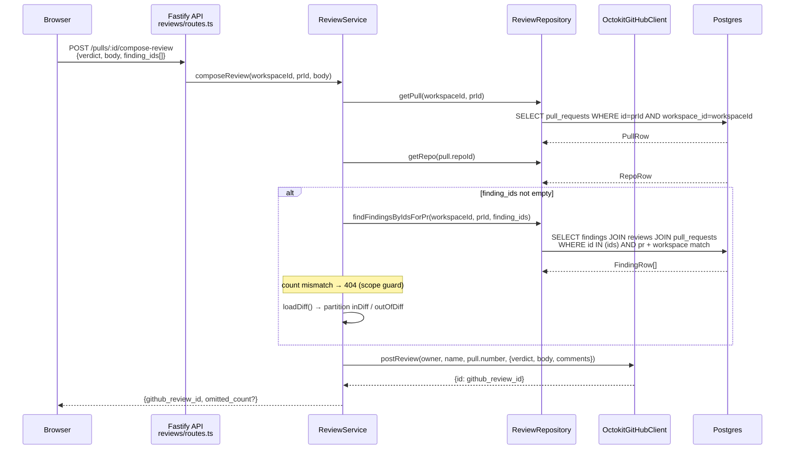

# Compose Review — server module (`modules/reviews`)

## Overview

The Compose Review feature adds `POST /pulls/:id/compose-review` to the existing
`reviews` module. It lets a user post a human-curated GitHub PR review — a verdict
plus an optional review body and inline comments derived from selected AI findings
— using the workspace's configured GitHub PAT. The endpoint, service method, and
repository query all live in `modules/reviews` alongside `replyToFinding`, the
established precedent they mirror.

No DB schema changes are required. The GitHub write is performed via
`OctokitGitHubClient.postReview()`, which was already implemented in the adapter
layer but previously unused.

The client-side component is documented in
[`../../client/docs/compose-review.md`](../../client/docs/compose-review.md).

## Request flow



## API reference

### `POST /pulls/:id/compose-review`

**Route:** `server/src/modules/reviews/routes.ts:197-204`

**Request body:** `ComposeReviewBody` (`server/src/vendor/shared/contracts/review-api.ts:68-73`):

```typescript
{
  verdict: 'APPROVE' | 'COMMENT' | 'REQUEST_CHANGES';
  body: string;
  finding_ids: string[];  // empty array is valid (posts a body-only review)
}
```

**Response:** `ComposeReviewResponse` (`server/src/vendor/shared/contracts/review-api.ts:76-81`):

```typescript
{
  github_review_id: string;
  omitted_count?: number;  // present only when > 0; findings skipped (line outside diff)
}
```

**What it does (`service.ts:310-399`):**

1. **PR + repo lookup** — fetches the `PullRow` and `RepoRow`; throws `NotFoundError` if
   either is absent (`service.ts:315-319`).
2. **Workspace + PR scope guard** — if `finding_ids` is non-empty, calls
   `repo.findFindingsByIdsForPr(workspaceId, prId, finding_ids)`. If the returned count
   differs from the requested count, throws `NotFoundError('One or more findings not found
   for this PR')`. This prevents a client supplying IDs from other workspaces or other PRs
   from having their content forwarded to GitHub (`service.ts:323-328`).
3. **GitHub adapter** — resolves `container.github()`; if unavailable (no PAT configured),
   throws `AppError('github_unavailable', 'Connect a GitHub token to post a review.', 400)`
   (`service.ts:330-339`). Matches the `replyToFinding` error code exactly.
4. **Diff pre-filter** — if there are findings to attach, loads the PR diff via
   `loadDiff(container, repo, workspaceId, pull, repoRow)` (from `diff-loader.ts`). Builds
   a `Map<file, Set<line>>` of new-side diff lines; partitions findings into `inDiff`
   (end_line present in the diff) and `outOfDiff` (not present). Only `inDiff` findings
   become inline comments — GitHub rejects out-of-diff lines with a 422. This pre-filter
   means `postReview` is called exactly once with only comments GitHub will accept
   (`service.ts:346-378`).
5. **GitHub post** — calls `gh.postReview({ owner, name }, pull.number, { body, event:
   verdict, comments })`. Returns `{ github_review_id: result.id }` plus `omitted_count`
   when greater than zero (`service.ts:380-399`). On failure, throws
   `AppError('github_review_failed', 'Failed to post the review to GitHub.', 400)`.

**Inline comment body** — built by `buildCommentBody(f)` (`helpers.ts:81`):
`` `**[${f.severity}] ${f.title}**\n\n${f.suggestion ?? f.rationale}` ``

## Repository: `findFindingsByIdsForPr`

**Method:** `ReviewRepository.findFindingsByIdsForPr` (`repository.ts:126-132`) delegates
to `reviewRepo.findFindingsByIdsForPr` (`repository/review.repo.ts:124-144`).

**Signature:**
```typescript
async function findFindingsByIdsForPr(
  db: Db,
  workspaceId: string,
  prId: string,
  findingIds: string[],
): Promise<FindingRow[]>
```

**Behavior:** returns `[]` immediately when `findingIds` is empty. Otherwise
inner-joins `findings → reviews → pull_requests`, filtering by
`findings.id IN (findingIds)`, `pull_requests.id = prId`, and
`pull_requests.workspace_id = workspaceId`. Rows that do not match all three
conditions are silently excluded — the service's count check converts any mismatch
into a 404, satisfying the OWASP A01 deny-by-default requirement
(`repository/review.repo.ts:130-143`).

## Shared Zod contracts

Both vendor copies are a manual mirror — no tooling enforces sync; TypeScript is
the only check. Both must be updated in the same logical change:

| File | Lines | Exports |
|------|-------|---------|
| `server/src/vendor/shared/contracts/review-api.ts` | 67–81 | `ComposeReviewBody`, `ComposeReviewResponse` |
| `client/src/vendor/shared/contracts/review-api.ts` | 67–81 | `ComposeReviewBody`, `ComposeReviewResponse` |

`ComposeReviewResponse.omitted_count` is `.optional()` (not `.nullable()`) — the
server omits the field entirely when zero omissions occur, rather than sending `0`.

## Related files

| File | Lines | Purpose |
|------|-------|---------|
| `server/src/modules/reviews/routes.ts` | 197–204 | `POST /pulls/:id/compose-review` Fastify handler; delegates to `service.composeReview`. |
| `server/src/modules/reviews/service.ts` | 310–399 | `ReviewService.composeReview` — PR lookup, scope guard, diff pre-filter, GitHub post. |
| `server/src/modules/reviews/repository.ts` | 126–132 | `ReviewRepository.findFindingsByIdsForPr` — delegates to `review.repo.ts`. |
| `server/src/modules/reviews/repository/review.repo.ts` | 124–144 | `findFindingsByIdsForPr` — Drizzle query scoped to workspace + PR; returns `[]` on empty input. |
| `server/src/modules/reviews/helpers.ts` | 81 | `buildCommentBody` — formats a `FindingRow` into a GitHub inline comment body string. |
| `server/src/modules/reviews/diff-loader.ts` | — | `loadDiff` — loads the PR's unified diff; consumed by `composeReview` to partition findings. |
| `server/src/vendor/shared/contracts/review-api.ts` | 67–81 | `ComposeReviewBody` and `ComposeReviewResponse` Zod schemas (server copy). |
| `client/src/vendor/shared/contracts/review-api.ts` | 67–81 | Mirror of the server schemas; must stay in exact lockstep. |
