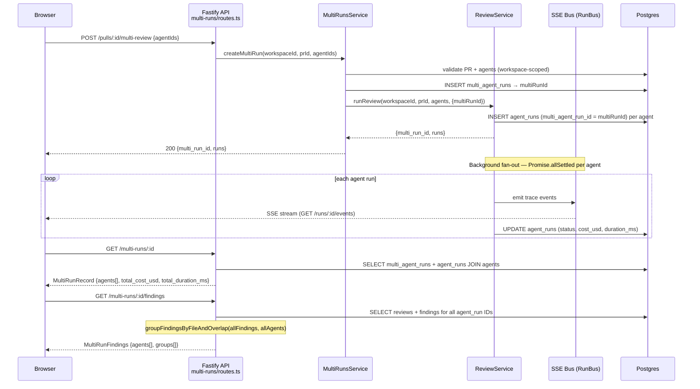

# Multi-Agent Review — server module (`modules/multi-runs`)

## Overview

The `multi-runs` module lets the client fan a single pull request out to multiple
review agents in one HTTP call, then query the aggregate results and the
cross-agent finding groups once all agents finish. It adds four endpoints to the
API surface and one new table (`multi_agent_runs`) with a nullable FK back-reference
(`multi_agent_run_id`) on `agent_runs`.

The module follows the standard five-file layout (`routes`, `service`,
`repository`, `helpers`, constants are inline). All business logic lives in
`MultiRunsService`; all DB access in `MultiRunsRepository`; grouping in the pure
helper `groupFindingsByFileAndOverlap`.

## Multi-run request flow



## API reference

All four handlers call `getContext(container, req)` before any DB access to enforce
workspace scoping (`server/src/modules/multi-runs/routes.ts:36,44,52,60`).

### `POST /pulls/:id/multi-review`

**Rate limit:** 10 requests per minute (tighter than the global 120/min — each
call fans out to N LLM reviews) (`routes.ts:30-32`).

**Request body:** `MultiReviewRequest` — `{ agentIds: string[] }` where every
element must be a valid UUID and the array must have at least one element
(`server/src/vendor/shared/contracts/observability.ts:148-151`). Invalid UUIDs
or an empty array are rejected 422 before the handler runs.

**Response:**
```
{ multi_run_id: string; runs: { run_id: string; agent_id: string; agent_name: string }[] }
```

**What it does (`service.ts:43-77`):**
1. Validates the PR exists in the workspace via `reviewRepo.getPull`.
2. Resolves each `agentId` in the workspace; throws `422` if any are missing.
3. Inserts one `multi_agent_runs` row → `multiRunId`.
4. Delegates to `ReviewService.runReview(..., { multiRunId })`, which inserts one
   `agent_runs` row per agent with `multi_agent_run_id = multiRunId` and kicks off
   the reviewer pipeline. The HTTP response returns **before** the reviews finish
   (fire-and-forget).

### `GET /multi-runs/:id`

**Response type:** `MultiRunRecord` (`observability.ts:169-180`).

Returns the multi-run header (`id`, `pr_id`, `pr_number`, `ran_at`) plus an
`agents[]` array of `AgentRunSummary` objects and computed totals. The service
sums `cost_usd` and `duration_ms` from all `agent_runs` rows in JS — null when
no row has data yet (`service.ts:94-107`).

### `GET /pulls/:id/agents/estimates`

**Response type:** `AgentEstimate[]` (`observability.ts:183-191`).

Returns one entry per enabled agent in the workspace. For each agent:
- Fetches all completed `agent_runs` where both `cost_usd` and `duration_ms` are
  non-null, ordered `DESC` by `ran_at`, via a single `IN` query
  (`repository.ts:119-150`).
- Groups the rows by `agentId` in JS (service layer); takes the first 10 per agent.
- Computes `estimated_duration_ms` (avg of `duration_ms`) and `estimated_cost_usd`
  (avg of `cost_usd`) over those rows (`service.ts:171-181`).
- Also fetches the most recent `reviews.summary` per agent via a separate
  `reviews JOIN agent_runs` query (`repository.ts:160-187`); the service picks the
  first match per agent with `.find()` (`service.ts:186`).
- The `_prId` parameter is accepted but not used: estimates are workspace-wide, not
  PR-specific (`service.ts:139`).

### `GET /multi-runs/:id/findings`

**Response type:** `MultiRunFindings` (`observability.ts:210-220`).

Fetches all `reviews` and their `findings` for every `agent_run` in the batch,
then:
1. Builds a per-agent flat list (`findings[]` keyed by `agentRunId`).
2. Calls `groupFindingsByFileAndOverlap` (see below) to produce cross-agent groups.

Response shape:
```
{
  agents: { agent_id, agent_name, findings: FindingRecord[] }[]
  groups: FindingGroup[]
}
```

## DB schema additions

**Table: `multi_agent_runs`** (`server/src/db/schema/runs.ts:60-69`)

| Column | Type | Notes |
|--------|------|-------|
| `id` | `uuid` PK | Auto-generated. |
| `workspace_id` | `uuid` FK → workspaces | Cascade delete. |
| `pr_id` | `uuid` FK → pull_requests | Cascade delete. |
| `ran_at` | `timestamptz` | Defaults to now. |

**FK on `agent_runs`:** `multi_agent_run_id uuid REFERENCES multi_agent_runs(id) ON DELETE SET NULL`
(`runs.ts:40-41`). Null for all single-agent runs. The FK column is indexed
(`agent_runs_multi_agent_run_id_idx`) because Postgres does not auto-index FK
columns and every multi-run read filters by this column (`runs.ts:43-49`).

Setting `onDelete: 'set null'` means deleting a `multi_agent_runs` row does **not**
cascade-delete the individual `agent_runs` rows.

## Cross-agent finding grouping (`helpers.ts`)

`groupFindingsByFileAndOverlap` (`server/src/modules/multi-runs/helpers.ts:21-96`)
is a pure function — no LLM call, no DB access, no substance or category filter.

**Signature:**
```typescript
function groupFindingsByFileAndOverlap(
  agentFindings: { agentId: string | null; agentName: string | null; finding: FindingRecord }[],
  allAgents: { agentId: string | null; agentName: string | null }[],
): FindingGroup[]
```

**Algorithm (`helpers.ts:1-19` docblock):**
1. Group findings by exact file path (Map keyed on `finding.file`).
2. Within each file, sort by `start_line`, then run a greedy clustering pass:
   - Two ranges overlap iff `A.start <= B.end AND B.start <= A.end`.
   - If a finding overlaps the current open cluster's accumulated `[start, end]`,
     merge it in and expand the range to the union.
   - If it does not overlap, finalize the cluster and open a new one.
3. After clustering, emit one `FindingGroup` per cluster with:
   - `start_line` = min of all merged `start_line` values.
   - `end_line` = max of all merged `end_line` values.
   - `agent_verdicts` = one entry per agent in `allAgents`: the matching
     `FindingRecord` if that agent contributed a finding to the cluster, else `null`
     ("did not flag").

A `null` verdict means the agent produced no finding in that file+line range — not
that it never ran. The caller (client) uses this to render "Where agents disagree"
conflicts.

**Conflict detection** (`null` verdict is the signal, not computed here): a group
is a conflict when at least two distinct verdict values appear (the client
`ConflictsSection` checks `unique.size >= 2` over `[null → "did_not_flag",
finding.severity]`).

## Related files

| File | Lines | Purpose |
|------|-------|---------|
| `server/src/modules/multi-runs/routes.ts` | 1–75 | Four Fastify route handlers; rate limit on POST; workspace scoping via `getContext`. |
| `server/src/modules/multi-runs/service.ts` | 1–283 | Business logic: `createMultiRun`, `getMultiRun`, `getEstimates`, `getFindings`. No HTTP, no raw DB. |
| `server/src/modules/multi-runs/repository.ts` | 1–334 | Drizzle queries: `insertMultiRun`, `findMultiRunById`, `getAgentRunsByMultiRunId`, `getLastNRunsPerAgent`, `getLastFindingSummaryPerAgent`, `getReviewsAndFindingsByAgentRunIds`. |
| `server/src/modules/multi-runs/helpers.ts` | 1–96 | Pure `groupFindingsByFileAndOverlap` function. |
| `server/src/db/schema/runs.ts` | 40–49 | `multi_agent_run_id` FK + index on `agent_runs`; `multi_agent_runs` table definition. |
| `server/src/modules/index.ts` | 20, 54 | Module registry entry for `multiRuns`. |
| `server/src/vendor/shared/contracts/observability.ts` | 147–220 | Zod contracts: `MultiReviewRequest`, `AgentRunSummary`, `MultiRunRecord`, `AgentEstimate`, `FindingGroup`, `MultiRunFindings`. |
| `server/src/modules/reviews/service.ts` | 109–136 | `ReviewService.runReview` — accepts `opts.multiRunId` and sets the FK on `agent_runs` rows. |
