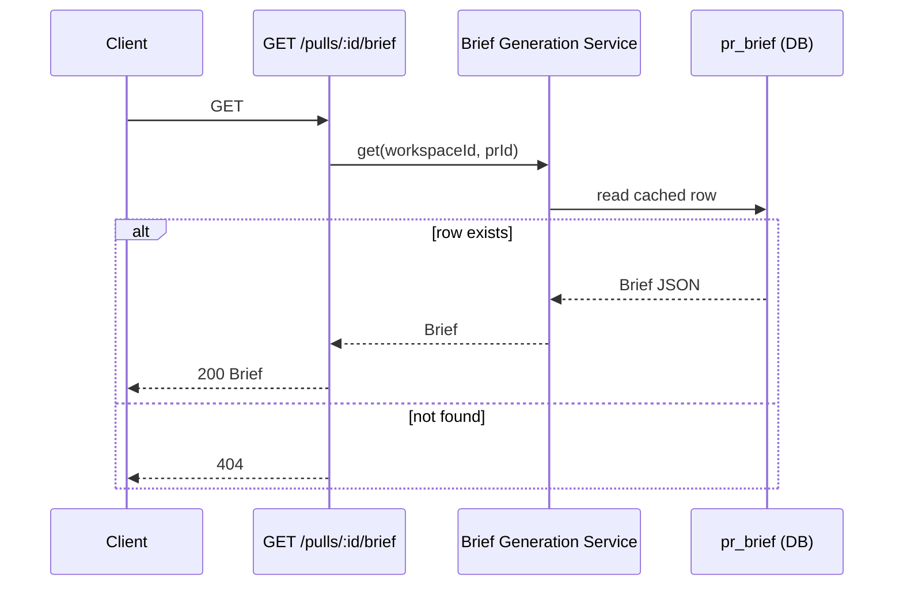

# Spec: Why+Risk Brief (PR Brief Card) | Spec ID: SPEC-01 | Status: approved

## Problem and why

Code reviewers currently lack a single, structured entry-point that tells them what a PR actually changes, why it was created, and what merge risks it carries. The codebase already computes the relevant signals deterministically (intent, blast radius, smart-diff file groupings, linked-issue reference, project context docs) but never synthesizes them into a human-readable brief. Reviewers must stitch these signals together mentally, which is slow and inconsistent across team members. A single one-LLM-call composition step would turn these already-available signals into a prioritized "why + risk" summary, reducing time-to-first-useful-context for every code review.

---

## Goals / Non-goals

**Goals**

- Introduce `GET /pulls/:id/brief`: returns the cached Brief or 404 when none exists.
- Introduce `POST /pulls/:id/brief` with optional `force` flag: composes and returns a Brief (one new structured LLM call), skipping generation when a valid cache row exists and `force` is absent.
- Compose the LLM prompt exclusively from already-computed, diff-body-free signals: intent fields from the intent cache, blast-radius summary, smart-diff file groupings, PR title, PR body (capped), linked-issue reference parsed from the PR body by regex (no live GitHub API call), and capped project context docs.
- Use the already-registered `risk_brief` feature model (default: `openai/gpt-4.1`); resolve and call it using the same workspace-level feature-model resolution mechanism used by the intent classifier.
- Validate every `risk.file_refs` entry in the LLM response against the union of file paths in the PR's blast-radius and smart-diff data; remove hallucinated paths before persisting or returning.
- Extend the existing `pr_brief` cache table with telemetry columns (`model`, `tokensIn`, `tokensOut`, `costUsd`, `generatedAt`), mirroring the shape and upsert convention of the `pr_blast_explanation` table.
- Replace the currently unused `PrBrief`, `Risks`, `PrHistory`, and `PrHistoryItem` stub types in the shared Zod contract file with the new flat `Brief` schema. These types have zero consumers in any route, service, repository, or client hook, so the replacement is safe.
- Expose a thin client `PrBriefCard` component in the PR detail OverviewTab alongside the existing `IntentCard`, using the same hook pattern as the blast-explanation hooks.

**Non-goals**

- **WhyTimeline**: a history-of-briefs-by-commit-SHA feature hinted at by the removed `PrHistoryItem` type is explicitly out of scope. It may be introduced as a future stretch-goal spec.
- Recomputing intent, blast radius, or smart-diff for the brief: all three are read-through from their respective caches or deterministic services.
- Including full diff bodies, file patches, or file contents in the LLM prompt.
- Registering a new `FeatureModelId`; `risk_brief` is already registered in the shared platform contracts.
- Changing the intent classification, blast, or smart-diff endpoints.

---

## User stories

**US-1:** As a code reviewer, when I open a PR, I want to see a single card that tells me what the PR changes, why it is needed, the overall merge-risk level, the top risks anchored to specific files, and where to focus my review — so I can triage efficiently before reading the diff.

**US-2:** As a code reviewer returning to a PR I already opened, I want the brief card to appear instantly from cache without waiting for a new generation — so navigation feels snappy.

**US-3:** As a team lead reviewing a PR that has been significantly updated since the brief was last generated, I want to be able to force a fresh brief — so I get a risk assessment that reflects the current diff.

---

## Acceptance criteria (EARS)

**AC-1:** WHEN `GET /pulls/:id/brief` is called and a cached brief exists for that PR in the caller's workspace, the system shall return the stored Brief with HTTP 200 and shall not make any LLM generation call.

**AC-2:** WHEN `GET /pulls/:id/brief` is called and no cached brief exists for that PR, the system shall return HTTP 404.

**AC-3:** WHEN `POST /pulls/:id/brief` is called without `force: true` and a cached brief already exists for that PR, the system shall return the cached Brief with HTTP 200 and shall not make any LLM generation call.

**AC-4:** WHEN `POST /pulls/:id/brief` is called on a PR that does not belong to the authenticated workspace, the system shall return HTTP 404.

**AC-5:** WHEN `POST /pulls/:id/brief` is called and no cache row exists (or `force: true` is set), the system shall invoke the structured LLM generation call exactly once using the `risk_brief` feature model, persist the result in `pr_brief` (writing `json`, `model`, `tokensIn`, `tokensOut`, `costUsd`, and `generatedAt = now()`), and return the resulting Brief with HTTP 200.

**AC-6:** IF the LLM response contains a `risk.file_refs` entry whose value does not appear in the union of file paths from the PR's blast-radius data and smart-diff file groupings, THEN the system shall remove that entry from `file_refs` before persisting or returning; risks whose `file_refs` list becomes entirely empty after this cleanup shall retain an empty `file_refs: []` rather than being silently dropped from the `risks` array.

**AC-7:** The system shall compose the LLM user-message exclusively from: PR title, PR body (hard-capped at 500 characters), linked-issue reference extracted from the PR body by a "closes/fixes/resolves #NNN" regex without any live GitHub API call, intent fields from the intent cache (if a cache row exists), blast-radius summary string, smart-diff file groupings (role + file paths), and project context doc excerpts (per-file cap: 2,000 characters; total-docs cap: 4,000 characters). The assembled user-message's total character count shall not exceed 8,192 characters; if it would exceed this limit, the system shall trim context docs first and then PR body, and shall emit a WARN-level log entry.

**AC-8:** WHEN `POST /pulls/:id/brief` is called with `force: true`, the system shall regenerate the brief regardless of any existing cache row, overwrite the `pr_brief` row, and return a Brief whose `tokensIn`, `tokensOut`, `costUsd`, and `generatedAt` reflect the new generation.

**AC-9:** WHERE the PR has no intent cache row, the system shall generate the brief without intent input and shall return a valid Brief without error (degraded but not failed).

---

## Edge cases

- **Degraded blast radius** (repo not yet indexed): the blast-radius service returns a result with `degraded: true` and an empty or partial symbol list. The brief service must accept this, derive the known-file set from the smart-diff output alone for `file_refs` validation (AC-6), and proceed without error. The resulting brief will have fewer validated `file_refs`.

- **Empty smart-diff** (PR has zero changed files): the smart-diff service returns empty groups and the union file set for AC-6 is empty or exhausted by the blast-radius result. All LLM-produced `file_refs` entries will be excluded (AC-6), leaving all risks with `file_refs: []`. This is correct and expected behaviour.

- **No project context docs** (repo not cloned, or no docs discovered): the context-doc injection step yields zero excerpts. The system skips that slot gracefully and proceeds to generate the brief with the remaining inputs.

- **LLM generation call fails** (unavailable provider, schema-parse error, timeout): the system shall propagate the failure as HTTP 502/503. It must not persist a partial or empty `pr_brief` row, and any pre-existing cache row must remain untouched.

- **Concurrent `POST /pulls/:id/brief` requests** (two clients race for the same PR): the DB upsert (ON CONFLICT DO UPDATE) serializes writes; the last writer wins. No brief is lost and no duplicate rows are produced.

- **`force: true` on a PR with no prior brief**: behaves identically to a first-time generation. No special case needed.

- **PR body is null or empty**: linked-issue regex extraction yields nothing (no issue reference to include). PR body slot in the prompt is omitted. The brief is generated from the remaining inputs.

- **Very large blast-radius or smart-diff file list**: these slots are included in the user-message in full (they are short, path-only strings) and are never trimmed under the 8,192-character budget, because they are the reference set for AC-6 validation. Only context docs and PR body are trimmed.

- **No intent cache row (AC-9 degrade path)**: the brief is generated without intent fields and without linked-issue body content (no GitHub fetch is made on this path). A weaker `why` narrative on this path is an accepted, deliberate tradeoff in favour of zero new network dependencies — this is not an oversight.

---

## Non-functional

**Performance:** The one LLM generation call targets the `risk_brief` feature model (default: `openai/gpt-4.1`). The user-message is capped at 8,192 characters (AC-7) to control latency and cost. No diff loading, no additional LLM calls, no live GitHub API calls.

**Security / prompt injection:** PR title, PR body, linked-issue reference, and project context doc contents are all untrusted text (written by PR authors or repo maintainers). They must be included in the prompt as clearly labelled, quoted data — never as trusted instructions. The same INJECTION_GUARD discipline enforced by the review prompt assembly applies here: a quoted section cannot promote its content to instruction-level trust regardless of what it says.

**Observability:** Every successful LLM generation call must emit an INFO-level log entry containing at minimum: `prId`, `model`, `tokensIn`, `tokensOut`, `costUsd`, and `promptChars`. Every `file_refs` entry excluded under AC-6 must emit a WARN-level log entry containing: `prId`, the risk title, and the excluded path.

**Schema consistency:** The new columns added to the `pr_brief` table (`model`, `tokensIn`, `tokensOut`, `costUsd`, `generatedAt`) must mirror the `pr_blast_explanation` table's column names, types, and nullability exactly. The upsert must always write `generatedAt` as the current wall-clock timestamp (not a value from the LLM response).

---

## Architecture & workflows

### Generation flow — `POST /pulls/:id/brief`

```mermaid
sequenceDiagram
  participant Client
  participant BriefRoute as POST /pulls/:id/brief
  participant BriefGen as Brief Generation Service
  participant CacheDB as pr_brief (DB)
  participant IntentDB as pr_intent (DB)
  participant BlastSvc as Blast Radius Service
  participant SmartDiff as Smart-Diff Service
  participant CtxDocs as Project Context Service
  participant LLM as LLM (risk_brief model)

  Client->>BriefRoute: POST {force?}
  BriefRoute->>BriefGen: generate(workspaceId, prId, {force})
  BriefGen->>CacheDB: read cached row
  alt cache hit and not force
    CacheDB-->>BriefGen: cached Brief JSON
    BriefGen-->>BriefRoute: Brief
    BriefRoute-->>Client: 200 Brief
  else cache miss OR force: true
    BriefGen->>IntentDB: read intent row (best-effort)
    IntentDB-->>BriefGen: Intent fields or null
    BriefGen->>BlastSvc: build blast radius (workspace, prId)
    BlastSvc-->>BriefGen: BlastRadius + file-path set
    BriefGen->>SmartDiff: build smart-diff groupings (workspace, prId)
    SmartDiff-->>BriefGen: file groups + file-path set
    BriefGen->>CtxDocs: list context docs (per-file cap 2K, total cap 4K)
    CtxDocs-->>BriefGen: capped doc excerpts
    BriefGen->>BriefGen: assemble user-message (char-count guard ≤ 8,192)
    BriefGen->>LLM: structured generation call (Brief schema, maxRetries: 1)
    LLM-->>BriefGen: {data: Brief, tokensIn, tokensOut, costUsd}
    BriefGen->>BriefGen: validate file_refs vs blast∪smartdiff file set; remove hallucinated paths
    BriefGen->>CacheDB: upsert pr_brief (json, model, tokensIn, tokensOut, costUsd, generatedAt=now())
    BriefGen-->>BriefRoute: Brief
    BriefRoute-->>Client: 200 Brief
  end
```

### Read flow — `GET /pulls/:id/brief`



### Prompt composition budget (AC-7)

The table below defines the order and trim priority for assembling the user-message. Slots marked "never trimmed" are always included in full; they are small by nature. Trim occurs from the bottom up (context docs first, then PR body) until total chars ≤ 8,192.

| Slot | Max chars | Trim priority |
|---|---|---|
| PR title | (no cap, short by nature) | never trimmed |
| Intent fields (if present) | ~500 | never trimmed |
| Blast-radius summary string | ~200 | never trimmed |
| Smart-diff file-group list (role + paths) | ~600 | never trimmed |
| Linked-issue number reference (from PR body regex) | ~100 | never trimmed |
| PR body | 500 | trimmed last |
| Project context doc excerpts (total) | 4,000 | trimmed first |

---

## Service contracts

### `GET /pulls/:id/brief`

| | |
|---|---|
| Request params | `id` — PR UUID |
| Response 200 | `Brief` (see schema below) |
| Response 404 | No cached brief exists for this PR |
| Response 400/422 | Invalid `id` format |

### `POST /pulls/:id/brief`

| | |
|---|---|
| Request params | `id` — PR UUID |
| Request body | `{ force?: boolean }` |
| Response 200 | `Brief` — from cache (no generation triggered) OR newly generated / force-regenerated |
| Response 404 | PR not found in caller's workspace |
| Response 502 | LLM generation call failed |
| Response 422 | Malformed body |

### `Brief` shape (replaces the unused `PrBrief` stub in the shared Zod contracts)

```
Brief {
  what:         string                    // What the PR changes (1 paragraph)
  why:          string                    // Why it is needed (1 paragraph)
  risk_level:   'low' | 'medium' | 'high' // Overall merge-risk verdict
  risks:        Risk[]                    // Individual risks (file_refs validated)
  review_focus: string[]                  // Ordered list of areas / files to prioritise
}
```

`Risk` is the existing type already in the shared Zod contracts (`kind`, `title`, `explanation`, `severity: 'low'|'medium'|'high'`, `file_refs: string[]`). Its definition is unchanged; this spec only removes the now-replaced wrapper types (`Risks`, `PrHistory`, `PrHistoryItem`, `PrBrief`) that wrap it.

### `pr_brief` DB table extension

The existing table (`prId PK, json jsonb`) gains five new columns that mirror the `pr_blast_explanation` table exactly:

| Column | Type | Nullability |
|---|---|---|
| `model` | text | nullable |
| `tokens_in` | integer | nullable |
| `tokens_out` | integer | nullable |
| `cost_usd` | double precision | nullable |
| `generated_at` | timestamp with time zone | NOT NULL |

`generated_at` is always written as the current wall-clock time at upsert, never passed in from the LLM response. All five columns are updated on every upsert (ON CONFLICT DO UPDATE), mirroring the `pr_blast_explanation` upsert convention.

### Structured LLM call shape

```
{
  schema:     Brief Zod schema,
  schemaName: 'Brief',
  messages: [
    { role: 'system', content: <brief system prompt> },
    { role: 'user',   content: <assembled user-message, ≤8,192 chars> }
  ],
  maxRetries: 1
}
```

Feature model resolution follows the same workspace-settings lookup used by the intent classifier: workspace-level override if set, otherwise the `risk_brief` default (`openai/gpt-4.1`).

### Cross-module client footprint

The client (home: `@devdigest/web`) gains exactly two artefacts to match the existing blast-explanation hook pattern:

1. **Data hooks** (new file under `lib/hooks/`):
   - `usePrBrief(prId)` — `GET /pulls/:id/brief`
   - `useGenerateBrief(prId)` — `POST /pulls/:id/brief { force? }`

2. **Display component** (`PrBriefCard`):
   - Mounted in the PR detail OverviewTab alongside the existing `IntentCard`.
   - Shows: `what` and `why` text, `risk_level` as a coloured badge, `review_focus` as a bullet list, and `risks` with `file_refs` entries rendered as clickable file-path links (using the same file-link convention as the blast/smart-diff views).

### Client i18n namespace

All new user-visible strings for `PrBriefCard` must be added under the `block.brief.*` key in `client/messages/en/brief.json` — specifically as a nested object under `block`, not as top-level keys. The existing `why.*` namespace in that file is reserved for the git-blame ("git-why") feature and must not be extended or reused for the brief card.

Minimum new key paths:
`block.brief.label`, `block.brief.what`, `block.brief.why`, `block.brief.riskLevel`, `block.brief.reviewFocus`, `block.brief.generate`, `block.brief.regenerate`.

---

## Inputs (provenance)

| Input | Source | Provenance tag |
|---|---|---|
| PR title | Stored PR row in DB | [reused: DB — 0 LLM calls] |
| PR body | Stored PR row in DB, capped at 500 chars | [reused: DB — 0 LLM calls] |
| Intent fields | Intent cache row in DB (`pr_intent`) | [reused: prior `review_intent` LLM call — 0 new LLM calls for this feature] |
| Blast-radius summary | Blast-radius service (reads repoIntel index deterministically) | [deterministic: repoIntel index — 0 LLM calls] |
| Smart-diff file groupings | Smart-diff service (classifies `pr_files` rows deterministically) | [deterministic: path-pattern classifier — 0 LLM calls] |
| Linked-issue reference | Regex parse of PR body (`/closes?\|fixes?\|resolves?\s+#(\d+)/i`) — no network call | [deterministic: body parse — 0 LLM calls, 0 GitHub API calls] |
| Project context docs | Context-doc discovery service (filesystem read of repo clone, capped 2K/file, 4K total) | [reused: FS read — 0 LLM calls] |
| Brief composition | Structured LLM call using `risk_brief` feature model | [new: 1 LLM call] |

---

## Untrusted inputs

| Input | Untrusted because | Mitigation |
|---|---|---|
| PR title | Written by the PR author | Included in the user-message as a clearly labelled data field; same INJECTION_GUARD discipline as the reviewer-core prompt — untrusted content is data, never instructions |
| PR body | Written by the PR author | Same as PR title; additionally hard-capped at 500 chars |
| Linked-issue reference extracted from PR body | The issue number is author-controlled; the content is NOT fetched, so attack surface is limited to the numeric string only | Only the numeric issue number is extracted; no GitHub API call is made |
| Project context doc content | Written by repo maintainers (broad trust boundary) | Included capped and quoted as data; never executed as instructions |
| LLM `risk.file_refs` output | Model can hallucinate file paths that do not exist in the PR | Validated against the blast∪smart-diff file-path set (AC-6); all unrecognised paths are removed before persisting or returning |

---

## Traceability

| AC-N | Evidence |
|---|---|
| AC-1, AC-3 | `intent-classifier.ts:29-32` (skip-if-cached pattern: `if (!opts.force) { const existing = ...; if (existing) return existing; }`); quoted user requirement: "Reopening a PR (or re-GETting the brief) after it was already generated MUST serve from the pr_brief cache and MUST NOT trigger a new completeStructured call." |
| AC-2 | `blast/service.ts:40-42` (getExplanation returns null → route emits 404 when no row); quoted user requirement (GET = "404/empty if never generated") |
| AC-4 | `blast/service.ts:67-70` (workspace-scope guard via `eq(pullRequests.workspaceId, workspaceId)` before any operation); server `CLAUDE.md` ("workspace scope enforced on every route via getContext()") |
| AC-5 | `blast/repository.ts:19-46` (upsert ON CONFLICT DO UPDATE with `generatedAt: new Date()`); `platform.ts:59-65` (`risk_brief` feature model already registered with `defaultProvider: 'openai', defaultModel: 'gpt-4.1'`); quoted user requirement: "POST /pulls/:id/brief with {force?: boolean} = generate-or-regenerate" |
| AC-6 | Quoted user requirement: "every risk's file_refs must resolve to real files from that PR's blast/smart-diff data; hallucinated paths must be flagged/rejected, not silently included." |
| AC-7 | `run-executor.ts:18-19` (doc-capping pattern: `MAX_SPEC_CHARS_PER_FILE = 4000`, `MAX_SPEC_TOTAL_CHARS = 16000` — mirrored with a tighter budget for the brief prompt); `intent-classifier.ts:44-53` (compact input: hunk headers only, no diff bodies, as proof-of-pattern for excluding diff content); quoted user requirement: "total input size must be verifiable as staying within a small budget (~8K chars/tokens)"; quoted user requirement ("exclude the diff body/full file contents entirely") |
| AC-8 | `intent-classifier.ts:29-31` (`force` param skips the cache-read branch); `blast/repository.ts:19-46` (upsert always overwrites all telemetry columns); quoted user requirement: "POST /pulls/:id/brief with force: true always regenerates and overwrites the cache with new tokensIn/tokensOut/costUsd/generatedAt." |
| AC-9 | `run-executor.ts:229-231` (intent from DB, best-effort: `if (intent) { ... }` — generation continues without intent when not found); quoted user requirement (AC-9 degrade is implicit in "already computed by IntentClassifier.classify()... cached in the pr_intent table") |

---

## Verification

| AC-N | Verification recipe |
|---|---|
| AC-1, AC-3 | Trigger a brief generation for a PR. Then call `GET /pulls/:id/brief` and `POST /pulls/:id/brief` (no `force`). Confirm both return the same `what`/`why` text as the first generation. Confirm server logs contain no second LLM generation call entry between the second and third requests. |
| AC-2 | Call `GET /pulls/:id/brief` on a PR that has never had a brief generated. Confirm the response is HTTP 404. |
| AC-4 | Call `POST /pulls/:id/brief` using a valid PR UUID that belongs to a different workspace. Confirm HTTP 404. |
| AC-5 | Call `POST /pulls/:id/brief` on a PR with no existing cache. Confirm HTTP 200 with a well-formed `Brief` body containing `what`, `why`, `risk_level`, `risks`, and `review_focus`. Confirm the `pr_brief` row now exists in the DB. Confirm the INFO log entry contains `tokensIn`, `tokensOut`, and `costUsd`. |
| AC-6 | In a unit/integration test, mock the LLM to return a `Brief` containing a `risk.file_refs` entry that does not appear in the PR's file list. Confirm the returned `Brief` does not contain that path in any risk. Confirm a WARN-level log entry is emitted naming the excluded path. Confirm the risk entry itself is still present with `file_refs: []`. |
| AC-7 | In a unit test, construct an input with a PR body of 2,000 characters and context docs totalling 10,000 characters. Call the prompt-assembly step. Confirm the assembled user-message does not exceed 8,192 characters. Confirm context docs are trimmed before PR body (swap trim order and verify the result changes). Confirm a WARN-level log is emitted when trimming occurs. |
| AC-8 | Generate a brief for a PR. Note the `generatedAt` timestamp returned. Call `POST /pulls/:id/brief` with `force: true`. Confirm the server log shows a second LLM generation call. Confirm the `generatedAt` in the returned Brief is strictly later than the first generation. |
| AC-9 | Call `POST /pulls/:id/brief` on a PR with no intent cache row. Confirm the call returns HTTP 200 with a `Brief` body. Confirm no error is thrown. |

