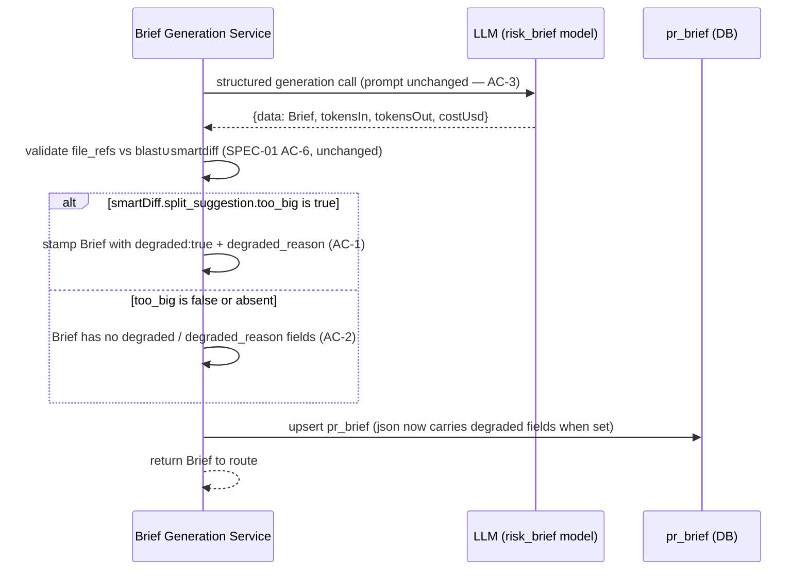
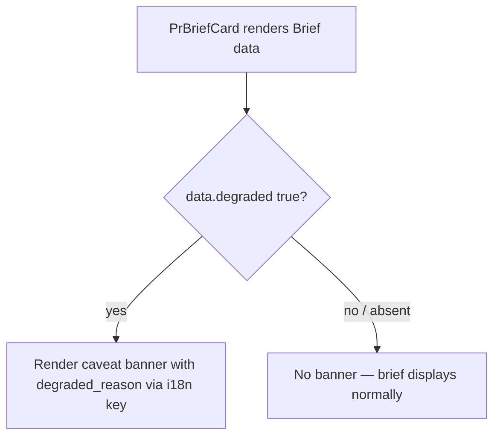

# Spec: Brief Oversized Caveat | Spec ID: SPEC-02 | Status: approved
Supersedes: None — follow-up to SPEC-01 (`server/specs/SPEC-01-why-risk-brief.md`); does not replace any prior spec approach.

## Problem and why

The Why+Risk Brief feature (SPEC-01) was dogfooded on a large, multi-feature PR (115 files, +10142/-304 lines, three unrelated features in the PR body). The generated brief described only the first feature. Root cause: the PR body is hard-capped at 500 chars (SPEC-01 AC-7), and those 500 chars cover only the first section of a 5,267-char body. `SmartDiff.split_suggestion.too_big` was already `true` for this PR (9,524 total changed lines) — a signal `BriefService.generate()` already loads before the LLM call (`service.ts:88-90`) but never uses.

This is a documented, accepted tradeoff in SPEC-01's Edge Cases section (working as designed), not a bug — but it means large PRs receive a silently incomplete "why" with no indication to the reviewer that the summary may be partial.

---

## Goals / Non-goals

**Goals**

- Extend the `Brief` Zod contract with two optional fields — `degraded` (optional boolean) and `degraded_reason` (optional string) — mirroring the pattern established by `BlastRadius` in the same contract file (lines 44-48).
- After the structured LLM call returns and `file_refs` validation completes, check `smartDiff.split_suggestion.too_big`; if `true`, stamp the Brief with `degraded: true` and a non-empty `degraded_reason` string that includes the `total_lines` count, before the Brief is persisted and returned.
- When `too_big` is `false` or absent, leave both fields absent from the Brief (not `false` or empty string) — matching the `BlastRadius.degraded` optional-field convention.
- Render a visible caveat banner in `PrBriefCard` when `degraded` is `true`, using a new `next-intl` i18n key under `block.brief.*` (not a hardcoded string literal — contrast with `BlastTab`, which hardcodes its banner text).
- Update the client vendor mirror of the `Brief` contract in lockstep with the server vendor change.

**Non-goals**

- Changing the PR body cap (remains 500 chars — SPEC-01 AC-7).
- Changing file-list trimming behaviour.
- Asking the LLM to self-report size issues or pass `too_big` to the prompt.
- Introducing any new LLM call, GitHub API call, or DB migration.
- Modifying SPEC-01.

---

## User stories

**US-1:** As a code reviewer, when the Why+Risk Brief for a large PR can only summarize part of the changes, I want to see a visible caveat banner on the brief card — so I know the brief may be incomplete and I read more carefully rather than treating it as exhaustive.

---

## Acceptance criteria (EARS)

**AC-1:** WHEN `smart_diff.split_suggestion.too_big` is `true` at the time of brief generation, the Brief returned and persisted SHALL include `degraded: true` and a non-empty `degraded_reason` string that contains the `total_lines` count from `smart_diff.split_suggestion.total_lines`.

**AC-2:** WHEN `smart_diff.split_suggestion.too_big` is `false` or absent at the time of brief generation, the Brief returned and persisted SHALL NOT contain the `degraded` or `degraded_reason` fields — both SHALL be absent (undefined), not `false` or empty string.

**AC-3:** The `degraded` and `degraded_reason` fields SHALL be computed server-side without any additional LLM call, and SHALL NOT appear in the prompt sent to the model.

**AC-4:** WHEN `degraded` is `true` on the Brief data returned by the brief hook, `PrBriefCard` SHALL render a visible caveat banner that includes the `degraded_reason` text and uses a `next-intl` translated string from a new key under `block.brief.*` in `client/messages/en/brief.json`; WHEN `degraded` is absent or falsy, no such banner SHALL render.

**AC-5:** The `Brief` Zod schema change SHALL be backward-compatible: both `degraded` and `degraded_reason` SHALL be declared `.optional()`; existing `pr_brief` cache rows whose stored JSON lacks these fields SHALL parse successfully against the updated schema, with both fields resolving to `undefined`.

---

## Edge cases

- **Cache read of a pre-existing Brief with no `degraded` field:** `z.boolean().optional()` parses `undefined` without error; `PrBriefCard` treats absent `degraded` as falsy and renders no banner. This is the common case for all briefs generated before this feature ships.

- **`force: true` regeneration after the PR shrinks below the `too_big` threshold:** the new Brief is persisted without `degraded`/`degraded_reason`, overwriting the old row that carried them. The banner disappears on next load. This is correct and expected.

- **`force: true` regeneration while `too_big` remains true:** the newly generated Brief is again stamped with `degraded: true`; the existing row is overwritten with a fresh `degraded_reason`.

- **`total_lines` is 0 when `too_big` is true:** this is pathological and should not occur in practice (if `too_big` is true, a line threshold was exceeded). The service SHALL still populate `degraded_reason` with whatever `total_lines` value is present and SHALL NOT add a special guard branch for zero.

- **`GET /pulls/:id/brief` returning a cached Brief that already carries `degraded: true`:** the flag travels with the JSON stored in the `pr_brief.json` JSONB column and is returned as-is on cache reads. No special handling is required in the read path.

---

## Non-functional

**Performance:** The `degraded` stamp is a synchronous boolean check and string construction after the LLM call — zero additional I/O.

**Accessibility:** The caveat banner in `PrBriefCard` SHALL include `role="status"` so screen readers announce it on render.

**Banner: no inline CTA (deliberate):** The caveat banner SHALL NOT include an inline call-to-action button. The card footer's existing "Regenerate" action is the appropriate affordance. An inline CTA on the banner would mislead reviewers into thinking regeneration remedies the incompleteness — it does not, because the same 500-char PR body cap applies on every regeneration; the incompleteness is structural, not fixable by repeating the generation.

**Schema consistency:** Both new fields use `.optional()` (not `.nullable()`) to match the `BlastRadius.degraded` convention. Using `.nullable()` would require all producers to supply an explicit `null` or `false` for non-oversized briefs, which would break backward compatibility with cached rows that carry neither field.

---

## Architecture & workflows

The following diagram shows where the `degraded` stamp is inserted into the existing SPEC-01 generation flow. All other steps from SPEC-01's sequence diagram are unchanged.





---

## Service contracts

### Updated `Brief` shape

The two new fields are added to the `Brief` Zod schema in both the server vendor and its client mirror, in lockstep. All existing fields are unchanged.

```
Brief {
  what:             string                     // unchanged from SPEC-01
  why:              string                     // unchanged from SPEC-01
  risk_level:       'low' | 'medium' | 'high'  // unchanged from SPEC-01
  risks:            Risk[]                     // unchanged from SPEC-01
  review_focus:     string[]                   // unchanged from SPEC-01
  degraded?:        boolean                    // NEW — absent unless too_big was true at generation time
  degraded_reason?: string                     // NEW — non-empty string including total_lines when degraded is true
}
```

Neither field has a default value. Both are optional. When `too_big` is `false` or absent, neither field appears in the returned or persisted JSON.

### No new API endpoints or DB migrations

This change layers onto the existing `POST /pulls/:id/brief` and `GET /pulls/:id/brief` responses defined in SPEC-01. The `pr_brief.json` column is JSONB and accommodates new optional fields without a migration.

### Cross-module client footprint

The client (home: `@devdigest/web`) requires exactly two changes, both additive:

1. **Contract update** — add `degraded?: boolean` and `degraded_reason?: string` to the `Brief` Zod schema in `client/src/vendor/shared/contracts/brief.ts`, in lockstep with the server vendor change.

2. **Banner in `PrBriefCard`** — when `data.degraded` is `true`, render a caveat banner mirroring the existing `BlastTab` degraded banner shape (`Icon.AlertTriangle` + warn-coloured `div` using `var(--warn-bg)` / `var(--warn)` CSS variables) and add a `degradedBanner` entry to `PrBriefCard/styles.ts` that reproduces the same style object already present in `BlastTab/styles.ts` (lines 20-29). The banner text SHALL use a `next-intl` translated key (e.g. `block.brief.oversizedNotice`) added to `client/messages/en/brief.json`, and SHALL include the `degraded_reason` string so the reviewer sees the line count.

---

## Inputs (provenance)

| Input | Source | Provenance tag |
|---|---|---|
| `smart_diff.split_suggestion.too_big` | `SmartDiffService.buildForPull()` result, already loaded in `BriefService.generate()` before the LLM call (`service.ts:88-90`) | [reused: deterministic smart-diff path classifier — 0 LLM calls] |
| `smart_diff.split_suggestion.total_lines` | Same SmartDiff result as above | [reused: deterministic smart-diff path classifier — 0 LLM calls] |
| `degraded` / `degraded_reason` stamp | Derived from the two inputs above, after the LLM call returns | [deterministic: server-side boolean check + string construction — 0 LLM calls] |

---

## Untrusted inputs

| Input | Untrusted because | Mitigation |
|---|---|---|
| `degraded_reason` string | Constructed by the server from `total_lines`, a server-computed integer — no user-controlled content enters the string | The integer comes from the deterministic smart-diff classifier, not from the PR author or LLM. No sanitization required beyond treating it as a plain numeric value. |

No additional untrusted input surface is introduced. All untrusted inputs from SPEC-01 (PR title, PR body, context doc content, LLM `file_refs` output) remain unchanged.

---

## Traceability

| AC-N | Evidence |
|---|---|
| AC-1 | `server/src/modules/brief/service.ts:88-90` (smartDiff loaded before LLM call, making `split_suggestion.too_big` and `total_lines` available at stamp time); `server/src/vendor/shared/contracts/brief.ts:113-121` (SmartDiff Zod schema: `split_suggestion.too_big: z.boolean()`, `total_lines: z.number().int()`); quoted user requirement: "SmartDiff.split_suggestion.too_big was already true for this PR (9,524 lines) — a signal BriefService already loads but never uses." |
| AC-2 | `server/src/vendor/shared/contracts/brief.ts:40-50` (BlastRadius precedent: `degraded: z.boolean().optional()` — field is absent, not `false`, when the index is healthy); quoted user requirement: "If false/absent, leave both fields unset (not false/empty string — match the BlastRadius precedent's optional-field convention)." |
| AC-3 | `server/src/modules/brief/service.ts:119-169` (LLM call at lines 121-136; file_refs validation at lines 139-145; upsert at lines 148-154 — the stamp inserts after line 145 and before line 148, after the LLM call is complete and the prompt has already been sent); quoted user requirement: "computed deterministically server-side (NOT asked of the LLM — set on the result after the structured call returns, before persisting/returning)." |
| AC-4 | `client/src/app/repos/[repoId]/pulls/[number]/_components/BlastTab/BlastTab.tsx:101-108` (exact JSX pattern: `degraded && <div style={s.degradedBanner}><Icon.AlertTriangle .../><span>...</span></div>`); `client/src/app/repos/[repoId]/pulls/[number]/_components/BlastTab/styles.ts:20-29` (degradedBanner style: flex, gap 8, padding 8px/12px, borderRadius 6, var(--warn-bg) background, var(--warn) color, fontSize 13); `client/src/app/repos/[repoId]/pulls/[number]/_components/PrBriefCard/PrBriefCard.tsx:4` (`useTranslations` already imported and used — i18n pattern already established in this component); quoted user requirement: "add a proper i18n key instead (not copy BlastTab's hardcoding)." |
| AC-5 | `server/src/vendor/shared/contracts/brief.ts:40-50` (BlastRadius uses `.optional()` for health-signal fields — the established backward-compat optional-field convention); `client/src/vendor/shared/contracts/brief.ts:79-86` (current Brief schema without degraded fields — parsing an old row with `.optional()` resolves both to `undefined`); quoted user requirement: "no DB column change — pr_brief.json already stores the whole Brief object as jsonb. Both fields optional; existing cached pr_brief rows without these fields remain valid." |

---

## Verification

| AC-N | Verification recipe |
|---|---|
| AC-1, AC-2, AC-3 | In a unit test, call `BriefService.generate()` with a SmartDiff fixture where `split_suggestion.too_big = true` and `total_lines = 9524`. Confirm the returned Brief has `degraded === true` and `degraded_reason` that contains `"9524"`. Then repeat with `too_big = false`. Confirm the returned Brief has `degraded === undefined` and `degraded_reason === undefined`. Confirm in both cases that the LLM mock was called exactly once (no additional call for the stamp). |
| AC-4 | In a component test for `PrBriefCard`, render with a `usePrBrief` mock returning a Brief with `degraded: true` and `degraded_reason: "PR has 9524 changed lines"`. Confirm a banner element with `role="status"` is present in the rendered output and contains the text "9524". Re-render with a Brief where `degraded` is absent. Confirm no banner element is rendered. |
| AC-5 | In a unit test, parse a plain JSON object matching the pre-existing Brief shape (fields: `what`, `why`, `risk_level`, `risks`, `review_focus` — no `degraded`/`degraded_reason`) through the updated server-side `Brief` Zod schema. Confirm `parse()` succeeds and the result has `degraded === undefined` and `degraded_reason === undefined`. Repeat against the client-side vendor mirror schema. |

