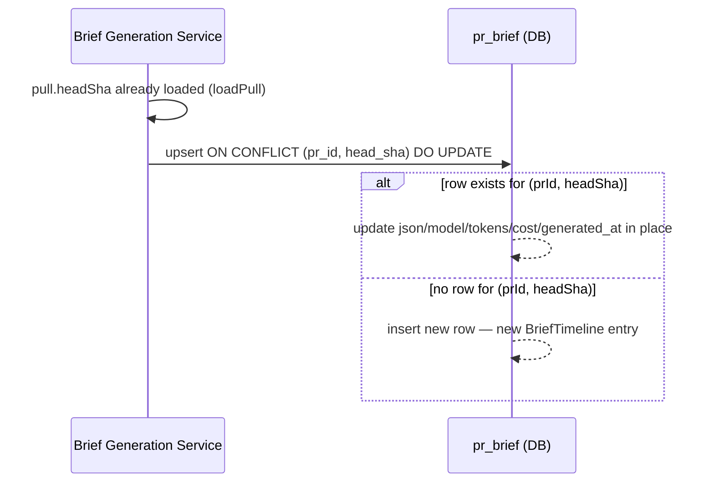
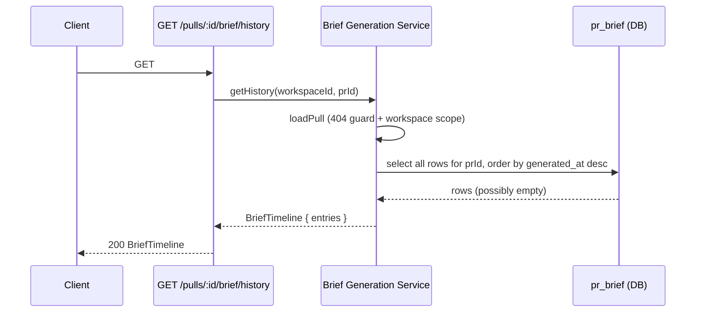

# Spec: BriefTimeline (Brief History by Commit SHA) | Spec ID: SPEC-03 | Status: approved
Supersedes: None — follow-up to SPEC-01 (`server/specs/SPEC-01-why-risk-brief.md`) and SPEC-02 (`server/specs/SPEC-02-brief-oversized-caveat.md`). Implements the stretch goal SPEC-01 explicitly scoped out: *"a history-of-briefs-by-commit-SHA feature... may be introduced as a future stretch-goal spec."*

## Problem and why

The Why+Risk Brief (SPEC-01) caches exactly one Brief per PR (`pr_brief`, primary key `prId`). Every `force: true` regeneration overwrites that single row, discarding the prior generation. When a PR is pushed to and re-briefed, a reviewer has no way to see how the "why" narrative or risk assessment changed as the PR evolved — the previous version is silently gone. This matters most on long-lived PRs that get re-briefed several times across review rounds.

## Goals / Non-goals

**Goals**

- Retain every generated Brief, keyed by the PR's head SHA at generation time, instead of overwriting the single cache row.
- Regenerating at an *unchanged* head SHA updates that SHA's row in place (no duplicate spam from repeated force-regenerates on the same commit); a *new* head SHA (new push) inserts a new row.
- Introduce `GET /pulls/:id/brief/history`: returns every generated Brief for the PR, newest first.
- Add a `BriefHistory` panel, toggled open from `PrBriefCard`'s footer, so a reviewer can inspect prior generations without leaving the Overview tab.

**Non-goals**

- **Naming as "WhyTimeline":** the name used in SPEC-01's non-goals text collides with an already-shipped, unrelated feature — the git-why per-line blame drawer (`server/src/vendor/shared/contracts/why.ts`, `WhyTimeline` Zod type, keyboard `w`). This feature is named `BriefTimeline` instead.
- Changing the existing single-brief cache-hit or force-regeneration semantics from SPEC-01 (AC-1/AC-3/AC-8): `GET`/`POST /pulls/:id/brief` continue to serve/generate against the *latest* brief, regardless of whether the PR has since moved to a new head SHA. This feature is additive persistence + a read/UI surface, not a rework of when regeneration is triggered.
- Auto-regenerating a Brief when a PR's head SHA changes. Regeneration remains force-only, exactly as in SPEC-01.
- Per-entry regeneration actions in the history panel (read-only view; the existing card-level "Regenerate" button is the only regeneration affordance).
- Any new LLM call. This feature only persists and reads what SPEC-01/SPEC-02 already generate.

## User stories

**US-1:** As a code reviewer on a PR that has been pushed to and re-briefed multiple times, I want to see how the why/risk assessment changed at each commit — so I can tell whether new risks were introduced by later pushes.

## Acceptance criteria (EARS)

**AC-1:** WHEN a Brief is generated for a PR and no `pr_brief` row exists for that PR's current head SHA, the system SHALL insert a new row keyed by `(prId, headSha)`, leaving all prior rows for that PR untouched.

**AC-2:** WHEN a Brief is regenerated (`force: true`) and a `pr_brief` row already exists for the PR's *current* head SHA, the system SHALL update that row in place (`ON CONFLICT (prId, headSha) DO UPDATE`) rather than inserting a new row.

**AC-3:** WHEN `GET /pulls/:id/brief/history` is called, the system SHALL return a `BriefTimeline` containing one entry per distinct head SHA the PR has been briefed at, ordered newest-first by `generated_at`.

**AC-4:** WHEN `GET /pulls/:id/brief/history` is called for a PR that has never had a Brief generated, the system SHALL return HTTP 200 with `entries: []` — not a 404. An empty history is a normal state, distinct from the single-brief `GET /pulls/:id/brief` endpoint's 404-means-never-generated semantics (SPEC-01 AC-2).

**AC-5:** WHEN `GET /pulls/:id/brief/history` is called for a PR that does not belong to the caller's workspace, the system SHALL return HTTP 404, enforced by the same workspace-scope guard used by the existing brief routes.

**AC-6:** The existing single-brief behavior SHALL be unchanged: `GET /pulls/:id/brief` SHALL continue to return the most recently generated Brief for the PR regardless of head-SHA drift, and `POST /pulls/:id/brief` SHALL continue to serve from cache unless `force: true` is set (SPEC-01 AC-1, AC-3, AC-8).

## Edge cases

- **PR briefed exactly once:** history has exactly one entry; the panel shows a single row.
- **Repeated `force: true` regenerate with no intervening push:** the head SHA is unchanged, so `listBriefHistory` continues to return the same number of entries — only that entry's content/timestamp changes (AC-2).
- **Pre-existing `pr_brief` rows from before this feature (SPEC-01/SPEC-02 era):** these rows predate the `head_sha` column. The migration backfills `head_sha` from each row's `pull_requests.head_sha` at migration time (best-effort — the PR's head *at migration time*, not necessarily the exact SHA the cached brief was generated against, since that information was never recorded pre-SPEC-03).
- **PR with no `pr_brief` rows at all:** `GET /pulls/:id/brief/history` returns `entries: []`, not an error (AC-4).

## Non-functional

**No new LLM calls:** this feature only changes how already-generated Briefs are persisted and read; it introduces no new structured-generation call.

**Naming collision avoidance:** `BriefTimeline`/`BriefTimelineEntry` are new, distinct type names — not `WhyTimeline`/`WhyEvent`, which remain exclusively owned by the git-why feature.

**Schema consistency:** the `pr_brief` table gains a surrogate `id` primary key (replacing `prId` as PK) and a `NOT NULL` `head_sha` column, with a unique index on `(pr_id, head_sha)` serving as the upsert conflict target, and a plain index on `(pr_id, generated_at)` serving both the "latest brief" lookup and the ordered history query.

## Architecture & workflows

### Persist flow — brief generation now keyed by head SHA



### Read flow — `GET /pulls/:id/brief/history`



## Service contracts

### `GET /pulls/:id/brief/history`

| | |
|---|---|
| Request params | `id` — PR UUID |
| Response 200 | `BriefTimeline` — `entries: []` when nothing generated yet |
| Response 404 | PR not found in caller's workspace |
| Response 400/422 | Invalid `id` format |

### `BriefTimeline` / `BriefTimelineEntry` shape (new; additive to the shared contracts)

```
BriefTimelineEntry {
  head_sha:     string
  brief:        Brief            // the existing SPEC-01/SPEC-02 Brief shape, unchanged
  model:        string | null
  tokens_in:    number | null
  tokens_out:   number | null
  cost_usd:     number | null
  generated_at: string
}

BriefTimeline {
  entries: BriefTimelineEntry[]   // newest first
}
```

### `pr_brief` DB table change

| Column | Before (SPEC-01/02) | After (SPEC-03) |
|---|---|---|
| `id` | — | `uuid` PRIMARY KEY, `default gen_random_uuid()` |
| `pr_id` | PRIMARY KEY | `uuid NOT NULL` (FK, no longer PK) |
| `head_sha` | — | `text NOT NULL` |
| `json`, `model`, `tokens_in`, `tokens_out`, `cost_usd`, `generated_at` | unchanged | unchanged |

New indexes: unique `(pr_id, head_sha)` (upsert conflict target) and plain `(pr_id, generated_at)` (latest-brief lookup and ordered history query).

**Migration note:** pre-existing rows have no recorded head SHA. The migration adds `head_sha` as nullable, backfills it from `pull_requests.head_sha` (best-effort — the PR's head at migration time), then enforces `NOT NULL`, before dropping the old single-column primary key and creating the new indexes.

### Cross-module client footprint

1. **Data hooks** (`client/src/lib/hooks/brief.ts`):
   - `useBriefHistory(prId)` — `GET /pulls/:id/brief/history`.
   - `useGenerateBrief`'s `onSuccess` now also invalidates the history query, so a fresh generation appears in the timeline immediately.
2. **Display component** (`BriefHistory`, new folder under `PrBriefCard`'s sibling `_components/`):
   - Toggled open from a "View history" button in `PrBriefCard`'s footer.
   - One row per entry (short SHA, risk-level badge, `why` excerpt, timestamp), expandable to the full `what`/`why`/`risks` for that generation. Read-only — no per-entry regenerate action.

### Client i18n namespace

New keys under `block.brief.history.*` in `client/messages/en/brief.json` (`label`, `show`, `hide`, `empty`). The file already contained unrelated, unused orphaned keys (`block.history`, `noHistory`, `overlap`) left over from an earlier, abandoned "overlapping PRs" concept (the removed `PrHistoryItem` stub) — these are untouched and must not be repurposed for this feature.

## Inputs (provenance)

| Input | Source | Provenance tag |
|---|---|---|
| Brief content per entry | Already-generated `Brief` from SPEC-01/SPEC-02 (`BriefService.generate()`) | [reused: 0 new LLM calls] |
| `head_sha` | `pull_requests.head_sha`, read at generation time via the already-loaded `pull` row | [reused: DB — 0 LLM calls] |
| History ordering/listing | Deterministic DB query (`ORDER BY generated_at DESC`) | [deterministic: 0 LLM calls] |

## Untrusted inputs

No new untrusted input surface. `head_sha` is a Git commit SHA already trusted and stored by the existing PR ingest path (SPEC-01/SPEC-02 make no changes here); Brief content displayed per history entry carries the same untrusted-content handling already established in SPEC-01/SPEC-02 (rendered as data, never as instructions).

## Traceability

| AC-N | Evidence |
|---|---|
| AC-1, AC-2 | `server/src/modules/brief/repository.ts:67-97` (`upsertBrief` — `onConflictDoUpdate({ target: [t.prBrief.prId, t.prBrief.headSha], ... })`); `server/src/db/schema/reviews.ts` (`pr_brief_pr_sha_uq` unique index on `(prId, headSha)`) |
| AC-3 | `server/src/modules/brief/repository.ts:40-56` (`listBriefHistory` — `orderBy(desc(t.prBrief.generatedAt))`, mapped to `BriefTimelineEntry[]`) |
| AC-4 | `server/src/modules/brief/service.ts:63-73` (`getHistory` returns `{ entries }` from `listBriefHistory`, never throws for an empty result); `server/src/modules/brief/routes.ts` (`GET /pulls/:id/brief/history` has no 404 branch for empty entries) |
| AC-5 | `server/src/modules/brief/service.ts:70` (`await this.loadPull(workspaceId, prId)` — same workspace-scope guard as `get()`/`generate()`) |
| AC-6 | `server/src/modules/brief/repository.ts:25-34` (`getBrief` — `orderBy(desc(generatedAt)).limit(1)`, i.e. always the latest row regardless of SHA); `server/src/modules/brief/service.ts` `generate()` cache-check branch unchanged from SPEC-01 |

## Verification

| AC-N | Verification recipe |
|---|---|
| AC-1 | Generate a Brief for a PR at head SHA A. Confirm one `pr_brief` row exists with `head_sha = A`. Update the PR's `head_sha` to B and force-regenerate. Confirm a second row now exists with `head_sha = B`, and the row for A is unchanged. |
| AC-2 | Force-regenerate a Brief twice in a row with no change to the PR's head SHA. Confirm exactly one `pr_brief` row exists for that SHA both times (row count does not grow). |
| AC-3 | After AC-1's two generations, call `GET /pulls/:id/brief/history`. Confirm `entries` has length 2, ordered with `head_sha = B` (newest) before `head_sha = A`. |
| AC-4 | Call `GET /pulls/:id/brief/history` for a PR with no Brief ever generated. Confirm HTTP 200 and `entries: []`. |
| AC-5 | Call `GET /pulls/:id/brief/history` using a PR UUID belonging to a different workspace. Confirm HTTP 404. |
| AC-6 | Generate a Brief, then push a new commit (change head SHA) without regenerating. Call `GET /pulls/:id/brief`. Confirm it still returns the previously generated Brief (latest by `generated_at`), not a 404 or an error — cache-hit behavior is unchanged from SPEC-01. |

Covered by: `server/src/modules/brief/brief.test.ts` (`BriefService.getHistory` describe block), `server/src/modules/brief/routes.test.ts` (`GET /pulls/:id/brief/history` describe block), `server/test/brief-history.it.test.ts` (real-Postgres upsert-by-SHA and ordering behavior), and client-side `BriefHistory.test.tsx` / extended `PrBriefCard.test.tsx`.
