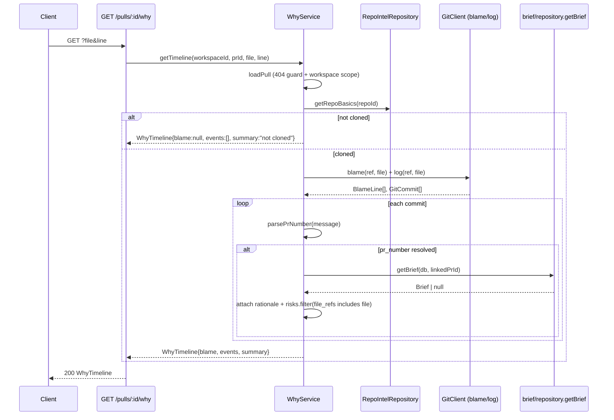

# Spec: git-why Blame Drawer | Spec ID: SPEC-04 | Status: approved
Supersedes: None. Builds the feature the shared contract file `server/src/vendor/shared/contracts/why.ts` (`WhyEvent`, `WhyTimeline`) anticipated but that was never actually implemented — no route, no service, no client UI existed prior to this spec. Composes data already produced by SPEC-01/SPEC-02/SPEC-03 (Brief, BriefTimeline).

## Problem and why

A reviewer looking at a line in the Diff tab has no way to see who wrote it, when, in which PR, or why — beyond GitHub's own blame view, which this app doesn't surface at all. The git adapter (`server/src/adapters/git/simple-git.ts`) already exposes `blame()` and `log()`, fully implemented and unused by any module. Separately, this project already generates a per-PR "why" narrative and risk list (`Brief.why`, `Brief.risks` with `file_refs`, cached per commit SHA via `pr_brief`/`BriefTimeline` — SPEC-01/02/03). These two pieces of already-computed data have never been joined: a reviewer inspecting a line has no path from "this line" to "the rationale and risks of the PR that introduced it."

## Goals / Non-goals

**Goals**

- Introduce `GET /pulls/:id/why?file&line`: deterministically walks git blame + log for a file/line and returns a `WhyTimeline` — the commit that currently owns the line, plus the chronological chain of commits that touched the file.
- For each commit event whose message references a PR number, resolve that PR (same repo) and — if it has a generated Brief — attach the PR's rationale (`Brief.why`) and its risks scoped to this specific file (`Brief.risks` filtered by `file_refs`). This is the traceability/personalization layer: "who added what, why, and what risk it carried" per line.
- A `WhyDrawer` on the Diff tab, opened via a per-line hover trigger (mirroring the existing inline-comment "+" affordance), rendering the timeline.

**Non-goals**

- Any new LLM call. This feature only reads already-computed git history and already-generated Briefs.
- A per-author aggregate risk profile (e.g. "this author has introduced N risks across all their PRs"). Scoped to per-line/per-commit traceability only; an aggregate view is a larger, separate feature.
- A global keyboard shortcut (`w`) to open the drawer. No hotkey infrastructure exists in `app-shell` today; the hover-button trigger is the only entry point this spec adds.
- Changing `pr_brief`/`BriefTimeline` (SPEC-01/02/03) in any way. This feature only reads `getBrief()`.
- Resolving PR numbers via a live GitHub API call. PR-number extraction is regex-only, from commit messages already available via `git log`.

## User stories

**US-1:** As a code reviewer looking at a line in the diff, I want to see who wrote it, when, and in which PR — so I know who to ask if I have a question about it.

**US-2:** As a code reviewer, when the commit that introduced a line belongs to a PR that has a generated Brief, I want to see that PR's rationale and any risks it flagged for this file — so I understand not just *who* touched this code but *why*, without leaving the diff.

## Acceptance criteria (EARS)

**AC-1:** WHEN `GET /pulls/:id/why?file&line` is called for a PR belonging to the caller's workspace, the system SHALL return a `WhyTimeline` containing `blame` (the commit currently owning `line`, or `null`) and `events` (every commit touching `file`, newest first).

**AC-2:** WHEN a commit's message matches a PR-number reference (`(#123)` or a bare `#123`), the corresponding `WhyEvent.pr_number` SHALL be populated with that number; WHEN no match exists, `pr_number` SHALL be `null`.

**AC-3:** WHEN a `WhyEvent`'s resolved `pr_number` corresponds to a `pull_requests` row in the same repo AND that PR has a generated Brief (via the existing `getBrief`), the event SHALL carry `rationale` (that Brief's `why`) and `risks` (that Brief's `risks` filtered to entries whose `file_refs` includes the queried `file`). WHEN no such PR or Brief exists, `rationale` and `risks` SHALL both be absent (not present as empty/null placeholders).

**AC-4:** The event whose `sha` matches the blame owner for `line` SHALL have `is_blame_head: true`; all others SHALL have `is_blame_head: false` (or omit it, since it defaults `false`).

**AC-5:** WHEN `GET /pulls/:id/why` is called for a PR that does not belong to the caller's workspace, the system SHALL return HTTP 404 — same workspace-scope guard as the existing brief routes.

**AC-6:** WHEN the repo has not been cloned yet, OR the git `blame`/`log` calls fail (missing/renamed/binary file), OR the file has no commit history, the system SHALL return a well-formed `WhyTimeline` with `events: []` and `blame: null` (and an appropriate `summary` string) rather than an error.

**AC-7:** This feature SHALL make zero new LLM calls; `rationale`/`risks` enrichment SHALL only read already-persisted `Brief` data via the existing `getBrief` function.

## Edge cases

- **Commit message with no PR reference** (e.g. a direct push, not a squash-merged PR): `pr_number: null`, no `rationale`/`risks` — the event is still returned with its git-level fields.
- **PR number resolves to a PR that was never briefed:** `getBrief` returns `null` — the event has `pr_number` but no `rationale`/`risks`. Not an error.
- **PR's Brief exists but its risks' `file_refs` don't mention this file:** `risks` resolves to `[]` after the filter (present but empty), while `rationale` (the PR-level `why`) is still attached — the narrative is PR-scoped, the risk list is file-scoped.
- **`blame()` names a sha that `log()` didn't return** (depth mismatch): fall back to a minimal `WhyEvent` built directly from the `BlameLine` (sha/author/date/summary), without enrichment, rather than dropping the blame-head entirely.
- **File renamed or deleted in a later commit:** `git blame`/`git log` operate against the file's current path at HEAD; a file that no longer exists degrades to AC-6's empty-timeline path.
- **Very large file history:** no pagination in this spec — `log()`'s full result is returned. Acceptable for this stretch scope; large-repo pagination is a future concern, not addressed here.

## Non-functional

**Performance:** two git subprocess calls (`blame`, `log`) plus, per event with a resolvable PR number, one indexed DB lookup (`pull_requests` by `repoId, number`) and one `pr_brief` read (`getBrief`, already indexed by SPEC-03's `(pr_id, generated_at)` index). No new heavy computation.

**Security:** `file` is a client-supplied query parameter (untrusted). It is used only as an argument to `git blame`/`git log` against the repo's own clone directory (via `simple-git`, which does not invoke a shell) — no path traversal risk beyond what `simple-git`'s argument-array invocation already prevents, consistent with how `diffNameOnly`/`readFile` already accept caller-supplied paths elsewhere in this adapter.

## Architecture & workflows



## Service contracts

### `GET /pulls/:id/why`

| | |
|---|---|
| Request params | `id` — PR UUID |
| Request query | `file: string` (required), `line: number` (required, coerced int) |
| Response 200 | `WhyTimeline` |
| Response 404 | PR not found in caller's workspace |
| Response 400/422 | Invalid `id`/`file`/`line` |

### `WhyEvent` (extended — additive, both fields optional)

```
WhyEvent {
  sha:            string
  summary:        string
  author:         string
  date:           string
  pr_number:      number | null
  is_blame_head:  boolean
  rationale?:     string   // NEW — linked PR's Brief.why, when resolvable
  risks?:         Risk[]   // NEW — linked PR's Brief.risks filtered to this file
}
```
`WhyTimeline { file, line, blame: WhyEvent | null, events: WhyEvent[], summary }` is unchanged in shape.

### Cross-module client footprint

- `client/src/lib/hooks/why.ts`: `useWhyTimeline(prId, file, line)` — `GET /pulls/:id/why`.
- `WhyDrawer` component (new `_components/WhyDrawer/`), built on the existing `Drawer` primitive (`@devdigest/ui`).
- A new hover-revealed trigger button in `CodeLine.tsx`, next to the existing inline-comment "+" button, only for lines present in the current file version (`(add|ctx) && newNo != null`).
- i18n: reuses the pre-seeded `why.*` namespace in `client/messages/en/brief.json` (`title`, `blame`, `noHistory`, `noCommits`), plus new keys `why.rationale`, `why.risks`, `why.viewPr`, `why.trigger`.

## Inputs (provenance)

| Input | Source | Provenance tag |
|---|---|---|
| Blame/commit history | `container.git.blame`/`.log` (simple-git over the repo clone) | [deterministic: git subprocess — 0 LLM calls] |
| `pr_number` | Regex parse of each commit message | [deterministic: 0 LLM calls, 0 GitHub API calls] |
| `rationale` / `risks` | Already-generated `Brief` (SPEC-01/02/03), read via existing `getBrief` | [reused: 0 new LLM calls] |

## Untrusted inputs

| Input | Untrusted because | Mitigation |
|---|---|---|
| `file` query param | Client-supplied | Passed only as an argument to `simple-git`'s array-based git invocation (no shell interpolation); a nonexistent/invalid path degrades to an empty `WhyTimeline` (AC-6), not an error or filesystem escape |
| Commit messages (for PR-number parsing) | Written by whoever authored the commit | Parsed by a fixed regex only; the extracted value is a numeric PR id used solely as a DB lookup key, never executed or rendered as instructions |

## Traceability

| AC-N | Evidence |
|---|---|
| AC-1 | `server/src/adapters/git/simple-git.ts:114-127` (`blame`/`log` already implemented); `server/src/modules/brief/service.ts:200-212` (`loadPull` workspace-guard pattern to mirror) |
| AC-2 | New `parsePrNumber` helper — no prior implementation existed; `why.ts`'s doc comment description is the only prior reference |
| AC-3 | `server/src/modules/brief/repository.ts:25-34` (`getBrief`, already exported, latest-brief lookup); `server/src/modules/pulls/routes.ts:66` / `polling/routes.ts:50` ((repoId, number) unique-index lookup pattern to mirror) |
| AC-4 | `BlameLine` shape (`server/src/vendor/shared/adapters.ts` — sha/author/date/summary per line) matched against `GitCommit.sha` from `log()` |
| AC-5 | Same `loadPull` guard as AC-1, reused verbatim across the brief/why modules |
| AC-6 | `server/src/modules/project-context/service.ts:65-72` (`resolveClonePath` — throws only a validation error today; this module instead degrades to an empty timeline rather than propagating) |
| AC-7 | No LLM adapter is imported by this module at all — grep-verifiable at review time |

## Verification

| AC-N | Verification recipe |
|---|---|
| AC-1 | Call `GET /pulls/:id/why?file=<known file>&line=<known line>` for a seeded PR. Confirm `events` is non-empty and ordered newest-first, and `blame` is a non-null event. |
| AC-2 | Unit-test `parsePrNumber` against `"Add rate limiting (#123)"` → `123`, `"Fix bug, closes #45"` → `45`, and a message with no reference → `null`. |
| AC-3 | Seed a commit whose message references a PR that has a generated Brief with a risk whose `file_refs` includes the queried file. Confirm that event's `rationale` equals the Brief's `why` and `risks` contains only the matching risk(s). Repeat with a PR that has no Brief — confirm both fields are absent. |
| AC-4 | Confirm exactly one event in a multi-commit history has `is_blame_head: true`, and it matches the `blame` field's `sha`. |
| AC-5 | Call the route with a PR UUID belonging to a different workspace. Confirm HTTP 404. |
| AC-6 | Mock `container.git.blame`/`.log` to throw. Confirm the route still returns HTTP 200 with `events: []`, `blame: null`. |
| AC-7 | Grep the `why` module's source for any LLM adapter import/call — confirm none exists. |

---

## Live-testing addendum: blame/log must target the PR's head_sha explicitly

Manually exercising the feature against this PR's own diff (dev-digest, PR #6) surfaced a real bug no mock caught: every line showed "No history available for this line."

**Root cause:** `GitClient.blame()`/`.log()` (as originally implemented) take no revision argument — they operate against whatever the shared clone directory currently has checked out. But the shared clone is only ever synced to a repo's **default branch** (`RepoIntelService`/`sync()` calls `container.git.sync(ref, repo.defaultBranch)`); it is never checked out to an arbitrary PR's branch. Any file that only exists on the PR's branch (which, for a PR under review, is essentially always true for at least some of its diff) would never be found by blame/log — not a stale-clone timing issue, but a structural one that would reproduce for every non-default-branch PR, every time.

**Fix:** `GitClient.blame(repo, path, ref?)` and `.log(repo, path?, ref?)` gained an optional revision parameter (both git commands support this natively — `git blame <ref> -- <path>` / `git log <ref> -- <path>`, no checkout required, no risk of racing other concurrent requests against the same shared clone). `WhyService` now always passes the PR's `head_sha` explicitly. Because that sha may not yet exist in the clone's local object database (it was never fetched), the service retries once after a best-effort `fetchPullHead(repo, pr_number)` (already-implemented, previously-unused) before degrading to an empty timeline.

`log()`'s implementation also moved off simple-git's high-level `.log()` wrapper (which has no clean way to start from an arbitrary ref) onto `raw()` with a custom `%x1f`/`%x1e`-delimited pretty-format, parsed by a new `parseLogPretty` — control characters that can't collide with commit-message content, unlike a naive delimiter.

**Verified live** against the real `VadimPoltoratskiy/dev-digest` clone: confirmed the PR's actual head_sha (`d6e528a...`) was absent from the clone's object database before the fix would have applied; confirmed `git fetch origin pull/6/head:pr-6` (what `fetchPullHead` does) makes it resolvable; confirmed both `git blame <sha> -- <path>` and `git log --pretty=format:... <sha> -- <path>` then return correct, real data for a file that only exists on this PR's branch.

This is a correctness fix within SPEC-04's existing AC-1/AC-6 — not a new acceptance criterion — found by exercising the real system rather than mocks.
