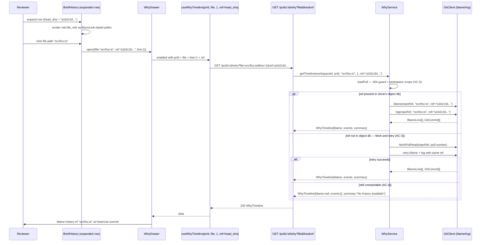

# Spec: Historical-ref WhyDrawer from BriefHistory | Spec ID: SPEC-05 | Status: approved
Supersedes: None — additive extension to SPEC-04 (git-why blame drawer, `server/specs/SPEC-04-git-why-blame-drawer.md`) and to the SPEC-03 `BriefHistory` UI panel (`server/specs/SPEC-03-brief-timeline.md`). No prior implementation of either extension exists.

## Problem and why

The "Why + Risk Brief" history panel (`BriefHistory`) shows every previously-generated Brief for a PR, one row per commit SHA. When a reviewer expands a history entry, they can read the narrative (`what`/`why`) and risk titles/explanations — but two gaps leave the history panel far less useful than it could be:

1. **`file_refs` are invisible in history entries.** Each risk names the files it concerns (`Brief.risks[].file_refs`), but the expanded `BriefHistory` row does not render them at all (confirmed: `BriefHistory.tsx` lines 53–66 render `risk.title` + `risk.explanation` and stop there). The current PR's `PrBriefCard` does render `file_refs` via `MonoLink` with GitHub blob links (`PrBriefCard.tsx:107–117`), but `BriefHistory` does not.

2. **No path from a historical Brief to the blame history of its files.** Even if a reviewer could see which files a past risk named, there is no way to open the blame history of those files *at the historical commit*. The existing `WhyDrawer` always scopes its blame/log call to the PR's current `pull.headSha` (hardcoded in `WhyService.getTimeline` at `service.ts:47–48`). The `GET /pulls/:id/why` route's `WhyQuery` has no `ref` field (`routes.ts:19–22`).

The combination means a reviewer cannot answer: "At the point this earlier Brief was generated, what was the commit history of the file this risk named?"

## Goals / Non-goals

**Goals**

- Extend `GET /pulls/:id/why` to accept an optional `ref` query parameter. When present and valid, `WhyService` SHALL use it as the git revision for `blame()` and `log()` instead of the PR's current `pull.headSha`. When absent, behavior is identical to SPEC-04 (backward-compatible; existing diff-tab call sites remain unchanged).
- Extend `WhyService.getTimeline` to apply the existing fetch-and-retry mechanism (currently used for `pull.headSha`) equally when an arbitrary `ref` is requested, since historical SHAs are also unlikely to be present in the shared clone's object database.
- Render `file_refs` in each `BriefHistory` expanded row — as clickable affordances styled consistently with `PrBriefCard`'s existing `MonoLink` treatment — each linking to the file at `entry.head_sha` on GitHub when `repoFullName` is available.
- Add a trigger on each rendered `file_refs` path so that clicking it opens the existing `WhyDrawer` scoped to `{file: <that path>, ref: entry.head_sha, line: 1}` — showing the blame history of that file at the historical commit, not at the PR's current head.
- Thread the optional `ref` through the client stack: `fetchWhyTimeline`, `useWhyTimeline`, and `WhyDrawer` each gain an optional `ref` parameter, defaulting to `undefined` (meaning: use current head, preserving today's behavior at the diff-tab call sites in `CodeLine.tsx`/`DiffTab.tsx`).

**Non-goals**

- Any new LLM call. This feature makes zero new structured-generation calls — it only re-invokes the existing `getTimeline` logic with a different git revision argument.
- A new "whole-file blame" response mode or a new `WhyTimeline` response shape. `ref` is a request-side parameter only; the response contract (`WhyTimeline`/`WhyEvent`) is unchanged.
- DB schema or migration changes. `ref` is a purely request-time parameter; nothing is persisted.
- Changing when or how Briefs are generated or cached. This feature is a read-only layer on top of SPEC-01/02/03/04 data.
- Per-entry regenerate actions in `BriefHistory` (read-only; the "Regenerate" button in `PrBriefCard`'s footer remains the only regeneration affordance — SPEC-03 non-goals unchanged).
- Support for abbreviated SHAs, branch names, or tag names as `ref` values. The only trigger in this spec always passes a full `BriefTimelineEntry.head_sha` (40-char hex SHA); other ref shapes are explicitly out of scope.
- A keyboard shortcut for the history-triggered drawer. The click affordance on `file_refs` paths is the only new entry point.

## User stories

**US-1:** As a code reviewer reading a historical Brief entry, I want to see which files each risk named — so I can understand the past risk scope without leaving the overview tab.

**US-2:** As a code reviewer, when I see a file path referenced in a past risk, I want to open the blame history of that file *as of the commit that Brief was generated against* — so I can see what the history looked like at the time the tool flagged it, not just today's history.

## Acceptance criteria (EARS)

**AC-1 (backward compatibility):** WHEN `GET /pulls/:id/why?file&line` is called without a `ref` parameter, the system SHALL behave identically to SPEC-04: `blame()` and `log()` SHALL be called with the PR's current `pull.headSha` as the revision argument, and the existing fetch-and-retry behavior (SPEC-04 AC-6) SHALL remain unchanged.

**AC-2 (ref-scoped blame/log):** WHEN `GET /pulls/:id/why?file&line&ref=<sha>` is called with a valid `ref` parameter, the system SHALL pass that `ref` value to `blame()` and `log()` instead of `pull.headSha`, returning a `WhyTimeline` reflecting the file's history as visible from that revision.

**AC-3 (fetch-and-retry for arbitrary ref):** WHEN blame/log with a caller-supplied `ref` fails because that revision is not present in the shared clone's object database, the system SHALL perform a best-effort fetch for the PR and retry the blame/log once before degrading — applying the same retry mechanism already used for `pull.headSha`.

**AC-4 (graceful degradation for unreachable ref):** IF the historical `ref` remains unreachable after the fetch-and-retry attempt, THEN the system SHALL return a well-formed `WhyTimeline` with `events: []` and `blame: null` (and an appropriate `summary` string) rather than an HTTP error — mirroring SPEC-04's AC-6 degradation behavior.

**AC-5 (workspace-scope enforcement):** WHEN `GET /pulls/:id/why` is called with any combination of parameters for a PR that does not belong to the caller's workspace, the system SHALL return HTTP 404 — the workspace-scope guard fires before any `ref` processing.

**AC-6 (file_refs rendered in BriefHistory):** WHEN a `BriefHistory` row is expanded and the entry's `brief.risks` contains at least one risk with a non-empty `file_refs` array, the system SHALL render each file path as a clickable affordance styled consistently with `PrBriefCard`'s existing `MonoLink` treatment, linking to the file at `entry.head_sha` on GitHub when `repoFullName` is available.

**AC-7 (WhyDrawer trigger from BriefHistory):** WHEN a reviewer clicks a `file_refs` path in an expanded `BriefHistory` row, the system SHALL open the `WhyDrawer` scoped to `{file: <that path>, ref: entry.head_sha, line: 1}` — showing the blame history of that file at the historical commit, not at the PR's current head.

**AC-8 (ref validation):** WHEN `ref` is provided as a query parameter and its value is not a 40-character lowercase hexadecimal string (`/^[0-9a-f]{40}$/`), the system SHALL reject the request with HTTP 422 — preventing git-level option injection via crafted values that begin with `-` or contain non-hex characters.

**AC-9 (subtitle indicates historical scope):** WHEN `WhyDrawer` is opened with a `ref` set, its subtitle SHALL append the short SHA (first 7 characters) to the existing `${file}:${line}` format — e.g. `src/foo.ts:1 @ a1b2c3d` — so a reviewer can distinguish it from a diff-tab-triggered drawer scoped to the PR's current head. WHEN `ref` is absent, the subtitle SHALL remain `${file}:${line}`, unchanged from SPEC-04.

## Edge cases

- **Historical SHA no longer reachable from current PR head** (e.g., after a force-push with history rewrite): the best-effort fetch cannot recover the SHA; degrades to AC-4's empty timeline. This is expected and correct — the historical data is gone from the remote.
- **Entry whose risks have only empty `file_refs` arrays** (e.g., a risk whose `file_refs: []`): no clickable paths are rendered for that risk; the rest of the expanded row (`title`, `explanation`) is unchanged.
- **Entry with no risks at all**: the expanded row renders only `what` and `why` — unchanged from today's behavior; this path is not affected by this spec.
- **WhyDrawer opened from BriefHistory on a repo not yet cloned**: the route returns an empty timeline (AC-4); the drawer shows the "no history" state, same as today for the diff-tab trigger.
- **Existing diff-tab trigger (CodeLine.tsx → WhyDrawer without `ref`)**: the `ref` prop defaults to `undefined`; the service path is identical to SPEC-04 (AC-1). These call sites must keep working unchanged.
- **`BriefHistory` rendered without `repoFullName`** (e.g., in a context where the parent does not supply it): file paths SHALL still be rendered as text affordances and SHALL still open the `WhyDrawer` when clicked; the GitHub blob link is simply omitted (same `canLink`-style guard as `PrBriefCard`).
- **Very long `file_refs` list**: no pagination in this spec — all paths render inline, consistent with `PrBriefCard`'s current unbounded rendering of the same data.

## Non-functional

**Performance:** identical to SPEC-04 — two git subprocesses (`blame`, `log`) plus, per commit with a resolvable PR number, one indexed DB lookup and one `getBrief` read. The `ref` argument has zero computational overhead beyond what git blame/log already incur.

**Security:** `ref` is a client-supplied query parameter passed as an element of a string array to `blame()`/`log()` via simple-git's `.raw()` method — which invokes git via Node's `child_process.spawn` argument array, not via a shell. Shell injection is not possible by construction. Git-level option injection (e.g., a `ref` starting with `--`) IS possible if the ref is not validated; AC-8's Zod schema (`/^[0-9a-f]{40}$/`) closes this by restricting `ref` to values that git unambiguously treats as commit SHA specifiers.

## Architecture & workflows

### New flow: click file_refs path in BriefHistory → WhyDrawer at historical ref

### Backward-compatible path: existing diff-tab trigger (no ref)

When `CodeLine.tsx` opens `WhyDrawer` without a `ref` (the current diff-tab flow), `ref` is `undefined`, `useWhyTimeline` omits it from the query key and fetch URL, and `WhyService` falls back to `pull.headSha` — identical to SPEC-04's behavior. No diagram change needed for this path.

## Service contracts

### `GET /pulls/:id/why` (extended — additive, `ref` optional)

| | Before (SPEC-04) | After (SPEC-05) |
|---|---|---|
| Request params | `id` — PR UUID | unchanged |
| Request query | `file: string` (required), `line: number` (required, coerced int) | + `ref: string` (optional) — when present, must match `/^[0-9a-f]{40}$/` |
| Response 200 | `WhyTimeline` | `WhyTimeline` (unchanged) |
| Response 404 | PR not in caller's workspace | unchanged |
| Response 400/422 | Invalid `id`/`file`/`line` | + invalid `ref` (non-SHA format) |

The `WhyTimeline` and `WhyEvent` response shapes are unchanged from SPEC-04 — `ref` is a request-side parameter only.

### Cross-module client footprint

All changes are additive; existing call sites remain unchanged.

- `client/src/lib/api.ts` — `fetchWhyTimeline(prId, file, line, ref?)`: optional `ref` appended to the `URLSearchParams` when set.
- `client/src/lib/hooks/why.ts` — `useWhyTimeline(prId, file, line, ref?)`: `ref` added to the `queryKey` array and forwarded to `fetchWhyTimeline`; the `enabled` guard is unchanged.
- `WhyDrawer` component — gains optional `ref?: string` prop; forwarded to `useWhyTimeline`. Subtitle rendering appends ` @ <short-sha>` when `ref` is set (AC-9). The diff-tab call sites (`CodeLine.tsx`/`DiffTab.tsx`) continue to omit `ref` and are unaffected.
- `BriefHistory` component — gains optional `repoFullName?: string | null` prop (forwarded from `PrBriefCard`, which already receives it). Used to: (a) build GitHub blob deep-links for rendered `file_refs` (at `entry.head_sha`), and (b) forward to the `WhyDrawer` instance it opens. `BriefHistory` also gains local state to track which `{file, ref}` pair is open in the drawer, rendered as a conditionally mounted `WhyDrawer`.
- New i18n keys under `block.brief.history.*` in `client/messages/en/brief.json`: `fileRefs` (section label for the file paths block in the expanded row) and `openBlame` (accessible label / tooltip for each clickable path affordance).

## Inputs (provenance)

| Input | Source | Provenance tag |
|---|---|---|
| `ref` query param | Client-supplied; in the UI trigger, always sourced from `BriefTimelineEntry.head_sha` — a value already stored in DB from SPEC-03 | [reused: DB-backed value, 0 new LLM calls] |
| Blame/commit history at `ref` | `container.git.blame(repoRef, file, ref)` / `.log(repoRef, file, ref)` — git subprocess over the shared clone | [deterministic: git subprocess — 0 LLM calls] |
| `file_refs` paths in history entries | `BriefTimelineEntry.brief.risks[].file_refs` — already loaded by the existing `useBriefHistory` query (SPEC-03), no new API call | [reused: 0 new API calls] |
| PR-number rationale / file-scoped risks | Already-generated `Brief` read via existing `getBrief` (SPEC-01/02/03) — unchanged from SPEC-04 enrichment path | [reused: 0 new LLM calls] |

## Untrusted inputs

| Input | Untrusted because | Mitigation |
|---|---|---|
| `ref` query param | Client-supplied — any string can be submitted in the HTTP request, even though the UI always passes a SHA from `BriefTimelineEntry.head_sha` | No shell injection risk: simple-git's `blame()`/`log()` pass `ref` as an element of an array to `git` via Node's `child_process.spawn` (no shell). Git-level option injection (e.g., `--upload-pack=evil`) IS possible if `ref` begins with `-`; mitigated by AC-8's Zod validation restricting `ref` to `/^[0-9a-f]{40}$/` — the only shape `BriefTimelineEntry.head_sha` ever takes, and one git unconditionally treats as a commit SHA specifier. Evidence for no-shell claim: `server/src/adapters/git/simple-git.ts:121–124` uses `.raw(args)` with an array; the `ref` element is inserted before `--` so git parses it as a revision, not a path. |
| `file_refs` path strings | Generated by an LLM (SPEC-01/02) — output of structured generation, not a trusted system value | Rendered as display text and GitHub URL path components (same as `PrBriefCard`'s existing treatment). Never executed, eval'd, or treated as instructions. The GitHub blob URL is built from the path using an explicit template function, not string concatenation into a command. |
| Commit messages (for PR-number enrichment) | Written by whoever authored the commit | Unchanged from SPEC-04 — parsed by a fixed regex, extracted number used only as a DB lookup key. |

## Traceability

| AC-N | Evidence |
|---|---|
| AC-1 | `server/src/modules/why/service.ts:45–48` (`runBlameAndLog` closure hardcodes `pull.headSha` — this is the current behavior preserved when `ref` is absent); `server/src/modules/why/routes.ts:19–22` (`WhyQuery` has only `file` + `line` — confirms no existing `ref` field to backward-break) |
| AC-2 | `server/src/adapters/git/simple-git.ts:120–126` (`blame(repo, path, ref?)` — already accepts optional `ref`, passes it in args array before `--`) and `134–139` (`log(repo, path?, ref?)` — same, added by SPEC-04's live-testing addendum); `server/src/modules/why/service.ts:45–48` (the `runBlameAndLog` closure where the `ref` argument must be threaded through) |
| AC-3, AC-4 | `server/src/modules/why/service.ts:55–67` (existing try-catch fetch-and-retry pattern for `pull.headSha`: catch → `fetchPullHead(repoRef, pull.number)` → retry → degrade to `emptyTimeline`; same structure to be applied when an arbitrary `ref` is used) |
| AC-5 | `server/src/modules/why/service.ts:118–125` (`loadPull` workspace guard — throws `NotFoundError` when PR not in workspace; unchanged and fires before any ref/git processing) |
| AC-6 | `client/src/app/repos/[repoId]/pulls/[number]/_components/BriefHistory/BriefHistory.tsx:53–66` (expanded row renders only `risk.title` + `risk.explanation` — `file_refs` are absent and need adding); `client/src/app/repos/[repoId]/pulls/[number]/_components/PrBriefCard/PrBriefCard.tsx:107–117` (`MonoLink` + `githubBlobUrl` pattern to replicate, with `entry.head_sha` as the blob revision) |
| AC-7 | `client/src/app/repos/[repoId]/pulls/[number]/_components/WhyDrawer/WhyDrawer.tsx:12–18` (current `WhyDrawerProps`: `{prId, repoFullName?, file, line, onClose}` — gains optional `ref?`); `client/src/lib/hooks/why.ts:11–14` (`useWhyTimeline(prId, file, line)` — gains optional `ref`); `client/src/lib/api.ts:112–114` (`fetchWhyTimeline(prId, file, line)` — gains optional `ref`); `client/src/app/repos/[repoId]/pulls/[number]/_components/PrBriefCard/PrBriefCard.tsx:137` (`<BriefHistory prId={prId} />` — to gain `repoFullName` prop forwarding) |
| AC-8 | `server/src/adapters/git/simple-git.ts:121–124` (ref pushed into args array before `--` — git parses it as a revision specifier, so values starting with `-` can be misinterpreted as git options; no shell involved so only git-level injection applies); `server/src/modules/why/routes.ts:19–22` (the `WhyQuery` Zod schema to be extended with `.regex(/^[0-9a-f]{40}$/)` for `ref`) |

## Verification

| AC-N | Verification recipe |
|---|---|
| AC-1 | Call `GET /pulls/:id/why?file=<known-file>&line=<n>` (no `ref`) for a seeded PR. Confirm the response is identical to the SPEC-04 baseline — events reflect the PR's current `head_sha`. Confirm existing diff-tab UI opens the `WhyDrawer` correctly without changes. |
| AC-2 | Call `GET /pulls/:id/why?file=<known-file>&line=1&ref=<historical-sha>` where the historical SHA is a prior commit on the same PR. Confirm `events` reflect that historical revision's blame/log output (different from the current-head result when the file changed between commits). |
| AC-3, AC-4 | Use a PR whose historical SHA has not been fetched into the clone's object database. Call the route with that SHA as `ref`. Confirm: (a) the route returns HTTP 200 (not 500), (b) either a non-empty `WhyTimeline` if the fetch succeeded, or `{blame: null, events: [], summary: <non-empty string>}` if the SHA was unreachable after retry. |
| AC-5 | Call `GET /pulls/:id/why?file=foo.ts&line=1&ref=<valid-sha>` using a PR UUID from a different workspace. Confirm HTTP 404. |
| AC-6 | Expand a `BriefHistory` row for a Brief entry whose `risks` include at least one risk with non-empty `file_refs`. Confirm each file path appears as a rendered affordance (clickable element) inside the expanded section, absent before this feature. |
| AC-7 | Click a file path in a `BriefHistory` expanded row. Confirm the `WhyDrawer` opens, is titled/subtitled with that file, and its events differ from those shown when opening the same file via the diff-tab trigger at the PR's current head — demonstrating the historical `ref` is being used. |
| AC-8 | Submit `GET /pulls/:id/why?file=foo.ts&line=1&ref=--upload-pack%3Devil` — confirm HTTP 422. Submit with `ref=abc123` (too short) — confirm HTTP 422. Submit with `ref=<valid 40-char lowercase hex sha>` — confirm HTTP 200. |
| AC-9 | Open `WhyDrawer` from a `BriefHistory` entry with `head_sha = "a1b2c3d4e5f6..."`. Confirm the subtitle reads `<file>:1 @ a1b2c3d`. Open `WhyDrawer` from the diff tab (no `ref`). Confirm the subtitle reads `<file>:<line>` with no `@` suffix. |

## Resolved decisions

- **WhyDrawer subtitle format when `ref` is set:** confirmed — append the short SHA (first 7 chars) as `${file}:${line} @ <short-sha>` (AC-9). No subtitle change when `ref` is absent.
