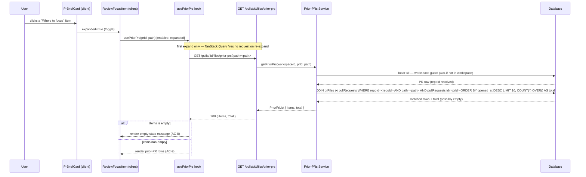

# Spec: Review Focus Prior PRs | Spec ID: SPEC-06 | Status: approved
Supersedes: None — additive to SPEC-01/SPEC-02 (Brief generation and caching). No existing Brief, blast, or why behavior is changed.

## Problem and why

The Why+Risk Brief panel on the PR Overview page shows a "Where to focus" section (`Brief.review_focus: string[]`) whose items are displayed as inert text bullets with no interactivity (`PrBriefCard.tsx`, lines 83-89). A reviewer looking at a flagged file path has no signal about whether this is a rarely-touched module or a recurring hotspot — a file modified in 10 prior PRs warrants very different review scrutiny than one changed for the first time. The ingested `pr_files` table already contains this history (one row per file per PR), but nothing currently reads it in the "reverse" direction: given a file path, which prior PRs touched it?

## Goals / Non-goals

**Goals**

- Introduce `GET /pulls/:id/files/prior-prs?path=<path>`: returns up to 10 previously-ingested pull requests in the same repo (excluding the current PR) whose diff touched the exact path, ordered newest-first by `opened_at`.
- Add a new shared Zod contract (`PriorPr` / `PriorPrList`) covering the response shape, mirrored in lockstep to the client vendor.
- Make each "Where to focus" item in `PrBriefCard` expandable: clicking it lazily fetches (only on first expand, not eagerly) and renders the prior-PRs list or an empty state inline, within a new colocated component.
- Document the required DB index on `prFiles.path` as a migration prerequisite.

**Non-goals**

- No new LLM call — this feature performs only indexed DB reads over already-ingested data.
- No annotation of whether a `review_focus` string is a literal file path vs. a conceptual description; if no `prFiles.path` row matches exactly, the result is `items: []`.
- No pagination beyond the cap of 10 — a `total` count is surfaced (see AC-1a) so the UI can indicate truncation, but there is no "load more"/page-2 mechanism in this spec.
- No diff content or blame lines for prior PRs — only enough metadata to render a summary row.
- No cross-repo lookup — only PRs in the same repo as the current PR are returned.
- No modification of Brief generation, caching (SPEC-01/02/03), or git-why blame drawer (SPEC-04).
- No accordion/mutual-exclusion behavior across "Where to focus" items — each item's expand state is independent (see US-1 and the Cross-module client footprint).

## User stories

**US-1:** As a code reviewer examining a PR's "Where to focus" list, I want to expand any listed file and immediately see which other ingested PRs in this repo also touched it — so I can recognize recurring hotspots and calibrate my review depth accordingly.

## Acceptance criteria (EARS)

**AC-1:** WHEN `GET /pulls/:id/files/prior-prs?path=<path>` is called for a PR belonging to the caller's workspace, the system SHALL return HTTP 200 with a `PriorPrList` containing only pull requests from the same repo as the current PR whose diff includes a `prFiles` row with `path` equal to the `path` query parameter, ordered by `opened_at` descending, limited to at most 10 items.

**AC-1a (total count):** The `PriorPrList` response SHALL include a `total` field equal to the full count of matching pull requests (before the 10-item cap is applied), computed via a single query (e.g. a `COUNT(*) OVER()` window on the same join) — not a separate round-trip. WHEN `total` exceeds `items.length`, the client SHALL indicate truncation (e.g. "Showing 10 of `total`").

**AC-2:** The system SHALL exclude the current PR (identified by the `:id` route parameter) from the returned `PriorPrList.items`, even when that PR's own diff also contains a `prFiles` row matching the given path.

**AC-3:** IF no ingested pull request in the same repo (other than the current PR) has a file matching the `path` query parameter, THEN the system SHALL return HTTP 200 with `items: []` — not a 404 or an error response.

**AC-4:** WHEN `GET /pulls/:id/files/prior-prs?path=<path>` is called for a PR that does not belong to the caller's workspace, the system SHALL return HTTP 404, enforced by the same workspace-scope `loadPull` guard used by the brief, blast, and why modules.

**AC-5:** WHEN the `path` query parameter is absent or blank, the system SHALL return HTTP 400/422 — rejected by Zod schema validation before the handler is reached.

**AC-6:** WHEN a "Where to focus" item in `PrBriefCard` is first expanded by the user, the client SHALL issue a request to `GET /pulls/:id/files/prior-prs?path=<item>` for that item's value, and SHALL NOT issue that request until the item is expanded (lazy fetch — not on initial page render).

**AC-7:** WHILE the prior-PRs request is in flight for an expanded "Where to focus" item, that item SHALL display a loading indicator and no partial list content.

**AC-8:** WHEN the prior-PRs response is received and `items` is empty, the expanded "Where to focus" item SHALL display an empty-state message indicating no prior PR history is recorded for that path in the ingested data.

**AC-9:** WHEN the prior-PRs response is received and `items` is non-empty, the expanded "Where to focus" item SHALL render one row per prior PR showing the PR number, title, author, status, and opened date, and each row SHALL be navigable to that PR's detail page within the app.

**AC-10 (truncation indicator):** WHEN the prior-PRs response's `total` exceeds `items.length`, the expanded "Where to focus" item SHALL display a truncation indicator (e.g. "Showing 10 of `total`") alongside the rendered rows.

## Edge cases

- **`review_focus` item is a conceptual description, not a literal file path** (e.g. "Authentication module"): no `prFiles.path` matches exactly → `items: []` and the empty state message renders (AC-3, AC-8). This is expected, not an error — the LLM that generates `review_focus` may produce descriptive strings rather than exact paths.
- **File is a hotspot with many prior PRs**: the query returns at most 10, plus a `total` count (AC-1a) so the UI can render "Showing 10 of `total`" rather than silently dropping older matches.
- **Current PR is the only ingested PR touching this file**: AC-2 excludes it → `items: []` and AC-8 applies.
- **`opened_at` is `null` on a prior PR**: that column is nullable in the DB. The response row carries `opened_at: null`. The DB sorts null-`opened_at` rows last under `ORDER BY opened_at DESC` (Postgres null ordering: `NULLS LAST` by default for DESC).
- **`path` contains forward slashes** (e.g. `src/auth/service.ts`): passed as a URL query parameter value (`?path=src/auth/service.ts`), not a path segment — no slash-encoding pitfall. The server URL-decodes it normally before matching.
- **Concurrent expansions of multiple "Where to focus" items**: each item issues its own independent request; there is no batching, deduplication, or accordion-collapse behavior — items expand/collapse independently, and several may be open at once (confirmed UX decision, see Cross-module client footprint).
- **Re-expansion after collapse**: TanStack Query caches the result under the `(prId, path)` query key — no second network request is issued for the same item.

## Non-functional

**No new LLM call:** this feature performs only indexed DB reads over already-ingested `pr_files`/`pull_requests` data. Zero LLM tokens consumed.

**Performance — migration required (prerequisite):** `prFiles.path` has no index today; the reverse lookup (given a path, find matching `prFiles` rows, then join to `pullRequests` for the `repoId` filter) would table-scan `pr_files` without one. A new index on `prFiles.path` must be declared in the DB schema file and generated via `pnpm db:generate` (never hand-edited SQL), then applied via `pnpm db:migrate`, before this endpoint is deployed. The join back to `pullRequests.repoId` already benefits from the leading column of the existing unique index `pr_repo_number_uq` on `(repoId, number)`. The new index on `prFiles.path` alone is sufficient — no composite index including `repoId` is warranted because `repoId` lives on `pullRequests`, not on `prFiles`.

**Security — parameterized query:** the `path` query parameter is user-supplied and therefore untrusted. It flows exclusively into a Drizzle ORM `eq()` filter, which generates a parameterized SQL placeholder (not raw string interpolation), the same ORM pattern already used throughout the codebase for user-supplied lookups. There is no shell execution and no filesystem access. Empty values are rejected by Zod schema validation before the handler is reached (AC-5).

## Architecture & workflows



**DB join path:** the query starts from `prFiles` using the new `prFiles.path` index to locate candidate rows, joins to `pullRequests` on the foreign key (`prFiles.prId = pullRequests.id`), filters by `pullRequests.repoId = <current PR's repoId>` and `pullRequests.id != <current prId>`, sorts by `pullRequests.opened_at DESC`, and applies `LIMIT 10`.

**Migration prerequisite:** the new index on `prFiles.path` must be declared in the schema, generated via `pnpm db:generate`, and applied via `pnpm db:migrate` before this feature is deployed. The index is the only schema change this feature requires.

## Service contracts

### `GET /pulls/:id/files/prior-prs`

| | |
|---|---|
| Request params | `id` — PR UUID |
| Request query | `path: string` (required, min length 1) |
| Response 200 | `PriorPrList` |
| Response 400/422 | `path` absent or empty — rejected by schema validation before handler |
| Response 404 | PR not found in caller's workspace |

### `PriorPr` / `PriorPrList` shape (new shared contract)

```
PriorPr {
  number:    integer          // PR number; used by client to build the in-app detail URL
  title:     string           // PR title
  author:    string           // PR author (GitHub login)
  status:    string           // PR status (e.g. "needs_review", "reviewed", "open")
  opened_at: string | null    // ISO timestamp; null when not recorded at ingest time
}

PriorPrList {
  items: PriorPr[]            // newest-first by opened_at, at most 10 items
  total: integer              // full count of matching PRs before the 10-item cap (AC-1a)
}
```

This contract is not Brief-specific and belongs in a new shared contracts file, mirrored in lockstep to the client vendor alongside the server-side file. The `PriorPr` fields map directly to columns on `pullRequests` (`number`, `title`, `author`, `status`, `openedAt`).

### Cross-module client footprint

1. **Shared contract** (client vendor): the new `PriorPr`/`PriorPrList` types must be mirrored to `client/src/vendor/shared/` in lockstep with the server-side new file. Both sides must stay in sync — a TypeScript build check will catch any drift.

2. **API function** (`client/src/lib/api.ts`): one new exported async function `fetchPriorPrs(prId, path)` → `GET /pulls/{prId}/files/prior-prs?path={path}`, returning `PriorPrList`. All HTTP calls go through `api.ts` — no inline fetch in components (enforced anti-pattern per client `CLAUDE.md`).

3. **Data hook** (new domain file in `client/src/lib/hooks/`): `usePriorPrs(prId, path, enabled)` — a TanStack Query hook whose `enabled` guard is `!!prId && !!path && enabled`. The `enabled` boolean is flipped to `true` on first expand, ensuring lazy fetch (AC-6). Subsequent expands of the same item are served from the TanStack Query cache with no additional request.

4. **UI component** (`ReviewFocusItem`, colocated under `PrBriefCard/_components/ReviewFocusItem/` per the project's `ui-architecture` colocation convention): replaces the current plain `<li>` rendering of each `review_focus` item (currently at `PrBriefCard.tsx` lines 83-89). Renders: an expand/collapse toggle, loading state (AC-7), empty state (AC-8), the prior-PR list (AC-9), and a truncation indicator when `total > items.length` (AC-10). Each prior-PR row links to the corresponding PR's in-app detail page, constructing the URL from `repoId` (available from the page's URL parameters at the `ReviewFocusItem` render site) and the `PriorPr.number` field. Each `ReviewFocusItem` instance owns its own `expanded` boolean — **independent toggles, not an accordion**: multiple items may be expanded simultaneously, letting a reviewer compare two files side-by-side (confirmed UX decision).

5. **i18n**: new keys under the `brief` namespace in `client/messages/en/brief.json` (`block.brief.reviewFocus.expand`, `block.brief.reviewFocus.collapse`, `block.brief.reviewFocus.priorPrs`, `block.brief.reviewFocus.noPriorPrs`) — no hardcoded UI strings in components.

## Inputs (provenance)

| Input | Source | Provenance tag |
|---|---|---|
| Current PR's `repoId` | `pullRequests.repoId`, read from DB via the workspace-scoped `loadPull` guard | [deterministic: DB — 0 LLM calls] |
| `path` query parameter | Client-supplied (the `review_focus` string value from `PrBriefCard`, ultimately LLM-generated by SPEC-01/02 Brief generation) | [new: client-triggered DB lookup — 0 LLM calls] |
| `PriorPrList` result | DB join `prFiles ⋈ pullRequests`, filtered by `repoId + path + id ≠ prId`, sorted and capped | [deterministic: DB — 0 LLM calls] |

## Untrusted inputs

| Input | Untrusted because | Mitigation |
|---|---|---|
| `path` query parameter | Client-supplied — any string value the client sends, including malformed paths or injection attempts | Validated by Zod schema (`z.string().min(1)`) at the route layer before reaching the service; passed only into a Drizzle ORM `eq()` call, which generates a parameterized SQL `$N` placeholder — confirmed ORM pattern at `blast/service.ts:32` (`eq(t.prFiles.prId, prId)`) and `why/service.ts:140` (`eq(t.pullRequests.repoId, repoId)`). No shell execution, no filesystem access, no raw SQL string concatenation. |
| `review_focus` strings (source of the client-sent `path`) | LLM-generated by the Brief generation step (SPEC-01/02); LLM output must be treated as data, not as instructions | Used only as a lookup key for an exact-match DB query. A non-matching string produces `items: []` (AC-3) — no error, no command execution, no template injection. |

## Traceability

| AC-N | Evidence |
|---|---|
| AC-1 | `server/src/db/schema/pulls.ts:36-45` — `prFiles` schema (columns `prId`, `path`; no `repoId` on this table, confirming the join must go through `pullRequests`); `server/src/db/schema/pulls.ts:5-34` — `pullRequests` columns (`repoId`, `openedAt`, `status`, `title`, `author`, `number`); user requirement: "join prFiles ⋈ pullRequests, filter by repoId + path, ORDER BY openedAt DESC, LIMIT 10" |
| AC-2 | User requirement ("excluding the current one"); analogous exclusion pattern in `server/src/modules/why/service.ts:139-141` — `resolveEnrichment` reads `pullRequests` filtered by `repoId + number` to find the *linked* PR (a different PR), never the current one |
| AC-3 | User requirement ("empty-list case — file never touched by any other ingested PR → 200 with items:[]"); analogous empty-list precedent: SPEC-03 AC-4 (`GET /pulls/:id/brief/history` returns 200 + `entries:[]` for never-briefed PR, same "not-found is a normal state" philosophy) |
| AC-4 | `server/src/modules/blast/service.ts:67-74` — `loadPull` workspace guard (select by `workspaceId + id`, throw `NotFoundError` if absent); `server/src/modules/why/service.ts:118-125` — identical guard; `server/src/modules/brief/service.ts:215-226` — same guard, comment "Mirrors BlastService.loadPull() exactly" |
| AC-5 | `server/src/modules/why/routes.ts:19-22` — `WhyQuery` Zod schema with `z.string().min(1)` on `file`; server `CLAUDE.md` ("Validation is schema-first … invalid input is rejected 422 before the handler"); same pattern for `path` here |
| AC-6 | `client/insights/INSIGHTS.md` — "Lazy-fetch-on-open popover: pass prId to a TanStack Query hook conditionally — `usePrReviews(open ? prId : null)`. The hook's `enabled: !!prId` guard fires no request until the popover opens." Same pattern for `usePriorPrs(prId, path, expanded)` |
| AC-7 | TanStack Query `useQuery` returns `isLoading: true` while in-flight — confirmed pattern across `client/src/lib/hooks/brief.ts`, `client/src/lib/hooks/why.ts`; component renders loading indicator while `isLoading` |
| AC-8 | `client/src/app/repos/[repoId]/pulls/[number]/_components/PrBriefCard/PrBriefCard.tsx:36-50` — empty-state pattern (checking `data === null` and rendering a fallback); analogous "empty list" empty-state rendering in `BriefHistory` component (SPEC-03 cross-module footprint) |
| AC-9 | `client/src/app/repos/[repoId]/pulls/[number]/_components/PrBriefCard/PrBriefCard.tsx:83-89` — the current plain-list rendering of `review_focus` items (to be replaced by `ReviewFocusItem`); `client/src/app/repos/[repoId]/pulls/[number]/page.tsx:31` (`repoId` is available from URL params at the render site, enabling in-app detail URL construction as `/repos/${repoId}/pulls/${number}`) |

## Verification

| AC-N | Verification recipe |
|---|---|
| AC-1, AC-2 | Seed repo R with PR A (touches `src/foo.ts`) and PR B (also touches `src/foo.ts`). Call `GET /pulls/{id_of_A}/files/prior-prs?path=src/foo.ts`. Confirm HTTP 200, `items` has exactly one entry for PR B (not PR A itself), fields `number`, `title`, `author`, `status`, `opened_at` are all present, and entry is ordered by `opened_at` descending. Add a third PR C (does NOT touch `src/foo.ts`) in the same repo — confirm it is absent from the result. |
| AC-3 | Call `GET /pulls/{id_of_A}/files/prior-prs?path=src/never-touched.ts` (no other PR touches this path). Confirm HTTP 200 and `items: []`. |
| AC-4 | Call `GET /pulls/{id}/files/prior-prs?path=src/foo.ts` using a PR UUID that belongs to a different workspace. Confirm HTTP 404. |
| AC-5 | Call `GET /pulls/{id}/files/prior-prs` with no `path` query parameter. Confirm HTTP 400 or 422. Call again with `?path=` (empty string). Confirm same error response. |
| AC-6, AC-7, AC-8, AC-9 | Render `PrBriefCard` in a component test with a seeded `review_focus: ["src/auth/service.ts"]` Brief and a mocked API. Confirm no call to `/files/prior-prs` fires on initial render (AC-6). Simulate a click on the focus item — confirm one request fires and a loading indicator appears during the pending mock delay (AC-7). Resolve the mock with `{ items: [], total: 0 }` — confirm the empty-state message appears (AC-8). Re-render with the mock resolving to `{ items: [{ number: 42, title: "Refactor auth", author: "alice", status: "reviewed", opened_at: "2026-01-01T00:00:00Z" }], total: 1 }` — confirm one row renders with all five fields visible and carries a link to `/repos/{repoId}/pulls/42` (AC-9). Simulate collapse + re-expand of the same item — confirm no second API request fires (TanStack Query cache hit, AC-6). |
| AC-1a, AC-10 | Seed 15 PRs in a repo that all touch `src/hotspot.ts`. Call `GET /pulls/{id}/files/prior-prs?path=src/hotspot.ts`. Confirm `items.length === 10` and `total === 15` (or 14, excluding the current PR if it's one of the 15). Render `ReviewFocusItem` with that response — confirm a "Showing 10 of 14" (or equivalent) truncation indicator is visible. |
| Independent expansion | Render `PrBriefCard` with two `review_focus` items. Expand both. Confirm both `ReviewFocusItem` instances show their expanded content simultaneously (neither collapses the other). |

## Resolved decisions

- **Total-count display:** confirmed — `PriorPrList` includes a `total` field (AC-1a), and the UI shows a truncation indicator when `total > items.length` (AC-10).
- **Accordion vs. independent expansion:** confirmed — independent toggles. Each `ReviewFocusItem` owns its own `expanded` state; multiple items may be open at once.
