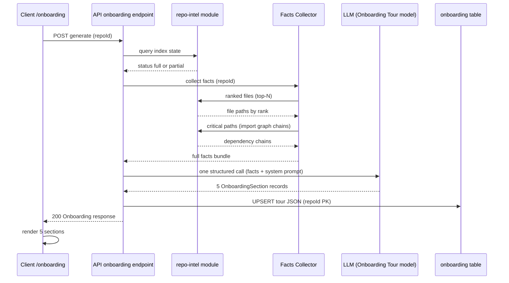
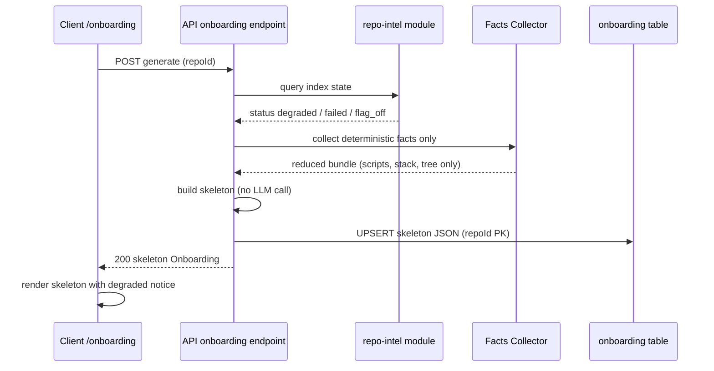
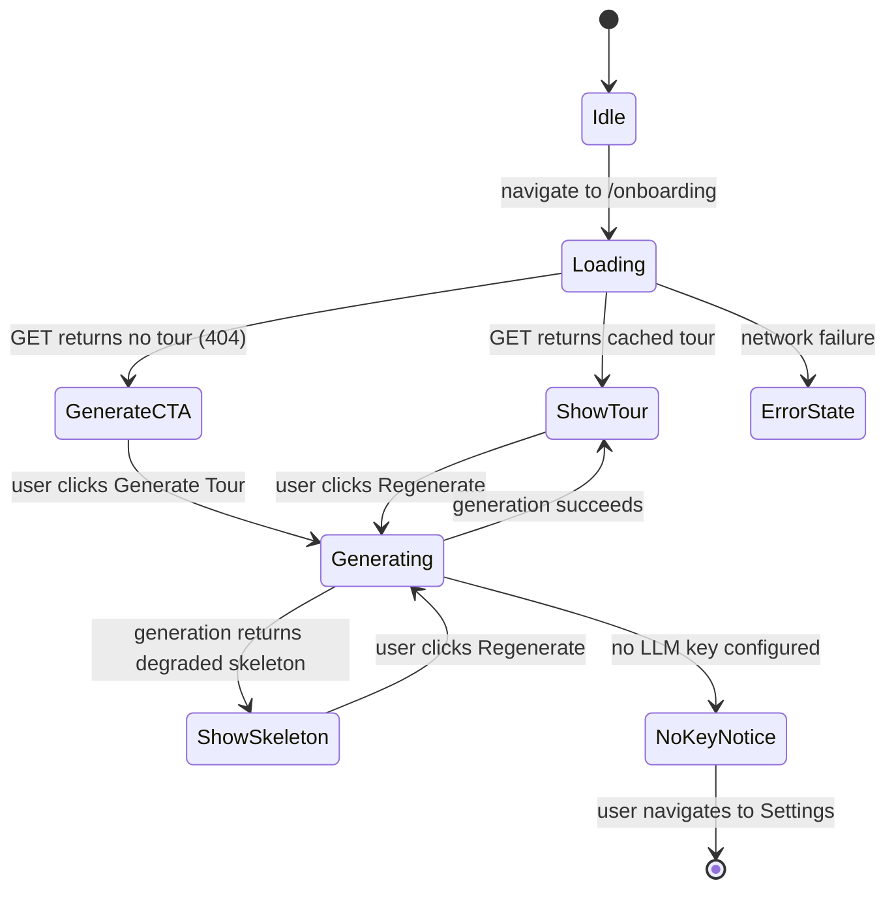

# Spec: Onboarding Generator | Spec ID: SPEC-01 | Status: draft

## Problem and why

New contributors to an indexed repository spend hours reading READMEs, tracing call paths, and discovering run scripts before they can make their first contribution. DevDigest already indexes every repo's import graph, file-rank data, and route list — but exposes those facts only to the reviewer pipeline. The Onboarding Generator surfaces the same facts as a human-readable, 5-section newcomer tour, produced in a single structured LLM call grounded entirely in deterministic artifacts. Contributors orient in minutes rather than hours; team leads generate onboarding material without writing it by hand.

---

## Goals / Non-goals

**Goals**

- Produce a 5-section tour (Architecture Overview, Critical Paths, How to Run Locally, Guided Reading Order, First Tasks) for any indexed repository via exactly one structured LLM call grounded in a deterministic facts bundle.
- Parse `package.json` scripts, dependencies, and engine constraints to build the "How to Run Locally" and "stack detection" facts — this is new analyzer work with no existing equivalent.
- Compute the Guided Reading Order using the repo-intel module's existing ranked-file and critical-paths output; the spec does not redefine or re-derive the ranking math.
- Persist the generated tour per-repository in the existing `onboarding` database table.
- Display the tour at the `/onboarding` client route. The current occupant of that route (the Add-Repository form) moves to a modal triggered from the repo switcher / home area; no new dedicated route is created for it. All existing "add a repo" entry points throughout the application — the empty-repo-list fallback in the shell navigation context, the root redirect CTA when no repos exist, and the repo-not-found screen — are expected to open this modal rather than navigate to `/onboarding`. This is a multi-site UX change, not a single-page replacement.
- Show a deterministic fallback skeleton (no LLM call, no empty screen) when the repo index is degraded.
- Offer a "Regenerate" action that re-runs the full pipeline for a fresh tour.

**Non-goals (v1)**

- **Share link / public unauthenticated tour access.** No backend infrastructure for share tokens or public routes exists, and none is built in v1. Backlogged.
- **New git-churn / hotness signal.** The `hotness = 0` constant is a deliberate v1 constraint agreed with the user; no new churn window is scoped here.
- **New Settings UI for the onboarding model.** The `'onboarding'` feature slot is already registered in the feature-model registry with a default model; no new settings work is needed.
- **GitHub good-first-issue label integration for "First Tasks".** The "First Tasks" tour section is LLM-inferred from the deterministic facts bundle only. No GitHub API call for issue labels is made during generation; that option (Option B from the original design exploration) is out of scope for v1.
- **Per-section regeneration.** Regeneration always re-runs all 5 sections together.
- **Streaming generation.** The single LLM call blocks; a loading state in the UI is sufficient.
- **Automatic stale-tour invalidation and per-regeneration TTL.** There is no TTL-based eviction and no per-regeneration cooldown; regeneration is user-initiated and rate-limited only by the existing global rate limiter (see Non-functional below).

---

## User stories

- As a developer just added to an unfamiliar repo, I want to open a single page and immediately see a plain-language architecture diagram, the most important files to read in sequence, and the exact commands to run the project locally — so I do not have to grep READMEs or ask a colleague.
- As a team lead onboarding a contractor, I want to press "Generate Tour" once and have a structured tour ready to share — so I do not need to write a setup guide by hand.
- As an experienced contributor returning after a month away, I want to press "Regenerate" and receive an updated tour that reflects recent structural changes.

---

## Acceptance criteria (EARS)

**AC-1** The system shall collect a deterministic facts bundle from the repository before any LLM call; the bundle shall include: detected runtime and framework names (from package manifest files and lock files), run scripts (from the package manifest), top-level directory tree structure (two levels deep), top-N files by PageRank-derived rank, dependency chains from the import graph, and API/route list if available from the repo index.

**AC-2** WHEN tour generation is triggered for a repository whose index status is `full` or `partial`, the system shall issue exactly one structured LLM call using the "Onboarding Tour" feature-model slot and the existing onboarding system prompt, producing exactly 5 section records covering: Architecture Overview, Critical Paths, How to Run Locally, Guided Reading Order, and First Tasks — in that order. The "First Tasks" section content shall be inferred by the LLM solely from the deterministic facts bundle already collected (codebase structure, stack, test layout, scripts); no GitHub good-first-issue label data is fetched.

**AC-3** WHEN the structured LLM call completes successfully, the system shall persist the full tour as a single JSON blob in the `onboarding` table keyed by repository ID, overwriting any prior entry for that repository.

**AC-4** IF the repository's index status is `degraded`, `failed`, or the repo-intel flag is off at the time generation is triggered, THEN the system shall return a deterministic fallback skeleton — 5 section records with the correct section kind identifiers and display titles, bodies generated solely from the deterministic facts available (scripts, stack, directory tree) without calling the LLM, and empty link arrays — rather than an error response.

**AC-5** WHILE a valid cached tour exists for the active repository in the `onboarding` table, the client `/onboarding` route shall display all 5 sections without triggering a new LLM call.

**AC-6** WHEN the user navigates to the `/onboarding` route and no tour has been generated for the active repository, the system shall display a "Generate Tour" call-to-action rather than an error boundary or blank page.

**AC-7** WHEN the user triggers tour regeneration, the system shall re-run the facts collector, re-issue the single structured LLM call, overwrite the persisted tour entry, and display the new tour.

**AC-8** The Guided Reading Order section shall present file paths ranked by `pagerank × (1 + hotness)` where `hotness = 0` in v1; the system shall derive this ranking solely from the repo-intel module's existing ranked-file and critical-paths data without re-computing the ranking math independently.

**AC-9** IF no model key is configured for the "Onboarding Tour" feature at generation time, THEN the system shall return a structured response that the client renders as a user-visible notice with a link to the Settings page, rather than an unhandled error boundary.

**AC-10** WHEN the `/onboarding` route is loaded, the system shall fetch and display the tour for the repository currently active in the navigation context (the same repo selector used by all other repo-scoped pages).

---

## Edge cases

These are derived from the existing DEGRADED CONTRACT in the repo-intel module and comparable existing behaviors:

1. **Repo too large to index** — a repository too large to clone/index fully reports a distinct "too large" reason code from the index-state query. Under AC-4 this falls into the degraded skeleton path. The `repo_too_large` reason renders the same generic degraded skeleton UI as any other degraded reason in v1; no distinct message is shown for this specific reason code.
2. **No `package.json` present** — the facts collector finds no package manifest. The "How to Run Locally" and "stack detection" facts are empty; the LLM section body must acknowledge the absence rather than hallucinating scripts. The system prompt's grounding rules ("NEVER invent file paths or scripts") already guard this.
3. **Import graph has no edges** (single-file repo or a repo whose graph traversal yields nothing) — the ranked-file and critical-paths data return empty. The reading-order section falls back to whatever the flat ranked-file list yields; if that is also empty, the section body acknowledges it without inventing paths.
4. **LLM returns structurally invalid output** — the structured LLM call is validated against the tour schema on receipt. If validation fails, the system shall treat the result as a generation failure rather than persisting a corrupt tour, and the client shall display a retryable error state.
5. **Concurrent regeneration requests for the same repository** — two simultaneous POST requests both complete; the second write wins (last-write-wins UPSERT). No locking or deduplication is required in v1.
6. **Tour was generated before the last index refresh** — the `generatedAt` timestamp in the `onboarding` table pre-dates the most recent index. No automatic invalidation occurs; the user triggers Regenerate manually. The "Regenerate" label shall indicate when the tour was last generated so the user can judge staleness.
7. **`repoIntelEnabled = false` global flag** — all array-returning repo-intel methods return empty arrays per the DEGRADED CONTRACT. Generation follows the AC-4 skeleton path.

---

## Non-functional

**Performance**
- The facts-collection step (package manifest parsing, file-tree scan, repo-intel queries) shall complete within 5 seconds for repos up to 50,000 files. The LLM call latency is network-bound and outside this budget.
- The GET endpoint for a cached tour shall respond within 200 ms under normal DB load (single row lookup by primary key).

**Rate limiting**
- Regeneration spam is prevented by the existing global `@fastify/rate-limit` plugin (120 req/min per IP, already registered on all API routes); no additional per-route rate-limiting code is needed for the onboarding generate endpoint.

**Security**
- All repository-sourced text injected into the LLM prompt (file names, script values, README excerpts) is wrapped in `<untrusted>…</untrusted>` blocks as prescribed by the existing onboarding system prompt, preventing prompt-injection from repo content.
- The rendered tour body is markdown. The client must sanitize LLM-generated markdown before rendering (strip raw HTML, disallow `javascript:` URLs in links) since the LLM output is untrusted.
- Generation and retrieval endpoints are scoped to the authenticated workspace; no anonymous access.

**Accessibility**
- Each section heading shall be a landmark heading element so screen-reader users can jump between sections.
- Mermaid diagrams shall include a visually hidden plain-text description as an accessible alternative.

---

## Architecture & workflows

### Generation flow (index healthy)

### Degraded fallback path

### Client page state machine

---

## Service contracts

### Server API (new endpoints under the `onboarding` module)

**`GET /repos/:repoId/onboarding`**

| Aspect | Detail |
|---|---|
| Auth | Workspace-scoped (same auth as all other `/repos/:id/…` endpoints) |
| Params | `repoId` — UUID of the repository |
| Response 200 | Tour object: `{ sections: Section[] }` where `Section = { kind: string, title: string, body: string, diagram: string \| null, links: Link[] }` and `Link = { label: string, path: string }` |
| Response 404 | No tour has been generated for this repository yet |
| Response 422 | `repoId` is not a valid UUID |

**`POST /repos/:repoId/onboarding`**

| Aspect | Detail |
|---|---|
| Auth | Workspace-scoped |
| Params | `repoId` — UUID of the repository |
| Body | None |
| Response 200 | Same tour shape as GET (generated or skeleton) |
| Response 200 + degraded metadata | When the skeleton path is taken, the response includes `degraded: true` at the top level so the client can render a notice |
| Response 404 | Repository not found |
| Response 503 | LLM key not configured (structured error body the client renders as a Settings notice) |

> The `GET /repos/:repoId/onboarding` endpoint returns only stored data. It does not trigger generation. The client always calls `POST` to generate and `GET` to retrieve.

### Shared wire contract (already frozen — do not modify)

The tour payload shape (`Onboarding`, `OnboardingSection`, `OnboardingLink`) is defined in the shared Zod contracts package mirrored between server and client. Any change to this contract must update both sides in lockstep per the mirror convention.

| Field | Type | Notes |
|---|---|---|
| `sections` | array of `OnboardingSection` | always 5 in the generated case; 5 in the skeleton case |
| `OnboardingSection.kind` | string | identifies the section type; used by the client to apply section-specific rendering (icons, diagram allowance). Exact kind values are an implementation decision for the planner; the spec constraint is that exactly 5 distinct kind values exist, one per section. |
| `OnboardingSection.diagram` | string or null | Mermaid syntax; the system prompt permits diagrams only for the Architecture Overview and Critical Paths sections; all other sections must receive `null`. |
| `OnboardingSection.links` | array of up to 4 `OnboardingLink` | paths must be repo-relative and must exist in the provided file tree; the system prompt's grounding rules enforce this. |

### Cross-module communication

The new `onboarding` server module calls the `repo-intel` module's public facade for:
- Index state (to decide full vs skeleton path)
- Top-N ranked file paths
- Dependency chains (critical paths)

No new public methods on the repo-intel facade are needed for v1 — both the top-ranked-files query and the dependency-chains query are already implemented in the facade. The `onboarding` module depends on the facade contract, not on repo-intel internals.

---

## Inputs (provenance)

| Input | Provenance tag | Notes |
|---|---|---|
| `repoId` request parameter | `[deterministic: route param, validated by request schema]` | UUID string; invalid UUIDs rejected at the route boundary |
| `package.json` scripts, engines, dependencies | `[deterministic: repo file parsed by facts collector]` | Read from the cloned repository on disk; no network call |
| Directory tree | `[deterministic: file-system scan of clone]` | Top two levels; no network call |
| Ranked file paths | `[deterministic: repo-intel]` | Pre-computed PageRank × (1 + hotness) stored in DB; queried via facade |
| Dependency chains | `[deterministic: repo-intel]` | BFS over the stored import graph; queried via facade |
| Route/API list | `[deterministic: repo-intel]` | Extracted during indexing; returned by facade; may be empty for degraded index |
| Onboarding system prompt | `[reused: existing prompt file in codebase]` | Frozen; reused verbatim; not regenerated per request |
| LLM section output (5 sections) | `[new: 1 LLM call per generation]` | Non-deterministic; validated against the tour schema before persistence |
| Feature-model configuration | `[reused: feature-model registry]` | Workspace-level model override or registry default (deepseek-v4-flash via OpenRouter) |

---

## Untrusted inputs

All of the following are sourced from user-controlled or third-party-controlled content. They must be treated as data to validate, never as instructions to execute or trust.

| Untrusted input | Risk | Mitigation |
|---|---|---|
| `package.json` scripts field values | A malicious repo could include script values crafted to influence the LLM (prompt injection) | Wrapped in `<untrusted>…</untrusted>` blocks in the system prompt, per the existing security pattern in the onboarding system prompt |
| Repository file names and directory names | Adversarial file names could include instruction-like strings | Same `<untrusted>` wrapping |
| README / doc excerpts injected as "key-file excerpts" | Stored XSS or prompt injection in repo documentation | `<untrusted>` wrapping in prompt; client-side Markdown sanitization before rendering |
| LLM-generated section body text | The LLM could produce raw HTML, `javascript:` links, or other unsafe content | Client sanitizes all rendered markdown; `body` fields are treated as untrusted markdown, not trusted HTML |
| `OnboardingLink.path` values in LLM output | The model could hallucinate or inject paths | Validated against the file tree provided in the facts bundle before persistence; invalid paths are stripped |

---

## Traceability

| AC-N | Evidence |
|---|---|
| AC-1 | `server/src/db/schema/context.ts:120–126` (onboarding table confirms what is persisted); user requirement "No code today parses `package.json` scripts or derives 'stack'/'how to run locally' facts — this is genuinely new"; `server/src/modules/repo-intel/types.ts:15–23` (DEGRADED CONTRACT confirms what the facade returns when degraded) |
| AC-2 | `server/src/prompts/onboarding.system.md` (reuse verbatim constraint from user requirement); `server/src/vendor/shared/contracts/platform.ts:14–21, 44–51` (confirms `'onboarding'` is in `FeatureModelId` enum and `FEATURE_MODELS` with default deepseek-v4-flash via OpenRouter); user requirement "exactly ONE structured LLM call" |
| AC-3 | `server/src/db/schema/context.ts:120–126` (confirms `onboarding` table with `repoId` as PK, `json jsonb`, `generatedAt timestamp`; PK = natural UPSERT target) |
| AC-4 | `server/src/modules/repo-intel/types.ts:15–23` (DEGRADED CONTRACT: array methods return `[]`, object methods carry `degraded?/reason`; `DegradedReason` enum includes `flag_off`, `index_failed`, `index_partial`, `repo_too_large`, `no_data`); user requirement "deterministic fallback skeleton — never an empty screen" |
| AC-5 | `server/src/db/schema/context.ts:120–126` (cached tour in `onboarding` table); user requirement "the code collects the facts, the model writes the narrative" (implies no re-generation from cache) |
| AC-6 | User requirement: client route shall show the tour; the "never an empty screen" constraint implies a CTA must exist for the pre-generation state |
| AC-7 | User requirement "Offer a Regenerate action"; `server/src/db/schema/context.ts:120–126` (UPSERT semantics: overwrite prior entry) |
| AC-8 | `server/src/modules/repo-intel/service.ts:639–702` (confirms `getTopFilesByRank` and `getCriticalPaths` already implement `pagerank × (1 + hotness)` ranking; `hotness` is documented as a v1 constant of 0); user requirement "ship v1 as-is, do NOT scope in a new git-churn/hotness signal" |
| AC-9 | `server/src/vendor/shared/contracts/platform.ts:14–21` (confirms `'onboarding'` uses a specific model slot; key could be absent); server `AGENTS.md`: "No keys required to boot: loadConfig marks every secret optional" |
| AC-10 | `client/src/lib/repo-context.tsx` referenced in `client/insights/INSIGHTS.md:2026-07-06 · Context` ("repo-scoped pages that have no repoId of their own reuse `useActiveRepo()`"); client `CLAUDE.md`: `app/onboarding/` already exists as a route |

---

## Verification

| AC-N | Verification recipe |
|---|---|
| AC-1 | Point the generator at a test repo with a `package.json` containing known scripts and dependencies. Inspect the facts bundle the server assembles (log or debug endpoint). Confirm it contains: the detected framework name, the exact script keys from `package.json`, at least two directory levels, a non-empty ranked-file list, and a non-empty critical-paths list. |
| AC-2, AC-3 | Trigger generation on a repo with a healthy index and an OpenRouter key configured. Verify: (a) the server emits exactly one outbound LLM request (observable in request logs), (b) the API returns a body with exactly 5 sections, (c) the `onboarding` table contains a row for the repo with a `generatedAt` timestamp matching the request time. |
| AC-4 | Trigger generation on a repo whose index is in `degraded` status (or with `REPO_INTEL_ENABLED=false`). Verify: (a) no outbound LLM request is emitted, (b) the response has exactly 5 sections with non-empty titles and non-empty bodies, (c) all link arrays are empty, (d) the response includes `degraded: true`. |
| AC-5 | Generate a tour, record the `generatedAt` timestamp. Reload `/onboarding`. Verify: (a) no new LLM request is emitted, (b) the displayed `generatedAt` matches the original timestamp. |
| AC-6 | With no `onboarding` row for the active repo, navigate to `/onboarding`. Verify: the page renders a "Generate Tour" button or equivalent CTA (no error boundary, no blank page). |
| AC-7 | Generate a tour. Wait 1 second. Click Regenerate. Verify: (a) a new LLM request is emitted, (b) the `generatedAt` timestamp in the database and UI is newer than the original. |
| AC-8 | Generate a tour on a well-indexed repo. Inspect the reading-order section. Verify: the file paths listed appear in the same rank order as the repo-intel module's ranked-file output for the same repo (query directly to compare). Verify no path appears in the section that does not exist in the repo. |
| AC-9 | Remove or invalidate the OpenRouter API key. Trigger generation. Verify: (a) the API returns a 503 with a structured error body, (b) the client renders a notice with a visible link that navigates to Settings — no raw error boundary. |
| AC-10 | With repo A selected in the nav context, navigate to `/onboarding`. Verify the tour displayed belongs to repo A (check the title, file paths, and scripts shown). Switch to repo B in the nav context; verify the displayed tour updates to repo B's content. |

---

## Suggested improvement (UX)

The existing onboarding system prompt contains a `{{language}}` placeholder for the tour's written language. The current codebase has no workspace locale/language setting. If a language preference is ever added (e.g., "generate tour in Spanish"), this placeholder is already wired. For v1 this can default to English. No AC is needed unless the user wants to scope a language toggle into this feature.
