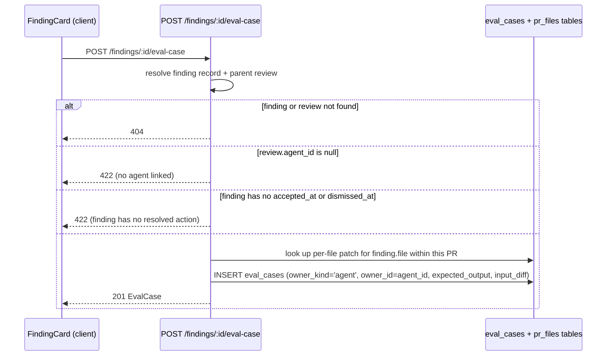
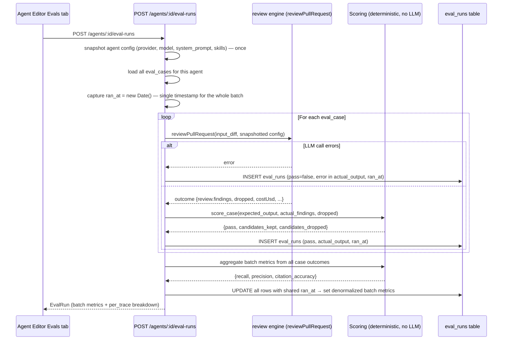
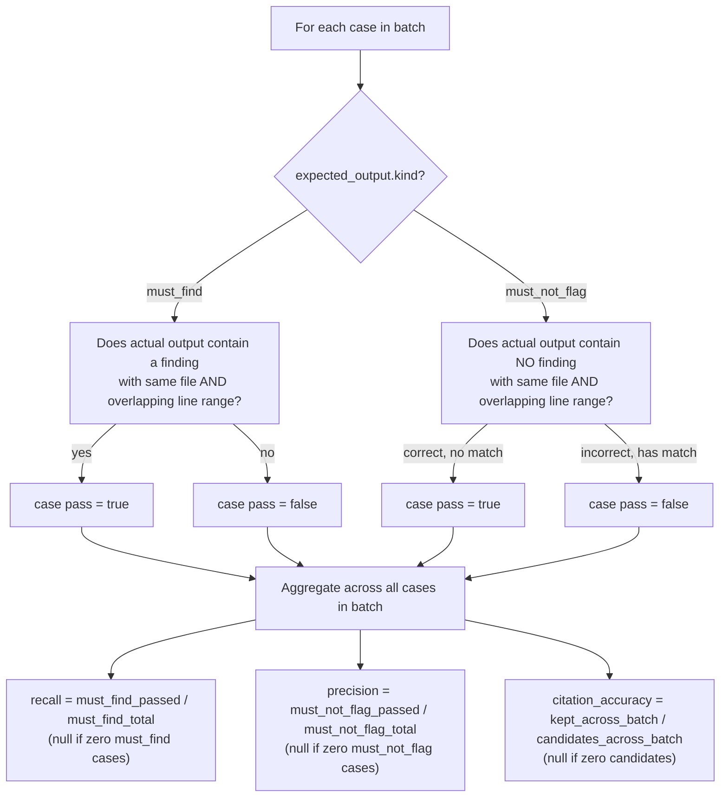
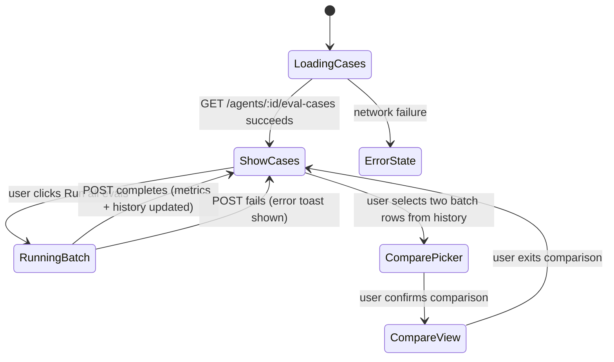

# Spec: Eval Pipeline for Reviewer Agents | Spec ID: SPEC-02 | Status: draft

## Problem and why

DevDigest agents (provider + model + system prompt + skills) are edited interactively, but there is currently no way to measure whether a prompt change improves or regresses an agent's review quality. The existing `evals/` package tests Claude Code skills in CI, but the subject under test there is the Claude Code toolchain — not a DevDigest reviewer agent. A developer who edits an agent's system prompt has no signal about whether the edit fixed a recall gap or introduced precision noise; they can only re-run the agent on a live PR and read the output by eye.

The Eval Pipeline solves this by letting users turn real accepted and dismissed findings into a reproducible regression suite, run the agent against the full suite in one action, and receive deterministic recall/precision/citation_accuracy scores — then compare two runs to see exactly which cases flipped after a prompt edit. Scoring is entirely deterministic code (file + line-range matching plus the existing citation-grounding gate output); no LLM-as-judge anywhere in the path, eliminating model-of-a-model noise from the measurement itself.

---

## Goals / Non-goals

**Goals**

1. Allow a user to create an eval case from a real finding in one click from the FindingCard: an accepted finding creates a `must_find` case; a dismissed finding creates a `must_not_flag` case.
2. Allow building up an arbitrary-size case set (target ≥ 8 for demo; no product-enforced minimum) for any agent with `owner_kind='agent'`.
3. Run the agent against its entire case set in a single user action, producing one batch of `eval_runs` rows sharing a single `ran_at` timestamp.
4. Compute three deterministic batch-level metrics: recall, precision, and citation_accuracy (see AC-5 through AC-7 for exact definitions).
5. Display an Evals tab in the Agent Editor showing the case list with per-case pass/fail status, a batch run history with metric badges, and a run-all button.
6. Display a global `/evals` Eval Dashboard page showing cross-agent aggregate metrics, trend, and recent runs for the workspace.
7. Enable two-run comparison (metric deltas + per-case flip list) for the "edit system prompt → re-run → compare" demo scenario.
8. Support a sensitivity demo: running a near-empty system prompt should produce measurably different metrics in the comparison view relative to a well-crafted prompt.

**Non-goals (v1)**

- **No LLM-as-judge**: scoring is purely deterministic — file:line matching + the citation-grounding gate. No LLM call in the scoring path.
- **No new DB migration**: `eval_cases` and `eval_runs` tables already exist and are used as-is. No `eval_batches` table and no `case_type` column are added.
- **No system-prompt diff panel in the compare view**: the comparison outputs metric deltas and a per-case flip list only.
- **No regression or modification of the existing skills-eval loop**: `owner_kind='skill'` cases and routes are untouched; this feature adds `owner_kind='agent'` functionality alongside them on the same tables.
- **No changes to the vendored nav file**: the "Eval Dashboard" nav entry already exists and is correct.
- **No changes to the DB schema files** (do-not-touch zone).
- **No UI-enforced case minimum**: "Run all evals" must work with 0 or 1 cases without error.

---

## User stories

- As a reviewer-agent author, I want to click "Turn into eval case" on an accepted finding so that I can build a must_find regression case from real feedback without leaving the PR detail page.
- As a reviewer-agent author, I want to click "Turn into eval case" on a dismissed finding so that I can build a must_not_flag case to guard against false-positive regressions.
- As a reviewer-agent author, I want to run all eval cases for my agent in one click and see recall/precision/citation_accuracy scores so that I can quantify the effect of a system prompt edit.
- As a reviewer-agent author, I want to select two past batch runs and see metric deltas and which specific cases flipped so that I can understand exactly what changed between two prompt versions.
- As a workspace admin, I want to view a cross-agent Eval Dashboard so that I can monitor overall eval health across all agents without opening each agent individually.

---

## Acceptance criteria (EARS)

**AC-1** WHEN the user clicks "Turn into eval case" on a FindingCard for a finding with `accepted_at` set, the system shall create an `eval_cases` row with `owner_kind='agent'`, `owner_id` equal to the `agent_id` of the finding's parent review, `expected_output = { kind: 'must_find', finding: { file, start_line, end_line, title, severity, category } }`, and `input_diff` set to the patch fragment for the finding's file extracted from the PR's diff.

**AC-2** WHEN the user clicks "Turn into eval case" on a FindingCard for a finding with `dismissed_at` set, the system shall create an `eval_cases` row with `owner_kind='agent'`, `owner_id` equal to the review's `agent_id`, `expected_output = { kind: 'must_not_flag', finding: { file, start_line, end_line, title, severity, category } }`, and `input_diff` set to the same per-file patch fragment.

**AC-3** IF the finding's parent review has `agent_id = null`, THEN the `POST /findings/:id/eval-case` endpoint shall return a 422 response with a human-readable error message explaining that the finding cannot be linked to an agent.

**AC-3a** IF the finding's file has no stored diff patch available (binary file, permission-only change, or missing PR-file record), THEN the `POST /findings/:id/eval-case` endpoint shall return a 422 response explaining that no diff is available for that file, rather than creating a case with an empty `input_diff`.

**AC-3b** IF the finding has both `accepted_at` and `dismissed_at` set, THEN the `POST /findings/:id/eval-case` endpoint shall return a 422 response explaining that the finding's state is ambiguous, rather than guessing a case kind.

**AC-4** IF the finding or its parent review has been deleted before the `POST /findings/:id/eval-case` request is received, THEN the system shall return a 404 response.

**AC-5** WHEN a batch run completes and the batch contains at least one `must_find` case, the system shall compute recall = (count of must_find cases where the agent produced at least one finding with `file` equal to the expected file AND whose `[start_line, end_line]` overlaps the expected `[start_line, end_line]`) ÷ (total count of must_find cases in the batch), and shall store this value on every `eval_runs` row in that batch. WHEN the batch contains zero must_find cases, the system shall store recall as null on every row.

**AC-6** WHEN a batch run completes and the batch contains at least one `must_not_flag` case, the system shall compute precision = (count of must_not_flag cases where the agent produced NO finding with `file` equal to the expected file AND whose `[start_line, end_line]` overlaps the expected range) ÷ (total count of must_not_flag cases in the batch), and shall store this value on every `eval_runs` row in that batch. WHEN the batch contains zero must_not_flag cases, the system shall store precision as null on every row.

**AC-7** WHEN a batch run completes and the batch produced at least one candidate finding across all cases (before the citation-grounding gate), the system shall compute citation_accuracy = (count of findings that passed the citation-grounding gate across all cases in the batch) ÷ (total candidate findings produced before grounding across all cases, kept + dropped), and shall store this value on every `eval_runs` row in that batch. WHEN the batch produced zero candidate findings, the system shall store citation_accuracy as null on every row.

**AC-8** WHEN a must_find case is scored, the system shall mark the case as passed (pass=true) if and only if the agent's actual output contains at least one finding with `file` equal to the expected file AND whose line range `[start_line, end_line]` overlaps (shares at least one integer line number with) the expected `[start_line, end_line]`.

**AC-9** WHEN a must_not_flag case is scored, the system shall mark the case as passed (pass=true) if and only if the agent's actual output contains NO finding with `file` equal to the expected file AND whose line range overlaps (shares at least one integer line number with) the expected `[start_line, end_line]`.

**AC-10** The system shall compute recall, precision, citation_accuracy, and per-case pass/fail using only deterministic code — no LLM call shall be made during scoring or metric computation.

**AC-11** WHEN `POST /agents/:id/eval-runs` is called, the system shall capture the agent's current configuration (provider, model, system_prompt, skill bodies) once at the start of the batch, insert one `eval_runs` row per case in the agent's case set all sharing a single `ran_at` timestamp captured once at batch start, and denormalize the batch-level recall, precision, and citation_accuracy values onto every row in that batch.

**AC-12** IF a single case's LLM call errors during a batch run, THEN the system shall record that case's `eval_runs` row with pass=false and an error description in `actual_output`, and continue running the remaining cases rather than aborting the batch.

**AC-13** WHEN `POST /agents/:id/eval-runs` is called for an agent with zero eval cases, the system shall return a successful response with all metrics null and traces_total=0, rather than an error.

**AC-14** WHILE the user is viewing the Agent Editor Evals tab, the system shall display: the agent's full case list with each case's kind (must_find / must_not_flag), name, and latest pass/fail status; a batch run history with one row per unique `ran_at` showing recall, precision, citation_accuracy, and cost; and a "Run all evals" button.

**AC-15** WHEN the user clicks "Run all evals" from the Agent Editor Evals tab, the system shall call `POST /agents/:id/eval-runs`, update the displayed metrics, run history, and per-case pass/fail status upon completion.

**AC-16** WHEN the user selects two batch runs from the run history and requests a comparison, the system shall display: metric deltas (recall_B − recall_A, precision_B − precision_A, citation_accuracy_B − citation_accuracy_A, cost_B − cost_A — where a null operand is excluded from the delta and displayed as N/A), and a per-case flip list identifying every case whose pass/fail outcome changed between the two batches (showing case name, pass in run A, and pass in run B).

**AC-17** The compare view shall NOT include a system-prompt diff panel; metric deltas and the per-case flip list are the complete and exclusive comparison outputs.

**AC-18** WHEN a user navigates to `/evals`, the system shall display the workspace-level `EvalDashboard` aggregate including: total eval cases count across all agents, current batch metrics (recall, precision, citation_accuracy, traces_passed, traces_total, cost_usd) from the most recent batch across all agents, delta metrics versus the immediately prior batch, a trend array of recent batch data points, and recent run records.

**AC-19** WHEN a user is viewing the FindingCard for a finding that has `accepted_at` or `dismissed_at` set, the system shall render a "Turn into eval case" button that is separate from the existing Accept / Dismiss buttons and does not add any new value to the existing `FindingActionKind` enum.

**AC-20** WHILE a finding has neither `accepted_at` nor `dismissed_at` set, the "Turn into eval case" button shall not be rendered on that FindingCard.

---

## Edge cases

Derived from reading the existing code and the skills-eval precedent:

1. **Review deleted before case creation** — `DELETE /reviews/:id` cascade-deletes its findings. A delayed click on "Turn into eval case" for a finding from a since-deleted review returns 404 (AC-4). No stale-state guard is needed on the client beyond standard 404 handling.

2. **Review with no agent_id** — `ReviewRecord.agent_id` is nullable. A finding whose review was not produced by a configured agent (e.g., a summary-kind review, or one whose agent was subsequently deleted) cannot be linked to a case. Returns 422 (AC-3).

3. **Both accepted_at and dismissed_at are set on the same finding** — This should not happen in a healthy system (Accept/Dismiss are mutually exclusive actions), but the schema does not enforce it. Resolved: returns 422 (AC-3b) rather than guessing a case kind.

4. **Per-file patch is null** — `pr_files.patch` is nullable (binary files, permission-only changes). If the finding's file has no stored patch, an empty `input_diff` would make must_find cases always fail and must_not_flag cases always pass trivially, with no warning to the user. Resolved: returns 422 (AC-3a) rather than creating a misleading case.

5. **Agent system prompt changes mid-batch** — If `PATCH /agents/:id` is called by another session while a batch run is in progress, later cases in the batch could run against a different prompt, producing a mixed-prompt batch whose metrics are uninterpretable. Resolved by AC-11: the agent config is snapshotted once at batch start and used for every case in that batch, regardless of concurrent edits.

6. **Zero-case batch** — Returns empty metrics per AC-13. The Evals tab renders an empty case list, not an error state.

7. **Batch contains only must_find cases** — Recall is computable; precision is null. The compare view and the dashboard must render null metrics gracefully — no division by zero, no NaN displayed.

8. **Batch contains only must_not_flag cases** — Precision is computable; recall is null. Same null-handling requirement.

9. **All cases error in a batch** — Every case gets pass=false per AC-12. Recall = 0.0 (zero must_find cases matched), precision = 0.0 (zero must_not_flag cases correctly suppressed), citation_accuracy = null (zero candidate findings produced). The batch endpoint returns 200 with a completed-but-all-failed result, not a 500.

10. **Single case with a large diff** — The review engine's strategy selection (single-pass vs map-reduce) is driven by the agent's `strategy` field and the diff size, the same as in a production review. Eval runs respect the agent's configured strategy.

11. **Two cases sharing the same expected file and overlapping line range, with different kinds** — A must_find and a must_not_flag case for the same file/range are both valid and scored independently. This is a natural consequence of separate accept and dismiss decisions on different findings at the same location.

12. **Finding whose review's PR has been deleted** — The PR cascade-deletes reviews, which cascade-deletes findings. The finding no longer exists. Same 404 path as edge case 1.

---

## Non-functional

**Performance**

- `POST /agents/:id/eval-runs` runs cases sequentially (mirroring the skills-eval pattern: continue past per-case failures). Each case incurs one `reviewPullRequest` call, which may itself fan out to multiple LLM calls under the map-reduce strategy. No wall-clock SLA is set for the whole batch; the UI must show a loading/running state for the duration.
- `GET /agents/:id/eval-cases` and `GET /agents/:id/eval-runs` shall respond within 500 ms under normal DB load. Both queries are naturally indexed by `owner_id + owner_kind` on the `eval_cases` and `eval_runs` tables.

**Security**

- All eval routes are workspace-scoped; the `getContext()` pattern must be applied on every new route handler, as on all other module routes.
- The `input_diff` stored in `eval_cases` is PR diff text from a real PR in the same workspace. **It is untrusted content that must flow through the same `assemblePrompt` + injection-guard path as a production review diff — not be passed raw to the LLM.** See Untrusted inputs section. Any implementation that bypasses this path for eval runs violates the existing `reviewer-core-ground-findings-gate` and `reviewer-core-zero-io` architecture rules.
- `expected_output` (the case's JSON blob) is parsed and cast at the service layer against a known shape; it is never injected into any LLM prompt.
- `actual_output` JSON blobs stored in `eval_runs` are LLM-generated text; they must not be rendered as trusted HTML on the client.

**Accessibility**

- The "Turn into eval case" button must carry a descriptive accessible label (not only an icon), consistent with the existing Accept/Dismiss button conventions on FindingCard.
- Metric badges (recall, precision, citation_accuracy) must expose their numeric value as visible text, not only as color coding.

---

## Architecture & workflows

### Create-case flow (FindingCard → `POST /findings/:id/eval-case`)



### Run-batch flow (`POST /agents/:id/eval-runs`)



### Scoring detail (deterministic, zero LLM calls)



### Compare-two-runs flow

```mermaid
sequenceDiagram
  participant UI as Run History compare view
  participant API as GET /agents/:id/eval-runs/compare

  UI->>API: GET .../compare?a=<ran_at_A>&b=<ran_at_B>
  API->>API: load all eval_runs rows for ran_at_A (batch A)
  API->>API: load all eval_runs rows for ran_at_B (batch B)
  API->>API: compute metric deltas (B.recall − A.recall, etc.; null if either operand is null)
  API->>API: compute flip list (cases where pass status changed between A and B)
  API-->>UI: {run_a, run_b, deltas, flips: [{case_id, case_name, from_pass, to_pass}]}
```

### Client page state — Agent Editor Evals tab



---

## Service contracts

All new agent-eval routes follow the naming convention established by the existing skills-eval routes (`/skills/:id/eval-cases`, `/skills/:id/eval-cases/run-all`). All routes are workspace-scoped; every handler must call `getContext()` to extract `workspaceId`.

### `POST /findings/:id/eval-case` (new)

| Aspect | Detail |
|---|---|
| Auth | Workspace-scoped |
| Params | `id` — UUID of the finding |
| Body | None — all data is derived from the finding record and its parent review |
| Response 201 | `EvalCase` (per the `EvalCase` Zod contract in `knowledge.ts`) |
| Response 404 | Finding not found (finding or parent review has been deleted) |
| Response 422 | Review has no `agent_id` (AC-3); or no diff data is available for the finding's file (AC-3a); or the finding has both `accepted_at` and `dismissed_at` set (AC-3b); or the finding has neither set |

### `GET /agents/:id/eval-cases` (new)

| Aspect | Detail |
|---|---|
| Auth | Workspace-scoped |
| Params | `id` — agent UUID |
| Response 200 | Array of agent eval cases. Each entry includes: `id`, `name`, `notes`, `input_diff`, `expected_output` (the `{kind, finding}` blob), and `latest_run` (most recent `eval_runs` row for this case, or null if never run). **Contract gap**: the existing `EvalCase` in `knowledge.ts` has no `latest_run` field. Implementation-planner must decide whether to extend `EvalCase` or define a separate `AgentEvalCase` shape, and update the client vendor mirror in lockstep. |
| Response 404 | Agent not found |

### `DELETE /agents/:id/eval-cases/:caseId` (new)

| Aspect | Detail |
|---|---|
| Auth | Workspace-scoped |
| Params | `id` — agent UUID; `caseId` — eval case UUID |
| Response 204 | Deleted |
| Response 404 | Case not found or not owned by this agent in this workspace |

### `POST /agents/:id/eval-runs` (new)

| Aspect | Detail |
|---|---|
| Auth | Workspace-scoped |
| Params | `id` — agent UUID |
| Body | None |
| Response 200 | Batch result matching the `EvalRun` shape from `knowledge.ts` (recall, precision, citation_accuracy, traces_passed, traces_total, duration_ms, cost_usd, per_trace), plus `ran_at` (the shared batch timestamp as an ISO string). **Contract gap**: `EvalRun` in `knowledge.ts` does not include `ran_at`. Implementation-planner must decide whether to extend `EvalRun` or wrap it in a new contract, and update the client vendor copy in lockstep. |
| Response 404 | Agent not found |

### `GET /agents/:id/eval-runs` (new)

| Aspect | Detail |
|---|---|
| Auth | Workspace-scoped |
| Params | `id` — agent UUID |
| Response 200 | `EvalRunRecord[]` (per `eval-ci.ts`). The client groups by `ran_at` to reconstruct one batch-history row per unique timestamp; the `EvalRunRecord` shape already carries `recall`, `precision`, `citation_accuracy`, `cost_usd`, and `ran_at` per row. |
| Response 404 | Agent not found |

### `GET /agents/:id/eval-runs/compare` (new)

| Aspect | Detail |
|---|---|
| Auth | Workspace-scoped |
| Params | `id` — agent UUID |
| Query | `a=<ran_at_A>` and `b=<ran_at_B>` — ISO timestamp strings identifying the two batch runs |
| Response 200 | Comparison result: `{ run_a: { ran_at, recall, precision, citation_accuracy, cost_usd }, run_b: { same fields }, deltas: { recall, precision, citation_accuracy, cost_usd }, flips: [{ case_id, case_name, from_pass: boolean, to_pass: boolean }] }`. **Contract gap**: this shape does not exist in the shared contracts. Implementation-planner must define and add it, mirroring to the client vendor copy. |
| Response 404 | Agent not found, or one/both `ran_at` values not found for this agent |
| Response 422 | `a` or `b` is not a valid ISO timestamp, or `a` equals `b` |

### `GET /evals/dashboard` (new)

| Aspect | Detail |
|---|---|
| Auth | Workspace-scoped |
| Query | Optional `owner_id=<agentId>` to filter to a specific agent; omit for the workspace-wide aggregate |
| Response 200 | `EvalDashboard` (per `eval-ci.ts`): `{ owner_kind, owner_id, cases_total, current, delta, trend, recent_runs, alert }`. `delta` = current batch metrics minus immediately prior batch metrics. `alert` is always null in v1 — no threshold-based alerting logic; the field is forward-compatible for a later lesson. |
| Response 404 | `owner_id` supplied but agent not found |

### Shared Zod contract gaps (for implementation-planner)

Contracts to reuse without modification (already correct):
- `EvalCase`, `EvalOwnerKind`, `EvalRun`, `EvalPerTrace` — `knowledge.ts`
- `EvalCaseInput`, `EvalRunRecord`, `EvalRunResult`, `EvalTrendPoint`, `EvalDashboard` — `eval-ci.ts`
- `FindingRecord`, `ReviewRecord` — `review-api.ts`

**Gaps requiring new or extended contracts (both server vendor and client vendor must stay in sync):**

1. `EvalCase` lacks `latest_run` — needed for `GET /agents/:id/eval-cases`
2. `EvalRun` lacks `ran_at` — needed for `POST /agents/:id/eval-runs` response
3. Compare-two-runs response shape — no existing contract; must be defined from scratch

---

## Inputs (provenance)

| Input | Provenance tag | Notes |
|---|---|---|
| `findingId` route param (`POST /findings/:id/eval-case`) | `[deterministic: route param, UUID-validated by request schema]` | Non-UUID values are rejected 422 before the handler runs |
| `agentId` route param (all `/agents/:id/...` routes) | `[deterministic: route param, UUID-validated]` | Same |
| `input_diff` in each eval case | `[deterministic: pr_files.patch stored at PR import time]` | Sourced from the database, not a live network call; falls back to git diff if the clone is accessible |
| `expected_output` blob | `[deterministic: derived from FindingRecord fields at case-creation time]` | Finding's `file`, `start_line`, `end_line`, `title`, `severity`, `category` are read from the DB |
| Agent provider, model, system_prompt, skills | `[reused: current agent config read from DB once at batch start]` | Snapshotted at the time of `POST /agents/:id/eval-runs`; not re-read per case |
| LLM actual output (candidate findings, before grounding) | `[new: 1 LLM call per case in the batch]` | Non-deterministic; each case invokes `reviewPullRequest` (which may itself make multiple LLM calls under map-reduce strategy) |
| Citation-grounding gate output (kept vs dropped findings) | `[deterministic: computed from LLM output + input_diff by the grounding gate]` | Purely deterministic code; no additional LLM call |

---

## Untrusted inputs

| Untrusted input | Risk | Mitigation |
|---|---|---|
| `input_diff` in `eval_cases` (PR diff text from a real PR) | The diff may contain text crafted to perform prompt injection against the reviewer agent | Must flow through the same `assemblePrompt` + injection-guard path as a production review diff. The eval harness must NOT call the LLM with raw diff text outside of `reviewPullRequest`. Bypassing this path for eval runs violates the `reviewer-core-ground-findings-gate` architecture rule. |
| Agent system prompt (the config under test) | An intentionally near-empty or broken system prompt is expected during eval sensitivity testing — not a security threat, but means LLM output may be poorly structured | The existing `parseWithRepair` machinery handles malformed model output; per-case errors are caught and recorded per AC-12 |
| `actual_output` JSON blob in `eval_runs` | LLM-generated text stored as JSONB; may contain raw HTML or unsafe link schemes | Client must render `actual_output` content as escaped text, not trusted HTML |
| FindingRecord `title` stored in `expected_output` | The finding title came from LLM output at review time and is untrusted | `expected_output` is parsed as a typed value at the service layer and used only for display and for the scoring comparison — never injected into any LLM prompt |
| `case_name` field (user-supplied or auto-derived from finding title) | User-controlled text | Validated as a non-empty string at the API boundary; rendered as escaped text in the UI |

---

## Traceability

| AC-N | Evidence |
|---|---|
| AC-1 | `server/src/db/schema/eval.ts:7–20` (eval_cases: owner_kind enum 'skill'\|'agent', expected_output jsonb); confirmed design decision #1: "Encode inside expected_output itself: `{ kind: 'must_find'|'must_not_flag', finding: { file, start_line, end_line, title, severity, category } }`"; `server/src/vendor/shared/contracts/review-api.ts:15–19` (FindingRecord extends Finding with accepted_at, dismissed_at) |
| AC-2 | Same evidence as AC-1; `server/src/vendor/shared/contracts/findings.ts:47–62` (Finding has file, start_line, end_line, severity, category, title) |
| AC-3 | `server/src/vendor/shared/contracts/review-api.ts:27` (ReviewRecord.agent_id: z.string().nullable()); user requirement: "a finding whose review has no agent must be rejected with a clear error, not silently create an orphan case" |
| AC-3a | Resolved clarification #1: reject with 422 rather than store an empty `input_diff`, which would make must_find cases always fail and must_not_flag cases always pass trivially |
| AC-3b | Resolved clarification #4: reject with 422 rather than guess a case kind when both `accepted_at` and `dismissed_at` are set |
| AC-4 | `server/src/modules/reviews/routes.ts:151–156` (DELETE /reviews/:id exists and cascade-deletes findings per FK on delete cascade); user requirement: "what happens when the source finding's review has been deleted before someone clicks 'turn into eval case' later" |
| AC-5 | Confirmed design decision #3: "recall = (# of must_find cases in the batch whose expected finding was actually produced, i.e. matched by file + overlapping [start_line,end_line]) / (total # of must_find cases in the batch). Undefined/N/A (spec must say what happens, e.g. null or 1.0) when a batch has zero must_find cases" |
| AC-6 | Confirmed design decision #3: "precision = (# of must_not_flag cases in the batch where the agent correctly produced NO matching finding) / (total # of must_not_flag cases in the batch). Undefined/N/A when a batch has zero must_not_flag cases" |
| AC-7 | Confirmed design decision #3: "citation_accuracy = (total findings that survived groundFindings across all cases in the batch) / (total candidate findings produced across all cases in the batch, kept+dropped), i.e. reuses reviewPullRequest's `dropped` array directly, aggregated across the whole batch. Define the zero-candidate-findings edge case." |
| AC-8 | Confirmed design decision #3: "a must_find case passes iff its expected finding was matched"; `reviewer-core/src/grounding.ts:41–46` (rangeIntersects: iterates lo–hi inclusive, returns true on first match — same overlap semantics to be applied to expected vs actual finding ranges) |
| AC-9 | Confirmed design decision #3: "a must_not_flag case passes iff no matching finding was produced" |
| AC-10 | User requirement (hard constraint): "scoring must be 100% deterministic code (file:line matching + the existing citation-grounding gate) — NO LLM-as-judge anywhere in the scoring path. This is the whole point: prompt changes must move the metrics with zero model-of-a-model noise in the measurement itself." |
| AC-11 | Confirmed design decision #2: "One POST /agents/:id/eval-runs call inserts one eval_runs row per case, ALL sharing one identical ran_at timestamp (a single Date instance reused for the whole batch, not new Date() called per-row). The batch-level recall/precision/citation_accuracy get computed once and denormalized onto every case-row in that batch (matching EvalRunRecord's per-row recall/precision/citation_accuracy columns)." |
| AC-12 | User requirement: "what happens on a partial-failure batch run where one case's LLM call errors — does the whole batch fail or does it record a failed case and continue, mirroring the skills-eval loop's runAllEvalCases which continues past per-case failures"; `server/src/modules/skills/service.ts:141–153` (runAllEvalCases: catch block swallows per-case errors and continues the loop) |
| AC-13 | Confirmed design decision #5: "NOT a product-enforced minimum. 'Run all evals' must function correctly with any number of cases, including 0 (should just no-op or show empty metrics, not error) and 1." |
| AC-14 | User requirement: "Evals tab in the Agent Editor (case list + run history for that agent)"; `client/src/app/agents/[id]/_components/AgentEditor/constants.ts:11–15` (TABS currently lists only config/skills/context; the file's own comment reads "Evals/Stats/CI tabs" as a planned extension) |
| AC-15 | User requirement: "Run the agent against all cases in its set in one action"; `client/src/app/skills/_components/SkillDetailPanel/EvalsTab.tsx:116–128` (skills precedent: "Run all evals" button pattern to mirror) |
| AC-16 | User requirement: "Browse run history and select two runs to compare ('old prompt vs new'), seeing metric deltas + which individual cases flipped pass/fail" |
| AC-17 | Confirmed design decision #4: "Explicitly NO system-prompt diff panel — document this as a non-goal even though reference UI inspiration showed one." |
| AC-18 | User requirement: "global /evals Eval Dashboard page (cross-agent view)"; `client/src/vendor/ui/nav.ts:36` (nav entry `{ key: "evals", label: "Eval Dashboard", icon: "FlaskConical", href: "/evals" }` already present — page does not yet exist) |
| AC-19 | User requirement: "an accepted finding → a must_find case; a dismissed finding → a must_not_flag case"; `client/src/app/repos/[repoId]/pulls/[number]/_components/FindingCard/FindingCard.tsx:90–113` (current action buttons: Accept + Dismiss only; no eval-case button exists); `server/src/vendor/shared/contracts/findings.ts:82` (FindingActionKind = 'accept'\|'dismiss'\|'learn'\|'reply' — must not be modified) |
| AC-20 | User requirement (implicit): "an accepted finding → must_find; a dismissed finding → must_not_flag" — a finding in neither state has no valid eval kind; `client/src/app/repos/[repoId]/pulls/[number]/_components/FindingCard/FindingCard.tsx:50–52` (accepted and dismissed flags derived from accepted_at / dismissed_at) |

---

## Verification

| AC-N | Verification recipe |
|---|---|
| AC-1, AC-2 | Accept a finding on the PR detail page, then click "Turn into eval case". Call `GET /agents/:agentId/eval-cases` and verify a new case appears with `expected_output.kind='must_find'`, `file`/`start_line`/`end_line` matching the finding's values, and non-empty `input_diff`. Repeat with a dismissed finding and verify `kind='must_not_flag'`. |
| AC-3 | Trigger `POST /findings/:id/eval-case` for a finding whose parent review has `agent_id=null` (e.g., a summary-kind review). Verify the API returns 422 with a human-readable error body. |
| AC-3a | Trigger `POST /findings/:id/eval-case` for a finding whose file has no stored patch (e.g., a binary-file finding). Verify 422, and verify no `eval_cases` row was created. |
| AC-3b | Manually set both `accepted_at` and `dismissed_at` on a finding (test fixture), then call `POST /findings/:id/eval-case`. Verify 422, and verify no `eval_cases` row was created. |
| AC-4 | Delete a review via `DELETE /reviews/:id`, then POST `POST /findings/:id/eval-case` using a finding ID that belonged to the deleted review. Verify the response is 404. |
| AC-5, AC-6, AC-7 | Build a case set with at least one must_find and one must_not_flag case. Run the batch via `POST /agents/:id/eval-runs`. Manually compute expected recall, precision, and citation_accuracy from the per-case outcomes and the dropped-findings counts. Verify the returned batch values match. Verify all `eval_runs` rows for this batch share the same recall/precision/citation_accuracy values. |
| AC-8, AC-9 | Inspect per-case `pass` values in the returned `per_trace`. For a must_find case: confirm pass=true only when an actual finding matches the file and its line range overlaps (including a boundary-touch test: expected [15, 20] and actual [10, 15] should overlap at line 15; expected [15, 20] and actual [10, 14] should NOT overlap). For a must_not_flag case: confirm pass=true only when no actual finding overlaps the expected range. |
| AC-10 | Enable outbound-request logging. Run a full batch. Verify: no LLM API calls are made after all per-case `reviewPullRequest` calls complete; the scoring computation emits no outbound requests. |
| AC-11 | Run a batch of N ≥ 2 cases. Query `eval_runs` directly and verify: all N rows share the exact same `ran_at` value (not just the same second); all N rows carry the same batch-level recall, precision, and citation_accuracy. |
| AC-12 | Configure the agent to use an invalid API key, or provide a case with an input_diff that causes the LLM call to error. Mix this failing case with valid cases. Run the batch. Verify: the failing case gets a row with pass=false; the remaining cases complete normally; the batch endpoint returns 200. |
| AC-13 | For an agent with zero eval cases, call `POST /agents/:id/eval-runs`. Verify: response is 200, `traces_total=0`, `recall=null`, `precision=null`, `citation_accuracy=null`, no 4xx or 5xx error. |
| AC-14, AC-15 | Navigate to Agent Editor → Evals tab. Verify: case list renders each case with a kind badge (must_find / must_not_flag), name, and pass/fail icon; run history table shows one row per batch with metric columns; "Run all evals" button is present. Click the button; verify the history table gains a new row and pass/fail icons update after completion. |
| AC-16, AC-17 | Run a batch with an original prompt (run A), edit the agent's system prompt, run again (run B). Select both runs in the run history and trigger comparison. Verify: delta values are displayed for recall, precision, citation_accuracy, and cost; a flip list is displayed for any cases that changed pass/fail status. Verify no system-prompt diff panel or prompt text appears anywhere in the compare view. |
| AC-18 | Navigate to `/evals`. Verify the page renders: a total case count, current batch metric values, delta values, a trend data set with entries for recent batches, and a list of recent run records. After running a new batch, reload `/evals` and verify the current metrics update. |
| AC-19, AC-20 | On the PR detail page: (a) for an accepted finding — verify "Turn into eval case" button is rendered alongside (but not replacing) Accept/Dismiss; (b) for a dismissed finding — same; (c) for a neutral finding (neither accepted nor dismissed) — verify the button is absent from the rendered FindingCard. |

---

## Resolved clarifications

All ambiguities raised during drafting were resolved before review (recommendations adopted as-is):

1. **Per-file patch is null** → 422 (AC-3a), not a silently-empty diff.
2. **Agent config snapshot during batch run** → snapshot once at batch start (AC-11); concurrent edits do not affect an in-flight batch.
3. **EvalDashboard alert threshold** → `alert` is always `null` in v1; no threshold logic (see `GET /evals/dashboard` contract).
4. **Both `accepted_at` and `dismissed_at` set** → 422 (AC-3b), not a guessed case kind.
5. **Compare endpoint shape** → `GET /agents/:id/eval-runs/compare?a=<ran_at>&b=<ran_at>` with URL-encoded ISO timestamps (pure read, no side effects).
