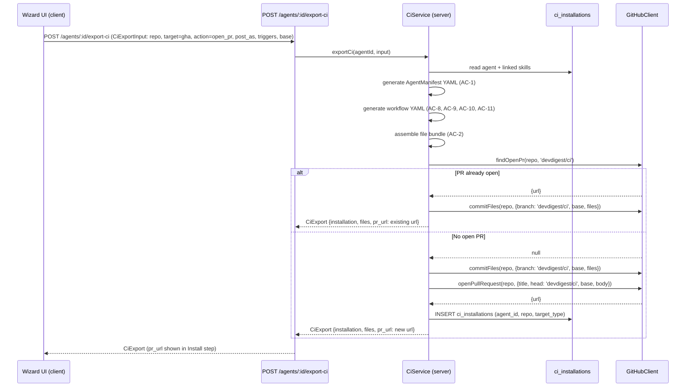
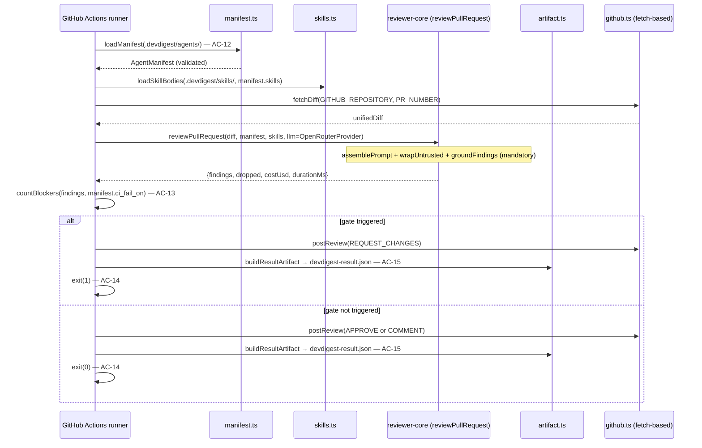
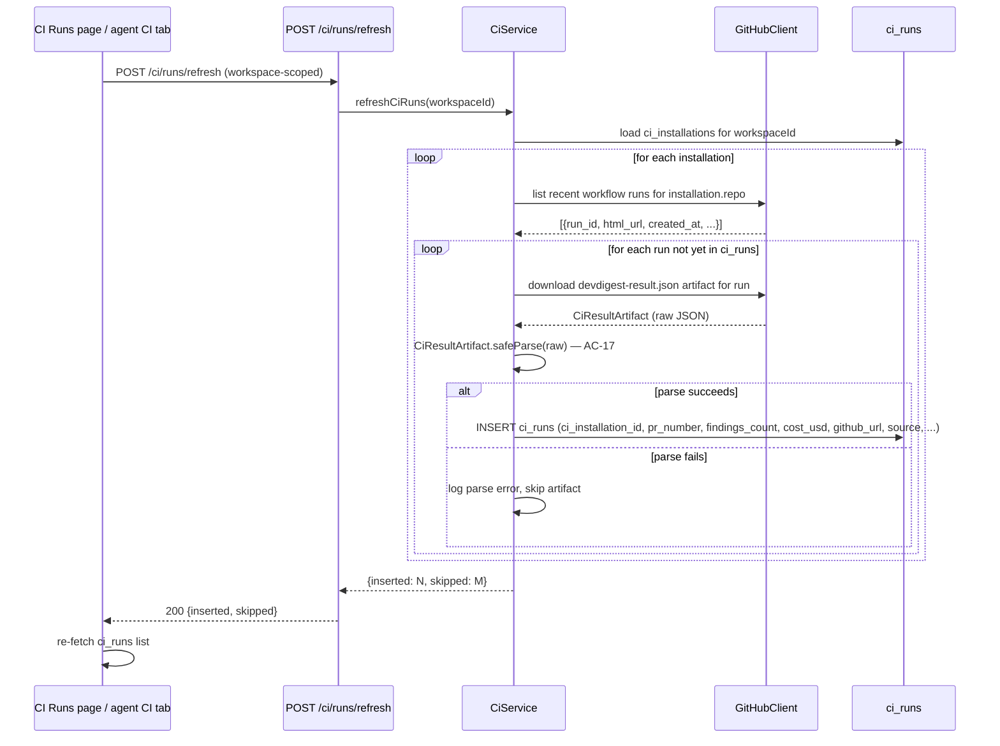
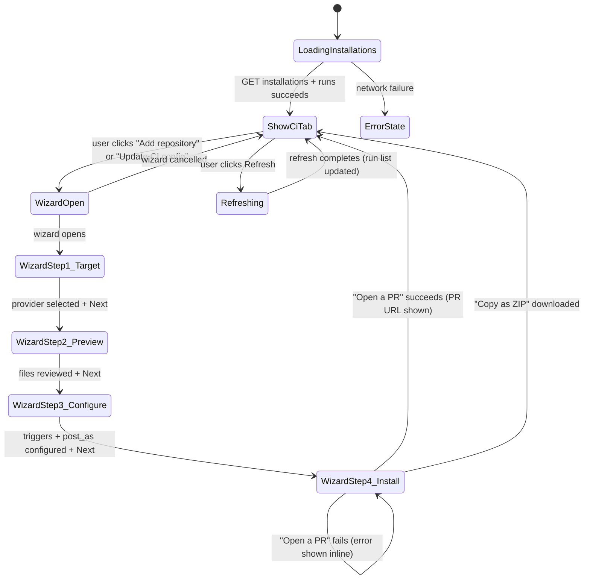

# Spec: Export to CI | Spec ID: SPEC-03 | Status: draft

## Problem and why

An agent configured in DevDigest studio (model + system prompt + skills + CI gate policy) is only useful locally until it runs automatically on real pull requests in a customer's codebase. Today there is no path from "agent configured in the studio" to "agent running in CI" — prompt changes, skill updates, or `ci_fail_on` adjustments made in the studio never propagate to production code review.

The Export to CI feature closes this gap by serializing the agent config into a YAML manifest validated by the same `AgentManifest` Zod contract shared between the studio and the self-contained agent-runner — one artifact, two consumers, zero drift between "what I tested locally" and "what runs in CI."

The security design is load-bearing, not incidental. This project earlier identified a "lethal trifecta" risk: untrusted input + tool access + external exfiltration channel. Exporting to CI is exactly where that trifecta becomes real — the agent reads an untrusted PR diff (attacker-influenced content) AND posts the result as a publicly visible GitHub review (a channel through which an attacker could attempt to exfiltrate LLM reasoning). The generated workflow is therefore explicitly designed to close that risk: minimal permissions (`contents: read`, `pull-requests: write`), `pull_request` trigger (not `pull_request_target`) to ensure fork PRs receive no secrets at the GitHub Actions platform level, no comment-based triggers, and the provider API key referenced only via `${{ secrets.* }}` — never committed in plaintext.

---

## Goals / Non-goals

**Goals**

- Serialize an agent's full configuration (provider, model, system prompt, linked skills, execution strategy, `ci_fail_on` gate policy) as a YAML manifest (`.devdigest/agents/<slug>.yaml`) validated against the existing `AgentManifest` Zod contract — the same contract the agent-runner reads and validates before using any field.
- Generate a complete file bundle for GitHub Actions (v1 fully specified provider): the agent manifest YAML, one `.devdigest/skills/<slug>.md` per linked skill, an empty `.devdigest/memory.jsonl`, the bundled agent-runner binary as `.devdigest/runner/index.js`, and `.github/workflows/devdigest-review.yml`.
- Expose a 4-step Export Wizard (Target → Preview → Configure → Install) reachable from an "Add to CI" button on the agent's CI tab.
- Provide two Install paths: (a) "Open a PR" — commits the file bundle atomically to a `devdigest/ci` branch on the target repository and opens a PR against its base branch, so the generated workflow and manifest are human-reviewed before merging; (b) "Copy as ZIP" — returns the bundle as a downloadable archive for manual installation when the user does not want to grant DevDigest write access to the target repo.
- Provide a global CI Runs page (`/ci-runs`) showing a table of CI-originated run results sourced from the `ci_runs` table, with user-triggered refresh that ingests `devdigest-result.json` artifacts from GitHub Actions.
- Provide an agent CI tab in the Agent Editor showing: deployment status summary, per-repository installation list, a "Fail CI on" selector (`agents.ci_fail_on`), and per-agent CI run history.
- Enforce the security invariants documented under "Security requirements" (see Problem section) in every generated GitHub Actions workflow.

**Non-goals (v1)**

- **CircleCI, Jenkins, and Generic CLI workflow generation.** These providers are selectable in the wizard Target step (UI placeholder) but no CI-provider-specific workflow file is generated for them in v1; only GitHub Actions is fully specified.
- **Automatic or webhook-based ingest.** CI run results are ingested on user-triggered refresh only; no background polling job or GitHub webhook integration is in scope.
- **Configuring GitHub branch protection rules or required status checks.** DevDigest has no GitHub App and cannot write branch protection settings; the user configures required status checks independently.
- **Verifying or creating GitHub Actions secrets in the target repository.** The Configure step secrets panel is informational — it shows which secrets the workflow needs, not their presence.
- **The full memory feature.** `.devdigest/memory.jsonl` is included as an empty file; memory population is a separate feature out of scope for this worktree.
- **Multi-run service and PR feed.** Owned by other worktrees; this spec does not touch them.
- **Auto-merging the CI setup PR.** The PR must be human-reviewed before merge.
- **New DB table definitions.** The `ci_installations`, `ci_runs`, `agent_runs.source`, and `agents.ci_fail_on` fields all already exist in the schema. One schema change IS required for v1: a `duration_ms` column must be added to `ci_runs` to store run duration at ingest time. This must be generated via `pnpm db:generate` (the `server/src/db/schema/` directory is a do-not-touch zone for hand-edits) and is a prerequisite migration for the implementation phase.

---

## User stories

- As an agent author, I want to click "Add to CI" and complete a 4-step wizard so my agent's configuration is committed to my target repository as a PR I can review and merge — not pushed directly to the default branch.
- As an agent author, I want the Preview step to show exactly which files will be created, including an editable workflow YAML preview, so I can inspect and adjust the generated workflow before any commit is made.
- As an agent author, I want the Configure step to inform me which GitHub Actions secrets I need to set in my target repository, without ever having to paste credentials into DevDigest.
- As a DevDigest user, I want the CI Runs page to show all past CI-originated reviews — PR number, repository, agent, status, findings count, cost, duration, and a link to the Actions job — so I can audit CI coverage at a glance.
- As an agent author, I want the agent's CI tab to show which repositories this agent is deployed in, let me start a new deployment or re-run the wizard for an existing one, and control at what finding severity the CI run should block a merge.

---

## Acceptance criteria (EARS)

**AC-1** The system shall generate an `AgentManifest` for any agent by reading its current `name`, `provider`, `model`, `system_prompt`, linked skill slugs (in their configured link order), `strategy`, and `ci_fail_on` from the database, and setting `post_as` from the `CiExportInput.post_as` value in the export request (one of: `github_review`, `pr_comment`, `exit_code_only`); the composed object shall pass `AgentManifest.safeParse` without errors, and the resulting YAML document shall be written to `.devdigest/agents/<slug>.yaml` where `<slug>` is derived from the agent name (lowercased, spaces replaced by hyphens, non-alphanumeric characters removed).

**AC-2** WHEN the Export Wizard is completed with `target = 'gha'`, the system shall include in the generated file bundle exactly five categories of files: (a) `.devdigest/agents/<slug>.yaml` (the validated manifest), (b) one `.devdigest/skills/<skill-slug>.md` file per skill linked to the agent, each containing the skill's body text, (c) `.devdigest/memory.jsonl` (an empty file, zero bytes), (d) `.devdigest/runner/index.js` (the `ncc`-compiled agent-runner binary, the build output of `agent-runner/`), and (e) `.github/workflows/devdigest-review.yml` (the generated GitHub Actions workflow).

**AC-3** WHEN the user selects "Open a PR with these files" in the Install step and the user's `GITHUB_TOKEN` has write access to the target repository, the system shall atomically commit all bundle files to a branch named `devdigest/ci` on the target repository using `GitHubClient.commitFiles`, then open a pull request against the configured base branch using `GitHubClient.openPullRequest`. IF a pull request from the `devdigest/ci` branch is already open on the target repository, the system shall return the existing PR's URL without opening a duplicate, using `GitHubClient.findOpenPr`.

**AC-4** WHEN the user selects "Copy files as a ZIP" in the Install step, the system shall return all generated bundle files as a downloadable ZIP archive without committing anything to any repository or creating any database records for the installation.

**AC-5** WHEN the user advances to the Preview step (step 2) of the Export Wizard, the system shall display all files in the bundle as a list with their paths and editable contents; the generated `.github/workflows/devdigest-review.yml` shall be rendered in an editable text pane so the user can adjust it before proceeding to Install.

**AC-6** WHEN the user is on the Configure step (step 3) of the Export Wizard, the system shall display: (a) trigger checkboxes pre-selected for `pull_request: [opened, synchronize]` with `reopened` available as an optional additional trigger; (b) a secrets-expected panel listing `OPENROUTER_API_KEY` (required — user must create this in the target repo's Actions secrets) and `GITHUB_TOKEN` (auto-provided by GitHub Actions — marked ready); and (c) a "Post results as" radio group with options `github_review` (default, recommended — the only option that can produce a blocking REQUEST_CHANGES verdict), `pr_comment`, and `exit_code_only` (uses only the CI exit code — posts nothing to the PR). The chosen `post_as` value is captured in `CiExportInput.post_as` and written into the exported `AgentManifest` as the `post_as` field. The Configure step shall include an inline hint explaining that to actually block merges the user must additionally set "Fail CI on" in the agent's CI tab and add a required status check in the target repo's GitHub branch protection settings — DevDigest cannot configure branch protection automatically.

**AC-7** WHERE `target` is `circle`, `jenkins`, or `cli`, the system shall allow the user to select that provider in the Target step (step 1) without error, and shall include only the manifest and skill files in the bundle (no CI-provider-specific workflow YAML); the Install step shall offer only the "Copy as ZIP" path for these providers.

**AC-8** The generated GitHub Actions workflow shall declare a top-level `permissions` key set to `contents: read` and `pull-requests: write`, and no other permissions.

**AC-9** The generated GitHub Actions workflow shall use `on: pull_request:` as its sole top-level trigger, which at the GitHub Actions platform level prevents fork-originated PRs from receiving repository secrets.

**AC-10** The generated GitHub Actions workflow shall not include `issue_comment`, `pull_request_target`, `workflow_run`, or any other trigger that accepts text from a comment or runs with elevated fork access.

**AC-11** The `OPENROUTER_API_KEY` value required at CI runtime shall appear in the generated workflow exclusively as `${{ secrets.OPENROUTER_API_KEY }}`; it shall not appear as a literal value in any generated file, in the manifest YAML, or anywhere in the committed file bundle.

**AC-12** WHEN the agent-runner starts in the target repository's CI context, the system shall locate the single `.devdigest/agents/*.yaml` file and validate it against the `AgentManifest` Zod contract before reading any field from it; IF the manifest directory is missing, contains zero or more than one YAML file, or the single file fails schema validation, THEN the runner shall exit with code 1, output a descriptive human-readable error message, and post nothing to the PR.

**AC-13** WHEN the agent-runner completes a CI review, the system shall compute the verdict by applying `countBlockers`/`gateTriggered` against the manifest's `ci_fail_on` policy using the grounded findings count by severity; the runner shall never use the LLM's self-reported verdict to determine whether to post `REQUEST_CHANGES` or what the exit code should be.

**AC-14** IF the agent-runner's deterministic gate is triggered (at least one finding at or above the `ci_fail_on` severity), THEN the runner shall exit with code 1 after posting the review; IF the gate is not triggered, THEN the runner shall exit with code 0 after posting the review; IF a hard failure occurs anywhere before the review is grounded (invalid manifest, unresolvable CI context, diff-fetch error, LLM error), THEN the runner shall exit with code 1 without posting anything and without writing an artifact.

**AC-15** WHEN the agent-runner successfully completes a CI review (gate triggered or not — hard failures per AC-14 are excluded), the system shall write a `devdigest-result.json` file conforming to the `CiResultArtifact` Zod contract, containing: `findings_count`, per-severity counts (`critical`, `warning`, `suggestion`), `cost_usd`, `duration_ms`, `agent` (the manifest `name`), `version`, and `pr_number`.

**AC-16** The CI Runs page (`/ci-runs`) shall display a table with one row per `ci_runs` record, showing for each run: PR number, repository (from `ci_installations.repo` via `ci_installation_id`), agent name (from the linked agent via `ci_installations.agent_id`), run status, findings count, cost in USD, duration, and a link to the GitHub Actions job (`ci_runs.github_url`); rows shall be ordered by `ran_at` descending.

**AC-17** WHEN the user triggers a refresh on the CI Runs page or the agent CI tab, the system shall, for each `ci_installations` record associated with the workspace, call the GitHub Actions REST API to list recent workflow runs on that installation's `repo`, download any `devdigest-result.json` artifact not yet recorded in `ci_runs` for that installation, validate each downloaded artifact against `CiResultArtifact`, and insert one `ci_runs` row per new valid artifact, storing the artifact's `duration_ms` value in the `ci_runs.duration_ms` column. The ingest target is exclusively `ci_runs` — no `agent_runs` rows are created by this path. IF a downloaded `devdigest-result.json` fails `CiResultArtifact` validation, THEN the system shall skip that artifact and record the parse error in the server log rather than inserting a malformed row.

**AC-18** WHILE the user is viewing the agent CI tab, the system shall display a deployment summary section showing the count of `ci_installations` rows for this agent.

**AC-19** WHILE the user is viewing the agent CI tab, the system shall display a per-repository list drawn from `ci_installations` filtered by the agent's id, showing for each installation: the repository name (`ci_installations.repo`), the CI provider type, the installation date, and the status of the most recent `ci_runs` row for that installation (or "No runs yet" if none exists); and a button labelled "Add repository" that opens the Export Wizard for a new installation, and an "Update CI config" button per installation that re-opens the wizard with the existing installation's settings pre-filled.

**AC-20** WHILE the user is viewing the agent CI tab, the system shall display a "Fail CI on" selector with options `never`, `critical`, `warning`, and `any` that reads the current `agents.ci_fail_on` value and persists changes to that field via the existing `PATCH /agents/:id` endpoint; changing this value takes effect on the next `POST /agents/:id/export-ci` call (the manifest and workflow are regenerated on each export).

**AC-21** WHILE the user is viewing the agent CI tab, the system shall display a run history table sourced from `ci_runs` rows associated with this agent's installations (joined via `ci_installations.agent_id`), showing for each run: PR number, repository, status, findings count, cost, and run date.

**AC-22** WHEN the user advances to the Install step (step 4) of the Export Wizard with "Open a PR" selected as the install method and `target = 'gha'`, the system shall perform a preflight check of the DevDigest GitHub token's write access to the target repository. IF the preflight check fails (the token does not have write access to the target repository), THEN the system shall disable the "Open a PR" option and surface only the "Copy files as a ZIP" path with an explanatory message stating that the DevDigest GitHub token lacks write access to the configured target repository.

---

## Edge cases

Derived from reading the existing agent-runner implementation, GitHub adapter interface, DB schema, and the security model:

1. **`devdigest/ci` branch already exists and PR is already open.** `GitHubClient.findOpenPr` detects the open PR and the service returns its URL without calling `openPullRequest`. If the branch exists but the PR was merged, `findOpenPr` returns null; a new commit is added to the branch (fast-forward) and `openPullRequest` opens a fresh PR.

2. **`GITHUB_TOKEN` lacks write access to the target repository (pre-flight detection).** Before the Install step enables the "Open a PR" option, the wizard performs a pre-flight check of the DevDigest GitHub token's write access to the target repository (AC-22). If the check fails, "Open a PR" is disabled and only "Copy as ZIP" is offered, with an explanatory message. If the pre-flight passes but `GitHubClient.commitFiles` subsequently receives a 403 (e.g., permissions changed between pre-flight and the commit call), the service maps this to a 422 response with a human-readable message directing the user to grant the token `repo` scope; the user may fall back to "Copy as ZIP".

3. **Agent has zero linked skills.** The manifest is generated with `skills: []`, and no `.devdigest/skills/` files are included in the bundle. The bundle is valid and the wizard proceeds normally.

4. **Multiple `.devdigest/agents/*.yaml` files in the target repository** (e.g., a previous installation left a differently-named manifest). The agent-runner fails with "Expected exactly one agent manifest, found N" and exits with code 1 (already enforced in `agent-runner/src/manifest.ts:42`). The spec makes this a known constraint: each target repo should be installed with at most one agent manifest.

5. **Fork-originated PR triggers the workflow.** GitHub Actions' `pull_request` trigger (not `pull_request_target`) prevents secrets from being injected into jobs triggered by fork PRs at the platform level. The runner finds `OPENROUTER_API_KEY` empty, its first LLM call fails, and it exits code 1 without posting anything and without writing an artifact. No DevDigest-level fork detection is required; the platform behavior is the gate.

6. **`devdigest-result.json` artifact not yet available at refresh time** (run still in progress or artifact upload failed). The GitHub Actions API lists the run but the artifact query returns no file. The ingest service skips this run; the artifact is picked up on the next user-triggered refresh.

7. **Ingest of the same artifact more than once** (user triggers refresh repeatedly). The service must deduplicate by checking for an existing `ci_runs` row before inserting; a constraint on `(ci_installation_id, pr_number, ran_at)` or a comparison with `github_url` prevents duplicate rows.

8. **Agent-runner's `groundFindings` gate drops all findings.** This is a valid `APPROVE` outcome — zero blockers, gate not triggered, exit code 0, a `devdigest-result.json` with `findings_count: 0` is written and the runner posts an APPROVE review.

9. **Manifest updated in the studio after the CI PR was merged** (e.g., the system prompt changed). The deployed CI branch reflects the previous export. The user must re-run the wizard ("Update CI config") to generate a new bundle and open a new PR with the updated manifest.

10. **`ci_runs.github_url` is null** (artifact ingested without a job URL, or the GitHub API didn't return one). The CI Runs page renders a dash for the job-link column rather than an error.

---

## Non-functional

**Security**

- The generated workflow's `permissions` block (AC-8) and trigger choice (AC-9, AC-10) together close the fork-PR secret-leak risk. These must not be relaxed without an explicit security review: widening permissions or adding `pull_request_target` would re-open the trifecta.
- The provider API key must never appear in the manifest, the committed files, or the `devdigest-result.json` artifact (AC-11, AC-15). The agent-runner CLAUDE.md confirms secrets are read directly from CI env vars and are never written to any output.
- `CiResultArtifact` content downloaded from GitHub during ingest is untrusted (see Untrusted inputs) and must be validated before any field is used.
- The "Open a PR" path uses the studio's `GITHUB_TOKEN` (from `LocalSecretsProvider`, scoped to `server/`). This is the DevDigest server's own PAT — a different credential from the `GITHUB_TOKEN` auto-injected into the generated workflow by GitHub Actions.

**Performance**

- File bundle generation (YAML serialization + agent-runner binary read) shall complete within 2 seconds for any agent. `commitFiles` and `openPullRequest` latency is GitHub API network-bound and outside this budget.
- The refresh endpoint shall complete within 30 seconds for a workspace with up to 10 `ci_installations`; it may run sequentially per installation without a timeout failure (GitHub API calls are the limiting factor).

**Accessibility**

- The Export Wizard step indicators shall be accessible as a progress landmark (or `<ol>` with `aria-current="step"`) so screen-reader users can identify the current step.
- The editable workflow YAML pane (Preview step) shall have a visible label and be accessible as a `<textarea>` rather than a raw `contenteditable` div.

---

## Architecture & workflows

### Export Wizard — "Open a PR" path

### Agent-runner CI flow (in target repository's GitHub Actions)

### CI Runs ingest — user-triggered refresh

### Agent CI tab — client state machine

---

## Service contracts

All new server routes belong to a new `ci` server module. All routes are workspace-scoped and require `workspaceId` extracted from the request context. The client mirrors new contracts in its vendor shared folder in lockstep with the server's shared contracts folder.

### `POST /agents/:id/export-ci` (new)

| Aspect | Detail |
|---|---|
| Auth | Workspace-scoped |
| Params | `id` — agent UUID |
| Body | `CiExportInput` (contract in `eval-ci.ts`, modified for v1): `repo` (owner/name string), `target` (CiTarget enum), `action` ('open_pr' or 'files'), `post_as` ('github_review'\|'pr_comment'\|'exit_code_only'), `triggers` (string[]), `base` (default branch name) |
| Response 200 | `CiExport` (existing contract): `{ installation: CiInstallation, files: CiFile[], pr_url: string \| null }` |
| Response 404 | Agent not found |
| Response 422 | `repo` is not a valid `owner/name` format; or `target` is `gha` and the GitHub API returned a 403 (GITHUB_TOKEN lacks write access); or agent has no valid `AgentManifest` fields |
| Side effect on `action: 'open_pr'` | Creates or reuses a `ci_installations` row; commits files to target repo; opens or returns existing PR |
| Side effect on `action: 'files'` | No `ci_installations` row created; no GitHub API write calls |

### `GET /agents/:id/ci-installations` (new)

| Aspect | Detail |
|---|---|
| Auth | Workspace-scoped |
| Params | `id` — agent UUID |
| Response 200 | `CiInstallation[]` (existing contract): `{ id, agent_id, repo, target_type, installed_at }` |
| Response 404 | Agent not found |

### `GET /ci/runs` (new)

| Aspect | Detail |
|---|---|
| Auth | Workspace-scoped |
| Query | Optional `agent_id` (UUID) to filter by a specific agent |
| Response 200 | `CiRun[]` (existing contract), ordered by `ran_at` descending; each row includes enriched `agent` (agent name via JOIN to `ci_installations.agent_id`) and `duration_s` (derived from `ci_runs.duration_ms` ÷ 1000 at the service layer) |
| Response 404 | `agent_id` supplied but agent not found |

### `POST /ci/runs/refresh` (new)

| Aspect | Detail |
|---|---|
| Auth | Workspace-scoped |
| Body | None |
| Response 200 | `{ inserted: number, skipped: number }` — counts of newly ingested rows and skipped artifacts (parse failures or duplicates) |
| Side effects | For each `ci_installations` row in the workspace: lists recent GHA workflow runs via `GitHubClient`, downloads `devdigest-result.json` artifacts not yet recorded, inserts valid `ci_runs` rows |

### `GET /ci/runs/:id` (new)

| Aspect | Detail |
|---|---|
| Auth | Workspace-scoped |
| Params | `id` — `ci_runs` UUID |
| Response 200 | Single `CiRun` row with enriched `agent` and `github_url` |
| Response 404 | Run not found or not in this workspace |

### Shared Zod contracts (two contracts modified for v1)

All wire contracts used by this feature exist in `server/src/vendor/shared/contracts/eval-ci.ts` and are re-exported via `server/src/vendor/shared/index.ts` (which the client mirrors at `client/src/vendor/shared/`). Two contracts require modification:

| Contract | Status | Notes |
|---|---|---|
| `AgentManifest` | **Modified** | A new `post_as` field (enum: `github_review \| pr_comment \| exit_code_only`) is added. Written by `POST /agents/:id/export-ci`, read and validated by the agent-runner before any field is used. This is a **shared contract change** consumed by both the studio (client) and agent-runner; both must be updated in lockstep. |
| `CiTarget` | Exists | Enum: `gha \| circle \| jenkins \| cli` |
| `CiFile` | Exists | `{ path, contents, editable }` |
| `CiExportInput` | **Modified** | Request body for `POST /agents/:id/export-ci`. The existing `post_as` enum value `'none'` is renamed to `'exit_code_only'` to align with `AgentManifest.post_as`. |
| `CiInstallation` | Exists | Mirrors `ci_installations` table |
| `CiExport` | Exists | Response of `POST /agents/:id/export-ci` |
| `CiRun` | Exists | Mirrors `ci_runs` table (enriched with `agent` and `duration_s` at service layer) |
| `CiRunStatus` | Exists | Enum: `succeeded \| failed \| no_findings \| running` |
| `CiResultArtifact` | Exists | Artifact shape written by agent-runner, validated during ingest |

`CiRun.duration_s` and `CiRun.agent` are not columns in `ci_runs`; they are enriched at the service layer. `duration_s` is derived by dividing the stored `ci_runs.duration_ms` by 1000. `agent` is populated via a JOIN to `ci_installations.agent_id`. No contract modification is needed for these two fields; the service is responsible for populating them.

---

## Inputs (provenance)

| Input | Provenance tag | Notes |
|---|---|---|
| `agentId` route param | `[deterministic: route param, UUID-validated by request schema]` | Non-UUID values rejected 422 before handler runs |
| `CiExportInput.repo` | `[new: user input, validated as non-empty string]` | User-supplied `owner/name`; passed to `GitHubClient` only after format validation |
| `CiExportInput.target`, `action`, `post_as`, `triggers`, `base` | `[new: user input, validated against CiExportInput Zod schema]` | Enum and string fields; validated at route boundary |
| Agent `name`, `provider`, `model`, `system_prompt`, `ci_fail_on`, `strategy` | `[reused: agent record read from DB via agentId]` | Source of truth for manifest generation |
| Linked skill slugs and bodies | `[reused: skill records from DB via agentSkills join, ordered by agentSkills.order]` | Used for manifest `skills[]` and per-skill `.md` files |
| `GITHUB_TOKEN` (for "Open a PR" path) | `[reused: LocalSecretsProvider('GITHUB_TOKEN') from ~/.devdigest/secrets.json]` | DevDigest studio's own PAT — separate from the target repo's GitHub Actions GITHUB_TOKEN |
| `agent-runner/dist/index.js` | `[reused: pre-built ncc bundle from agent-runner package]` | Static binary; bundled at `agent-runner/` build time, not regenerated per export |
| `CiResultArtifact` JSON downloaded from GitHub Actions artifacts (ingest path) | `[new: 1 GitHub API call per artifact per installation per refresh]` | Third-party-controlled content; must be validated with `CiResultArtifact.safeParse` before any field is used |

---

## Untrusted inputs

| Untrusted input | Risk | Mitigation |
|---|---|---|
| `CiExportInput.repo` (user-supplied `owner/name` string) | An attacker-controlled value could be crafted to hit unintended GitHub API endpoints (SSRF variant) | Validated as a valid `owner/name` format (two slash-separated non-empty strings, no special characters) at the route boundary before being passed to `GitHubClient`; the GitHub adapter is the only call surface |
| Agent `system_prompt` embedded in manifest YAML | A system prompt containing YAML-special characters could corrupt the generated manifest | YAML serialized with a library that properly escapes all strings; manifest validated with `AgentManifest.safeParse` after serialization before committing |
| Workflow YAML shown in the editable Preview pane and edited by the user | The user may modify the workflow in ways that introduce new security issues (e.g., adding `pull_request_target`) | The editable preview is the user's own choice — the system provides the secure default and it is the user's responsibility to not degrade it. The spec's security ACs (AC-8 through AC-11) describe the required defaults, not immutable enforcement of the final content |
| `devdigest-result.json` artifact content (downloaded from GitHub Actions during ingest) | An attacker with write access to the target repo could craft a malicious artifact to cause injection or data corruption on ingest | Validated with `CiResultArtifact.safeParse` before any field is extracted or inserted into `ci_runs`; parse failures are logged and skipped (AC-17) |
| PR diff read by the agent-runner in CI | Attacker-controlled PR content could attempt prompt injection against the reviewer agent | The agent-runner uses `reviewer-core`'s `assemblePrompt` / `wrapUntrusted` / `INJECTION_GUARD` pipeline unchanged — the same injection defense applied to local studio reviews; the runner CLAUDE.md enforces this as a non-negotiable invariant |

---

## Traceability

| AC-N | Evidence |
|---|---|
| AC-1 | `server/src/vendor/shared/contracts/eval-ci.ts:177–194` (AgentManifest Zod schema: name, provider, model, system_prompt, skills, strategy, ci_fail_on — `post_as` is the field being added); `server/src/db/schema/agents.ts:8–40` (agents table with all source DB fields); `agent-runner/src/manifest.ts:69–77` (safeParse validation before use); `agent-runner/insights/INSIGHTS.md` (Open Questions: "post_as wiring gap — manifest has no post_as, runner defaults to github_review from DEVDIGEST_POST_AS env var" — confirms the gap this AC closes) |
| AC-2 | `agent-runner/README.md` (file bundle description: manifest + skills + memory.jsonl + runner binary + workflow); `server/src/vendor/shared/contracts/eval-ci.ts:162–167` (CiFile: path, contents, editable) |
| AC-3 | `server/src/vendor/shared/adapters.ts:129–163` (CommitFilesPayload + GitHubClient.commitFiles, openPullRequest, findOpenPr); `server/src/vendor/shared/contracts/eval-ci.ts:199–210` (CiExportInput.action: 'open_pr'|'files'); `server/src/db/schema/ci.ts:4–12` (ci_installations table with agent_id, repo, target_type) |
| AC-4 | `server/src/vendor/shared/contracts/eval-ci.ts:199–210` (CiExportInput.action: 'files'); user requirement: "Copy files as a zip (degraded/manual path)" |
| AC-5 | `server/src/vendor/shared/contracts/eval-ci.ts:162–167` (CiFile.editable: boolean); user requirement: "shows every file that will be created/changed... workflow YAML is shown in an editable text preview pane" |
| AC-6 | `server/src/vendor/shared/contracts/eval-ci.ts:199–210` (CiExportInput: post_as, triggers — existing `'none'` enum value renamed to `'exit_code_only'`); coordinator resolution #3 (post_as enum: `github_review \| pr_comment \| exit_code_only`, matching wizard's Configure step); user requirement ("Configure" step description, including the secrets panel and inline hint about branch protection) |
| AC-7 | `server/src/vendor/shared/contracts/eval-ci.ts:158–159` (CiTarget: gha\|circle\|jenkins\|cli); user requirement: "Only GitHub Actions needs to be fully specified for v1; the other three are selectable but can be stubbed/non-functional placeholders" |
| AC-8 | User security requirement: "The generated workflow must request only `contents: read` and `pull-requests: write` permissions — nothing broader" |
| AC-9 | User security requirement: "Workflow must NOT run (or must run with no secret access) on `pull_request` events originating from a fork"; GitHub Actions platform behavior: `pull_request` trigger (not `pull_request_target`) prevents fork PRs from receiving secrets |
| AC-10 | User security requirement: "No trigger may be `issue_comment` or any comment-based event — comment text is untrusted input and must never be able to trigger a run with secret access" |
| AC-11 | User security requirement: "The provider API key is read from GitHub Secrets in the generated workflow YAML — never embedded in the manifest or committed in plaintext anywhere" |
| AC-12 | `agent-runner/src/manifest.ts:25–77` (findManifestPath validates single file, loadAgentManifest validates YAML + Zod); `agent-runner/README.md:exit codes` (exit 1 on hard failure) |
| AC-13 | `agent-runner/README.md:step 5` ("Computes a deterministic verdict from the grounded findings + the manifest's ci_fail_on... never from the model's self-reported verdict"); `server/src/db/schema/agents.ts:25–27` (ciFailOn: 'never'\|'critical'\|'warning'\|'any'); `server/src/vendor/shared/contracts/knowledge.ts:362–363` (CiFailOn enum) |
| AC-14 | `agent-runner/README.md:exit codes` (0 = gate not triggered, 1 = gate triggered OR hard failure, no posting on hard failure) |
| AC-15 | `agent-runner/src/artifact.ts:32–53` (buildResultArtifact: CiResultArtifact.safeParse validates before write); `server/src/vendor/shared/contracts/eval-ci.ts:251–264` (CiResultArtifact shape) |
| AC-16 | `client/src/vendor/ui/nav.ts:45` (nav entry: key "ci-runs", href "/ci-runs" already present); `server/src/vendor/shared/contracts/eval-ci.ts:233–247` (CiRun contract: id, ci_installation_id, pr_number, ran_at, status, findings_count, cost_usd, github_url, agent, duration_s); `server/src/db/schema/ci.ts:14–26` (ci_runs table columns) |
| AC-17 | `server/src/vendor/shared/contracts/eval-ci.ts:251` ("Ingested back on refresh to populate `ci_runs`" — confirms `ci_runs` is the sole ingest target, not `agent_runs`); `server/src/vendor/shared/contracts/eval-ci.ts:251–264` (CiResultArtifact — includes `duration_ms` field; stored in `ci_runs.duration_ms` per coordinator resolution #2); `server/src/db/schema/ci.ts:14–26` (`ci_runs` table — `duration_ms` column to be added via `pnpm db:generate`) |
| AC-18, AC-19 | `server/src/db/schema/ci.ts:4–12` (ci_installations: agent_id, repo, target_type, installed_at); user requirement ("Agent CI tab" — deployment status summary, per-repository list); `client/src/app/agents/[id]/_components/AgentEditor/constants.ts:11–16` (TABS lists config/skills/context/evals — CI tab is missing, must be added) |
| AC-20 | `server/src/db/schema/agents.ts:25–27` (ciFailOn column: 'never'\|'critical'\|'warning'\|'any'); user requirement ("'Fail CI on' selector — determines what CI run outcome causes non-zero exit code / REQUEST_CHANGES verdict") |
| AC-21 | `server/src/db/schema/ci.ts:14–26` (ci_runs: ci_installation_id FK → ci_installations.agent_id → agents); user requirement ("Run history for this agent's CI installations") |
| AC-22 | `server/src/vendor/shared/adapters.ts:129–163` (GitHubClient — the adapter whose token is being pre-flight checked); `server/src/adapters/secrets/local.ts` (LocalSecretsProvider — source of the DevDigest GitHub PAT used for the "Open a PR" path); coordinator resolution #4 ("wizard performs a preflight check of the DevDigest GitHub PAT's write access to the target repo BEFORE showing/enabling the Install step's 'Open a PR' option") |

---

## Verification

| AC-N | Verification recipe |
|---|---|
| AC-1 | Configure an agent with a name, provider, model, system prompt, linked skills, strategy, and ci_fail_on. Call `POST /agents/:id/export-ci` with `target='gha'` and `post_as='pr_comment'`. Inspect the returned `files` array: locate the `.devdigest/agents/<slug>.yaml` entry, parse the YAML, and confirm it passes `AgentManifest.safeParse` without errors. Confirm the `post_as` field in the parsed YAML equals `'pr_comment'`. Confirm the slug is kebab-case derived from the agent's name. |
| AC-2 | After the same POST call, verify the `files` array contains exactly: one `.devdigest/agents/<slug>.yaml`, one `.devdigest/skills/<skill-slug>.md` per linked skill, one `.devdigest/memory.jsonl` (empty string contents), one `.devdigest/runner/index.js` (non-empty binary), and one `.github/workflows/devdigest-review.yml`. |
| AC-3 | Call `POST /agents/:id/export-ci` with `action='open_pr'` and a target repo where the test user's `GITHUB_TOKEN` has write access. Verify a PR URL is returned. Navigate to that URL and confirm the PR exists targeting the configured base branch. Call the same endpoint again without merging; verify the same PR URL is returned without opening a duplicate. |
| AC-4 | Call `POST /agents/:id/export-ci` with `action='files'`. Verify a bundle is returned with all files and no PR URL, and that no `ci_installations` row was created in the database. |
| AC-5 | Open the Export Wizard to step 2 (Preview). Verify all five file paths are displayed. Verify the workflow YAML is rendered in an editable field. Edit the workflow text; confirm the edited content flows through to the Install step. |
| AC-6 | Open the Configure step. Verify `opened` and `synchronize` checkboxes are pre-checked and `reopened` is available. Verify the secrets panel lists `OPENROUTER_API_KEY` and `GITHUB_TOKEN`. Verify the "Post results as" radio defaults to `github_review` and includes `pr_comment` and `exit_code_only` as selectable options (no `none` option). Select `exit_code_only`; proceed to Install and call the export endpoint. Inspect the generated manifest: confirm `post_as` equals `'exit_code_only'`. Verify an inline hint mentioning branch protection settings is visible. |
| AC-7 | Select "CircleCI" in the Target step. Verify the wizard completes without error. Verify the returned file bundle contains only `.devdigest/agents/<slug>.yaml` and any skill files (no `devdigest-review.yml`, no runner binary). Verify only "Copy as ZIP" is offered in the Install step. |
| AC-8 | Inspect the generated `.github/workflows/devdigest-review.yml`. Confirm `permissions: { contents: read, pull-requests: write }` is present at the top-level key and no other permissions are listed. |
| AC-9 | Inspect the generated workflow. Confirm the sole top-level trigger is `on: pull_request:` (or `on: { pull_request: ... }`). Confirm `pull_request_target` is absent. |
| AC-10 | Inspect the generated workflow. Confirm `issue_comment`, `workflow_run`, and similar comment-based trigger names are absent from the `on:` block. |
| AC-11 | Inspect all files in the generated bundle. Confirm the string `OPENROUTER_API_KEY` appears only as `${{ secrets.OPENROUTER_API_KEY }}` in the workflow YAML and nowhere else as a literal value. |
| AC-12 | In a test repository with the file bundle deployed: (a) rename the manifest to introduce a second `.yaml` file — verify the runner exits 1 with "Expected exactly one agent manifest" error; (b) corrupt the manifest YAML — verify the runner exits 1 with a YAML parse error; (c) remove a required field from the manifest — verify the runner exits 1 with a schema validation error. In all three cases verify no GitHub review is posted. |
| AC-13 | Configure the agent with `ci_fail_on='critical'`. Run against a PR that has exactly one CRITICAL finding and one WARNING finding. Verify the runner posts `REQUEST_CHANGES` and exits 1. Verify the model's self-reported verdict is not used (observable by examining the runner's console log which only references `countBlockers`/`gateTriggered` output). |
| AC-14 | Confirm gate-triggered run exits 1. Confirm gate-not-triggered run (all findings below threshold) exits 0. Confirm hard-failure run (empty `OPENROUTER_API_KEY`) exits 1, posts nothing, and writes no `devdigest-result.json`. |
| AC-15 | After a successful run, locate `devdigest-result.json`. Parse it and confirm it contains `findings_count`, `critical`, `warning`, `suggestion`, `cost_usd`, `duration_ms`, `agent` (matching the manifest name), `version`, and `pr_number`. Validate the file passes `CiResultArtifact.safeParse`. |
| AC-16 | Navigate to `/ci-runs`. After seeding a `ci_runs` row, verify the table renders: PR number, repository from the linked installation, agent name, status, findings count, cost, duration, and a clickable GitHub URL link. Verify rows are ordered newest-first. |
| AC-17 | After a CI run completes and uploads `devdigest-result.json` to GitHub Actions artifacts, click Refresh on the CI Runs page. Verify a new `ci_runs` row appears in the table and that no `agent_runs` row was created for this artifact. Query the new `ci_runs` row directly and verify `duration_ms` is populated with the value from the artifact. Click Refresh again; verify no duplicate row is created. Seed a corrupted artifact (invalid JSON) in a test scenario; click Refresh and verify the run is skipped and no malformed row appears in `ci_runs`. |
| AC-18 | On the agent CI tab, with two `ci_installations` rows for the agent, verify the deployment summary shows "Active in 2 repos" or equivalent count. |
| AC-19 | On the agent CI tab, verify each installation row shows: repository name, provider type, installation date, and last run status. Verify "Add repository" button opens the wizard. Verify "Update CI config" button re-opens the wizard with the repo field pre-filled. |
| AC-20 | On the agent CI tab, verify the "Fail CI on" selector shows the current `agents.ci_fail_on` value. Change it to `warning`. Verify `GET /agents/:id` returns the updated `ci_fail_on` value. |
| AC-21 | On the agent CI tab, after seeding two `ci_runs` rows linked to this agent's installations, verify both rows appear in the run history with the correct PR number, repository, status, findings count, cost, and date. |
| AC-22 | Open the Export Wizard with a target repository where the DevDigest GitHub token has no write access. Advance to step 4 (Install). Verify "Open a PR" is disabled and a message explaining the token lacks write access is displayed. Verify "Copy as ZIP" remains available and functional. Repeat with a repository where the token HAS write access; verify "Open a PR" is enabled. |

