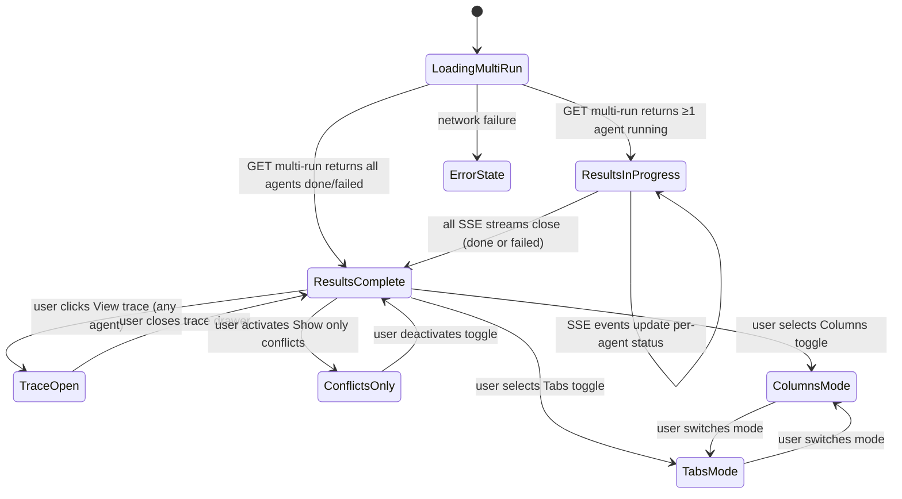
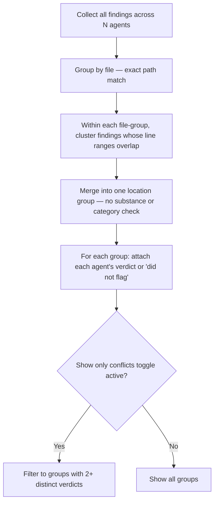

# Spec: Multi-Agent Review | Spec ID: SPEC-03 | Status: draft

## Problem and why

A real pull request touches security posture, runtime performance, and domain-logic correctness simultaneously. Today a user must pick one review agent per run. A single agent's prompt and skills are tuned for one concern — it will systematically miss the others. Running N specialized agents against the same PR in one action closes all angles in one pass. But three agents independently flagging the same bug erodes trust if shown as three unrelated findings; the results page must surface where agents agree and where they diverge ("Where agents disagree"). Attribution of which agent produced which finding must be preserved as queryable data — it is the raw material for a future Per-Agent Stats feature that is explicitly out of scope here, so the data must exist without the UI for it. Running N agents with no live visibility into progress is anxiety-inducing: the user needs live per-agent status during the run, with a way to drill into each agent's full trace once complete.

---

## Goals / Non-goals

**Goals**

1. Add a "Pick agents to run" agent-picker extension to the PR-page Run Review dropdown — checkboxes per agent with rough time estimates — with a "Run multi-agent review (N)" primary action and a "Configure agents..." link.
2. Build a Configure Run page: step to select a target PR, agent cards with per-agent time/cost estimates derived from historical runs, a "Select all" control, and an aggregate pre-launch estimate footer ("≈ Xs · $X.XX · parallel fan-out").
3. Build a multi-run grouping service and routes: create one `multi_agent_runs` record that groups N individual agent_runs for a single PR, expose read endpoints for the multi-run's aggregate status, cost, and results.
4. Build the Multi-Agent Review results page with a Columns mode (one column per agent, live status, findings, "View trace" link) and a Tabs + detail mode (tab per agent, full FindingCard with action buttons).
5. Build cross-agent finding grouping ("Where agents disagree"): group findings across agents by same file and overlapping line range; for each group, show every agent's verdict including agents that did not flag that location; provide a "Show only conflicts" toggle.
6. Preserve per-agent attribution on every finding so a future Per-Agent Stats feature can consume it without schema-breaking changes.
7. Reuse the existing run-trace drawer and live log stream for per-agent trace access from the results page.

**Non-goals (v1)**

- **GitHub Actions deployment of review agents** — a separate initiative; must not be mentioned as a dependency or goal.
- **`ci/` and `agent-runner/` packages** — off-limits; nothing in this feature requires changes there.
- **Per-Agent Stats dashboard** — out of scope; this feature only preserves the attribution data.
- **"Compose Review" drawer** — a different existing feature; do not conflate with "Where agents disagree" or fold its behavior here.
- **Automatic multi-run scheduling or webhooks** — all runs are user-initiated.
- **Single-agent review path changes** — the existing single-agent review flow is unchanged.

---

## User stories

- As a developer reviewing a security-sensitive PR, I want to run a security agent and a performance agent in one action and see their findings side by side — so I can close all concerns in one pass without a second review cycle.
- As a team lead, I want to see where agents agree (shared findings) and where they disagree (agent A flagged, agent B did not) — so I can calibrate trust in each agent's verdict and identify gaps.
- As a reviewer-agent author, I want to monitor live progress per agent while a multi-agent run is in flight — so I know which agents are still running and which have completed or failed.
- As a reviewer-agent author, I want to drill into any agent's full trace (prompt assembly, token counts, per-call cost) from the results page — so I can diagnose poor findings without leaving the multi-agent review context.
- As a developer, I want to see a pre-launch cost and time estimate before committing to running N agents — so I can make an informed choice about which agents to include.

---

## Acceptance criteria (EARS)

**AC-1** WHEN the user opens the Run Review dropdown on the PR detail page, the system shall display a checkbox per available agent (each accompanied by a rough time estimate from historical data), a "Run multi-agent review (N selected)" primary action that is enabled when at least one agent is selected, and a "Configure agents..." link that navigates to the Configure Run page.

**AC-2** WHEN the user navigates to the Configure Run page, the system shall display a step to select the target PR and a step to display agent cards — each with the agent's name, a one-line summary of what that agent most recently found on any run, and per-agent time and cost estimates — along with checkboxes and a "Select all" control.

**AC-3** WHEN the Configure Run page computes a pre-launch estimate for a given agent, the system shall derive the estimated duration (seconds) and cost (USD) by averaging the agent's last 10 completed runs (or all completed runs if fewer than 10 exist). IF the agent has zero completed runs, THEN the system shall display "no history yet" for that agent's estimate rather than a fabricated value.

**AC-4** The Configure Run page footer shall display an aggregate pre-launch estimate line (total estimated duration assuming parallel execution, total estimated cost, and the label "parallel fan-out") for all currently selected agents, updated live as the user changes agent selections.

**AC-5** WHEN the user triggers a multi-agent review from either the PR-page agent picker or the Configure Run page with N ≥ 1 agents selected, the system shall insert one `multi_agent_runs` record for that PR, trigger N individual agent_run executions for the selected agents, and set the `multi_agent_run_id` column on each of the N `agent_runs` rows to the new `multi_agent_runs` record's id — so they are queryable as a group. Single-agent runs triggered outside this flow shall leave `multi_agent_run_id` null on their `agent_runs` row.

**AC-6** IF one agent's run fails during a multi-agent review, THEN the system shall record that agent_run as failed and continue executing the remaining agents to completion, rather than aborting the entire multi-run.

**AC-7** WHILE any agent's run is still in progress on the Multi-Agent Review results page, the system shall display a live per-agent status indicator (running/done/failed) for each agent by subscribing to that agent_run's SSE event stream.

**AC-8** WHEN the user selects Columns mode on the Multi-Agent Review results page, the system shall display one column per agent containing: a live status spinner while the run is in progress; the agent's score, verdict, and finding count once complete; the agent's findings list; and a "View trace" link for that agent_run.

**AC-9** WHEN the user selects Tabs mode on the Multi-Agent Review results page, the system shall display one tab per agent; the active tab shall show a summary card (score, one-line summary, verdict, "View trace" link with run time and cost) followed by FindingCards for each of that agent's findings.

**AC-10** WHEN the user clicks "View trace" for any agent's run on the Multi-Agent Review results page, the system shall open the existing run-trace drawer for that agent_run, showing the full persisted trace (prompt assembly, token counts, per-call cost, raw output) and — while still running — the live log stream.

**AC-11** WHEN FindingCards are rendered on the Multi-Agent Review results page (in either Columns or Tabs mode), the system shall provide Accept, Dismiss, and "Turn into eval case" action buttons with the same semantics as defined in SPEC-02 AC-1 and AC-2.

**AC-12** WHEN the Multi-Agent Review results page is rendered with completed results from at least two agents, the system shall group findings across all agents by same file AND overlapping line range only — two findings group together if and only if they share the same file path (exact match) and their `[start_line, end_line]` ranges overlap (share at least one integer line number, using the same overlap semantics as SPEC-02 AC-8). No substance, category, or embedding check is applied. For each group, the system shall display a row showing every participating agent's verdict at that location — including "did not flag" for agents that produced no matching finding at that location — in a side-by-side layout.

**AC-13** WHEN the user activates the "Show only conflicts" toggle in the "Where agents disagree" section, the system shall filter the displayed groups to those where at least two agents reached different verdicts (where "did not flag" counts as one distinct verdict type relative to any explicit finding severity level).

**AC-14** The system shall preserve which agent_id produced each finding on every individual agent_run record, such that per-agent attribution is queryable independently of the multi_agent_runs grouping record.

**AC-15** WHEN a client requests a multi_agent_run's status and results via the multi-run read endpoint, the server shall return the multi_agent_run record including its id, pr_id, ran_at, and for each participating agent_run: agent_id, agent_name, status, score, finding_count, cost_usd, and duration_ms; plus aggregate total_cost_usd and total_duration_ms across all agent_runs in the group.

**AC-16** The Multi-Agent Review results page header shall display: a breadcrumb identifying the current PR, a "Configure run" navigation link, a Columns/Tabs mode toggle, and a summary line showing agent count, execution model ("parallel"), total duration (once all complete), and total cost.

---

## Edge cases

Derived from reading the existing run-executor, SSE infrastructure, schema, and INSIGHTS.md:

1. **Zero agents selected at launch** — The "Run multi-agent review" button shall be disabled when no agents are checked. A multi_agent_run must not be created with zero agents.

2. **All agents fail** — Every agent_run in the batch records status=failed (per AC-6). The results page shall display N failed status indicators with no findings, rather than an error boundary. Total cost and duration are zero or null.

3. **N=1 agents selected via the multi-agent picker** — Valid. Creates a multi_agent_run with one member. The results page renders with a single column/tab. "Where agents disagree" has no groups (requires at least two agents with results).

4. **Agent deleted while run is in progress** — The `agent_runs.agent_id` column references agents with `onDelete: 'set null'`. If an agent is deleted mid-run, the agent_run's agent_id becomes null. The results page shall render the agent column/tab using the agent name from the run trace rather than the live agent record.

5. **Same file, overlapping line range, but different substance** — Two agents both flag the same file:line with unrelated issues (e.g., one flags a security bug, the other flags a style issue). Per AC-12, grouping is by file + overlapping line range only — no substance or category check. Both findings appear in the same location group. The user reads both verdicts side by side and judges their relationship.

6. **`multi_agent_run_id` FK column on `agent_runs`** — The `agent_runs` table requires a new nullable `multi_agent_run_id` column (a FK to `multi_agent_runs.id`, `onDelete: 'set null'`). This must be generated via `pnpm db:generate` and applied via `pnpm db:migrate` — never hand-edited SQL. Single-agent runs triggered through the existing review path leave this column null. The implementation-planner must generate and verify the migration before writing any query that filters by `multi_agent_run_id`.

7. **Run executor sequential iteration** — The current run-executor iterates agents sequentially in a for-loop (one agent awaited at a time), while the product owner's mockups describe "parallel fan-out". The implementation-planner must verify whether the executor needs to be updated to achieve true concurrency or whether sequential execution satisfies the "parallel fan-out" label. This is an implementation concern, not a spec ambiguity.

8. **Pre-launch estimate with no matching historical data** — An agent has been created but never run. AC-3 requires "no prior data" display. If an agent has only failed runs, the spec does not require using failed-run data for estimates; only completed runs are valid data points.

9. **Multi-run requested for a merged/closed PR** — Consistent with the existing single-agent flow (which warns but does not block merged PRs), the multi-agent picker shall display the merged-PR warning but shall not prevent the run.

10. **Concurrent multi-run requests for the same PR** — Two simultaneous multi-run creation requests both complete. Each creates its own `multi_agent_runs` row. No deduplication or locking is required in v1. The results page is addressed by a multi_run_id, so concurrent runs do not interfere with each other's display.

---

## Non-functional

**Performance**

- The multi-run creation endpoint shall return the multi_run_id and agent_run targets within 2 seconds of receiving the request, regardless of how long the N agent executions take (execution is background; the endpoint is non-blocking).
- The Configure Run page pre-launch estimate query shall complete within 500 ms under normal DB load (historical run data lookup per agent, averaged across the last 10 completed runs).
- The multi-run read endpoint (GET aggregate status) shall respond within 500 ms under normal DB load.

**Security**

- All multi-run routes are workspace-scoped; every handler must call the standard context-extraction pattern to verify workspace membership before accessing multi_agent_run or agent_run records.
- Agent_run findings displayed in the Multi-Agent Review results page are the same LLM-generated content as in the single-agent flow; they must be treated as untrusted markdown (render-escaped, strip raw HTML, disallow `javascript:` URLs) — see Untrusted inputs.
- The "Where agents disagree" grouping computation operates over stored finding records from the database; it must not re-invoke the LLM or expose agent system prompts.

**Accessibility**

- Each agent's column header in Columns mode and each agent tab label in Tabs mode shall include the agent's status as accessible text, not only as a color or icon, so screen-reader users know which agents are still running.
- The "Show only conflicts" toggle shall be a standard toggle control with a visible label and an accessible description of its current state.

---

## Architecture & workflows

### Multi-agent fan-out flow

```mermaid
sequenceDiagram
  participant U as User (PR page or Configure Run page)
  participant C as Client
  participant API as POST /pulls/:id/multi-review
  participant DB as multi_agent_runs + agent_runs tables
  participant Exec as Run Executor (existing)

  U->>C: Selects N agents, triggers multi-agent review
  C->>API: POST /pulls/:id/multi-review { agentIds: [A, B, …N] }
  API->>DB: INSERT multi_agent_runs (workspace_id, pr_id, ran_at)
  loop For each selected agent
    API->>DB: INSERT agent_runs (workspace_id, agent_id, pr_id, status='running', multi_run_id)
  end
  API-->>C: { multi_run_id, runs: [{ run_id, agent_id, agent_name }, …] }
  Note over C: Client navigates to results page; subscribes to SSE per run_id
  loop Background (non-blocking)
    Exec->>Exec: Execute each agent's review (diff load once, then per-agent)
    Exec->>DB: UPDATE agent_runs (status, score, findings_count, cost_usd, …)
    Exec->>DB: INSERT run_traces
  end
```

### Multi-Agent Review results page state machine



### "Where agents disagree" grouping logic



---

## Service contracts

All new routes are workspace-scoped; every handler must extract workspace context before accessing data.

### `POST /pulls/:id/multi-review` (new)

| Aspect | Detail |
|---|---|
| Auth | Workspace-scoped |
| Params | `id` — UUID of the pull request |
| Body | `{ agentIds: string[] }` — non-empty array of agent UUIDs to run |
| Response 200 | `{ multi_run_id: string, runs: [{ run_id: string, agent_id: string, agent_name: string }] }` — one entry per agent. The executor runs in the background; this response is non-blocking. |
| Response 400 | `agentIds` is empty or contains invalid UUIDs |
| Response 404 | Pull request not found for this workspace |
| Response 422 | Any agent UUID in the list does not exist in this workspace |

### `GET /multi-runs/:id` (new)

| Aspect | Detail |
|---|---|
| Auth | Workspace-scoped |
| Params | `id` — UUID of the multi_agent_run |
| Response 200 | `MultiRunRecord`: `{ id, pr_id, ran_at, agents: AgentRunSummary[], total_cost_usd: number \| null, total_duration_ms: number \| null }` where `AgentRunSummary = { run_id, agent_id, agent_name, status, score, finding_count, cost_usd, duration_ms, error }` |
| Response 404 | Multi-run not found for this workspace |

### `GET /pulls/:id/agents/estimates` (new)

| Aspect | Detail |
|---|---|
| Auth | Workspace-scoped |
| Params | `id` — UUID of the pull request (used for any PR-specific last-finding context) |
| Response 200 | Array of `AgentEstimate`: `{ agent_id, estimated_duration_ms: number \| null, estimated_cost_usd: number \| null, last_finding_summary: string \| null, has_historical_data: boolean }`. `null` on cost/duration fields means no historical data available. |

### `GET /multi-runs/:id/findings` (new)

| Aspect | Detail |
|---|---|
| Auth | Workspace-scoped |
| Params | `id` — UUID of the multi_agent_run |
| Response 200 | `MultiRunFindings`: `{ agents: [{ agent_id, agent_name, findings: FindingRecord[] }], groups: FindingGroup[] }` where `FindingGroup = { file: string, start_line: number, end_line: number, agent_verdicts: [{ agent_id, agent_name, finding: FindingRecord \| null }] }` |
| Response 404 | Multi-run not found |

### Shared Zod contract additions needed

New contracts not yet present in the shared vendor package; both server and client vendor copies must be updated in lockstep:

1. `MultiRunRecord` — aggregate multi-run response shape for `GET /multi-runs/:id`
2. `AgentRunSummary` — per-agent status entry within a MultiRunRecord
3. `AgentEstimate` — per-agent estimate entry for the Configure Run page
4. `MultiRunFindings` and `FindingGroup` — findings with cross-agent grouping for "Where agents disagree"
5. `RunRequest` currently supports `{ agentId?: string, all?: boolean }` only. A `{ agentIds?: string[] }` field (or a new parallel request contract) is required for the multi-agent picker path. Any extension to `RunRequest` must remain backward-compatible for existing single-agent callers.

---

## Inputs (provenance)

| Input | Provenance tag | Notes |
|---|---|---|
| `agentIds[]` in multi-review request body | `[deterministic: request body, UUID-validated at route boundary]` | Non-UUID values rejected 422 before handler runs |
| `multi_run_id` route param (GET /multi-runs/:id) | `[deterministic: route param, UUID-validated]` | Same |
| Historical agent_run data (cost_usd, duration_ms) for estimates | `[deterministic: stored in agent_runs table at run completion]` | Last 10 completed runs per agent (or all if fewer than 10 exist); zero runs → "no history yet" display |
| `last_finding_summary` for agent card | `[deterministic: most recent FindingRecord.title from stored reviews for this agent]` | Read from DB, not an LLM call |
| Agent_run status and findings (results page) | `[reused: agent_runs rows + run_traces + reviews persisted by the existing run-executor]` | Same data path as the single-agent PR detail page |
| SSE events (live per-agent status) | `[reused: existing RunBus SSE stream per agent_run — GET /runs/:id/events]` | Streams events until the run completes; supports replay buffer |
| RunTrace document (View trace) | `[reused: GET /runs/:id/trace — single-document persisted by run-executor on completion]` | No new LLM call; reads the stored JSONB document |

---

## Untrusted inputs

| Untrusted input | Risk | Mitigation |
|---|---|---|
| FindingRecord fields (title, rationale, suggestion) displayed in Columns/Tabs mode | LLM-generated text that may contain raw HTML, `javascript:` URLs, or prompt-injection fragments | Render as escaped markdown (same as single-agent FindingCard); strip raw HTML; disallow `javascript:` link schemes |
| `last_finding_summary` text in agent cards on Configure Run page | Derived from a LLM-generated finding title stored in the DB | Render as escaped plain text; do not inject into prompts |
| Agent_run trace content displayed in the run-trace drawer | LLM-generated raw output displayed verbatim in the trace | The existing run-trace drawer renders raw output as escaped text; the multi-agent results page does not change this rendering |
| `agentIds[]` from the request body | Untrusted client-supplied UUIDs | UUID-format validation + workspace-membership check at the route boundary before any DB write |

---

## Traceability

| AC-N | Evidence |
|---|---|
| AC-1 | `client/src/app/repos/[repoId]/pulls/[number]/_components/RunReviewDropdown/RunReviewDropdown.tsx:14–101` (current dropdown pattern to extend: shows per-agent items with name and model); user requirement: "Agent picker on PR page — 'Pick agents to run' quick dropdown replacing/extending RunReviewDropdown" |
| AC-2, AC-3, AC-4 | User requirement: "Configure Run page: PR selection, agent checkboxes each showing time/cost estimates derived from past runs, a pre-launch total estimate line"; `server/insights/INSIGHTS.md` (no pre-launch estimate exists anywhere in the product today — confirmed new); product owner decision: "average over the last 10 completed runs per agent; if fewer than 10 exist, average over whatever runs exist; zero runs → 'no history yet'" |
| AC-5 | `server/src/db/schema/runs.ts:43–52` (multi_agent_runs table: id, workspace_id, pr_id, ran_at — exists, currently unused); `server/src/modules/reviews/run-executor.ts:52–80` (existing executor already receives a `jobs` list and iterates per-agent with failure isolation); product owner decision: "add a nullable multi_agent_run_id FK column on the existing agent_runs table (not a separate join table)"; user requirement: "create a multi-run, fan out to N individual agent_runs via the existing run-executor, associate them under one multi_agent_runs row" |
| AC-6 | `server/src/modules/reviews/run-executor.ts:84–101` (failAll helper: per-agent run failure marks that run as failed; the loop at line 123 continues to the next agent); SPEC-02 AC-12 precedent (continue past per-case errors in a batch) |
| AC-7 | `client/src/lib/hooks/reviews.ts:202–250` (useRunEvents: accepts `runIds: string[]`, opens one EventSource per runId in parallel — already designed for multi-run streaming); `client/src/vendor/ui/LiveLogStream.tsx:20–30` (generic props: log, running, height — no page-specific deps) |
| AC-8, AC-9, AC-16 | User requirement: "Columns mode … one column per agent … live status spinner/ring while running … finding count … View trace link"; "Tabs mode … tab per agent … summary card … finding cards"; "Results page header: breadcrumb, Configure run button, Columns/Tabs toggle, summary line" |
| AC-10 | `client/src/app/repos/[repoId]/pulls/[number]/_components/RunTraceDrawer/RunTraceDrawer.tsx:19–29` (props: runId: string, agentName?: string \| null, prNumber?: number \| null, findings?: FindingRecord[], running?: boolean, onClose: () => void — all generic, no page-specific dependency); `client/src/lib/hooks/trace.ts:12–19` (useRunTrace: calls GET /runs/:id/trace with only the runId — generic); `client/src/lib/hooks/reviews.ts:202–250` (useRunEvents — generic, accepts any runIds array) |
| AC-11 | `client/src/app/repos/[repoId]/pulls/[number]/_components/FindingCard/FindingCard.tsx:101–145` (existing Accept, Dismiss, "Turn into eval case" button rendering — muted-guard for eval case); `server/src/vendor/shared/contracts/findings.ts:82` (FindingActionKind = 'accept' \| 'dismiss' \| 'learn' \| 'reply' — must not be extended); SPEC-02 AC-1, AC-2 (eval-case semantics) |
| AC-12 | Product owner decision: "file + overlapping line range ONLY — no substance/category/embedding similarity check for v1"; SPEC-02 AC-8 overlap semantics (shares at least one integer line number); user requirement: "Where agents disagree" cross-agent grouping |
| AC-13 | User requirement: "'Show only conflicts' toggle filters to groups where agents disagree" |
| AC-14 | `server/src/db/schema/runs.ts:8–33` (agent_runs.agent_id column already stores the producing agent per run with onDelete='set null'; reviews inherit this attribution via reviews.run_id → agent_runs.id); `server/insights/INSIGHTS.md` line 31 ("reviews.runId links to agent_runs.id … to aggregate findings across a multi-agent batch, collect all agent_runs.id"); user requirement: "Attribution of 'who found it' is raw material for a future Per-Agent Stats feature — just don't destroy the attribution data" |
| AC-15 | `server/src/db/schema/runs.ts:43–52` (multi_agent_runs: id, workspace_id, pr_id, ran_at); `server/src/db/schema/runs.ts:8–33` (agent_runs: status, score, cost_usd, duration_ms, findings_count, agent_id); user requirement: "expose read endpoints for a multi-run's aggregate status/cost/results" |

---

## Verification

| AC-N | Verification recipe |
|---|---|
| AC-1 | On the PR detail page, open the Run Review dropdown. Verify: (a) checkboxes appear for each agent with a time-estimate label; (b) the primary action button shows "Run multi-agent review (0 selected)" and is disabled until at least one checkbox is checked; (c) checking N agents updates the count label; (d) "Configure agents..." link is present and navigates to the Configure Run page. |
| AC-2, AC-3, AC-4 | Navigate to the Configure Run page. Verify: (a) a PR-selection step is shown; (b) each agent card shows a name, a one-line last-finding summary, and a time/cost estimate derived from up to the last 10 completed runs; (c) an agent with exactly zero completed runs shows "no history yet" (not a number or "no prior data"); (d) an agent with 1–9 completed runs shows an estimate averaged from those runs; (e) the footer aggregate estimate updates live when checkboxes are toggled. |
| AC-5 | Select two agents from the picker, trigger multi-agent review. Query the DB directly and verify: (a) one multi_agent_runs row exists for this PR; (b) two agent_runs rows exist with multi_agent_run_id set to the new multi_agent_runs row's id; (c) a single-agent run created via the existing single-agent path has multi_agent_run_id = null; (d) the API response contains multi_run_id and two entries in the runs array. |
| AC-6 | Configure one agent to fail (invalid API key or unreachable model). Select it alongside a valid agent. Trigger a multi-agent review. Verify: (a) the failing agent's row has status=failed in agent_runs; (b) the valid agent's run completes successfully; (c) the multi-run endpoint returns both agent statuses; (d) the results page shows one failed column/tab and one completed column/tab without an error boundary. |
| AC-7 | Trigger a multi-agent review with two slow agents. On the results page, verify that live status indicators (spinner or "running" label) are shown for each agent until their SSE streams close. Verify that each indicator transitions to "done" or "failed" independently as runs complete. |
| AC-8, AC-9 | After a multi-agent review completes, toggle between Columns and Tabs modes. Verify Columns mode shows one column per agent with score, verdict, finding count, and "View trace" link. Verify Tabs mode shows one tab per agent with a summary card and FindingCards. Verify both modes display the correct findings per agent (no cross-contamination). |
| AC-10 | Click "View trace" for any agent on the results page. Verify: (a) the run-trace drawer opens showing the prompt assembly, token counts, and per-call cost for that agent's run; (b) clicking "View trace" for a different agent opens the drawer for that agent's run_id (not the previous one). |
| AC-11 | In Tabs mode, expand a FindingCard. Verify: (a) Accept and Dismiss buttons are present; (b) "Turn into eval case" is shown only after accepting or dismissing; (c) accepting a finding updates its accepted_at timestamp (verify via DB or by re-querying); (d) the eval-case creation flow matches SPEC-02 behavior. |
| AC-12 | After a multi-agent review with two agents: (a) where agent A flags `foo.ts` lines 10–20 and agent B flags `foo.ts` lines 15–25 — verify these appear in ONE group (ranges overlap at lines 15–20), not two; (b) where agent A flags `foo.ts` lines 10–20 for a security issue and agent B flags `foo.ts` lines 10–20 for a style issue — verify they still appear in ONE group (same file + overlapping range; no substance filter is applied); (c) where agent A flags `foo.ts` lines 10–20 and agent B flags `bar.ts` lines 10–20 — verify these appear in TWO separate groups (different files); (d) where agent A flags a location but agent B produces no finding there — verify agent B's row shows "did not flag" in the group. |
| AC-13 | Activate "Show only conflicts". Verify: (a) groups where all agents produced the same verdict (or all did not flag) are hidden; (b) groups with mixed verdicts (including "did not flag" vs. any explicit severity) remain visible. Deactivate the toggle and verify all groups return. |
| AC-14 | After a multi-agent review, query the agent_runs table directly. Verify each agent_run row has a non-null agent_id matching the selected agent. Query the reviews and findings tables via run_id and verify finding records are traceable to their agent through agent_runs.agent_id. |
| AC-15 | Call GET /multi-runs/:id. Verify the response includes: multi_run_id, pr_id, ran_at, and an agents array with one entry per participating agent (each with run_id, agent_id, agent_name, status, score, finding_count, cost_usd, duration_ms); plus total_cost_usd and total_duration_ms summed across all agent_runs in the group. |
| AC-16 | On the Multi-Agent Review results page, inspect the header. Verify: (a) the breadcrumb shows "Multi-Agent Review > #PR-number"; (b) "Configure run" link is present; (c) the Columns/Tabs toggle is present and functional; (d) the summary line shows the count of selected agents, the label "parallel", the total duration (once all runs complete), and the total cost. |

