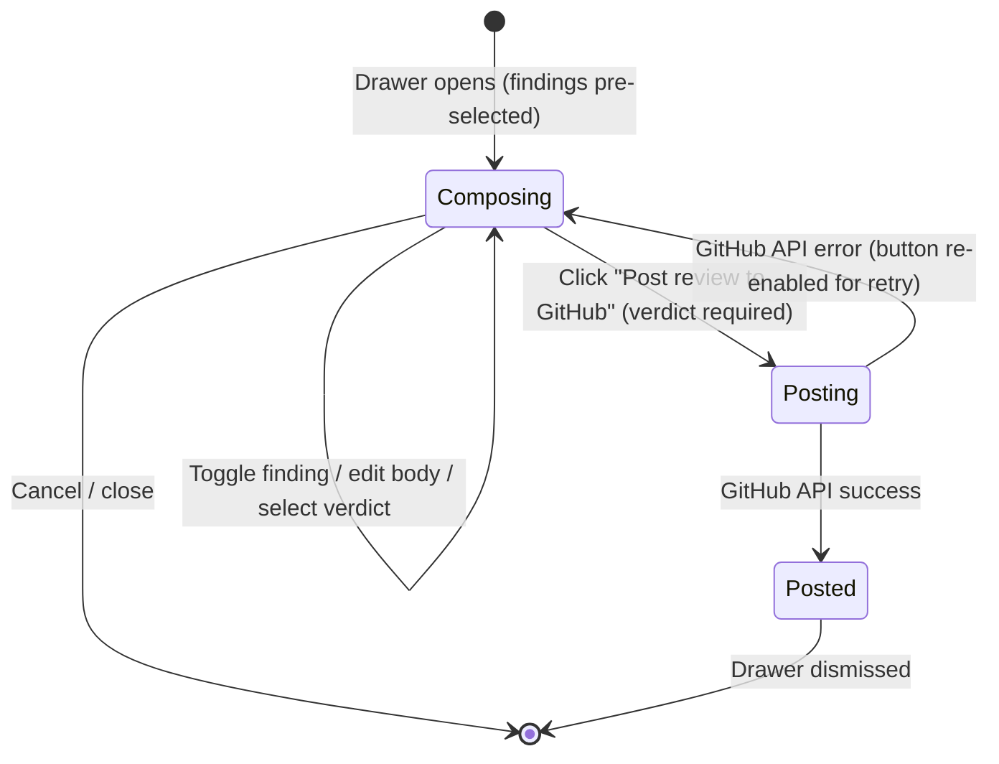

# Spec: Compose Review | Spec ID: SPEC-04 | Status: draft

## Problem and why

DevDigest AI agents surface real issues in PRs, but the user's considered judgment never reaches GitHub. After curating findings (accepting/dismissing), the reviewer must manually re-open GitHub and re-type the same concerns to post an actual PR review — two passes through the same information in two separate tools. The "Compose Review" drawer closes this gap: the user selects a verdict, writes a summary, picks the AI findings they want to surface, and posts a single GitHub PR review "as themselves" (using the workspace GitHub PAT). This is a human-curated, human-triggered action — distinct in every way from the AI agents' own automated commenting during a run.

---

## Goals / Non-goals

**Goals**

1. Add a "Compose review" button to the PR detail page header, next to the existing "Run Review ▾" dropdown, visible whenever a PR ID is resolved for the page.
2. A drawer that lets the user select a verdict (Approve / Comment / Request changes), write or edit a review body, and curate a subset of AI findings from all completed review runs on the PR.
3. Each selected finding becomes one inline comment in the GitHub review, anchored to that finding's file path and end line.
4. A server-side endpoint that resolves the PR, obtains the workspace GitHub client, calls `postReview`, and returns the GitHub review ID.
5. Success, posting, and error states fully described by the existing `compose.reviewDrawer` i18n strings.

**Non-goals**

- This is NOT the AI agents' automated commenting mechanism — agents post their own comments during run execution; Compose Review is separately initiated by a human.
- This is NOT part of the Multi-Agent Review "Where agents disagree" feature (SPEC-03 explicitly lists "Compose Review" as a non-goal of that spec).
- No persistence of the composed review to the local DevDigest database — GitHub is the sole source of truth for the submitted review.
- No editing or deleting a GitHub review after it has been posted.
- No draft save state — closing the drawer before posting discards the composition.
- No AI-generated review body — the review body is entirely user-authored.
- No standalone "Reply to finding" as part of this spec (that already exists separately via `replyToFinding`).

---

## User stories

- As a developer reviewing a PR, I want to select which AI findings I agree with and post them as a real GitHub PR review, so the PR author sees my consolidated verdict without me re-typing the issues from scratch.
- As a reviewer, I want to pick a verdict and write an overview before posting, so the GitHub review has a coherent human voice rather than just raw AI comments.
- As a reviewer, I want to start from a sensible default curation — accepted and non-dismissed findings pre-checked — and freely add or remove findings before posting, so I can exercise full judgment without clicking through every finding.
- As a reviewer, I want to know how many inline comments will be posted before I click "Post," so I'm not surprised by what appears on GitHub.

---

## Acceptance criteria (EARS)

**AC-1** The system shall display a "Compose review" button in the PR detail page header action area, next to the "Run Review ▾" dropdown, whenever a PR ID is resolved for that page.

**AC-2** WHEN the user clicks "Compose review," the system shall open a slide-over drawer with the heading "Compose Review" and the subheading "Post a GitHub review as yourself (PAT)."

**AC-3** The drawer shall display a verdict selector labeled "Verdict" with three choices — "Approve," "Comment," and "Request changes" — and no option pre-selected on first open.

**AC-4** The drawer shall display an editable text area labeled "Review body" annotated "markdown · editable," empty on first open.

**AC-5** WHEN the drawer opens, the system shall pre-select (check) all findings across all completed review runs for that PR where `accepted_at` is set and `dismissed_at` is null; all other findings shall be present in the list but not checked.

**AC-6** WHEN the user toggles an individual finding's checkbox in the drawer, the system shall add or remove that finding from the curated set; the inline comment counter shall update immediately to reflect the new count of selected findings.

**AC-7** The drawer shall display a live counter labeled "Inline comments" showing the count of currently selected findings, rendered as "# finding" (singular) or "# findings" (plural).

**AC-8** WHEN the user clicks "Post review to GitHub" with a verdict selected, the system shall disable the button and change its label to "Posting…" for the duration of the server request.

**AC-9** WHEN the server receives a compose-review request, the system shall post to GitHub a PR review containing: the selected verdict as the review event, the review body text, and one inline comment per selected finding anchored to that finding's file path and end line, whose body is composed as `**[{severity}] {title}**\n\n{content}` where `{content}` is `finding.suggestion` if present, otherwise `finding.rationale`.

**AC-10** WHEN the GitHub API call succeeds and returns a review ID, the system shall display the message "Review posted to GitHub · id {id}." where `{id}` is the returned review ID, and shall prevent re-submission from the same drawer session.

**AC-11** WHERE a selected finding's file-and-line combination falls outside the current PR diff, the system shall omit that finding's inline comment from the submitted review and still post the review with the remaining comments. IF one or more comments were omitted, THEN the success message shall report the omitted count (e.g. "Review posted to GitHub · id {id} · {count} comment(s) skipped (out of diff).") via a new i18n key; WHERE no comments were omitted, the existing "Review posted to GitHub · id {id}." message applies unchanged.

**AC-12** IF the workspace has no GitHub token configured, THEN the system shall return an error code `github_unavailable` and the client shall display a message directing the user to connect a GitHub token, without proceeding to post.

**AC-13** IF the GitHub API returns an error during review posting, THEN the system shall return an error code `github_review_failed`, the client shall display a user-facing error message, re-enable the "Post review to GitHub" button, and permit the user to retry or cancel.

**AC-14** WHEN the user clicks "Cancel," the system shall close the drawer and discard all unsaved composition state (verdict selection, body text, and checkbox changes).

**AC-15** The system shall accept and post a compose-review request where `finding_ids` is an empty array — a verdict plus review body with no inline comments — as a fully valid review submission, without any special warning or blocking.

---

## Edge cases

- **All findings dismissed or none accepted**: The drawer opens with zero findings pre-checked. The user can still post a body-only review (AC-15 applies) or manually check dismissed findings to include them.
- **No review runs on the PR yet**: The findings list is empty. The drawer renders with an empty list and allows posting a body-only review.
- **Findings from multiple agents and multiple runs mixed**: Findings from different `review_id`s (different agents or re-runs of the same agent) coexist in the drawer list. Each finding maps to its own `path`+`line` inline comment. No cross-finding deduplication is required — the user curates the set.
- **Two findings at the same file and line**: Both may be selected; GitHub allows multiple review comments at the same location. No deduplication is specified.
- **Finding from a previous run whose file is no longer in the diff**: AC-11 applies — the comment is omitted from the posted review, not the whole review.
- **Already-merged or closed PR**: The drawer is available (the existing stale banner already warns the user). GitHub accepts reviews on closed/merged PRs. No additional blocking beyond the existing banner.
- **Empty review body with a verdict selected**: Valid per GitHub's API. No warning or blocking.
- **Verdict not yet selected when "Post" is clicked**: The "Post review to GitHub" button shall remain disabled or display a validation message until a verdict is selected (AC-3 implies the user must choose).
- **Finding IDs that do not belong to this PR or workspace**: The server must reject them — see Untrusted inputs.
- **Review body exceeding GitHub's character limit**: GitHub silently truncates at 65,535 characters. Out of scope for v1 — no client-side length warning is specified.

---

## Non-functional

- **Security**: The workspace GitHub PAT is resolved server-side via `container.github()` and must never be transmitted to the client. Each `finding_id` in the request body must be verified server-side to belong to a finding scoped to the request's workspace and PR before its content is used in the GitHub API call.
- **Latency**: The `postReview` adapter call carries a 30-second timeout (matching the existing Octokit adapter constant). The "Posting…" state (AC-8) covers the wait; no additional timeout UI is required.
- **Accessibility**: The drawer must be keyboard-dismissible via the Escape key, and the verdict selector must be reachable via tab navigation, consistent with other drawer patterns in the application.

---

## Architecture & workflows

The drawer relies on findings already loaded into the TanStack Query cache from `GET /pulls/:id/reviews`, so opening it incurs no extra network request. The only new server round-trip is the compose-review submission.

```mermaid
sequenceDiagram
  participant U as User (browser)
  participant D as Compose Review Drawer (client)
  participant S as Server POST /pulls/:id/compose-review
  participant GH as GitHub API

  U->>D: Click "Compose review"
  D->>D: Open drawer; read findings from TanStack Query cache (GET /pulls/:id/reviews)
  D->>D: Pre-select findings where accepted_at≠null AND dismissed_at=null

  U->>D: Select verdict · edit body · toggle findings
  U->>D: Click "Post review to GitHub"
  D->>D: Disable button, show "Posting…"

  D->>S: POST /pulls/:id/compose-review<br/>{ verdict, body, finding_ids }
  S->>S: Resolve PR row → repo row (workspace-scoped)
  S->>S: Resolve finding rows for each finding_id (workspace + PR scope guard)
  S->>S: container.github() — missing token → github_unavailable (400)
  S->>GH: postReview({ event, body, comments:[{path, line, body}…] })
  alt success
    GH-->>S: { id: "9876543" }
    S-->>D: { github_review_id: "9876543" }
    D->>U: "Review posted to GitHub · id 9876543."
  else GitHub API error
    GH-->>S: 4xx / 5xx
    S-->>D: { error: "github_review_failed" }
    D->>U: Error message; re-enable "Post" button
  end
```

**Findings-curation state machine:**



---

## Service contracts

### New endpoint: POST /pulls/:id/compose-review

**Request body** (all fields required):

| Field | Type | Description |
|---|---|---|
| `verdict` | `"APPROVE" \| "COMMENT" \| "REQUEST_CHANGES"` | GitHub review event |
| `body` | `string` | Review body text (may be empty string) |
| `finding_ids` | `string[]` | IDs of findings to attach as inline comments (may be empty) |

**Response (HTTP 200):**

| Field | Type | Description |
|---|---|---|
| `github_review_id` | `string` | GitHub's numeric review ID, stringified |

**Error responses:**

| Error code | HTTP status | Condition |
|---|---|---|
| `github_unavailable` | 400 | No GitHub token configured in workspace secrets |
| `github_review_failed` | 400 | GitHub API call failed (network, permission, or 422) |
| Not found | 404 | The PR ID does not exist in this workspace |

**Server resolution flow:**
1. Resolve the PR row by `:id` + `workspaceId`.
2. Resolve the repo row from the PR.
3. For each `finding_id`, resolve the `FindingRecord` and assert it belongs to a review whose `pr_id` matches the request PR and whose workspace matches; reject unknown or out-of-scope IDs.
4. Call `container.github()` to get the GitHub client; surface `github_unavailable` if it throws.
5. Map `verdict` to GitHub event: `APPROVE` → `'APPROVE'`, `COMMENT` → `'COMMENT'`, `REQUEST_CHANGES` → `'REQUEST_CHANGES'`.
6. Build the `GitHubReviewPayload`: `{ body, event, comments: [{path, line, body}…] }` where `path` = `finding.file`, `line` = `finding.end_line`.
7. Call `postReview(repoRef, pr.number, payload)`; surface `github_review_failed` on any GitHub error.
8. Return `{ github_review_id: id }`.

**Verdict label-to-event mapping** (informational for client rendering):

| User-facing label (i18n) | API `verdict` field | GitHub event |
|---|---|---|
| "Approve" | `"APPROVE"` | `APPROVE` |
| "Comment" | `"COMMENT"` | `COMMENT` |
| "Request changes" | `"REQUEST_CHANGES"` | `REQUEST_CHANGES` |

### Shared Zod contract additions

A new `ComposeReviewBody` Zod schema must be added to the server vendor shared contracts and mirrored to the client vendor shared contracts. It captures the request body shape above. The response shape `{ github_review_id: z.string() }` is simple and may be defined alongside it or inline in the route.

---

## Inputs (provenance)

| Input | Source | Tag |
|---|---|---|
| PR internal ID (`:id`) | URL param from current page route (`/repos/[repoId]/pulls/[number]`) | [reused: URL routing] |
| Findings list for the PR | `GET /pulls/:id/reviews` → `ReviewRecord[].findings` (TanStack Query cache) | [reused: deterministic query — no LLM calls] |
| Verdict selection | User interaction with the selector in the drawer | [new: 0 LLM calls — user action] |
| Review body text | User-typed markdown in the drawer text area | [new: 0 LLM calls — user action] |
| Selected finding IDs | User-curated subset of already-fetched `FindingRecord` items | [reused: deterministic, derived from cache] |
| Finding `file`, `end_line`, `rationale`, `suggestion` | Already present in `FindingRecord` from the prior fetch | [reused: deterministic] |
| PR `head_sha` (commit anchor for inline comments) | PR row from the server database, resolved at service layer | [reused: deterministic] |
| GitHub PAT | `container.github()` → `~/.devdigest/secrets.json` | [reused: secrets layer — 0 LLM calls] |

---

## Untrusted inputs

- **`FindingRecord.rationale` and `FindingRecord.suggestion`**: LLM-generated text that flows into inline comment bodies posted to GitHub. Treat as opaque text data — pass to the GitHub API as strings, do not parse or execute.
- **User-typed review body**: User-authored markdown that reaches GitHub's API and is displayed to other GitHub users. No server-side sanitization beyond GitHub's own rendering is specified. The server must not eval or interpret this content.
- **`finding_ids` array in the request body**: User-supplied IDs. The server must verify each ID belongs to a finding scoped to the request's `workspaceId` and the target PR before reading that finding's content. An attacker supplying arbitrary finding IDs from a different workspace or PR must receive a 404, not a data leak.

---

## Traceability

| AC-N | Evidence |
|---|---|
| AC-1 | User requirement: "Trigger: a new 'Compose review' button on the PR detail page header, next to the existing 'Run Review ▾' dropdown"; `PrDetailHeader.tsx` `div style={s.actions}` contains the existing action buttons confirming placement context |
| AC-2 | `client/messages/en/compose.json:3-4` — `reviewDrawer.title` = "Compose Review", `reviewDrawer.subtitle` = "Post a GitHub review as yourself (PAT)" |
| AC-3 | `client/messages/en/compose.json:11-15` — `verdictLabel` and `verdicts.{approve,comment,requestChanges}`; task request: "verdict selector (Approve/Comment/Request changes)"; no default-verdict source confirmed by this spec — see [NEEDS CLARIFICATION] |
| AC-4 | `client/messages/en/compose.json:16-17` — `reviewBody` = "Review body", `markdownEditable` = "markdown · editable" |
| AC-5 | Task: "A sensible default is findings where `accepted_at` is set and `dismissed_at` is null"; `FindingRecord` schema at `server/src/vendor/shared/contracts/review-api.ts:15-19` confirms both fields exist |
| AC-6 | Task: "the user must be able to add/remove findings from the curated set before posting"; `FindingRecord.id` at `server/src/vendor/shared/contracts/findings.ts:48` is the stable per-finding key |
| AC-7 | `client/messages/en/compose.json:6,19` — `inlineComments` = "Inline comments", `findingsCount` = "{count, plural, one {# finding} other {# findings}}" |
| AC-8 | `client/messages/en/compose.json:8` — `posting` = "Posting…"; task: "posting state" disables the post button |
| AC-9 | `OctokitGitHubClient.postReview()` at `server/src/adapters/github/octokit.ts:139-164`; `GitHubReviewPayload` interface at `server/src/vendor/shared/adapters.ts:103-107` — `event`, `body`, `comments?: [{path, line, body}]` |
| AC-10 | `client/messages/en/compose.json:9` — `postedWithId` = "Review posted to GitHub · id {id}."; `postReview` returns `{ id: string }` at `octokit.ts:159` |
| AC-11 | GitHub API behavior: `POST .../reviews` with comments on lines outside the diff returns HTTP 422; `replyToFinding` error-wrapping pattern at `server/src/modules/reviews/service.ts:291-293` confirms the idiom for catching GitHub write failures |
| AC-12 | `replyToFinding` `github_unavailable` pattern at `server/src/modules/reviews/service.ts:267-272` — `container.github()` throws on missing token → `AppError('github_unavailable', ...)` |
| AC-13 | `replyToFinding` `github_comment_failed` pattern at `server/src/modules/reviews/service.ts:288-293` |
| AC-14 | `client/messages/en/compose.json:7` — `cancel` = "Cancel" |
| AC-15 | `GitHubReviewPayload.comments` is typed `?: { path: string; line: number; body: string }[]` (optional) at `server/src/vendor/shared/adapters.ts:106`; GitHub's API treats absent `comments` as a verdict-only review |

---

## Verification

| AC-N | Verification recipe |
|---|---|
| AC-1 | Navigate to any PR detail page with a resolved PR ID. Confirm a "Compose review" button is visible in the header action area alongside the "Run Review ▾" dropdown. Confirm the button is absent when the PR ID is not yet resolved. |
| AC-2 | Click "Compose review." Confirm a drawer opens with the heading "Compose Review" and the subheading "Post a GitHub review as yourself (PAT)." |
| AC-3 | With the drawer open, confirm a "Verdict" label and three options are visible: "Approve," "Comment," and "Request changes." Confirm none is selected on first open and the "Post review to GitHub" button is disabled while no verdict is selected. |
| AC-4 | Confirm an editable text area labeled "Review body" with the annotation "markdown · editable" is present and empty on first open. Type text; confirm it is retained until cancel or post. |
| AC-5 | On a PR with accepted (non-dismissed) findings AND dismissed findings AND findings with neither action: open the drawer. Confirm accepted/non-dismissed findings are pre-checked, dismissed findings are unchecked, and neutral findings are unchecked. |
| AC-6, AC-7 | Open the drawer; note the "Inline comments" count. Uncheck a pre-selected finding; confirm the count decrements by one. Check an unchecked finding; confirm the count increments by one. |
| AC-8 | Select a verdict and click "Post review to GitHub." Confirm the button label immediately changes to "Posting…" and the button is disabled during the pending request. |
| AC-9, AC-10 | With a valid GitHub PAT configured: select "Comment," type a body, select at least one finding, and post. On GitHub, confirm the PR shows a new "Comment" review with the typed body and an inline comment at the correct file and line. In the drawer, confirm "Review posted to GitHub · id {id}." appears with the real GitHub review ID. |
| AC-11 | Identify or engineer a finding whose `end_line` is on a file not changed in the current PR diff. Include that finding in the curated set and post. Confirm the review is posted successfully, that finding does not appear as an inline comment on GitHub, and the success message reports the count of included vs omitted comments. |
| AC-12 | Remove the GitHub token from Settings. Open the drawer, select a verdict, and click "Post review to GitHub." Confirm an error message prompts the user to connect a GitHub token and the post button is re-enabled without any GitHub API call succeeding. |
| AC-13 | With a GitHub token that lacks PR-write scope (or with a stubbed 500 error): attempt to post. Confirm a user-facing error message appears, the "Post review to GitHub" button is re-enabled, and no review appears on GitHub. |
| AC-14 | Open the drawer; select a verdict; type a body; toggle some findings. Click "Cancel." Confirm the drawer closes, the page shows no review posted, and re-opening the drawer starts fresh (no retained state). |
| AC-15 | Open the drawer; select a verdict; type a body; uncheck all findings (zero selected). Click "Post review to GitHub." Confirm the request succeeds, a review with the selected verdict and body but zero inline comments appears on GitHub, and the success message is shown. |

---

## Resolved decisions (previously NEEDS CLARIFICATION)

- **Default verdict selection:** Option A confirmed — no pre-fill. The verdict starts unset and the "Post review to GitHub" button stays disabled until the user explicitly picks one (AC-3 unchanged).
- **Inline comment body composition:** `finding.suggestion` if present, otherwise `finding.rationale`, prefixed with `**[{severity}] {title}**` for GitHub-side context (AC-9 updated above).
- **Out-of-diff comment handling granularity:** the success message must report the omitted count when non-zero, requiring a new i18n key (`postedWithOmissions`, alongside the existing `postedWithId`/`posted`) in `client/messages/en/compose.json` (AC-11 updated above). The check itself (pre-filter vs. catch-422) remains an implementation choice for `implementation-planner`.
