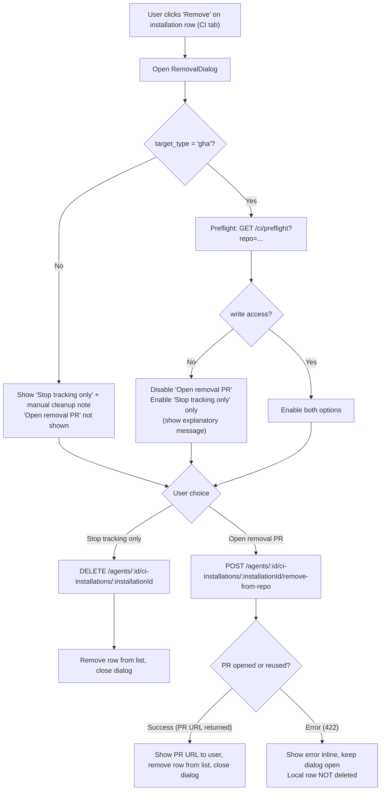
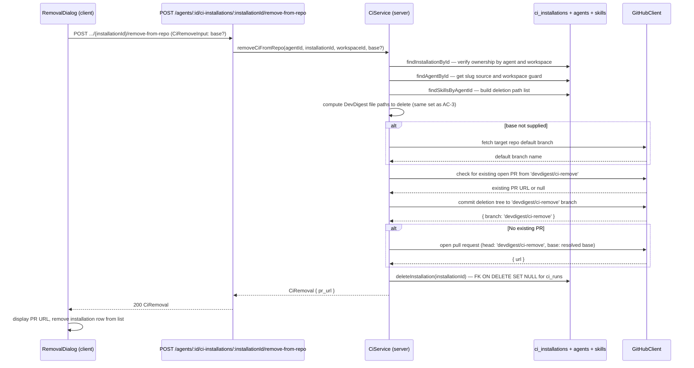

# Spec: Remove CI integration from target repository | Spec ID: SPEC-04 | Status: approved

## Problem and why

The existing "Remove" action for a CI installation (`DELETE /agents/:id/ci-installations/:installationId`) only deletes DevDigest's own tracking record (`ci_installations` row). The GitHub Actions workflow (`.github/workflows/devdigest-review.yml`) and all DevDigest config files (`.devdigest/**`) remain committed to the target repository after the user removes the installation in the DevDigest studio.

The practical consequence: the workflow keeps triggering on every pull request, consuming the user's GitHub Actions minutes and posting reviews, even though DevDigest no longer considers the integration active. The current confirm-dialog text in the CI tab acknowledges this explicitly ("This only removes DevDigest's record — the workflow file and secrets stay in the repo until you remove them there yourself"), but leaves cleanup entirely to the user.

The only recourse today is for users to manually navigate to the target repository, delete five DevDigest-managed files or directories, and handle any open `devdigest/ci` branch. This is error-prone, especially for users who do not know which exact files DevDigest committed.

This spec adds a "remove from repository" path that opens a human-reviewed deletion PR in the target repository — mirroring the add-flow's non-destructive, human-in-the-loop philosophy from SPEC-03, where the agent config is committed on a separate branch and merged only after human review.

---

## Goals / Non-goals

**Goals**

- Add a new server endpoint that constructs a deletion commit for all DevDigest-managed file paths in a target repository, commits it to a dedicated `devdigest/ci-remove` branch, opens a PR against the repository's default branch (or a caller-supplied base), deletes the local `ci_installations` row, and returns the PR URL.
- Surface a two-path confirmation dialog in the CI tab when the user clicks "Remove" on an installation: (a) "Open removal PR" — the repo-mutating primary path; (b) "Stop tracking only" — the local-record-only secondary escape hatch, preserving the current behavior for users without write access.
- Reuse the existing write-access preflight (`GET /ci/preflight`) to check whether the DevDigest token can write to the target repo before the user commits to the repo-mutating path.
- Preserve all `ci_runs` historical data after removal: existing behavior nulls `ci_installation_id` (FK ON DELETE SET NULL) rather than cascading the delete.

**Non-goals (v1)**

- **Auto-merging the removal PR.** The PR must be human-reviewed before merge, consistent with the add-flow.
- **Removing GitHub Actions secrets from the target repository.** GitHub's Secrets API requires admin scope not held by DevDigest's PAT. The wizard already informs users that secrets remain theirs to manage (SPEC-03 non-goals).
- **Removing GitHub branch protection rules or required status check registrations.** Out of scope, same as the add-flow.
- **Webhook- or poll-based detection of a merged removal PR.** The local record is deleted immediately when the removal PR is initiated (fire-and-forget). DevDigest does not poll for merge confirmation.
- **Bulk removal across all installations in a workspace.** One installation at a time.
- **Removal PRs for CircleCI, Jenkins, or CLI target types.** Non-GitHub-Actions installations must be cleaned up manually in the target CI system; only the "Stop tracking only" path is offered for those target types.
- **New `ci_installations` database columns.** The existing schema has everything needed; no migrations are required for this feature.

---

## User stories

- As an agent author, I want to click "Remove" on a CI installation and be shown two distinct options — "open a cleanup PR in the repo" and "stop tracking only" — so I understand clearly whether DevDigest will actually clean up the target repository or only stop recording CI runs locally.
- As an agent author, I want the "Open removal PR" path to verify whether DevDigest has write access to the target repo before I confirm, so I am not surprised by a failure after clicking.
- As an agent author, I want the removal PR to contain only the DevDigest-owned files as deletions, so I can review exactly what is being removed before merging and be confident nothing else in my repository is touched.
- As an agent author, I want my CI run history to remain visible in the CI Runs page after removing a CI installation, so I can still audit past automated reviews even after stopping the integration.

---

## Acceptance criteria (EARS)

**AC-1** WHEN the user clicks the "Remove" button on a CI installation row in the agent CI tab, the system shall display a modal confirmation dialog (not a browser-native `window.confirm`) that presents two named actions — "Open removal PR" (primary, repo-mutating) and "Stop tracking only" (secondary, local-only) — and describes the behavioral difference between them before any destructive action is taken.

**AC-2** WHEN the removal dialog is opened for a CI installation whose `target_type` is `gha`, the system shall perform a write-access preflight check against the target repository and: IF the check passes, enable the "Open removal PR" action; IF the check fails, disable the "Open removal PR" action and display an explanatory message directing the user to use "Stop tracking only" instead or to grant DevDigest write access to the repository.

**AC-3** WHEN the user confirms "Open removal PR" and the preflight has passed, the system shall commit a deletion of all DevDigest-managed paths (`.devdigest/agents/<slug>.yaml`, one `.devdigest/skills/<skill-slug>.md` per skill currently linked to the agent, `.devdigest/memory.jsonl`, `.devdigest/runner/index.js`, and `.github/workflows/devdigest-review.yml`) to a branch named `devdigest/ci-remove` on the target repository, then open a pull request targeting the repository's default branch (or the `base` value supplied in the request body).

**AC-4** IF a pull request from the `devdigest/ci-remove` branch is already open on the target repository, THEN the system shall update that branch with a new deletion commit and return the existing PR URL without opening a duplicate pull request.

**AC-5** WHEN the "Open removal PR" action completes successfully (PR URL returned), the system shall immediately delete the local `ci_installations` row for that installation. All `ci_runs` rows previously linked to that installation shall remain in the database with their `ci_installation_id` set to null, preserving historical run data.

**AC-6** WHEN the user selects "Stop tracking only" in the confirmation dialog and confirms, the system shall call the existing `DELETE /agents/:id/ci-installations/:installationId` endpoint (unchanged behavior), remove the installation row from the CI tab list, and close the dialog without making any GitHub API call.

**AC-7** IF the remove-from-repo endpoint is called with a `GITHUB_TOKEN` that lacks write access to the target repository (manifesting as a 403 from the GitHub API), THEN the system shall return a 422 response with an explanatory error message and SHALL NOT delete the local `ci_installations` row.

**AC-8** WHERE the CI installation's `target_type` is not `gha`, the system shall not offer the "Open removal PR" action in the removal dialog; only "Stop tracking only" shall be available, and the dialog shall display a note that non-GitHub-Actions CI systems must be cleaned up manually.

**AC-9** The system shall include in the deletion commit only the DevDigest-managed file paths listed in AC-3. No other files in the target repository shall be modified or deleted by the removal commit.

---

## Edge cases

Derived from reading the existing `commitFiles` implementation (octokit.ts), the `ci_installations` schema, and the SPEC-03 edge cases that the removal flow mirrors:

1. **Agent skills have changed since the original export.** The deletion path list is derived from the agent's current linked skill slugs at removal time, not from a stored snapshot of what was exported. Skills de-linked after the original export will not appear in the deletion PR (their `.devdigest/skills/<slug>.md` files remain in the repository). Skills newly linked after export but never committed will produce deletion entries for non-existent paths — the GitHub Trees API silently ignores deletion entries for paths that do not exist in the base tree. Users needing a complete cleanup should audit `.devdigest/skills/` manually after merging the PR.

2. **DevDigest-managed files have already been manually deleted from the repository's default branch.** Deletion tree entries for paths that do not exist are silently ignored by the GitHub Trees API. The removal PR may have an empty or reduced diff; it is still valid to merge.

3. **The `devdigest/ci-remove` branch already exists from a prior (now merged) cleanup PR.** `findOpenPr` returns null (no open PR). The system commits a new deletion tree to the existing branch and opens a fresh PR. This handles re-export followed by re-removal for the same repository.

4. **Multiple CI installations for the same agent targeting the same repository.** Each installation has a distinct `installationId`. Removing one installation opens its own removal PR and deletes its own `ci_installations` row. Other installations are unaffected; they retain their own rows and their `ci_runs` history.

5. **Preflight passes but the commit call receives a 403** (e.g., branch protection rules block force-push to `devdigest/ci-remove` between preflight and commit). The system surfaces a 422 response. The local `ci_installations` row is NOT deleted (AC-7 applies regardless of whether the 403 originates at preflight or at commit time).

6. **`ci_installations` row not found, or belongs to a different agent or workspace.** The endpoint returns 404 without making any GitHub API call.

7. **The removal PR is opened but the user never merges it.** The DevDigest local record is already deleted (AC-5). The unmerged PR remains in the target repository indefinitely. If the user re-runs "Add to CI" for the same repository, a new `ci_installations` row is upserted and files are committed via the `devdigest/ci` branch (distinct from `devdigest/ci-remove`). The stale removal PR will conflict with the new commit; the user should close it manually.

8. **Agent has zero linked skills.** The deletion path list contains only the four non-skill DevDigest paths (manifest YAML, memory file, runner binary, workflow YAML). The deletion commit is valid and the PR is opened normally.

---

## Non-functional

**Security**

- All GitHub API calls for the removal path use the DevDigest server's own PAT from `LocalSecretsProvider('GITHUB_TOKEN')` — the same credential as the add-flow. No user or repository secrets are used or exposed by this feature.
- The deletion commit paths are entirely server-constructed from trusted DB data (agent slug derived from DB-stored agent name, skill slugs from DB-stored skill names). No user-supplied path strings from the HTTP body reach the GitHub Trees API.
- The removal PR targets the `devdigest/ci-remove` branch, not the default branch directly. A human must review and merge — DevDigest never writes to the default branch without a PR intermediary, consistent with the add-flow invariant (SPEC-03).
- The `agentSlug()` derivation strips all non-`[a-z0-9-]` characters from agent and skill names before constructing any repository path, neutralizing path-separator injection even if DB content is unexpectedly malformed.

**Performance**

- The remove-from-repo endpoint shall complete its GitHub API interaction (deletion tree creation + PR open or PR URL return) within 30 seconds, consistent with the existing export-CI performance budget (SPEC-03 Non-functional → Performance).
- The write-access preflight reuses the existing `GET /ci/preflight` endpoint and its existing timeout budget.

**Accessibility**

- The removal confirmation dialog shall be implemented as a modal dialog (not a browser-native `window.confirm`) with a visible heading, clearly labelled primary and secondary action buttons, and keyboard-navigable focus management: focus is trapped within the dialog while it is open, and returns to the triggering "Remove" button when the dialog closes.
- The dialog shall be dismissible via the Escape key without taking any destructive action.

---

## Architecture & workflows

### Removal dialog — user decision flow

### Remove-from-repo server sequence

---

## Service contracts

### New endpoint: `POST /agents/:id/ci-installations/:installationId/remove-from-repo`

| Aspect | Detail |
|---|---|
| Auth | Workspace-scoped |
| Params | `id` — agent UUID; `installationId` — `ci_installations` UUID |
| Body | `CiRemoveInput`: `{ base?: string }` — optional base branch name; if omitted, the server fetches the target repository's default branch via the GitHub API |
| Response 200 | `CiRemoval`: `{ pr_url: string }` — URL of the opened or pre-existing removal PR |
| Response 404 | `ci_installations` row not found, or does not belong to the specified agent and workspace |
| Response 422 | `GITHUB_TOKEN` lacks write access to the target repository; the local `ci_installations` row is NOT deleted in this case |
| Side effects | Commits a deletion tree to a `devdigest/ci-remove` branch on the target repository; opens (or updates an existing) PR against the resolved base branch; deletes the `ci_installations` row; `ci_runs` rows have their `ci_installation_id` nulled (FK ON DELETE SET NULL — no `ci_runs` rows are deleted) |

### Existing endpoint (unchanged): `DELETE /agents/:id/ci-installations/:installationId`

No changes to this endpoint's behavior. It remains the "Stop tracking only" path: deletes the local `ci_installations` row and returns 204, with no GitHub API calls. The removal dialog's "Stop tracking only" action calls this endpoint.

### New shared Zod contracts

Two new contracts added to the shared contracts file and mirrored to the client vendor:

| Contract | Shape |
|---|---|
| `CiRemoveInput` | `{ base?: string }` — the optional base branch name for the deletion PR. Validated as a non-empty string when supplied; rejected with 422 if present but empty. |
| `CiRemoval` | `{ pr_url: string }` — the URL of the cleanup PR that was opened or whose existing URL was returned. |

### GitHub adapter interface extension

The GitHub adapter interface requires a new capability to commit file deletions (tree entries that mark existing paths as removed) rather than additions. The deletion payload specifies only the list of paths to delete and the branch/base; no file contents are involved. The exact method signature and payload shape are determined by the implementation planner; the behavior contract is captured in AC-3 and AC-9.

---

## Inputs (provenance)

| Input | Provenance tag | Notes |
|---|---|---|
| `agentId` route param | `[deterministic: route param, UUID-validated by request schema]` | Non-UUID values rejected 422 before handler runs |
| `installationId` route param | `[deterministic: route param, UUID-validated by request schema]` | Non-UUID values rejected 422 before handler runs |
| `CiRemoveInput.base` (optional body field) | `[new: user input, validated as non-empty string when supplied]` | If omitted, the server fetches the target repository's default branch via a GitHub API call |
| `installation.repo` (target repository reference) | `[reused: ci_installations row read from DB by installationId]` | DB-sourced; trusted |
| Agent `name` (source of slug) | `[reused: agents row read from DB by agentId]` | Used to derive the `.devdigest/agents/<slug>.yaml` deletion path |
| Linked skill names (sources of skill slugs) | `[reused: skills + agent_skills JOIN from DB by agentId]` | Used to derive `.devdigest/skills/<slug>.md` deletion paths |
| `GITHUB_TOKEN` | `[reused: LocalSecretsProvider('GITHUB_TOKEN') from ~/.devdigest/secrets.json]` | DevDigest studio's own PAT — same credential as the add-flow (SPEC-03) |
| Target repository default branch | `[new: 1 GitHub API call per remove-from-repo request when base is not supplied]` | Fetched via `repos.get()` on the target repository; only consumed as the PR base branch name |

---

## Untrusted inputs

| Untrusted input | Risk | Mitigation |
|---|---|---|
| `CiRemoveInput.base` (user-supplied base branch name) | A crafted branch name could attempt to target unexpected refs in the GitHub API | Validated at the route boundary as a non-empty string; passed as a branch name only to the PR open call, which rejects invalid refs at the GitHub API level; the resulting 4xx is mapped to a 422 response by the service |
| Agent `name` and skill `name` fields (DB-sourced, used to construct deletion paths) | DB content is server-controlled and trusted; however, a name with path-separator characters could attempt path traversal in the constructed repo paths | `agentSlug()` strips all characters outside `[a-z0-9-]` — including `/` and `\` — before any path is constructed, making the resulting paths safe regardless of DB content |

---

## Traceability

| AC-N | Evidence |
|---|---|
| AC-1 | `client/src/app/agents/[id]/_components/AgentEditor/_components/CiTab/CiTab.tsx:47-51` (existing `window.confirm` and `removeInstallation.mutate` — the surface being enhanced); `client/messages/en/agents.json` (`ci.removeConfirm` key — text documents the current local-only behavior); user requirement: "with proper confirmation UX since this is now a repo-mutating action, not just a local DB delete" |
| AC-2 | `server/src/modules/ci/service.ts:193-200` (`checkWriteAccess` — existing preflight, reused); `server/src/modules/ci/routes.ts:138-149` (`GET /ci/preflight` — existing route, reused); SPEC-03 AC-22 (preflight pattern precedent) |
| AC-3 | `server/src/adapters/github/octokit.ts:268-334` (`commitFiles` using Git Trees API with `base_tree` — file deletion requires analogous tree entries with null SHA, same API family); `server/src/adapters/github/octokit.ts:249-266` (`openPullRequest` — reused); `server/src/modules/ci/helpers.ts:150-193` (`buildCiBundle` — canonical list of five DevDigest file-path categories being mirrored as deletions); user requirement: "the existing add-flow uses 'open a PR, human reviews and merges' rather than committing directly to the default branch" |
| AC-4 | `server/src/adapters/github/octokit.ts:336-353` (`findOpenPr` — reused, same logic as SPEC-03 AC-3); SPEC-03 edge case 1 (existing PR detection and reuse precedent) |
| AC-5 | `server/src/modules/ci/repository.ts:148-155` (`deleteInstallation` with explicit FK ON DELETE SET NULL comment — same method reused by the new removal path); `server/src/modules/ci/service.ts:245-259` (`removeCiInstallation` — existing local-only removal, extended by this spec) |
| AC-6 | `server/src/modules/ci/routes.ts:79-87` (`DELETE /agents/:id/ci-installations/:installationId` — unchanged endpoint); `client/src/app/agents/[id]/_components/AgentEditor/_components/CiTab/CiTab.tsx:47-51` (`handleRemove` calling `removeInstallation.mutate` — the call this dialog path preserves) |
| AC-7 | `server/src/modules/ci/service.ts:147-155` (403 → `ValidationError(422)` pattern in `exportCi` — same pattern applied to removal); `server/src/adapters/github/octokit.ts:450-460` (`checkWriteAccess` — referenced as preflight in AC-2, but the 403 guard at commit time is the AC-7 case) |
| AC-8 | `server/src/vendor/shared/contracts/eval-ci.ts:158-159` (`CiTarget` enum: `gha | circle | jenkins | cli`); SPEC-03 AC-7 (non-GHA targets offer ZIP-only path in the add-flow — analogous restriction for removal) |
| AC-9 | `server/src/modules/ci/helpers.ts:150-193` (`buildCiBundle` defines exactly five path categories — the deletion list is derived from and limited to these same paths); user requirement: "the DevDigest-owned files... not touching anything else in the target repository" |

---

## Verification

| AC-N | Verification recipe |
|---|---|
| AC-1 | On the CI tab with at least one active GHA installation, click the "Remove" button. Verify that a modal dialog appears (not a browser native alert). Verify the dialog contains both a primary "Open removal PR" action and a secondary "Stop tracking only" action, and that each action's behavioral scope is described in the dialog body before any button is clicked. |
| AC-2 | Open the removal dialog for a GHA installation targeting a repository where the DevDigest token has no write access. Verify "Open removal PR" is disabled. Verify "Stop tracking only" remains enabled. Verify an explanatory message about write access is visible. Repeat with a repository where the token has write access — verify "Open removal PR" is now enabled. |
| AC-3 | For a GHA installation in a repo with write access, click "Open removal PR" and confirm. After the action completes, navigate to the target repository on GitHub and verify: (a) a PR exists from branch `devdigest/ci-remove` targeting the repository's default branch; (b) the PR's diff shows deletions of `.devdigest/agents/<slug>.yaml`, `.devdigest/memory.jsonl`, `.devdigest/runner/index.js`, `.github/workflows/devdigest-review.yml`, and one `.devdigest/skills/<slug>.md` per skill currently linked to the agent. |
| AC-4 | With an open removal PR already present on the target repository, call the remove-from-repo endpoint a second time. Verify the response returns the same PR URL as before. Navigate to the repository and confirm only one PR from `devdigest/ci-remove` is open. |
| AC-5 | After a successful "Open removal PR" action, query the database: verify the `ci_installations` row for that installation is absent. Verify that all previously-linked `ci_runs` rows still exist with `ci_installation_id = null`. Verify the CI tab no longer shows the removed installation. |
| AC-6 | Open the removal dialog, select "Stop tracking only", and confirm. Verify that `DELETE /agents/:id/ci-installations/:installationId` is called and returns 204. Verify the installation row disappears from the CI tab. Verify no GitHub API calls were made (no new branch or PR appears in the target repository). |
| AC-7 | Call `POST /agents/:id/ci-installations/:installationId/remove-from-repo` with a `GITHUB_TOKEN` that has no write access to the target repository. Verify the HTTP response status is 422 and the body contains an error message. Verify the `ci_installations` row is still present in the database. |
| AC-8 | For a CI installation with `target_type = 'circle'`, open the removal dialog. Verify "Open removal PR" is not present in the dialog. Verify only "Stop tracking only" is available. Verify a note about manual cleanup of the CircleCI (or other non-GHA) system is displayed. |
| AC-9 | After the removal PR is created, inspect the PR's file changes on GitHub. Verify that no files outside the known DevDigest paths (`.devdigest/` directory and `.github/workflows/devdigest-review.yml`) appear in the diff as modified or deleted. |

---

## Resolved product decisions

The three open questions below were resolved with the product owner before implementation began; all three took the spec's recommended default.

1. **Dialog shape vs. separate buttons — RESOLVED: shared dialog.** The removal dialog is a single modal (AC-1) with two named actions, "Open removal PR" (primary) and "Stop tracking only" (secondary), not two separate row buttons.

2. **Base branch auto-detect vs. user-supplied — RESOLVED: auto-detect.** `CiRemoveInput.base` stays optional; the server fetches the target repository's default branch via a GitHub API call when it is omitted (AC-3, service contracts). No base-branch input field is added to the dialog.

3. **Skill-mismatch cleanup warning — RESOLVED: include it.** The removal dialog includes a small inline note that skills unlinked from the agent since the original export will not appear in the deletion PR, and directs the user to audit `.devdigest/skills/` manually if needed (extends edge case 1's UX coverage).
