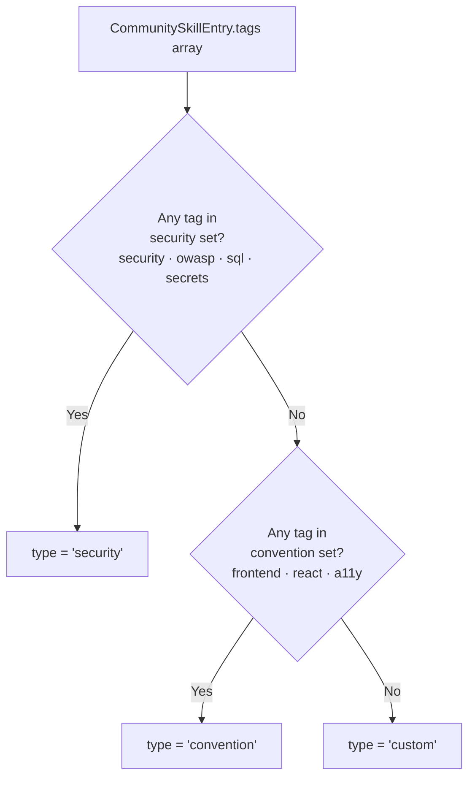
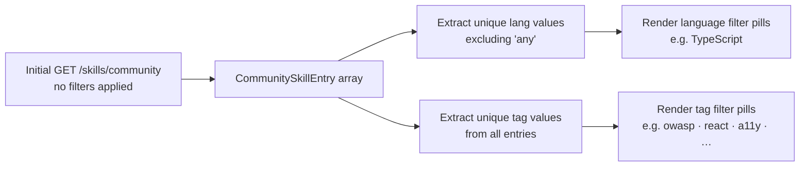

# Spec: Community Skill Import (fix + polish) | Spec ID: SPEC-05 | Status: draft
<!-- All open questions resolved 2026-07-16. Ready for approval. -->

## Problem and why

The community catalog import path has three distinct gaps that together break the core promise of the "Community" tab in the Skills import drawer:

1. **Source mis-tag.** When the user clicks "Import" on a community catalog entry the resulting skill is persisted with `source = 'imported_url'` instead of `source = 'community'`. The `community` value already exists in the `SkillSource` Zod enum and in the DB schema's `source` column — it is simply never written because the client hardcodes `'imported_url'` in the save payload regardless of the import path. The consequence is that workspace analytics, future source-based filtering, and any community-specific behaviour (e.g. update checking) cannot distinguish community-imported skills from URL-imported ones.

2. **Metadata discarded.** When the community entry is handed off to the shared import form, only the entry's `name` and `body` are forwarded. The entry's real `description` is dropped and the description field falls back to the skill's name as a placeholder. The skill `type` is also not derived from the entry's tags — it defaults to `custom` for every community import, regardless of what the tags indicate. The catalog's `CommunitySkillEntry` already carries a `description` field and a `tags` array specifically for this purpose.

3. **Filters don't match data.** The Community tab presents static language pills (`TypeScript / Python / Go / Rust`) and tag pills (`security / performance / style / test`). The actual curated catalog (10 entries) contains only two language values (`TypeScript` and `any`) and tags such as `owasp`, `react`, `a11y`, `secrets`, `sql`, `cleanup`, `dx`, `api`, `contracts`, `database`, `drizzle`, `typescript`, `safety`, `testing`, `quality`. Selecting `Python`, `Go`, `Rust`, `performance`, `style`, or `test` always returns an empty result set, making those filter pills non-functional and confusing.

---

## Goals / Non-goals

**Goals**

1. A community catalog entry imported by the user is created with `source = 'community'`, not `source = 'imported_url'`.
2. The saved skill's `description` is populated from the catalog entry's `description` field, pre-filled in the import form for the user to review before saving.
3. The saved skill's `type` is derived from the catalog entry's `tags` using the deterministic heuristic specified in AC-3; the derived value is pre-selected in the import form.
4. The saved skill's `body` is the catalog entry's `body` after the existing server-side sanitize step, with no other transformation applied.
5. The language and tag filter pills in the Community tab are derived exclusively from values present in the curated catalog, so no offered filter value can produce an empty result set.
6. Selecting a language filter returns catalog entries whose `lang` matches that language, plus entries with `lang = 'any'` (consistent with the existing server-side filtering logic).

**Non-goals**

- No live GitHub/gist search — the catalog remains curated and in-app. The existing "From URL" import path is completely unchanged.
- No DB schema change or migration. The skills table `source` column already carries `'community'` in its enum. The catalog's `repo`, `stars`, and `tags` fields are display-only in the Community tab browse UI — they are not persisted onto the saved skill record.
- No change to the "From file" or "From URL" import path behaviour. Their save calls continue to pass `source: 'imported_url'`.
- No change to the `COMMUNITY_CATALOG` content, its search algorithm, or the `GET /skills/community` endpoint contract.
- No automatic re-syncing of already-imported community skills when the catalog changes.
- No persistence of `stars`, `repo`, or `tags` fields from the catalog entry into the skills table.

---

## User stories

- As a developer, I want to import a security skill from the community catalog and have it correctly tagged as community-sourced, so I can distinguish it from skills I imported myself via a URL.
- As a developer, I want the description of an imported community skill to be the catalog's authoritative description pre-filled for me, so I don't have to type it manually or accept the skill name as a placeholder.
- As a developer, I want the skill type to be pre-inferred from the catalog entry's tags when I import a community skill, so I get a sensible starting point without having to know the type taxonomy myself.
- As a developer browsing the Community tab, I want the language and tag filter pills to show only values I can actually filter by, so I never click a pill and get an empty list.
- As a developer, I want imported community skills to show a "needs vetting" indicator in the skills list until I enable them, so I know which skills still need review before use.

---

## Acceptance criteria (EARS)

**AC-1** WHEN the user confirms the import of a community catalog entry, the system shall persist the resulting skill with `source = 'community'` — not `source = 'imported_url'`.

**AC-2** WHEN the user confirms the import of a community catalog entry, the system shall pre-fill the import form's description field with the catalog entry's `description` value; the description persisted in the saved skill shall equal that catalog description (unless the user edits it before confirming).

**AC-3** WHEN a community catalog entry is imported, the system shall derive the skill's `type` from the entry's `tags` using the following precedence-ordered heuristic and pre-select it in the import form: IF any tag is one of `security`, `owasp`, `sql`, or `secrets`, THEN `type = 'security'`; ELSE IF any tag is one of `frontend`, `react`, or `a11y`, THEN `type = 'convention'`; ELSE `type = 'custom'`. The heuristic shall never produce `type = 'rubric'` — that type is reserved for manually authored skills. Tags not in either trigger set (including `safety`, `cleanup`, `dx`, `api`, `contracts`, `database`, `drizzle`, `typescript`, `testing`, `quality`) always resolve to `custom`.

**AC-4** WHEN the user confirms the import of a community catalog entry, the system shall persist as the skill body the catalog entry's `body` after the existing server-side sanitize step; no other transformation shall be applied to the body content.

**AC-5** The system shall save every community-catalog import with `enabled = false`, so that the skill is inactive until a user explicitly enables it via the toggle.

**AC-6** WHILE a skill whose `source` is not `'manual'` has `enabled = false`, the system shall display a "needs vetting" affordance on the skill card in the skills list.

**AC-7** WHEN the Community tab renders its filter pills, the system shall derive the offered language pills and tag pills exclusively from values present in the curated catalog, such that selecting any offered language or tag filter value returns at least one catalog entry.

**AC-8** WHEN the user selects a language filter pill in the Community tab, the system shall display all catalog entries whose `lang` equals the selected value AND all entries whose `lang = 'any'`, and shall hide all other entries.

**AC-9** WHEN the user selects a tag filter pill in the Community tab, the system shall display only catalog entries whose `tags` array includes the selected tag value, and shall hide all other entries.

---

## Edge cases

Derived from reading the catalog content, the existing filtering logic, and the import route code.

1. **Tag heuristic with no matching category.** Ten of the current catalog tags (`cleanup`, `dx`, `api`, `contracts`, `database`, `drizzle`, `typescript`, `safety`, `testing`, `quality`) do not match any security or convention trigger. These entries default to `type = 'custom'`. See the `[NEEDS CLARIFICATION]` section for the open question about the `safety` tag.

2. **Catalog entries with `lang = 'any'`.** Five entries have `lang = 'any'`. These appear under every language filter selection (including `TypeScript`) because the server's filtering logic includes `lang = 'any'` entries whenever a specific language filter is active. The language filter pills should list only the non-`any` language values present in the catalog (currently `TypeScript`), since `any` is a catalog metadata value indicating language-agnostic entries — not a user-selectable filter pill.

3. **Name collision with existing skill.** The `skills` table enforces a unique index on `(workspace_id, name)`. If a user imports a community catalog entry whose name already exists in their workspace, the server returns a constraint error. The client must surface a clear error message rather than leaving the user on a spinning pending state.

4. **User edits description or type before saving.** The description and type values are pre-filled from the catalog entry but the user may change them in the import form before confirming. AC-2 and AC-3 require the pre-fill to be the catalog values; what the user ultimately saves overrides them. This is expected and correct behaviour.

5. **Catalog body already sanitize-clean.** The catalog bodies are handcrafted markdown with no `<script>` or `<style>` blocks, so the sanitize step is effectively a no-op against current catalog content. The step must still execute for defensive correctness in case catalog contents ever change.

6. **Active filter state when "Import" is clicked.** If the user has selected a language or tag filter pill and then clicks "Import" on a visible entry, the import flow proceeds normally. The filter state is local to the Community tab browse UI only; it does not affect what is saved.

7. **Heuristic precedence for mixed tag sets.** If a future catalog entry has tags spanning both the security and convention sets (e.g., `['security', 'react']`), `security` wins by the precedence order in AC-3. No current catalog entry has this combination.

---

## Non-functional

**Security**

The catalog `body` and `description` fields are treated as untrusted input — see Untrusted inputs. The existing server-side sanitize step strips `<script>` and `<style>` blocks and must be applied before persisting the body. The description is rendered as escaped text in the UI and stored as a plain text database column; it is never injected into LLM prompts as an instruction.

No new network-callable surfaces are introduced for this fix. The existing SSRF posture for the "From URL" import path (strict host allowlist, redirect-error policy, size cap, AbortSignal timeout) is unchanged and does not apply to community catalog imports, which come from the in-app hardcoded constant, not a network request.

**Performance**

Deriving filter facets from the catalog must not incur additional network round-trips beyond the existing `GET /skills/community` call already present in the Community tab. No new background fetches, polling, or pre-loading is introduced.

**Accessibility**

None — the "needs vetting" badge (AC-6) already has a `title` attribute for hover text. A pre-existing gap is that no accessible text accompanies the badge for screen-reader users who cannot hover; remediation of this gap is out of scope for this spec.

---

## Architecture & workflows

### Community import: corrected end-to-end flow

```mermaid
sequenceDiagram
  participant U as User (Community tab)
  participant CT as Community Tab (client)
  participant CQ as GET /skills/community
  participant IF as Import form (client)
  participant IS as POST /skills/import/save (server)
  participant DB as skills table

  U->>CT: Opens Community tab
  CT->>CQ: GET /skills/community (no filters)
  CQ-->>CT: CommunitySkillEntry[] (all catalog entries)
  CT->>CT: Derives language pills from unique non-'any' lang values
  CT->>CT: Derives tag pills from unique tag values

  U->>CT: Selects a language or tag filter pill
  CT->>CQ: GET /skills/community?lang=X or ?tag=Y
  CQ-->>CT: Filtered CommunitySkillEntry[]

  U->>CT: Clicks "Import" on a catalog entry
  CT->>IF: Pre-fills name=entry.name,\ndescription=entry.description,\ntype=derived from entry.tags,\nbody=entry.body

  U->>IF: Reviews; optionally edits name/description/type
  U->>IF: Confirms import

  IF->>IS: POST /skills/import/save\n{ name, description, type, body, source='community' }
  IS->>IS: Sanitize step on body
  IS->>DB: INSERT skill (source='community', enabled=false,\ndescription=catalog description, type=derived type)
  IS-->>IF: Skill record (enabled=false, source='community')
  IF->>U: Drawer closes; skills list refreshes;\nnew skill shows "needs vetting" badge
```

### Tag-to-type derivation



### Filter pill derivation



---

## Service contracts

No new API endpoints are introduced by this spec. The existing endpoints are unchanged in their request/response shapes; only the values the client sends change.

### Existing endpoints (no contract change)

**`GET /skills/community`** — accepts `q`, `lang`, `tag` query parameters; returns `CommunitySkillEntry[]`. Response contract: `{ name, repo, stars, lang, description, tags, body }` per entry. No change. The server's language filter logic already includes `lang = 'any'` entries when filtering by a specific language.

**`POST /skills/import/save`** — accepts `{ name, description, type, body, source }` where `source` is already typed as `'imported_url' | 'community'`. No schema change. The server already enforces `enabled: false` and applies the sanitize step to the body regardless of client input. The client must begin sending `source = 'community'` for catalog imports rather than the currently hardcoded `'imported_url'`.

### Shared Zod contracts (no change)

`CommunitySkillEntry` — already present in the shared vendor contracts with fields `name`, `repo`, `stars`, `lang`, `description`, `tags`, `body`. No new fields are needed.

`SkillSource` — already includes `'community'`. No change.

`SkillType` — already includes `'security'`, `'convention'`, `'custom'`, `'rubric'`. No change.

---

## Inputs (provenance)

| Input | Source | Provenance tag |
|---|---|---|
| `COMMUNITY_CATALOG` (10 entries) | Hardcoded constant in the server skills module | [deterministic: in-app curated constant, zero LLM calls, no external network request] |
| `GET /skills/community` response | Filtered view of the catalog constant via the search function | [deterministic: pure function over the hardcoded constant, no LLM call] |
| Derived filter facets (language pills, tag pills) | Extracted from the initial no-filter `GET /skills/community` response | [deterministic: derived from catalog constant, zero LLM calls] |
| `entry.description` (pre-filled description) | `CommunitySkillEntry.description` field from the catalog constant | [deterministic: hardcoded catalog field] |
| `entry.tags` (for type derivation) | `CommunitySkillEntry.tags[]` field from the catalog constant | [deterministic: hardcoded catalog field] |
| `entry.body` (skill body) | `CommunitySkillEntry.body` field from the catalog constant | [deterministic: hardcoded catalog field; sanitized at server ingest via existing step] |
| User-edited name, description, type | User interaction in the import form before confirming | [new: 0 LLM calls — user action, overrides catalog pre-fill values] |

---

## Untrusted inputs

| Untrusted input | Risk | Mitigation |
|---|---|---|
| `CommunitySkillEntry.body` (catalog markdown body) | Catalog entries are hardcoded and in-app, but the body is ultimately injected into LLM prompts as data; future catalog contributors could introduce adversarial prompt-injection fragments or script tags. | The existing server-side sanitize step strips `<script>` and `<style>` blocks at ingest. The body is stored as a plain-text DB column and passed to the LLM as delimiter-wrapped data, never as an instruction. No executable content is introduced into prompt context. |
| `CommunitySkillEntry.description` | Rendered in the UI as editable text and persisted as-is; could contain XSS-like fragments if the catalog is ever modified by a contributor. | Description is rendered as escaped text in all UI surfaces (never via direct HTML injection). It is stored as a plain-text DB column and is not injected into LLM prompts. |
| User-provided overrides to name, description, type before save | User-authored text that reaches the DB via `POST /skills/import/save`. | Already validated by the existing route Zod schema: `name` and `description` are `z.string().min(1)`; `type` is constrained to the `SkillType` enum. |

---

## Traceability

| AC-N | Evidence |
|---|---|
| AC-1 | `client/src/app/skills/_components/ImportDrawer/ImportDrawer.tsx:111` — `source: "imported_url"` hardcoded in `handleSave`; `server/src/modules/skills/routes.ts:79` — `ImportSaveBody` already accepts `z.enum(['imported_url', 'community'])`; `server/src/db/schema/skills.ts:15-17` — `source` column enum already includes `'community'`; `server/src/vendor/shared/contracts/knowledge.ts:205` — `SkillSource` already includes `'community'` |
| AC-2 | `client/src/app/skills/_components/ImportDrawer/ImportDrawer.tsx:43-47` — `handleCommunityImport(name, body)` passes only name and body, drops `entry.description`; `client/src/app/skills/_components/ImportDrawer/ImportDrawer.tsx:107-108` — description initialized as `""` then falls back to `preview.name` (the skill name); `server/src/vendor/shared/contracts/knowledge.ts:324` — `CommunitySkillEntry.description: z.string()` field exists and is populated in all 10 catalog entries |
| AC-3 | `client/src/app/skills/_components/ImportDrawer/ImportDrawer.tsx:43-47` — `handleCommunityImport` does not pass `entry.tags`; `client/src/app/skills/_components/ImportDrawer/ImportDrawer.tsx:98` — type initialized as `"custom"` with no derivation; `server/src/vendor/shared/contracts/knowledge.ts:327` — `CommunitySkillEntry.tags: z.array(z.string())`; `server/src/modules/skills/community-catalog.ts:4-234` — actual tag values in catalog confirm which tags exist; user requirement: "type is derived from the catalog entry's tags with a sensible heuristic" |
| AC-4 | `server/src/modules/skills/routes.ts:100-104` — sanitize step defined: strips `<script>` and `<style>` blocks; `server/src/modules/skills/routes.ts:267-277` — `POST /skills/import/save` applies the sanitize step to the body before inserting, `enabled: false` hardcoded; user requirement: "The saved skill body equals the catalog entry's body unchanged after the existing sanitize step" |
| AC-5 | `server/src/modules/skills/routes.ts:274` — `enabled: false` is hardcoded in the save handler, server-enforced regardless of client payload; user requirement: "imported skills are saved disabled until vetted" |
| AC-6 | `client/src/app/skills/_components/SkillsListView/SkillCard.tsx:111-124` — `!skill.enabled && skill.source !== 'manual'` renders the badge; `client/messages/en/skills.json:79-80` — `listItem.needsVetting = "needs vetting"`, `listItem.vettingTitle = "Untrusted source — vet before enabling"` |
| AC-7 | `client/src/app/skills/_components/ImportDrawer/ImportDrawer.tsx:389` — `LANG_FILTERS` hardcodes `["All","TypeScript","Python","Go","Rust"]`; `client/src/app/skills/_components/ImportDrawer/ImportDrawer.tsx:390` — `TAG_FILTERS` hardcodes `["All","security","performance","style","test"]`; `server/src/modules/skills/community-catalog.ts:4-234` — actual catalog has only `TypeScript` and `any` for languages, and tags `security`, `owasp`, `frontend`, `react`, `sql`, `a11y`, `cleanup`, `dx`, `api`, `contracts`, `database`, `drizzle`, `secrets`, `typescript`, `safety`, `testing`, `quality`; user requirement: "no offered filter value can ever yield an empty result set by construction" |
| AC-8 | `server/src/modules/skills/community-catalog.ts:254-257` — server filtering logic includes `lang = 'any'` entries when any specific language filter is active; user requirement: "Selecting a language filter returns only entries matching that facet" |
| AC-9 | `server/src/modules/skills/community-catalog.ts:259-261` — tag filter: `results.filter((s) => s.tags.includes(tag))`; user requirement: "Selecting a language or tag filter returns only entries matching that facet" |

---

## Verification

| AC-N | Verification recipe |
|---|---|
| AC-1 | Import any community catalog entry through the Community tab. After the drawer closes, open the skill's detail view or query the skills list; confirm `source = 'community'`. Also import a skill via the "From URL" tab; confirm it still shows `source = 'imported_url'`. |
| AC-2 | Import the `owasp-top-10-review` entry. Confirm the description in the saved skill equals "Maps diff changes to the OWASP Top 10 with CWE references." — not "owasp-top-10-review" (the name). |
| AC-3 | (a) Import `owasp-top-10-review` (tags: `security`, `owasp`); confirm saved `type = 'security'`. (b) Import `react-hooks-rules` (tags: `frontend`, `react`); confirm saved `type = 'convention'`. (c) Import `no-console-log` (tags: `cleanup`, `dx`); confirm saved `type = 'custom'`. (d) Confirm the import form pre-selects the correct type before the user clicks save (not after). |
| AC-4 | Import `owasp-top-10-review`. Open the skill detail preview and confirm the body is identical to the catalog entry's `body` field — no content added, removed, or transformed beyond any script/style stripping (the current catalog has none). |
| AC-5 | After importing any community catalog entry, confirm the skill card in the list shows the toggle in the off/disabled state before the user takes any action. Enable it via the toggle; confirm it becomes active. |
| AC-6 | After importing a community catalog entry (enabled=false, source='community'), confirm the skill card shows the "needs vetting" badge. Enable the skill; confirm the badge disappears. Disable it again; confirm the badge reappears. Create a manual skill and disable it; confirm the badge does NOT appear (source = 'manual' is excluded). |
| AC-7 | Open the Community tab. Inspect all rendered filter pills. Confirm: (a) no `Python`, `Go`, or `Rust` pills appear; (b) no `performance`, `style`, or `test` pills appear; (c) clicking every offered pill returns at least one result; (d) `any` does not appear as a language pill. |
| AC-8 | Click the `TypeScript` language pill. Confirm all 10 catalog entries appear (5 TypeScript + 5 `any`-language entries). If the catalog has only one non-`any` language (`TypeScript`), all entries satisfy the filter. Reset to "All"; confirm all 10 entries appear. |
| AC-9 | Click the `owasp` tag pill; confirm only `owasp-top-10-review` appears. Click `security`; confirm `owasp-top-10-review`, `sql-injection-gate`, and `secret-leakage-gate` appear. Click `react`; confirm only `react-hooks-rules` appears. |

