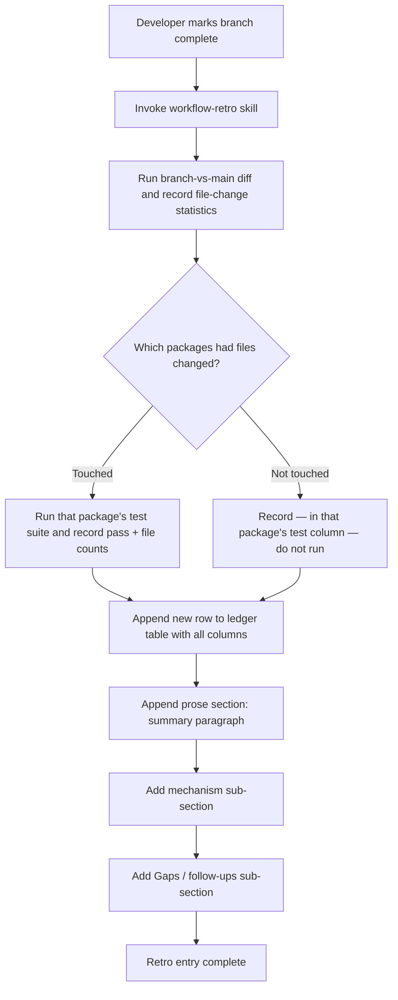
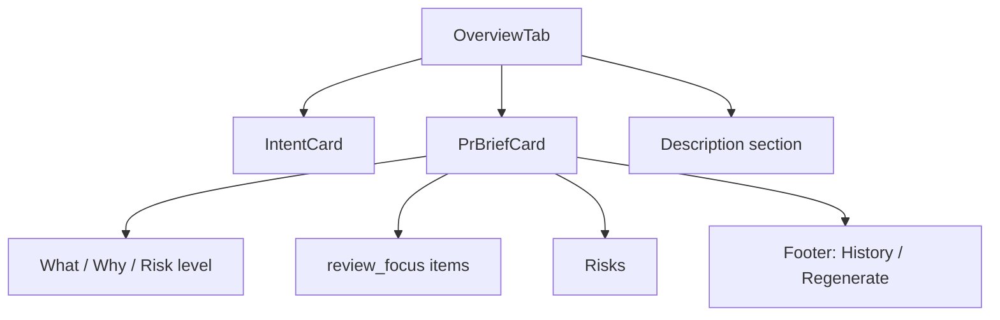
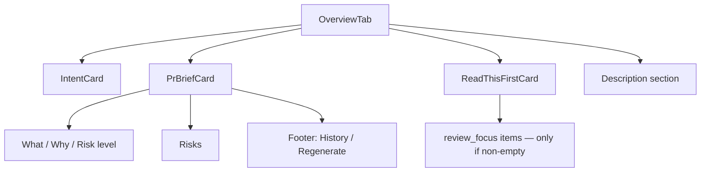
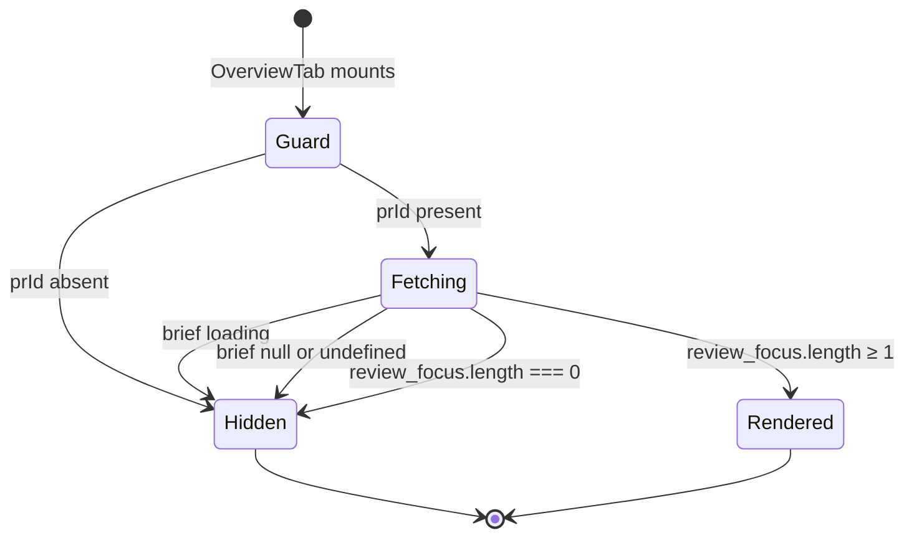

# Spec: Review Feedback Fixes — Batch | Spec ID: SPEC-06 | Status: approved
Supersedes: None

## Problem and why

Three independent gaps exist in the project tooling and the client UI:

**1. Missing `workflow-retro` skill.** A retro ledger (`docs/retros/ledger.md`) documents the process for capturing per-branch retrospectives at merge time — collecting file-change statistics, test-run counts, a key-mechanism description, and gaps/follow-ups — but no skill formalizes this repeatable workflow. The two existing Workflow-category skills (`pr-self-review`, `dependency-checker`) demonstrate the expected pattern: a SKILL.md with frontmatter and a numbered checklist. Without a skill, the retro process risks being skipped or applied inconsistently across sessions.

**2. Spec-creator agent uses a weaker model.** The spec-creator agent is configured to use `claude-sonnet-4-6`, while the architecture-reviewer — a comparable quality-gate agent — already uses the stronger `claude-opus-4-8`. The spec is the upstream ground-truth artifact for the entire dev workflow; producing it with the weaker model creates avoidable quality gaps in acceptance criteria and gap analysis.

**3. `review_focus` is buried inside the brief card.** The PR brief's prioritized reading list (`review_focus`) currently renders as a sub-section of the brief card block, alongside What / Why / Risk-level / Risks / History. This buries the most actionable reviewer guidance inside a dense card. The desired UX is a standalone, top-level "Read This First" block that appears immediately after the brief card and before the PR description on the Overview tab.

## Goals / Non-goals

**Goals:**
- Add a `workflow-retro` skill under the Workflow catalog scope, with content derived from the existing retro ledger process documentation.
- Upgrade the spec-creator agent model declaration from `claude-sonnet-4-6` to `claude-opus-4-8` in both the agent definition file and the agents catalog README entry.
- Move the `review_focus` list out of the brief card into a standalone "Read This First" block on the Overview tab, positioned after the brief card and before the PR description.
- Relocate the expandable focus-item sub-component (and its test file) from under the brief card to under the new block's component tree.
- Add the `block.readThisFirst` i18n key with the label "Read This First".
- Update brief-card tests to drop `review_focus` display assertions; add a colocated test for the new block.

**Non-goals:**
- No changes to any server API endpoint, database schema, or Zod contracts — the `review_focus` contract field and the brief API endpoint remain untouched.
- No changes to any agent's model other than spec-creator.
- No changes to the per-item expand/collapse behavior, lazy prior-PR fetch, or any state (loading, empty, populated, truncation) of individual review-focus items — behavior is identical, only location changes.
- No new LLM calls or server-side logic introduced by the client UI change.
- No changes to the `block.brief.reviewFocus.*` i18n sub-keys consumed by the focus-item sub-component.

## User stories

**Concern 1 — workflow-retro skill:**
As a developer finishing a branch, I want a skill I can invoke that guides me step-by-step through the retro process, so that I always collect the right metrics and write a consistent ledger entry without having to remember the format or the table column order.

**Concern 2 — spec-creator model:**
As a developer using spec-creator, I want the spec produced by the highest-quality available model, so that acceptance criteria are precise and gaps are identified before implementation begins.

**Concern 3 — ReadThisFirst block:**
As a code reviewer opening a PR's Overview tab, I want to see the prioritized reading list as a standalone block immediately after the brief summary, so that I know where to focus my review effort before I read the PR description.

## Acceptance criteria (EARS)

### Concern 1 — workflow-retro skill

**AC-1:** The project tooling shall include a `workflow-retro` skill under the Workflow catalog scope, with frontmatter that declares a `name`, `description`, and `allowed-tools` field following the same pattern as the existing `engineering-insights` skill.

**AC-2:** WHEN a developer invokes the `workflow-retro` skill at branch or feature completion, the skill SHALL direct the user to: (a) collect branch-versus-main file-change statistics and line-insertion/deletion counts; (b) run the test suite only for packages whose files were changed by the branch and record pass count and file count for each; record "—" (not run) in the test column for any package whose files were not changed by the branch — do not run tests for untouched packages; at least one package's test results must be recorded before the row is written; (c) append exactly one new row to the retro ledger table containing Branch, Files changed, +/- lines, Server tests, Client tests, Key mechanism, and Notes columns; and (d) append exactly one new prose section below the table containing a feature summary paragraph and sub-sections for the key technical mechanism and Gaps/follow-ups, matching the structure of the existing `emdash/multi-agent-review-mbw10` entry.

**AC-3:** The `workflow-retro` skill SHALL be listed as a new row in the skills catalog README under the Workflow scope, with its name linked to the skill file and a one-line description.

### Concern 2 — spec-creator model upgrade

**AC-4:** The spec-creator agent definition shall declare `claude-opus-4-8` as its model identifier, matching the model already declared in the architecture-reviewer agent definition.

**AC-5:** The agents catalog README shall show `claude-opus-4-8` as the model for the spec-creator entry in the agent reference table.

### Concern 3 — standalone ReadThisFirst block

**AC-6:** The Overview tab shall render a standalone "Read This First" block positioned after the brief card block and before the PR description section.

**AC-7:** WHEN the PR brief's `review_focus` array contains one or more items, the "Read This First" block SHALL render a `<section>` element containing a section-heading element labelled by the `block.readThisFirst` i18n key, followed by one expandable item per entry — using the same `<section>` plus section-heading structure as the brief card and the PR description section in the Overview tab.

**AC-8:** WHEN the `review_focus` array is empty, or WHEN the brief data is absent (null, undefined, or still loading), the "Read This First" block SHALL render nothing — no heading, no placeholder, no empty list.

**AC-9:** The brief card block shall no longer render the `review_focus` list or its "Where to focus" sub-section label; the "Read This First" block is the sole rendering site for `review_focus` data.

**AC-10:** WHEN a reviewer expands a review-focus item, the item SHALL lazily load prior PRs that touched the same file path on first expand, displaying loading, empty, populated-list, and truncation states identical to the current behavior; two items in the same "Read This First" block expanded simultaneously SHALL each show their own independent data without affecting the other.

**AC-11:** The i18n message catalog shall include a `block.readThisFirst` key with the value "Read This First"; the existing `block.brief.reviewFocus.label`, `expand`, `collapse`, `loading`, `noPriorPrs`, `priorPrs`, and `truncation` sub-keys shall remain unchanged.

**AC-12:** The brief card test suite shall not assert on rendered `review_focus` items; a colocated test for the "Read This First" block shall cover: (a) no render when brief is absent, (b) no render when `review_focus` is empty, and (c) correct item count when `review_focus` is non-empty; the focus-item sub-component test file shall be colocated with the sub-component in its new location.

## Edge cases

**Concern 1:**
- The retro ledger currently has exactly one table row and one prose section. The workflow-retro skill must instruct the user to append new content only — never to overwrite or reformat existing rows.
- Packages not touched by the branch: the skill SHALL instruct the user to record "—" in that package's test column and skip running its tests. Only packages whose files appear in the branch diff require a test run. The ledger row is complete when branch diff statistics plus at least one package's test results are recorded. No interactive confirmation prompt is needed; the "—" rule is applied automatically by the checklist step.

**Concern 2:**
- No edge cases — this is a two-field text change in two static configuration files with no runtime behaviour.

**Concern 3:**
- When the brief is loading (`isLoading: true`): the block renders nothing, same code path as brief absent (covered by AC-8).
- Both the brief card and the "Read This First" block fetch brief data with the same PR identifier. TanStack Query deduplicates requests keyed by the same identifier — a single network request serves both subscribers from cache (confirmed by client insights pattern: TanStack Query cache sharing via a single QueryClientProvider in the root layout). No double network call occurs.
- The `prId` prop is conditionally available in the Overview tab (rendered only when `prId` is defined). The new block must respect the same conditional guard, mounting only when `prId` is present.
- A `review_focus` item whose path string is very long inherits the text-overflow handling of the focus-item sub-component — behavior unchanged by the move.

## Non-functional

**Concern 1:** None — the skill is a static Markdown file with no runtime execution.

**Concern 2:** None — the model field is a static string in a configuration file with no runtime execution.

**Concern 3:**
- **Performance:** The brief data fetch is shared between the brief card and the "Read This First" block via TanStack Query's cache deduplication. No additional network request is introduced.
- **Accessibility:** The "Read This First" block shall be wrapped in a `<section>` element with a section-heading element labelled by the `block.readThisFirst` i18n key — matching the `<section>` plus section-heading structure used by the brief card and the PR description section in the Overview tab. This ensures a consistent heading hierarchy and landmarks for screen readers.

## Architecture & workflows

### Concern 1 — retro workflow (as modelled by the new skill)

### Concern 3 — Overview tab rendering: before and after

**Before (current):**

**After (target):**

### Concern 3 — ReadThisFirst block render states

## Service contracts

No new service contracts are introduced by any of the three concerns.

**Concern 3 — reused contract:**
The "Read This First" block consumes the existing PR Brief response via the same data-fetching hook already used by the brief card, identified by the same PR identifier (`prId`). The relevant field is `review_focus`: an ordered array of strings, each representing a file path or area to prioritise. The shape of this field and the API endpoint that produces it are unchanged.

The focus-item sub-component, when expanded, fetches prior-PR data for the given path via the same hook and query key already in use — no new API surface is introduced.

## Inputs (provenance)

**Concern 1:**
- Branch-versus-main diff statistics (file count, insertion/deletion counts): `[deterministic — version-control CLI output run against the local repository at retro time]`
- Package test-runner output (pass count, file count): `[deterministic — each package's configured test command output]`
- Existing ledger table and prose entries: `[reused — content already present in docs/retros/ledger.md]`

**Concern 2:**
- No runtime inputs. The model identifier is a static string in the agent definition frontmatter.

**Concern 3:**
- `review_focus` list items: `[reused — existing Brief.review_focus field, same data already fetched by the brief card block, served from TanStack Query cache]`
- Prior-PR metadata fetched on focus-item expand (number, title, author, status, opened_at): `[reused — same data-fetching hook and query key already used by the existing focus-item sub-component]`
- `block.readThisFirst` i18n label: `[deterministic — static string added to the messages JSON]`

## Untrusted inputs

**Concern 1:** Retro prose (mechanism, gaps/follow-ups) is developer-authored narrative written into the ledger file — not LLM output. Git diff output and test-runner output are deterministic system outputs. No untrusted input injection risk in the skill workflow.

**Concern 2:** None — no runtime inputs.

**Concern 3:**
- `review_focus` items are LLM-generated strings produced by the brief-generation pipeline. They must be rendered as read-only display text only — not parsed as HTML, not interpreted as URLs, not executed as commands. This is the same handling already applied in the brief card.
- Prior-PR metadata (title, author, status) fetched on expand originates from GitHub API data stored in the database. It must be rendered as read-only display text only — same handling as the existing focus-item sub-component.

## Traceability

| AC-N | Evidence |
|---|---|
| AC-1 | `.claude/skills/engineering-insights/SKILL.md`:1-5 (frontmatter pattern: name, description, allowed-tools); `.claude/skills/README.md`:21-22 (Workflow-scope rows show the expected catalog format) |
| AC-2 | `docs/retros/ledger.md`:1-8 (table header: Branch, Files changed, +/- lines, Server tests, Client tests, Key mechanism, Notes); `docs/retros/ledger.md`:11-40 (prose-section shape for `emdash/multi-agent-review-mbw10`: summary paragraph + mechanism sub-section + Gaps/follow-ups sub-section); user requirement: "at branch/feature completion, gather git diff --stat main..<branch> and each package's test runner; one table row + a prose section per branch"; coordinator clarification: "run tests only for packages touched by the branch; record — for untouched packages; no interactive prompt; ledger row requires diff stats plus at least one package's test results" |
| AC-3 | `.claude/skills/README.md`:21-22 (existing Workflow-scope rows: name-link + description pattern to replicate) |
| AC-4 | `.claude/agents/spec-creator.md`:20 (`model: claude-sonnet-4-6` — current value); `.claude/agents/architecture-reviewer.md`:9 (`model: claude-opus-4-8` — target model, already used by the project-standard reviewer) |
| AC-5 | `.claude/agents/README.md`:74 (`**Model:** claude-sonnet-4-6` — current mirror entry to update) |
| AC-6 | `client/src/app/repos/[repoId]/pulls/[number]/_components/OverviewTab/OverviewTab.tsx`:16-29 (current rendering order: IntentCard → PrBriefCard → description section); user requirement: "Placement: render the new block AFTER <PrBriefCard/>, before the Description <section>" |
| AC-7, AC-10 | `client/src/app/repos/[repoId]/pulls/[number]/_components/PrBriefCard/PrBriefCard.tsx`:81-90 (current review_focus rendering site, conditional on `data.review_focus.length > 0`); `client/src/app/repos/[repoId]/pulls/[number]/_components/PrBriefCard/_components/ReviewFocusItem/ReviewFocusItem.tsx`:1-83 (per-item expand/lazy-fetch behavior to preserve); `client/src/vendor/shared/contracts/brief.ts`:84 (`review_focus: z.array(z.string())`); `client/src/app/repos/[repoId]/pulls/[number]/_components/OverviewTab/OverviewTab.tsx`:16-29 (existing `<section>` structure used by description section and PrBriefCard establishes the structural pattern); coordinator clarification: "wrap the heading + list in a `<section>` using the same SectionLabel pattern as PrBriefCard and the Description section in OverviewTab; encode at spec level for consistency + heading hierarchy; section label text from block.readThisFirst i18n key" |
| AC-8 | `client/src/app/repos/[repoId]/pulls/[number]/_components/PrBriefCard/PrBriefCard.tsx`:36-52 (null/undefined brief → generate-button empty state, no focus list); `client/src/app/repos/[repoId]/pulls/[number]/_components/PrBriefCard/PrBriefCard.tsx`:81 (focus list guarded by `data.review_focus.length > 0`); user requirement: "renders NOTHING when review_focus.length === 0" |
| AC-9 | `client/src/app/repos/[repoId]/pulls/[number]/_components/PrBriefCard/PrBriefCard.tsx`:81-90 (the rendering site to be removed); user requirement: "MOVE review_focus out of PrBriefCard entirely (single source of truth)" |
| AC-11 | `client/messages/en/brief.json`:1-51 (complete current key set; no `block.readThisFirst` key present); `client/messages/en/brief.json`:13-19 (`block.brief.reviewFocus.*` sub-keys to preserve); user requirement: "add a block.readThisFirst label ('Read This First') in brief.json; keep the existing block.brief.reviewFocus.* sub-strings" |
| AC-12 | `client/src/app/repos/[repoId]/pulls/[number]/_components/PrBriefCard/PrBriefCard.test.tsx`:122-158 (review_focus assertions to remove); `client/src/app/repos/[repoId]/pulls/[number]/_components/PrBriefCard/_components/ReviewFocusItem/ReviewFocusItem.test.tsx`:1-10 (test file to relocate with the component); user requirement: "PrBriefCard.test.tsx drops review_focus assertions; add colocated ReadThisFirstCard.test.tsx; move ReviewFocusItem.test.tsx with the component" |

## Verification

| AC-N | Verification recipe |
|---|---|
| AC-1, AC-3 | Open the skills catalog README and confirm a `workflow-retro` row exists under the Workflow scope with a linked name and description. Open the `workflow-retro` SKILL.md and confirm its frontmatter has `name`, `description`, and `allowed-tools` fields. |
| AC-2 | Follow the skill's checklist on any branch that has been merged or is ready for retro. Confirm the skill instructs: (a) collection of branch-vs-main diff statistics; (b) running tests only for packages whose files changed — and recording "—" for untouched packages with no test run; (c) production of a new ledger table row with all seven columns; (d) a prose section with a feature summary, a mechanism sub-section, and a Gaps/follow-ups sub-section. Confirm the existing `emdash/multi-agent-review-mbw10` row and prose section remain unmodified. On a branch touching only the server package: confirm client tests column shows "—" and client tests were not run. |
| AC-4 | Open the spec-creator agent definition file and confirm the `model:` frontmatter field reads `claude-opus-4-8`. |
| AC-5 | Open the agents catalog README and find the spec-creator entry. Confirm the `**Model:**` line reads `claude-opus-4-8`. |
| AC-6 | Open a PR Overview tab in the browser. Confirm a "Read This First" section heading appears between the brief card and the PR description. Confirm no "Where to focus" sub-section appears anywhere inside the brief card. |
| AC-7, AC-10 | On a PR whose generated brief has a non-empty `review_focus`: confirm the "Read This First" block is wrapped in a `<section>` element with a section-heading element whose label matches the `block.readThisFirst` i18n value ("Read This First"). Confirm each focus item appears as a clickable row beneath that heading. Expand one item; confirm prior-PR data (or empty state) appears. Expand a second item simultaneously; confirm each shows its own independent data. Collapse and re-expand the first; confirm data is still present (served from cache, no visible reload flicker). |
| AC-8 | Open a PR with no generated brief: confirm the "Read This First" block does not appear at all (no heading, no list). Open a PR whose brief has an empty `review_focus` array: confirm the "Read This First" block does not appear at all. |
| AC-9 | On any PR with a non-empty `review_focus`, inspect the brief card: confirm no "Where to focus" sub-section or focus-item list appears inside it. Confirm the focus items appear only in the "Read This First" block. |
| AC-11 | Open `client/messages/en/brief.json`. Confirm `block.readThisFirst` = `"Read This First"` is present. Confirm `block.brief.reviewFocus.label`, `expand`, `collapse`, `loading`, `noPriorPrs`, `priorPrs`, and `truncation` keys all remain. |
| AC-12 | Run `pnpm test` in the client package. Confirm all tests pass. Confirm the brief card test file contains no assertions on rendered focus-item text or paths. Confirm a `ReadThisFirstCard.test.tsx` file exists colocated with the new block component and passes tests for: (a) renders nothing when `usePrBrief` returns null/undefined, (b) renders nothing when `review_focus` is an empty array, (c) renders the correct number of list items when `review_focus` has entries. Confirm `ReviewFocusItem.test.tsx` passes in its new location colocated with the moved sub-component. |

