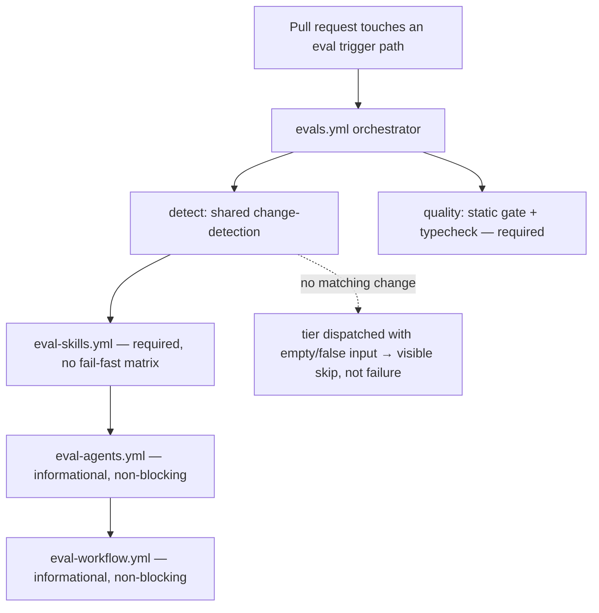
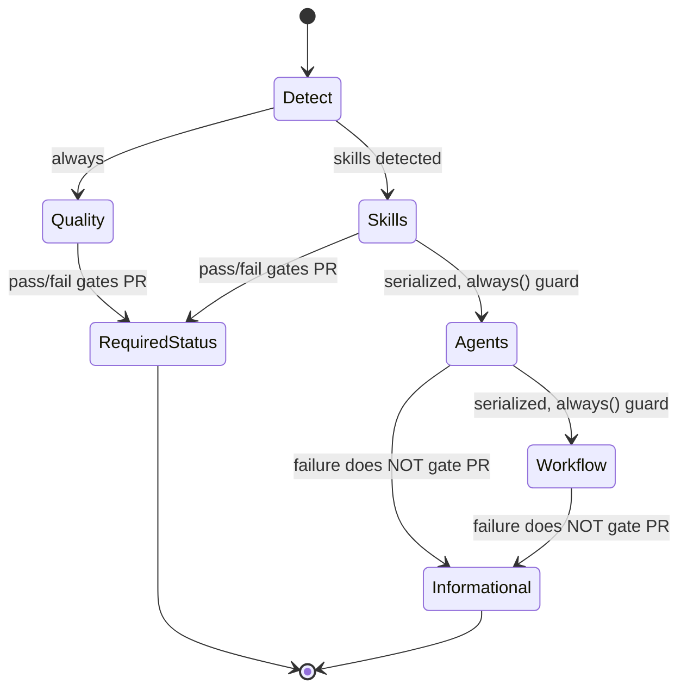

# Spec: Eval Commands Documentation + Named CI Tier Split | Spec ID: SPEC-07 | Status: approved
Supersedes: None

## Problem and why

Two independent gaps make the harness eval tooling harder to discover and reason about — one in documentation, one in CI structure.

**1. The root project map exposes no eval commands and no trigger map.** The root project map (`AGENTS.md`, symlinked as `CLAUDE.md`) is the scannable entry point for contributors. Its `## Commands` block lists per-package `pnpm` commands, and its "Read when" section carries exactly one eval pointer: "Touching the evals harness or its CI gating → read `evals/README.md`". It lists none of the four `pnpm eval:*` commands and no mapping of which change triggers which eval tier. A contributor who edits a skill or an agent has no way to know — from the map alone — which eval to run locally, and must read the whole evals README first. The authoritative trigger→tier logic already lives in one place (`evals/scripts/ci-detect.mjs`); the map should surface a human-readable version of it without duplicating or drifting from that source of truth.

**2. The eval CI tiers are invisible by file name.** CI eval behavior is delivered today by a single dynamic workflow (`.github/workflows/evals.yml`) that internally contains a change-detection job, a static-quality job, and three tier jobs (`skills`, `agents`, `workflow`) chained via `needs`. When a contributor scans `.github/workflows/` by file name, the three tiers are not discoverable — they are buried inside one file. The requirement is for each tier to exist as its own named workflow file while preserving the current CI behavior exactly (same triggers, same shared change-detection, same serialized ordering, same informational status for the tool tiers, same non-fail-fast skills matrix, same static gate). The confirmed mechanism is to keep `evals.yml` as an orchestrator that detects changes and calls three named tier files as reusable workflows.

Both concerns are documentation/CI-structure changes only. No eval logic, no model selection, and no CI trigger surface changes.

## Goals / Non-goals

**Goals:**
- Add the four `pnpm eval:*` commands — `eval:quality`, `eval:skills`, `eval:agents`, `eval:workflow` — to the root project map (`AGENTS.md` / `CLAUDE.md`) so a contributor can run the right eval locally without first reading the evals README.
- Add a "which change → which eval tier" table to the root project map whose trigger→tier rows match `evals/scripts/ci-detect.mjs` exactly (the detector remains the single source of truth; the table is a human-readable mirror).
- Retain the existing "Touching the evals harness or its CI gating → read `evals/README.md`" deep-dive pointer in the map.
- Split the three eval CI tiers into three separately named workflow files — `eval-skills.yml`, `eval-agents.yml`, `eval-workflow.yml` — so each tier is discoverable when scanning `.github/workflows/` by file name.
- Keep `evals.yml` as the orchestrator that runs shared change-detection and invokes the three named tier files as reusable workflows, preserving today's CI behavior end to end.

**Non-goals:**
- No changes to the `pnpm eval:*` scripts in `evals/package.json`.
- No changes to `evals/scripts/ci-detect.mjs` (the trigger→tier detector) or to its mapping.
- No changes to `evals/agent-evals.config.yaml` (including its `excluded_agents` list).
- No changes to any eval source under `evals/src/**`, `evals/skills/**`, `evals/agents/**`, or `evals/workflow/**`.
- No change to which models the tiers run on (the tool tiers stay on `google/gemini-2.5-flash` via OpenRouter; nothing switches to the Anthropic subscription).
- No *narrowing* of the CI trigger source coverage (`evals/**`, `.claude/**`, `CLAUDE.md` stay). **Amended 2026-07-16:** the three new tier files (`eval-skills.yml`, `eval-agents.yml`, `eval-workflow.yml`) ARE added to `on.pull_request.paths`, additively — mirroring the existing self-reference to `evals.yml` — so that a PR editing only a tier file still triggers eval CI. This does not narrow coverage; it only self-references the new CI files.
- No change to the informational (non-blocking) status of the agent and workflow tiers, nor to the required status of the quality and skills tiers.
- No change to the actual eval pass/fail outcome of any PR — only where the commands are documented and how the CI files are named/organized.

## User stories

**Concern 1 — eval commands + trigger table in the map:**
As a contributor about to change a skill or an agent, I want the root project map to show me which `pnpm eval:*` command corresponds to my change, so that I can run the right eval locally before pushing without reading the entire evals README first.

**Concern 2 — named CI tier files:**
As a contributor scanning `.github/workflows/`, I want each eval tier to appear as its own named workflow file, so that I can see at a glance which tiers exist and open the one I care about — while trusting that CI behavior is identical to before.

## Acceptance criteria (EARS)

### Concern 1 — eval commands + trigger table in the root project map

**AC-1:** The root project map shall list all four eval commands — `eval:quality`, `eval:skills`, `eval:agents`, and `eval:workflow` — each shown as the `pnpm` command a contributor runs from the evals package.

**AC-2:** The root project map shall include a table that maps each category of change to the eval tier it triggers, covering: a changed skill → that skill's content tier; a changed agent → that agent's tool tier; a change to the project map, any agent definition, the workflow cases, or the eval engine → the workflow tier; and a changed artifact with no written evals → a visible skip rather than a failure.

**AC-3:** The trigger→tier rows in the map's table shall match the mapping encoded by the eval change-detector, so the documentation does not drift from the detector as the single source of truth.

**AC-4:** The root project map shall retain a pointer directing the reader to the evals README for the full eval/CI deep dive.

### Concern 2 — named, first-class CI tier workflow files

**AC-5:** The CI configuration shall include three separately named eval-tier workflow files — for the skills tier, the agents tier, and the workflow tier — each discoverable by file name when scanning the workflows directory.

**AC-6:** The CI configuration shall retain an orchestrating eval workflow that performs the shared change-detection and invokes the three named tier files as reusable workflows.

**AC-7:** WHEN a pull request changes a file under the current eval trigger paths, the CI system shall perform the same change-detection and dispatch the same set of eval tiers as it did before the split.

**AC-8:** The eval CI shall run the skills, agents, and workflow tiers in that serialized order, each tier queued after the previous one rather than dispatched to run in parallel.

**AC-9:** IF the agents tier or the workflow tier reports a failure, THEN the overall required CI status for the pull request shall remain unaffected, because those two tool tiers stay informational (non-blocking).

**AC-10:** The skills tier shall continue to run its per-skill matrix without fail-fast, so a failure in one skill's case does not cancel the other skills' matrix jobs.

**AC-11:** The CI configuration shall retain the static-quality gate (typecheck plus the model-free skill-quality check) as a required job.

**AC-12:** The net eval outcome of any given pull request — which tiers run, on which models, and whether the PR's required status passes or fails — shall be identical before and after the split.

## Edge cases

**Concern 1:**
- A changed artifact that has no written evals must be shown in the table as a visible skip, not as a run and not as a failure — mirroring the detector's `skipped_*` behavior. The table must not imply that every changed skill or agent always produces a run.
- The `eval:quality` command is the model-free static gate; the table/commands must not imply it needs an OpenRouter key or a model, unlike the model-driven tiers.

**Concern 2:**
- A PR that changes nothing under the eval trigger paths must produce the same result as today: the orchestrator's detection runs and the tier files are dispatched with empty/false inputs, so no tier does real work (a skip, not a failure).
- The agents tier being excluded for specific agents (via the detector's exclusion config) must continue to behave exactly as today; the split must not change which agents are dispatched.
- Each tier file, dispatched from the orchestrator, must still gate on its own detection input so that an upstream skip or failure does not cause a downstream tier to be skipped when it should run (the current `always()`-guarded chaining behavior is preserved).

## Non-functional

- **Maintainability:** The trigger→tier table in the map is a human-readable mirror of the detector; the detector stays the single source of truth. The spec requires the rows to match the detector at authoring time — there is no runtime enforcement, so drift is a documentation-review concern, surfaced under `[NEEDS CLARIFICATION]`.
- **Performance/security/a11y:** None — this feature changes documentation text and CI file organization only, with no runtime execution, no user-facing surface, and no data handling.

## Architecture & workflows

### Concern 2 — orchestrator + named reusable tier files (target structure)

The orchestrator runs shared detection once, then calls the three named tier files as reusable workflows in the same serialized order the single-file version used. Observable CI behavior (which tiers run, ordering, blocking vs informational, the static gate) is unchanged; only the file boundaries change.

### Concern 2 — tier blocking vs informational status

## Service contracts

No cross-service or cross-module runtime contract is introduced. The only new interface is internal to CI: the orchestrator invokes each named tier file as a reusable workflow, passing the shared change-detection result — the set of skills to run, the set of agents to run, and whether the workflow tier runs — as inputs. The shape and meaning of that detection result are unchanged from what the single-file workflow already computes and consumes; only the boundary it crosses (job-to-reusable-workflow instead of job-to-job) changes. No API request/response, event payload, or shared Zod contract is affected.

## Inputs (provenance)

- The four eval command strings added to the map: `[deterministic — copied verbatim from the eval script names already defined in the evals package manifest]`.
- The trigger→tier table rows: `[deterministic — transcribed from the eval change-detector's existing trigger→tier mapping; no new logic]`.
- The CI change-detection result consumed by the tier files: `[reused — the same detection output the current single-file workflow already produces from the PR's changed-file list]`.

There are no LLM-call inputs introduced by this feature.

## Untrusted inputs

None introduced by this change. The documentation edit is static author-written text. The CI reorganization consumes the PR's changed-file list, which the existing detector already handles; this feature adds no new parsing of untrusted content and does not change how the changed-file list is read or trusted.

## Traceability

| AC-N | Evidence |
|---|---|
| AC-1 | `evals/package.json`:9-12 (`eval:skills`, `eval:agents`, `eval:workflow`, `eval:quality` script definitions to surface); `CLAUDE.md`:17-27 (`## Commands` block — the map location that currently lists per-package commands but no eval commands) |
| AC-2 | `evals/scripts/ci-detect.mjs`:6-9 (header comment stating the trigger→tier mapping: skill→content tier, agent→tool tier, map/agent/engine change→workflow tier); `evals/scripts/ci-detect.mjs`:86-110 (the detection logic implementing skills/agents/run_workflow); `evals/scripts/ci-detect.mjs`:95-98 (a changed artifact with no written evals reported as `skipped_*`, not a failure) |
| AC-3 | `evals/scripts/ci-detect.mjs`:1-20 (module doc declaring it the authoritative change detector); user requirement: "The table's trigger→tier rows must match `ci-detect.mjs` exactly (single source of truth — docs must not drift from the detector)" |
| AC-4 | `CLAUDE.md`:51 ("Touching the evals harness or its CI gating → read `evals/README.md`" — the existing deep-dive pointer to retain); user requirement: "The existing 'read evals/README.md' deep-dive pointer stays" |
| AC-5 | `.github/workflows/evals.yml`:107-134 (`skills` job), :136-176 (`agents` job), :178-214 (`workflow` job) — the three tiers currently inlined in one file, to become named files `eval-skills.yml` / `eval-agents.yml` / `eval-workflow.yml`; user requirement: "the skills, agents, and workflow tiers must each exist as a separately named workflow file" |
| AC-6 | `.github/workflows/evals.yml`:52-79 (`detect` job runs `ci-detect.mjs` and exposes `skills`/`agents`/`run_workflow` outputs); user requirement (confirmed mechanism): "keep `evals.yml` as an orchestrator that detects changes and calls the three named tier files as reusable workflows" |
| AC-7 | `.github/workflows/evals.yml`:31-37 (`on.pull_request.paths` trigger set: `evals/**`, `.claude/**`, `CLAUDE.md`, `.github/workflows/evals.yml`); `.github/workflows/evals.yml`:53-79 (shared detection to preserve) |
| AC-8 | `.github/workflows/evals.yml`:138 (`agents` `needs: [detect, skills]`), :180 (`workflow` `needs: [detect, agents]`) — serialized chaining to preserve; `.github/workflows/evals.yml`:21-24 (comment: tiers chained via `needs` to queue and avoid OpenRouter throttling under one API key) |
| AC-9 | `.github/workflows/evals.yml`:141 (`agents` `continue-on-error: true`), :183 (`workflow` `continue-on-error: true`); `.github/workflows/evals.yml`:9-15 (comment: tool tiers stay informational since dispatch/activation checks are indicative on non-Anthropic models) |
| AC-10 | `.github/workflows/evals.yml`:115-118 (`skills` `strategy.fail-fast: false`); `.github/workflows/evals.yml`:26-28 (comment: one flaky skill case must not cancel every other skill's matrix job) |
| AC-11 | `.github/workflows/evals.yml`:81-105 (`quality` job: `pnpm typecheck` + `pnpm eval:quality`, no `continue-on-error` → required static gate) |
| AC-12 | `.github/workflows/evals.yml`:46-50 (`env`: `EVAL_MODEL` / `EVAL_JUDGE_MODEL` = `google/gemini-2.5-flash` — model selection to preserve); `.github/workflows/evals.yml`:52-214 (full current job graph whose net outcome must be unchanged); user requirement: "the overall CI behavior stays identical to today ... same non-fail-fast skills matrix, same static-gate/quality job" |

## Verification

| AC-N | Verification recipe |
|---|---|
| AC-1 | Open the root project map (`AGENTS.md` / `CLAUDE.md`). Confirm all four eval commands — `eval:quality`, `eval:skills`, `eval:agents`, `eval:workflow` — appear as runnable `pnpm` commands scoped to the evals package. |
| AC-2, AC-3 | In the same map, find the change→eval-tier table. Confirm it has rows for: a changed skill → its content tier; a changed agent → its tool tier; a project-map / agent-definition / workflow-case / engine change → the workflow tier; and a no-eval artifact → a skip. Compare each row against the detector's documented mapping and detection logic; confirm no row contradicts the detector. |
| AC-4 | In the same map, confirm the "read `evals/README.md`" deep-dive pointer is still present. |
| AC-5 | List `.github/workflows/`. Confirm three named files exist for the skills, agents, and workflow tiers (`eval-skills.yml`, `eval-agents.yml`, `eval-workflow.yml`), each recognizable by name. |
| AC-6 | Open the orchestrating eval workflow. Confirm it still runs the shared change-detection step and that it invokes the three named tier files as reusable workflows rather than inlining the tier jobs. |
| AC-7 | Open a PR that changes a file under each trigger category (a skill, an agent, the project map). Confirm detection runs and the same tiers are dispatched as on the pre-split workflow for the equivalent change. |
| AC-8 | Inspect a PR's CI run graph. Confirm the skills, agents, and workflow tiers execute in that order (each queued after the previous), not concurrently. |
| AC-9 | On a PR where the agents or workflow tier reports a failing case, confirm the PR's overall required status is not marked failed by that tier (the tier shows as informational/neutral). |
| AC-10 | On a PR that changes two or more skills, confirm the skills matrix runs each skill as its own job and that a failure in one does not cancel the sibling skill jobs. |
| AC-11 | On any eval PR, confirm the static-quality job (typecheck + `eval:quality`) runs and gates the PR as a required check. |
| AC-12 | Compare a representative PR's eval results before and after the split (same changed files): confirm the same tiers run, the tool tiers run on `google/gemini-2.5-flash`, and the required pass/fail status is identical. |

## [NEEDS CLARIFICATION: …]

None blocking. One non-blocking note for the caller to relay:

- **Doc/detector drift is unenforced.** The trigger→tier table in the map is a manual mirror of `ci-detect.mjs`; nothing fails CI if the two diverge later. If the team wants a guard against drift (for example, a check that the map's table stays in sync with the detector), that is an additive follow-up beyond this spec's scope — flag it if desired, otherwise the table is maintained by review.
