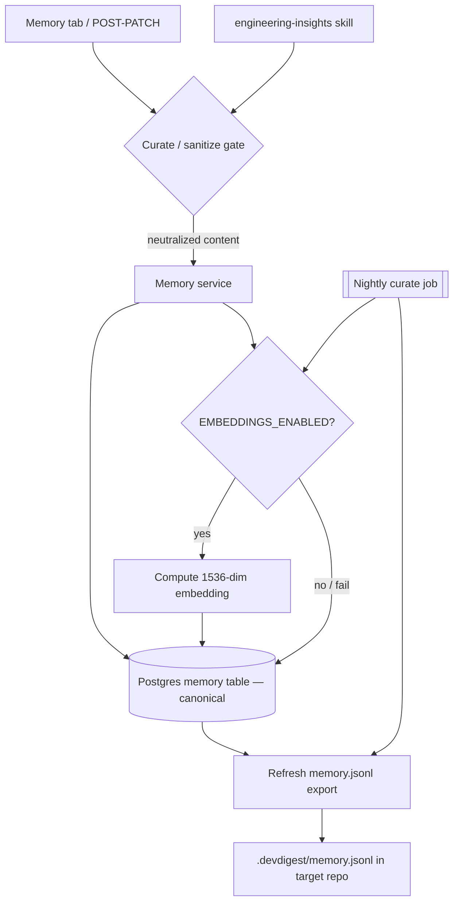
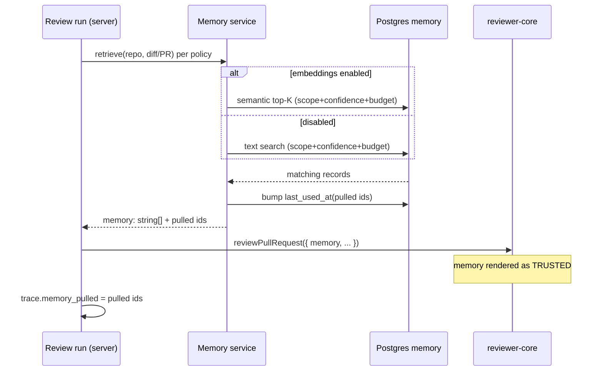
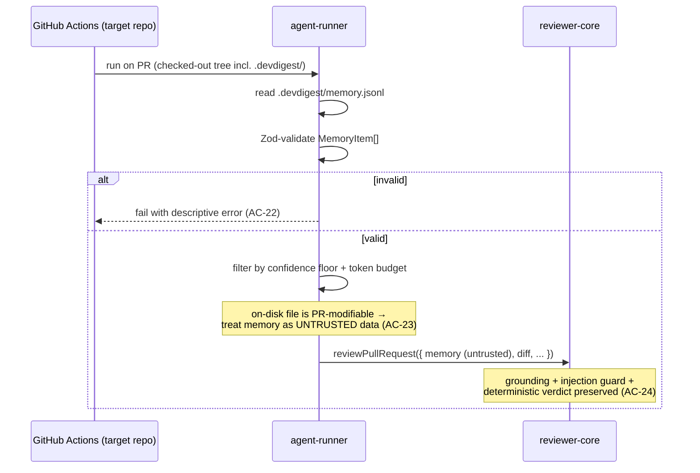

# Spec: Memory | Spec ID: SPEC-08 | Status: draft
Supersedes: none

> **Delivery note (2026-07-16):** The **CI read path is DEFERRED to a future PR** because it
> requires changes to the `agent-runner` module, which is out of scope for the current
> iteration. Consequently **AC-21, AC-22, AC-23, AC-24, and AC-29 are NOT delivered here** —
> they remain specified for the follow-up PR that wires `agent-runner`. Everything else
> (server memory module + REST + export endpoint, `/memory` UI, local studio injection via
> reviewer-core + MCP `get_memory`, and the `engineering-insights` + nightly-curate path) is
> delivered. The local read path is unaffected.

## Problem and why

DevDigest already captures session learnings as free-form markdown (the
`engineering-insights` skill → per-module `INSIGHTS.md`). That knowledge is
human-readable but not queryable and never reaches an agent's review. The
**Memory** feature turns those learnings into a structured, queryable,
agent-consumable pool: typed records (`decision` / `convention` / `preference` /
`fact` / `learning`) with a scope (`repo` / `global` / `team`), a confidence
score, source contexts (PR references), and an optional embedding — surfaced in a
new **Memory** tab and pulled into review context so shared knowledge actually
informs reviews.

The DB `memory` table, the `MemoryItem` Zod contract, the reviewer-core `memory`
prompt slot, the run-trace `memory_pulled` field, and the sidebar `Memory` nav
entry already exist but sit empty/unused. This spec wires the full vertical:
read/list UI + CRUD + local and CI agent injection + a curate/embed nightly job +
structured writes from `engineering-insights`.

The security design is load-bearing. reviewer-core injects the memory slot as a
**trusted, un-delimited** `## Relevant memory` block, and the shared
`INJECTION_GUARD` only governs `<untrusted>…</untrusted>` blocks — so anything in
the memory slot is treated by the model as instructions. But memory records can
derive from untrusted PR text (`sources[].pr`), and the CI-read
`.devdigest/memory.jsonl` is a checked-in file that any pull-request author can
modify. Establishing trust at write time (a curate/sanitize gate) and treating the
CI on-disk file as untrusted are therefore first-class requirements, not
afterthoughts.

---

## Goals / Non-goals

**Goals**

- A read/list Memory tab at `/memory` with SCOPE / KIND / FRESHNESS filters, a
  search box (semantic-vs-text badge), per-record confidence %, scope + kind tags,
  source contexts (PR references), updated date, and a "used" (last-used) date, plus
  a detail pane with edit and delete.
- Full CRUD over the canonical Postgres `memory` table via a REST surface
  (`GET /memory` with filters + `?q`, `POST /memory`, `PATCH /memory/:id`,
  `DELETE /memory/:id`, `GET /memory/export`).
- Local agent injection: relevant records reach a review through the existing
  reviewer-core `memory` slot; pulled ids are recorded in the run trace and their
  `last_used_at` is bumped.
- Both agent surfaces: local studio (MCP `get_memory` tool + reviewer-core slot)
  AND CI `agent-runner` (reads a checked-in `.devdigest/memory.jsonl`).
- A write-time curate/sanitize trust gate, and Zod-validation of the CI-read file
  as untrusted on-disk content.
- `engineering-insights` also emits structured memory records; a nightly curate job
  (re)embeds new/updated rows and refreshes the export.
- Graceful degradation to text search when `EMBEDDINGS_ENABLED=false` (the default).

**Non-goals**

- Live runtime memory sharing between concurrent agents. The pool is shared
  asynchronously through the DB (canonical) and the exported flat file — each agent
  reads independently. No shared in-process state.
- Changing the DB `memory` schema. The table already exists; this feature builds on
  it. (A backward-compatible *contract* superset is added, not a schema change.)
- Changing reviewer-core's pipeline invariants (grounding, injection guard,
  deterministic verdict). The memory slot already exists — injection populates it.
- Semantic (embedding) retrieval inside the CI runner. CI has no embedder; CI memory
  is a pre-scoped flat file, filtered by confidence + token budget only.
- Auto-enabling embeddings. `EMBEDDINGS_ENABLED` stays off by default and never
  self-enables.
- Access-controlled `team` scope. The `team` value stays in the enum, filters, and
  seed data (so the mockup's "Team decided not to adopt tRPC" record renders), but
  team-scoped records are workspace-wide and visible exactly like `global` — no
  team-membership or team-level authorization model is built this iteration.
- Surfacing pulled memory in the run-trace UI. The run trace keeps `memory_pulled`
  populated in its data, but the trace-UI enhancement that links each pulled record
  back to the Memory tab is deferred to a future iteration.

---

## User stories

- As a tech lead, I open the Memory tab, filter by SCOPE=repo and KIND=decision, and
  read the team's accumulated decisions with their source PRs and confidence.
- As a reviewer-agent operator, I run a review and see in the run trace exactly which
  memory records were pulled into the prompt.
- As an engineer, when I finish a session the `engineering-insights` skill records a
  structured `learning` memory in addition to updating `INSIGHTS.md`.
- As a repo owner, I export an agent to CI and the checked-in `.devdigest/memory.jsonl`
  carries the repo's curated knowledge to the CI runner.
- As a security-conscious maintainer, I trust that a malicious PR cannot smuggle
  instructions into a review by editing `.devdigest/memory.jsonl` or by seeding a
  memory record from PR text.

## Acceptance criteria (EARS)

**Write / CRUD**

- **AC-1** — WHEN a memory record is created via `POST /memory`, the system shall
  persist it to the canonical Postgres `memory` table scoped to the caller's
  workspace.
- **AC-2** — WHERE embeddings are enabled, WHEN a record's content is created or its
  content is changed, the system shall compute and store a 1536-dimension embedding
  for that record.
- **AC-3** — IF embeddings are disabled (the default) or the embedding call fails,
  THEN the system shall persist the record without an embedding and complete the
  write without error.
- **AC-4** — WHEN a memory record is updated via `PATCH /memory/:id`, the system
  shall apply only the supplied fields and refresh its `updated_at`.
- **AC-5** — WHEN a memory record is deleted via `DELETE /memory/:id`, the system
  shall remove it from the canonical store and return no content.
- **AC-6** — IF a `PATCH` or `DELETE` targets a memory id outside the caller's
  workspace, THEN the system shall return not-found rather than modifying it.

**Write-time trust gate (security)**

- **AC-7** — WHEN a memory record is written from any source (UI, `engineering-insights`
  skill, or import), the system shall pass its content through a curate/sanitize gate
  that neutralizes embedded instructions before the record becomes eligible for
  trusted injection.
- **AC-8** — The system shall persist each record's provenance in `sources`
  (a context string plus an optional PR number) so a record derived from untrusted PR
  text remains traceable.

**List / search / UI**

- **AC-9** — WHEN the Memory list is requested with SCOPE, KIND, and/or FRESHNESS
  filters, the system shall return only records matching all supplied filters within
  the caller's workspace.
- **AC-10** — WHERE embeddings are enabled, WHEN a search query `?q` is supplied, the
  system shall return records ranked by semantic similarity to `q` and report the
  search mode as `semantic`.
- **AC-11** — IF embeddings are disabled or unavailable WHEN a search query `?q` is
  supplied, THEN the system shall fall back to text search over `content` and report
  the search mode as `text`.
- **AC-12** — WHILE displaying search results, the client shall show a badge
  reflecting whether the active search mode is `semantic` or `text`.
- **AC-13** — The Memory tab shall display, for each record, its scope tag, kind tag,
  confidence percentage, source contexts (including PR references), updated date, and
  last-used date.
- **AC-14** — WHEN a record is selected in the Memory tab, the client shall show a
  detail pane offering edit and delete.
- **AC-30** — The system shall treat a record as "stale" when its `last_used_at` is
  older than 60 days (falling back to `updated_at` when the record was never used),
  and the Memory list shall hide stale records by default unless the "Show Stale
  (>60d)" freshness toggle is enabled.

**Contract**

- **AC-15** — The system shall expose a `MemoryRecord` contract that is a
  backward-compatible superset of `MemoryItem` adding `id`, `updated_at`, and
  `last_used_at`, kept in sync between the server and client vendored contracts.

**Local agent injection (reviewer-core path)**

- **AC-16** — WHEN a local review run starts, the system shall retrieve relevant
  memory per the retrieval policy and populate the reviewer-core memory slot. The
  policy defaults (tunable) are: scope = repo + global + team; confidence floor = 0.5;
  semantic-or-text top-K = 8 over the diff/PR; injection token budget ≈ 1500 tokens.
- **AC-17** — WHEN memory records are pulled into a review, the system shall record
  their identifiers in the run trace's `memory_pulled` field.
- **AC-18** — WHEN memory records are pulled into a review, the system shall bump
  those records' `last_used_at`.
- **AC-19** — IF no memory records match the retrieval policy, THEN the system shall
  run the review with an empty memory slot and behavior identical to the pre-memory
  prompt.

**MCP tool**

- **AC-20** — WHEN the `get_memory` MCP tool is invoked for an `owner/repo` (with
  optional `scope` / `kind` / `q`), the system shall return the workspace's matching
  memory records validated against the `MemoryRecord` contract.

**CI path** — ⏸️ **DEFERRED (not in this PR; requires `agent-runner` changes).** AC-21–24 and AC-29 below are specified for a follow-up PR.

- **AC-21** — WHEN an agent is exported to CI, the system shall write a checked-in
  `.devdigest/memory.jsonl` containing the repo-relevant memory records serialized as
  `MemoryItem` lines.
- **AC-22** — IF the CI-read `.devdigest/memory.jsonl` fails `MemoryItem[]`
  validation, THEN the agent-runner shall fail with a descriptive error rather than
  partially trusting or silently defaulting to it.
- **AC-23** — The agent-runner shall treat CI-loaded memory content as untrusted data
  that cannot deliver instructions to the model, because the on-disk file is
  modifiable within an attacker's pull request.
- **AC-24** — The agent-runner shall preserve every reviewer-core invariant
  (mandatory grounding gate, injection guard, deterministic verdict) when injecting
  memory.
- **AC-29** — The agent-runner shall render CI-loaded memory to the model through an
  untrusted, injection-guard-delimited (`<untrusted>…</untrusted>`) channel — NOT the
  trusted local `## Relevant memory` slot — routing it instead through an
  untrusted/delimited path (e.g. the existing untrusted `specs`-style slot or an
  explicitly-wrapped block), so that the same shared `INJECTION_GUARD` that governs
  the diff and PR body also governs CI memory. (Flagged for `security-reviewer`.)

**Export endpoint**

- **AC-25** — WHEN `GET /memory/export` is requested, the system shall return the
  workspace's memory serialized as newline-delimited `MemoryItem` JSON.

**Skill + nightly curate job**

- **AC-26** — WHEN the `engineering-insights` skill captures a session, it shall also
  emit structured memory records (with `kind`, `scope`, `confidence`, and `sources`)
  through the write path while preserving its existing `INSIGHTS.md` behavior.
- **AC-27** — WHERE embeddings are enabled, the nightly curate job shall (re)embed new
  or updated records and refresh the `memory.jsonl` export.
- **AC-28** — IF embeddings are disabled WHEN the nightly curate job runs, THEN the
  job shall still refresh the export, without embedding and without error.

## Edge cases

- **Empty pool / no matches** — retrieval and list return empty; the review runs with
  an empty memory slot (AC-19); the tab shows an empty state.
- **Embeddings disabled (default)** — every embed path (write, search, retrieval,
  nightly job) degrades to text/no-embed and never errors (AC-3, AC-11, AC-28);
  mirrors how the embedder resolver throws when disabled and all callers catch and
  degrade (`container.ts:201-203`).
- **Oversized content / huge PR body in `sources`** — the write-time gate and the
  retrieval token budget bound how much memory content reaches a prompt; mirror the
  existing per-file/total char caps used for specs and PR descriptions
  (`prompt.ts:37-40`, `run-executor.ts:18-19`).
- **Malicious content in a record** — an attacker-seeded record (via PR-derived source
  text or an edited CI file) attempting prompt injection is handled by the write-time
  curate gate (AC-7) for the trusted DB path and by untrusted treatment + Zod
  validation (AC-22, AC-23) for the CI path.
- **Corrupt / malformed `.devdigest/memory.jsonl`** — CI fails clearly, exactly like a
  malformed agent manifest (`manifest.ts:60-76`), never partially trusting it.
- **Concurrent `last_used_at` bumps** — two simultaneous reviews pulling the same
  record both bump `last_used_at`; last write wins, no correctness impact (the field
  is advisory freshness only).
- **Deleted record still referenced by a past run trace** — `memory_pulled` stores
  identifiers historically; a later delete does not rewrite past traces.
- **Search query that is itself injection text** — `q` is used only as a text-search
  operand / embedding query, never as an instruction; parameterized text search, no
  string interpolation.

## Non-functional

- **Security (primary)** — see `Untrusted inputs`. The trusted-vs-untrusted boundary
  between the DB-sourced local path and the on-disk CI path is the defining
  constraint of this feature and must be preserved.
- **Performance** — memory retrieval per review must stay within a bounded token
  budget and must not add a blocking network dependency when embeddings are off
  (text search only). The nightly curate job runs off the request path.
- **a11y** — the Memory tab's filters, search, list, and detail pane follow the
  existing client a11y conventions (keyboard-navigable, labeled controls); no new
  a11y requirements beyond the project baseline.

## Architecture & workflows

### Write → embed → export flow

### Local read path (studio: reviewer-core slot + MCP)

MCP `get_memory` is a parallel local read: it calls `GET /memory` for an
`owner/repo` and validates the response against `MemoryRecord`, mirroring
`get_conventions`.

### CI read path (agent-runner: on-disk file)

## Service contracts

All routes are workspace-scoped (resolved server-side from request context). Shapes
are described at the interface level; field names follow the shared contracts.

- **`GET /memory`** — query params: `scope?` (`repo`|`global`|`team`), `kind?`
  (`decision`|`convention`|`preference`|`fact`|`learning`), `repo?` (repo reference),
  `freshness?` (freshness filter), `q?` (search string). Response: an array of
  `MemoryRecord` plus a `search_mode` indicator (`semantic` | `text`) when `q` is
  present.
- **`POST /memory`** — request body: a `MemoryItem` (`content`, `scope`, `kind`,
  `confidence` 0–1, `sources[]`). Response: the created `MemoryRecord`.
- **`PATCH /memory/:id`** — request body: a partial `MemoryItem` (any subset of
  `content` / `scope` / `kind` / `confidence` / `sources`). Response: the updated
  `MemoryRecord`; not-found when the id is outside the workspace.
- **`DELETE /memory/:id`** — no body; 204 on success; not-found when the id is
  outside the workspace.
- **`GET /memory/export`** — no body; response: newline-delimited `MemoryItem` JSON
  (the `.jsonl` export), optionally scoped to a repo.

**Shared contract addition** — `MemoryRecord`: a backward-compatible superset of the
existing `MemoryItem` (`content`, `scope`, `kind`, `confidence`, `sources`) adding
`id`, `updated_at`, and `last_used_at`. `MemoryItem` itself is unchanged (the
`.jsonl` line format and any existing consumer stay valid). The addition is mirrored
between `server/src/vendor/shared` and `client/src/vendor/shared`.

**reviewer-core contract** — unchanged: `reviewPullRequest` already accepts
`memory?: string[]` and renders it in the `## Relevant memory` slot. Injection
populates the slot; the engine is not modified.

**Run trace contract** — unchanged: `memory_pulled` already exists on the trace;
injection sets it to the pulled record ids.

## Inputs (provenance)

- Memory content authored in the Memory tab / `POST` / `PATCH` — `[new: 0 LLM calls]`
  (user-supplied text; untrusted user input, see below).
- Memory content emitted by the `engineering-insights` skill — `[new: N LLM calls]`
  when the skill uses a model to structure the record; the underlying session/code
  facts are `[deterministic: session capture]`.
- `sources[].pr` / `sources[].context` — `[deterministic: PR metadata]` when copied
  from a PR, but PR text is untrusted (see below).
- Per-record embedding on write/update — `[new: 1 embedding call]` per changed record,
  only WHERE `EMBEDDINGS_ENABLED` (default off → skipped).
- Retrieval query embedding per local review — `[new: 1 embedding call]` per review,
  only WHERE `EMBEDDINGS_ENABLED`; text search otherwise (`[new: 0 LLM calls]`).
- Canonical store, `MemoryItem`/`MemoryScope`/`MemoryKind`/`MemorySource` contracts,
  reviewer-core `memory` slot, run-trace `memory_pulled`, sidebar `Memory` nav entry —
  `[reused]` existing scaffolding.
- CI-read `.devdigest/memory.jsonl` — `[deterministic: exported from DB]` at write
  time, but untrusted on-disk content by the time CI reads it (see below).

## Untrusted inputs

1. **PR-derived source content** (`sources[].pr` / `sources[].context`, and any record
   whose content originated from PR text) — an attacker can influence PR text; a record
   seeded from it could carry injection payloads. Because the DB memory path is
   injected as **trusted** by reviewer-core (`prompt.ts:47,132-135,160`), trust is
   established at write time by the curate/sanitize gate (AC-7), not at read time.
2. **User-supplied content** via the Memory tab / `POST` / `PATCH` — Zod-validated at
   the boundary and passed through the same write-time gate; treated as data.
3. **CI-read `.devdigest/memory.jsonl`** — a checked-in file in the target repo tree,
   modifiable by any pull-request author. It MUST be `MemoryItem[]` Zod-validated
   before use (AC-22, exactly like the agent manifest at `manifest.ts:48-77`) AND
   treated as **untrusted** so it cannot deliver instructions to the model (AC-23).
   Concretely, the CI runner renders it through an injection-guard-delimited
   `<untrusted>…</untrusted>` channel — NOT the trusted local `## Relevant memory`
   slot (AC-29) — in contrast to the local DB path, whose trust is guaranteed by the
   write-time curate gate. Zod validation alone is insufficient: a structurally-valid
   record can still carry an injection payload, so untrusted delimiting is required in
   addition to validation.
4. **Search query `q`** — used only as a text-search operand or an embedding query,
   never as an instruction; parameterized, no string interpolation.
5. **LLM-structured records from `engineering-insights`** — model output; validated
   against the contract and passed through the write-time gate before persistence.

## Traceability

| AC-N | Evidence |
|---|---|
| AC-1 | `server/src/db/schema/knowledge.ts:8-29` (memory table, workspace-scoped); conventions CRUD template `server/src/modules/conventions/repository.ts:24-44` |
| AC-2 | `server/src/db/schema/knowledge.ts:21` (`embedding vector(1536)`); `server/src/platform/container.ts:195-208` (embedder resolver) |
| AC-3 | `server/src/platform/config.ts:22,83` (default off); `server/src/platform/container.ts:196-203` (throws when disabled, callers degrade) |
| AC-4 | `server/src/db/schema/knowledge.ts:25` (`updated_at`); conventions update `server/src/modules/conventions/repository.ts:46-57` |
| AC-5 | conventions delete `server/src/modules/conventions/repository.ts:65-71`; `server/src/modules/conventions/routes.ts:73-78` (204) |
| AC-6 | conventions delete/update filter by `workspaceId` `server/src/modules/conventions/repository.ts:54,68`; NotFound pattern `routes.ts:68,76` |
| AC-7 | Plan brief open question #1 (`lets-implement-memory-feature-linked-feigenbaum.md:40`); trusted memory slot `reviewer-core/src/prompt.ts:47,132-135,160` |
| AC-8 | `MemorySource` contract `server/src/vendor/shared/contracts/knowledge.ts:186-190` (`pr`, `context`) |
| AC-9 | conventions list-by-filter `server/src/modules/conventions/repository.ts:17-22`; mockup filters SCOPE/KIND/FRESHNESS (plan brief) |
| AC-10 | `server/src/platform/container.ts:195-208` (embedder); `server/src/db/schema/knowledge.ts:21` (vector) |
| AC-11 | `server/src/platform/config.ts:22,83` (default off); container degrade `container.ts:196-203`; plan open question #3 (`:42`) |
| AC-12 | plan brief mockup semantics (semantic-vs-text badge); AC-10/AC-11 |
| AC-13 | plan brief mockup semantics (scope/kind tags, confidence %, source contexts, updated, "used" date) |
| AC-14 | plan brief mockup (detail pane with edit/delete); conventions PATCH/DELETE routes `routes.ts:62-78` |
| AC-15 | `server/src/vendor/shared/contracts/knowledge.ts:186-199` (`MemoryItem`); missing `id`+timestamps per plan brief (`:22`); schema `knowledge.ts:11,25,26` |
| AC-16 | reviewer-core memory input `reviewer-core/src/review/run.ts:58-59,139`; retrieval-policy defaults (K=8, floor=0.5, budget≈1500t, scope=repo+global+team) — coordinator decision (item 3) |
| AC-17 | run trace `memory_pulled` `server/src/modules/reviews/run-executor.ts:318` |
| AC-18 | schema `last_used_at` `server/src/db/schema/knowledge.ts:26`; plan open question #2 (`:41`, "pulling bumps last_used_at") |
| AC-19 | omit-when-empty slot behavior `reviewer-core/src/prompt.ts:132-135,160`; reviewer-core/CLAUDE.md "Extra prompt slots … unused when omitted" |
| AC-20 | `get_conventions` MCP template `mcp-server/src/tools/get-conventions.ts:15-46` (validate response against contract) |
| AC-21 ⏸️ DEFERRED | (CI path — future PR) CI bundle writes empty `.devdigest/memory.jsonl` `server/src/modules/ci/helpers.ts:160,172,202`; plan Phase 5 (`:67`) |
| AC-22 ⏸️ DEFERRED | (CI path — future PR) manifest Zod-validate-on-load `agent-runner/src/manifest.ts:48-77`; plan open question #1 (`:40`) |
| AC-23 ⏸️ DEFERRED | (CI path — future PR) trusted unwrapped memory slot `reviewer-core/src/prompt.ts:47,132-135,160`; `INJECTION_GUARD` covers only `<untrusted>` `prompt.ts:16-28`; agent-runner untrusted-tree note `agent-runner/CLAUDE.md` (pull_request trigger) |
| AC-24 ⏸️ DEFERRED | (CI path — future PR) reviewer-core invariants `reviewer-core/CLAUDE.md` (grounding gate, injection guard, deterministic verdict); `agent-runner/CLAUDE.md` "must preserve every reviewer-core invariant" |
| AC-25 | conventions export/serialize pattern `server/src/modules/conventions/service.ts`; `MemoryItem` line shape `contracts/knowledge.ts:192-199`; plan Phase 1 `exportJsonl()` (`:51`) |
| AC-26 | plan Phase 6 (`:70-71`); skills loader/read pattern `agent-runner/src/skills.ts` |
| AC-27 | plan Phase 6 nightly curate (`:72`); embedder gating `container.ts:195-208` |
| AC-28 | `server/src/platform/config.ts:22,83` (default off); container degrade `container.ts:196-203` |
| AC-29 ⏸️ DEFERRED | (CI path — future PR) trusted unwrapped memory slot `reviewer-core/src/prompt.ts:47,132-135,160`; `INJECTION_GUARD` + `wrapUntrusted` govern only `<untrusted>` `prompt.ts:16-34`; untrusted `specs`-style slot `prompt.ts:136-139,164`; coordinator decision (item 1, CI memory untrusted) |
| AC-30 | schema `last_used_at`/`updated_at` `server/src/db/schema/knowledge.ts:25-26`; mockup "Show Stale (>60d)" freshness toggle (plan brief); coordinator decision (item 4, stale = >60d) |

## Verification

| AC-N | Verification recipe |
|---|---|
| AC-1, AC-4, AC-5, AC-6 | `POST /memory`, confirm the row appears in `GET /memory` for the workspace and is absent for another workspace; `PATCH` a field and confirm only it changed and `updated_at` advanced; `DELETE` returns 204 and the row disappears; `PATCH`/`DELETE` a foreign-workspace id returns not-found. |
| AC-2, AC-3 | With `EMBEDDINGS_ENABLED=true`, create a record and confirm an embedding is stored; with it unset (default), confirm the write still succeeds with no embedding and no error. |
| AC-7, AC-8 | Write a record whose content contains an obvious instruction/injection string; confirm the persisted content is neutralized by the gate and that `sources` retains the PR/context provenance. |
| AC-9 | List with each of SCOPE / KIND / FRESHNESS filters set and confirm only matching records return, workspace-scoped. |
| AC-10, AC-11, AC-12 | With embeddings on, search `?q=…` and confirm results are similarity-ranked with `search_mode=semantic` and the UI badge reads "semantic"; with embeddings off, confirm text-ranked results, `search_mode=text`, and badge "text". |
| AC-13, AC-14 | Open `/memory`; confirm each row shows scope tag, kind tag, confidence %, source contexts with PR refs, updated date, and last-used date; select a row and confirm the detail pane offers edit and delete. |
| AC-30 | Seed a record last used >60 days ago (and one never used with `updated_at` >60 days ago); confirm both are hidden by default and appear only when "Show Stale (>60d)" is toggled on. |
| AC-15 | Confirm `MemoryRecord` parses a payload with `id`/`updated_at`/`last_used_at`, `MemoryItem` still parses a payload without them, and the server and client vendored contracts match. |
| AC-16, AC-17, AC-18, AC-19 | Run a review on `acme/payments-api` PR #482 (seeded rows); confirm the prompt's `## Relevant memory` is populated per policy, the trace's `memory_pulled` lists the pulled ids, those rows' `last_used_at` advanced; run a repo with no matching memory and confirm an empty slot and unchanged prompt shape. |
| AC-20 | Call `get_memory` for `acme/payments-api`; confirm records return and validate against `MemoryRecord`. |
| AC-25 | Confirm `GET /memory/export` returns the workspace's records as newline-delimited `MemoryItem` JSON. |
| AC-21 ⏸️ DEFERRED (future PR) | Export an agent to CI; confirm `.devdigest/memory.jsonl` is written with the repo's records as `MemoryItem` lines. |
| AC-22, AC-23, AC-24, AC-29 ⏸️ DEFERRED (future PR) | In the agent-runner test harness, feed a malformed `.devdigest/memory.jsonl` and confirm a descriptive failure; feed a valid file containing injection text and confirm the assembled prompt renders that memory inside an `<untrusted>…</untrusted>` block (not the trusted `## Relevant memory` slot), the model treats it as data (no instruction-following), and grounding, injection guard, and deterministic verdict still hold. |
| AC-26 | Run the `engineering-insights` skill on a session; confirm a structured memory record is written through the write path AND `INSIGHTS.md` is still updated. |
| AC-27, AC-28 | Run the nightly curate job with embeddings on (confirm new/updated rows get (re)embedded and the export refreshes) and off (confirm the export still refreshes with no embedding and no error). |

## [NEEDS CLARIFICATION]

None — all prior open questions were resolved by the coordinator and folded into this
spec:

1. **CI-path trust** — RESOLVED: CI-loaded memory is untrusted (AC-23) and rendered
   through an injection-guard-delimited channel, not the trusted local slot (AC-29).
   The untrusted-channel design remains flagged for `security-reviewer` confirmation
   during implementation (a note, not an open question).
2. **Retrieval-policy constants** — RESOLVED as tunable spec defaults (AC-16):
   K=8, confidence floor=0.5, token budget≈1500, scope = repo + global + team;
   pulling bumps `last_used_at` (AC-18).
3. **FRESHNESS semantics** — RESOLVED (AC-30): stale = `last_used_at` older than
   60 days (fallback to `updated_at` when never used); stale hidden by default.
4. **`team` scope** — RESOLVED: reserved / display-only; workspace-wide and visible
   like `global`, no membership/auth model (see Non-goals).
5. **Run-trace UI enhancement** — RESOLVED: deferred; `memory_pulled` stays populated
   in the trace data, but the trace-UI linking is out of scope (see Non-goals).
