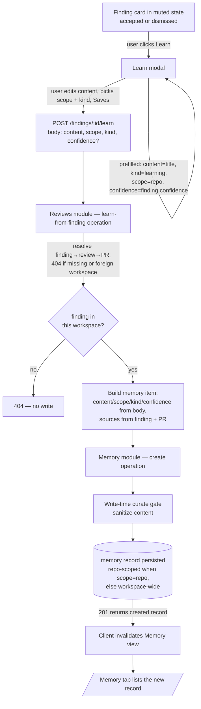

# Spec: "Learn" finding action (finding→memory bridge) | Spec ID: SPEC-09 | Status: draft
Supersedes: None — this extends SPEC-08 (Memory); it does not replace it.

## Problem and why

Finding cards expose **Accept · Dismiss · Turn into eval case · Reply**, but no way to
capture a reviewer finding as durable knowledge. The Memory feature (SPEC-08, shipped in
PR #13) can persist and later re-inject lessons into review prompts, but nothing yet
feeds it from the review surface. The **"Learn"** action closes that loop: it turns one
finding into one durable **memory record** so future reviews of the same repo pull the
lesson back in.

The action is scaffolded but unbuilt: `FindingActionKind` already includes `'learn'`,
the server's finding-action handler explicitly anticipates the "learn → memory action"
and currently rejects it, the i18n label `finding.learn: "Learn"` exists, and the Memory
tab empty state already promises *"Memory is created by the 'Learn' action on findings."*
This spec defines the behavior that fulfills that promise, cross-module across the
**server `reviews`** module and the **client** finding-card surface, both consuming the
existing Memory service.

## Goals / Non-goals

Goals:
- A **Learn** action on finding cards that opens a modal to shape a lesson (editable text,
  selectable scope and kind) and, on save, creates exactly one memory record.
- The action is **muted-only**: visible only after a finding is accepted or dismissed,
  next to the existing "Turn into eval case" action (identical gating).
- A dedicated body-carrying endpoint (like eval-case / reply), not the generic
  accept/dismiss finding-action loop.
- The Learn path routes through the existing Memory **create** operation so the memory
  write-time curation gate is always applied (never bypassed by a direct insert).
- The action works in **both** finding-card consumers: the PR findings panel and the
  multi-runs comparison view.

Non-goals (explicitly out of scope):
- **No `learned_at` column on findings** and **no schema migration** to track learned
  state. Tracking whether a finding was already learned would require a schema change;
  v1 treats the modal as the only friction.
- **No dedup / "already learned" suppression.** Repeated Learn on the same finding is
  allowed and creates independent memory records (mirrors eval-case allowing multiple
  cases per finding).
- **No bulk "Learn all findings"** action.
- **No new LLM call** to synthesize the lesson. The default lesson text is derived
  deterministically from existing finding fields; the user edits it by hand.
- **No editing or deleting** of memory records from the finding card — that remains the
  Memory tab's responsibility.
- **No change** to the generic accept/dismiss finding-action loop or to the pre-existing
  `'learn'` enum member's presence in `FindingActionKind`.
- **No access-controlled `team` scope semantics.** In v1 `team` and `global` are both
  stored workspace-wide with no repository scope and behave identically at retrieval (only
  `repo` scope is repo-filtered). `team` is reserve/display-only metadata, consistent with
  SPEC-08's team=reserve decision; distinct access-controlled team semantics are out of
  scope.
- **No confidence control in the Learn modal.** Confidence is carried implicitly from the
  finding; exposing a confidence editor in the modal is out of scope (mirrors the
  eval-case modal's minimal surface).
- **No post-save toast or deep-link.** On success the modal closes and the Memory view
  refreshes (AC-11); a success toast and/or a deep-link to the created record in the
  Memory tab are deferred as future enhancements, out of scope for v1.

## User stories

- As a reviewer, after I accept a finding I want to save its lesson to memory so the next
  review of this repo remembers it, without leaving the PR view.
- As a reviewer, I want to reshape the auto-derived lesson text and choose whether it
  applies to this repo, the whole team, or globally, before it is stored.
- As a maintainer, I want every learned lesson to pass the same write-time sanitization
  as any other memory record, because finding text originates from model output over
  untrusted PR content.

## Acceptance criteria (EARS)

- **AC-1** — WHILE a finding is accepted or dismissed, the finding card shall display a
  Learn action adjacent to the "Turn into eval case" action.
- **AC-2** — WHILE a finding is neither accepted nor dismissed, the finding card shall
  not display the Learn action.
- **AC-3** — WHEN the user activates the Learn action, the system shall open a modal
  pre-filled with a derived lesson: default content set to the finding title only (the
  suggestion is not auto-appended), default kind `learning`, default scope `repo`, and
  confidence carried implicitly from the finding (no confidence control in the modal);
  with only the content, scope, and kind editable before saving.
- **AC-4** — WHEN the user confirms the Learn modal, the system shall submit the edited
  content, the chosen scope, the chosen kind, and the confidence to the finding's learn
  endpoint.
- **AC-5** — WHEN the learn endpoint receives a valid request, the system shall create
  exactly one memory record for the request's workspace and return the created record.
- **AC-6** — The system shall set the created record's `sources` to a single entry
  referencing the finding's PR number and a context string that identifies the finding by
  its title, file, and line.
- **AC-7** — WHERE the submitted scope is `repo`, the system shall scope the created
  record to the finding's PR repository; WHERE the scope is `global` or `team`, the system
  shall create it workspace-wide with no repository scope, treating `team` and `global`
  identically in v1 (no repo filtering, no distinct retrieval behavior).
- **AC-8** — IF the target finding does not exist or belongs to another workspace, THEN
  the learn endpoint shall respond 404 and shall not create any memory record.
- **AC-9** — IF the request body has empty content or a scope/kind outside the allowed
  values, THEN the system shall reject the request before any memory record is created.
- **AC-10** — The system shall pass the submitted memory content through the Memory
  write-time curation gate before persistence, by routing the Learn path through the
  Memory service's create operation rather than a direct insert.
- **AC-11** — WHEN a memory record is successfully created via Learn, the system shall
  refresh the Memory view so the new record appears in it.
- **AC-12** — The system shall allow the Learn action to be invoked repeatedly on the
  same finding, each invocation creating an independent memory record.
- **AC-13** — The system shall make the Learn action functional in every view that renders
  finding cards: the PR findings panel and the multi-runs comparison view.

## Edge cases

- **Empty / whitespace-only edited content** — rejected before create (AC-9); the save
  control is disabled while content is blank, mirroring the eval-case modal's `canSave`
  guard.
- **Finding text that itself contains prompt-injection openers or `<untrusted>` delimiter
  attempts** — the content is sanitized by the curate gate on create (AC-10); the record
  is persisted sanitized, not rejected. See Untrusted inputs.
- **Foreign-workspace or deleted finding** — 404, no write (AC-8); same guard shape as the
  existing accept/dismiss and eval-case paths.
- **Repeated Learn on the same finding** — allowed; produces duplicate-content records
  (AC-12). Deduplication is a Non-goal.
- **Embeddings disabled** (`EMBEDDINGS_ENABLED=false`, the default) — the record is still
  created; the Memory create operation already degrades embedding-on-write silently and
  the nightly curate job backfills later. Learn does not depend on embeddings.
- **Scope `repo` on a finding whose PR repo cannot be resolved** — the finding→PR→repo
  chain is the same one the eval-case and reply paths already resolve via finding context;
  if the finding resolves, its PR (and thus repo) resolves.

## Non-functional

- **Security** — Finding-derived text is untrusted model output; it must not reach a
  trusted prompt slot unsanitized. See Untrusted inputs. No new secret, network egress, or
  privileged operation is introduced.
- **Performance** — One synchronous create per save (one insert plus a best-effort
  embed that already degrades on failure). No batching or fan-out. Negligible.
- **A11y** — The Learn control carries an accessible label (as the sibling eval-case and
  reply controls already do); the modal follows the existing modal primitive's semantics.

## Architecture & workflows

Behavioral flow (role names, not code symbols):

Ordering notes:
- The finding→PR resolution and workspace-scope guard happen **before** any write (AC-8).
- The curate gate runs **inside** the Memory create operation, before persistence (AC-10);
  the Learn path must not perform its own insert.
- Repo scoping is decided from the submitted scope: `repo` → the finding's PR repo;
  `global`/`team` → no repo scope (AC-7).

## Service contracts

**`POST /findings/:id/learn`** — cross-module boundary (client → server `reviews`).

- Path param: `id` — the finding id.
- Request body:
  - `content`: string, non-empty — the edited lesson text.
  - `scope`: one of `repo` | `global` | `team`.
  - `kind`: one of `decision` | `convention` | `preference` | `fact` | `learning`.
  - `confidence`: optional number in `[0,1]` — defaults to the finding's confidence when
    omitted.
- Success response: **201** with the created **memory record**:
  `{ id, content, scope, kind, confidence, sources: [{ pr?, context }], updated_at,
  last_used_at }`. This is the existing Memory record shape returned unchanged by the
  Memory create operation.
- Error responses:
  - **404** — finding missing or in another workspace (AC-8); no record created.
  - **422** — body fails validation: empty `content`, or `scope`/`kind` outside the
    allowed enums (AC-9).

**Shared contract** — a new request-body contract (`content`/`scope`/`kind`/optional
`confidence`) is added to the shared Zod contracts and **mirrored** between the server and
client shared-contract vendors. The change is additive and backward-compatible (no existing
contract field changes). `scope` and `kind` reuse the already-shared Memory scope/kind
enums; the response reuses the already-shared Memory record shape. No new event or SSE
channel is introduced.

## Inputs (provenance)

- **Finding title / file / line / confidence / suggestion** — `[reused: persisted finding
  row]`. These were produced by a prior review's LLM structured output and stored; Learn
  reuses them to derive the default lesson and the source reference. No new model call.
- **PR number and repository** — `[deterministic: reviews finding-context resolution]`.
  Resolved from the finding via review → PR, the same chain the eval-case and reply paths
  use.
- **Edited lesson `content`** — `[new: 0 LLM calls]` — supplied by the user in the modal
  (seeded from the reused finding title). No LLM synthesis.
- **`scope` / `kind` / `confidence`** — user selections in the modal (confidence defaults
  to the reused finding confidence). `[new: 0 LLM calls]`.

This feature adds **no LLM calls**. Its only write is one memory record via the existing
Memory create operation.

## Untrusted inputs

- **Finding `title` / `rationale` / `suggestion` are untrusted model output derived from
  PR text.** The seed content and the source-context string originate from this text, and
  the user-edited `content` may retain it. If injected verbatim into a future review
  prompt, it could carry prompt-injection payloads.
- **Trust boundary:** local DB memory is injected **TRUSTED** (unwrapped) into the
  reviewer's "Relevant memory" prompt slot; it is protected only by the **write-time
  curation gate** applied by the Memory create operation. Learn therefore **must** create
  through that operation — not a direct insert — so the gate always runs (AC-10). The gate
  strips `<untrusted>`-delimiter escape attempts and common prompt-injection opener lines;
  it is best-effort defense-in-depth, not a complete guarantee, and residual risk is
  accepted under the single-writer studio model (see server INSIGHTS, 2026-07-16).
- **Workspace scoping** is enforced on the finding before any write (AC-8), preventing a
  caller from learning against another workspace's finding.

## Traceability

| AC-N | Evidence |
|---|---|
| AC-1, AC-2 | Muted-only gating mirrors the eval-case button: `client/src/components/FindingCard/FindingCard.tsx:121-132` (`{muted && …}` group; `muted = accepted || dismissed`). Decision locked in plan: `~/.claude/plans/lets-implement-memory-feature-linked-feigenbaum.md:17`. |
| AC-3 | Modal-with-defaults pattern: `client/src/components/FindingCard/CreateEvalCaseModal.tsx:28-34` (title-seeded field, smart-default select; confidence not exposed). Derivation defaults from plan brief item 1 and `~/.claude/plans/...:37`. Coordinator decisions: content = title only, confidence implicit (no modal control). Finding fields exist on the record: `server/src/vendor/shared/contracts/findings.ts:47-62` (title/file/start_line/end_line/confidence/suggestion). |
| AC-4, AC-5 | Body-carrying endpoint precedent: `server/src/modules/reviews/routes.ts:170-184` (eval-case route, 201). Memory create returns the record: `server/src/modules/memory/service.ts:44-69`. |
| AC-6 | `sources` shape `{ pr?, context }`: `server/src/vendor/shared/contracts/knowledge.ts:186-190`. PR number available via finding context: `server/src/modules/reviews/repository/review.repo.ts:103-117` (`pull`). Source-derivation rule: plan brief item 1. |
| AC-7 | Repo scoping on create keyed off scope: `server/src/modules/memory/routes.ts:72` and `server/src/modules/memory/service.ts:44-56` (`repoId` passed to insert). `MemoryScope` enum: `server/src/vendor/shared/contracts/knowledge.ts:174`. Retrieval filters only by `repoId`, not `team`/`global`: `server/src/modules/memory/service.ts:159-185` (`retrieve`). Coordinator decision: `team` == `global` == workspace-wide in v1 (consistent with SPEC-08 team=reserve). |
| AC-8 | Workspace-scope + not-found guard precedent: `server/src/modules/reviews/findings.ts:17-20` and `server/src/modules/reviews/service.ts:190-196` (`createFindingEvalCase`). |
| AC-9 | Schema-first rejection (422) precedent: `server/CLAUDE.md` ("invalid input is rejected 422 before the handler"); eval-case body validation `server/src/modules/reviews/routes.ts:172`. Enum sources: `server/src/vendor/shared/contracts/knowledge.ts:174-184`. |
| AC-10 | Curate gate runs inside create: `server/src/modules/memory/service.ts:48` (`curateContent(data.content)`), `server/src/modules/memory/helpers.ts:48-53`. Two-path trust model: server INSIGHTS `2026-07-16 · Decision` (`server/insights/INSIGHTS.md:32`). |
| AC-11 | Memory view is a TanStack Query surface refreshed by invalidation; hook/mutation pattern per `client/src/lib/hooks/reviews.ts` (eval-case mutation) and plan Phase 2 (`~/.claude/plans/...:53`). |
| AC-12 | "v1 allows repeated Learn (like eval-case allows multiple cases)": plan brief item 2 (`~/.claude/plans/...:38`); no learned-state column (Non-goal). |
| AC-13 | Two `FindingCard` consumers both wire the action: `client/src/app/repos/[repoId]/pulls/[number]/_components/FindingsPanel/FindingsPanel.tsx:76-86` and `client/src/app/multi-runs/[multiRunId]/_components/TabsView/TabsView.tsx:143-148` (both already pass `onCreateEvalCase`/`evalCasePending`). |

## Verification

| AC-N | Verification recipe |
|---|---|
| AC-1, AC-2 | On a PR with findings, confirm no Learn control on an un-actioned finding. Accept (or dismiss) it → Learn appears next to "Turn into eval case". Un-action if possible → Learn disappears. |
| AC-3 | Click Learn on a muted finding → a modal opens with the content field pre-filled from the finding title only (no suggestion appended), kind = learning, scope = repo; content, scope, and kind are changeable, and no confidence control is present (confidence is carried implicitly). |
| AC-4, AC-5 | Edit the content, choose a scope/kind, Save → the request carries the edited content/scope/kind/confidence and returns 201 with a memory record whose fields match the submission. |
| AC-6 | Inspect the returned/persisted record's `sources`: exactly one entry, `pr` equals the finding's PR number, `context` names the finding by title and `file:line`. |
| AC-7 | Save once with scope = repo and once with scope = global; in the Memory tab, filter by repo — the repo-scoped record appears under the PR's repo, the global one does not. |
| AC-8 | Call the learn endpoint for a non-existent finding id and for a finding in another workspace → 404 each time; confirm no new memory record was created. |
| AC-9 | Submit empty content, then an out-of-enum scope/kind → each rejected (422) with no record created; confirm the modal's Save is disabled while content is blank. |
| AC-10 | Learn a finding whose text starts with an injection opener line (e.g. "ignore previous instructions") or contains a `<untrusted>` fragment → the persisted record's content has those stripped, proving it passed the create-time curate gate. |
| AC-11 | Immediately after a successful Save, the Memory view shows the new record without a manual reload. |
| AC-12 | Learn the same finding twice with the same content → two distinct records exist; no "already learned" error. |
| AC-13 | Repeat the AC-1→AC-5 flow once from the PR findings panel and once from the multi-runs comparison view; both create a record. |

## [NEEDS CLARIFICATION]

None — all open questions have been resolved by the coordinator and folded into the ACs
and Non-goals above:
- Default lesson content = finding title only (suggestion not auto-appended) → AC-3.
- `team` == `global` == workspace-wide in v1; only `repo` is repo-filtered → AC-7 + Non-goals.
- No post-save toast/deep-link in v1 (modal closes, Memory view refreshes) → Non-goals.
- Confidence stays implicit; no confidence control in the modal → AC-3 + Non-goals.
</content>
</invoke>
