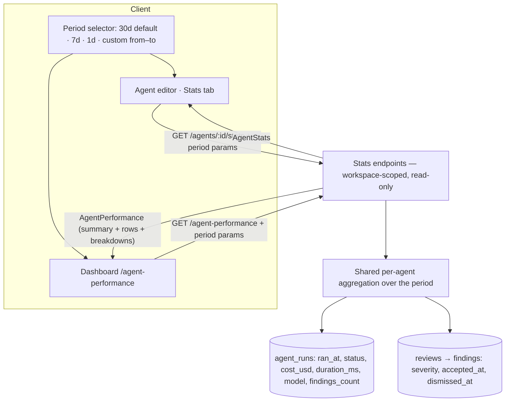
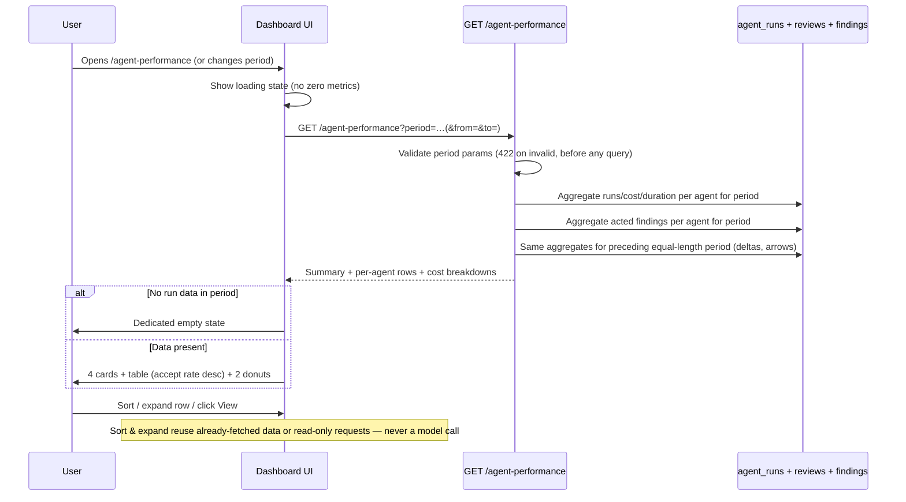
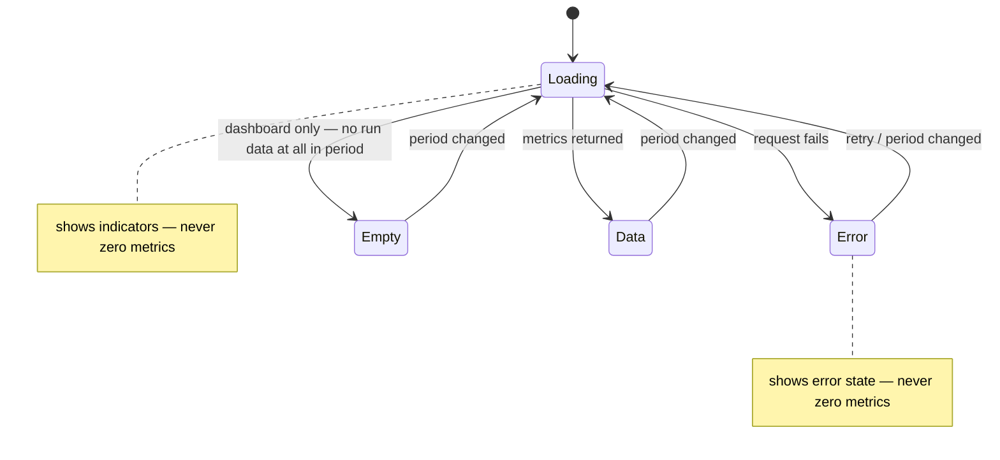

# Spec: Agent Performance (per-agent Stats tab + global dashboard) | Spec ID: SPEC-10 | Status: approved

## Problem and why

DevDigest persists rich per-run and per-finding attribution data (runs, cost, duration, findings, accept/dismiss actions) — SPEC-03 deliberately preserved it "as raw material for a future Per-Agent Stats feature." That feature has no UI: a user who runs multiple review agents cannot answer "which agents earn their keep?" The headline quality signal — accept rate — exists only as scattered per-run rows. The unused `AgentStats` Zod contract for `GET /agents/:id/stats` has existed in the shared vendor package since the observability work but was never wired to an endpoint or a screen. Meanwhile the sidebar already ships a dead "Agent Performance" nav entry pointing at `/agent-performance`, which today renders nothing.

This feature adds two connected read-only surfaces over already-persisted data — **zero LLM/model calls**:

- **A. Per-agent Stats tab** in the agent editor (alongside Config / Skills / Context / Evals / CI) showing one agent's metrics for a selected period.
- **B. Global Agent Performance dashboard** at `/agent-performance` comparing all agents for a selected period: summary cards, a sortable table, and cost breakdowns by agent and by model.

The two surfaces must agree by construction: the same aggregation logic serves both, so a number seen in the dashboard table always equals the same number on that agent's Stats tab for the same period.

---

## Goals / Non-goals

**Goals**

1. Add a "Stats" tab to the agent editor showing, for a selected period: runs, findings totals (total / accepted / dismissed / pending), accept rate (headline quality signal), dismiss rate, avg findings per run, total and avg cost, avg latency/duration, findings by severity, and a recent-runs trend chart.
2. Wire the existing, unused `AgentStats` shared contract to a real `GET /agents/:id/stats` endpoint with period parameters. Any new fields are additive and backward-compatible; server and client vendor copies stay mirrored.
3. Build the global Agent Performance dashboard at `/agent-performance` per the finished design mock: header with quality-signal tagline and period selector; 4 summary cards (total runs with mini trend, total cost with delta vs previous period, avg accept rate with radial indicator, most-active agent); an agent comparison table sorted by accept rate descending, whose View action deep-links to the agent's Stats tab with the selected period preserved; two cost-breakdown donuts (by agent, by model).
4. Support period presets 30 days (default) / 7 days / 1 day plus a custom from–to date range, passed as query parameters and applied to everything on screen, on both surfaces.
5. Serve the dashboard from **one aggregate read endpoint** backed by the **same repository aggregation** as the per-agent stats endpoint — consistency between surfaces is guaranteed by construction, not by parallel re-implementation, and the dashboard loads in one round-trip instead of N per-agent calls.
6. Handle empty, loading, and error states honestly: a zero-run agent renders correctly, a fully-empty dashboard gets a dedicated empty state, and loading/error never display fictitious zero metrics.

**Non-goals**

- **Any model/LLM call** — both surfaces are pure read-only aggregations of saved `agent_runs` + `reviews`/`findings` data. Nothing here invokes a provider.
- **Any write endpoint** — no mutation of runs, findings, or agents; no new tables, columns, or migrations (all needed columns already exist).
- **Navigation changes** — the sidebar entry for `/agent-performance` already exists in the vendored nav config and must not be touched.
- **Schema changes** — the `agent_runs`, `reviews`, and `findings` tables already carry every field required.
- **Backfilling cost data** — runs persisted before cost tracking have null `cost_usd`; they are excluded from cost math (see Edge cases), not retroactively priced.
- **Changing the single- or multi-agent review flows** — this feature only reads what they persist.
- **CSV/report export, scheduled digests, or alerting** — out of scope for v1.

---

## User stories

- As a team lead, I want a dashboard comparing all my review agents by accept rate, cost, and speed for a chosen period — so I can decide which agents earn their keep and which to retire or retune.
- As a reviewer-agent author, I want a Stats tab on my agent's editor page showing its runs, findings breakdown, accept/dismiss rates, cost, and latency over a period — so I can measure whether my prompt and skill changes actually improved quality.
- As a budget owner, I want the period's total review cost broken down by agent and by model — so I can see where the money goes and whether an expensive model is justified by its accept rate.
- As a team lead scanning the dashboard, I want to click any agent row and land on that agent's page with the same numbers — so I never have to reconcile two disagreeing values for the same metric.
- As a user with a brand-new agent (zero runs), I want its Stats tab and dashboard row to say honestly that there is no data yet — not show zeros that look like a measured (terrible) performance.

---

## Acceptance criteria (EARS)

### Per-agent Stats tab

**AC-1** WHEN the user opens the "Stats" tab in the agent editor (shown alongside the existing Config, Skills, Context, Evals, and CI tabs), the system shall display, for the selected period: run count, findings totals (total, accepted, dismissed, pending), accept rate, dismiss rate, average findings per run, total cost, average cost per run, average latency/duration, a findings-by-severity breakdown (CRITICAL / WARNING / SUGGESTION), and a recent-runs trend chart plotting findings per run (one point per run within the period, oldest → newest).

**AC-2** The per-agent stats response shall conform to the existing shared `AgentStats` contract (`agent_id`, `agent_name`, `runs`, `findings_total`, `accepted`, `dismissed`, `pending`, `accept_rate`, `dismiss_rate`, `avg_findings_per_run`, `total_cost_usd`, `avg_cost_usd`, `avg_latency_ms`, `findings_by_severity`, `trend`); any newly introduced fields shall be additive and backward-compatible, and the server and client vendor copies of the contract shall remain mirrored.

**AC-3** WHEN a per-agent stats request arrives without period parameters, the system shall default the period to the last 30 days.

### Period selection (both surfaces)

**AC-4** WHEN the user selects a period preset (30 days, 7 days, or 1 day) or a custom from–to date range, the system shall pass the selection as query parameters to the stats endpoints and recompute every metric, card, table row, trend, and breakdown on the current screen for exactly that range.

**AC-5** IF a stats request carries invalid period parameters (unknown preset value, malformed date, `from` later than `to`, or a custom range longer than the allowed maximum), THEN the system shall reject the request with a validation error before any aggregation executes, and the UI shall prevent submitting a custom range where `from` is later than `to`.

### Dashboard — summary cards

**AC-6** WHEN the dashboard at `/agent-performance` loads with data for the selected period, the system shall display four summary cards: (a) total runs with a mini trend line of runs over the period; (b) total cost with a delta versus the immediately preceding period of equal length; (c) the average accept rate with a radial/ring indicator, computed as the pooled rate — all accepted findings ÷ all acted findings across every agent in the period — rendered as a placeholder (not 0%) when no findings were acted on; (d) the most-active agent showing its run count and accept rate.

**AC-7** The most-active agent shall be the agent with the largest run count in the selected period; IF two or more agents tie on run count, THEN the system shall break the tie deterministically (most recent last-run first, then agent name ascending).

**AC-8** IF the immediately preceding period contains no cost data, THEN the system shall render the total-cost card without a delta indicator rather than displaying a computed-from-nothing or infinite percentage; the same rule applies to per-agent accept-rate trend arrows when the preceding period has no acted findings for that agent.

### Dashboard — table

**AC-9** WHEN the dashboard table renders, the system shall show one row per agent with columns: Agent (icon + name), Runs, Avg cost, Avg duration, Accept rate (with an up/down trend arrow versus the preceding period), Last run (relative time), and a View action; the table shall be sorted by accept rate descending by default, with agents whose accept rate is null (no acted findings) placed after all agents with a defined accept rate, and ties broken deterministically (runs descending, then agent name ascending).

**AC-10** WHEN the user clicks a row's View action (or the row itself), the system shall navigate to that agent's editor opened on its Stats tab with the dashboard's currently selected period preselected — so the user lands on the same numbers without re-selecting the period; WHEN the user expands a row, the system shall show a short trend of that agent's recent runs (findings per run) within the period.

### Dashboard — cost breakdown

**AC-11** WHEN the dashboard renders with cost data, the system shall display two cost-breakdown blocks: a donut of cost by agent and a donut of cost by model, each with a legend listing the segment names and their cost amounts.

**AC-12** The total cost for the selected period shall equal the sum of per-agent costs for that period, and both cost breakdowns (by agent and by model) shall each sum to that same total.

### Cross-surface consistency

**AC-13** For any agent and any selected period, the Runs, Avg cost, Avg duration, and Accept rate values shown in the dashboard table shall equal the values shown on that same agent's Stats tab for the same period — both surfaces shall be served by the same aggregation logic so the equality holds by construction.

**AC-14** Accept rate shall be computed as accepted ÷ (accepted + dismissed) over acted findings only — pending findings (neither accepted nor dismissed) are excluded from the denominator — and shall be null (rendered as a placeholder, not 0%) when the agent has no acted findings in the period; this semantic shall be identical on both surfaces.

**AC-15** A finding shall belong to a period when its producing review's creation time falls within that period, and its accepted/dismissed state shall be read as of query time (an accept action performed after the period ends still counts for a finding produced inside the period); this attribution rule shall be identical on both surfaces.

### Data honesty — empty, null, loading, error

**AC-16** IF an agent has zero runs in the selected period, THEN the system shall render its Stats tab with zero counts and placeholder markers for undefined ratios/averages (accept rate, dismiss rate, avg cost, avg duration render as "—"-style placeholders, not fabricated zeros), and shall render its dashboard row with Runs = 0 and the same placeholders, without crashing either surface.

**AC-17** IF no agent has any run in the selected period, THEN the dashboard shall display a dedicated empty state (explaining there is no run data for the period and how to get some) instead of rendering cards, table, and donuts with zeros.

**AC-18** WHILE stats data is loading on either surface, the system shall display loading indicators and shall not display zero-valued metrics; IF a stats request fails, THEN the system shall display an error state with no fictitious metric values.

**AC-19** WHEN aggregating cost and duration, the system shall exclude null `cost_usd` and null `duration_ms` values (failed/cancelled runs and pre-cost-tracking rows) from sums and from average denominators — a null shall never be coerced to zero inside an average — while the run count shall include runs of every status.

### Read-only guarantee

**AC-20** The system shall never trigger a review, LLM call, or any model invocation from either surface; reloading, changing the period, sorting, expanding rows, and navigating shall issue only read-only requests that aggregate saved `agent_runs` and `reviews`/`findings` data.

### Period boundaries and deleted-agent attribution

**AC-22** WHEN a custom from–to range is applied, the system shall interpret its boundaries as UTC day boundaries — `from` at 00:00:00.000 UTC through `to` at 23:59:59.999 UTC — identically on both surfaces; preset periods (30d/7d/1d) shall remain relative windows ending at the moment of the request.

**AC-23** IF runs within the selected period belong to an agent that has since been deleted (the run's agent reference is null), THEN the system shall aggregate those runs into a single synthetic "(deleted agent)" bucket that appears as a row in the dashboard table and as a segment in the by-agent cost breakdown — so the period's total cost equals the sum of the by-agent breakdown exactly and no spend silently disappears; the synthetic bucket shall carry no View navigation and its runs shall count toward the summary totals and the by-model breakdown.

### Visual structure

**AC-21** The dashboard's visual structure shall match the finished design: a header ("Agent Performance — Which agents earn their keep — accept rate is the quality signal") with the period selector, followed by the summary-cards row, the agent table, and the two cost-breakdown blocks.

---

## Edge cases

Derived from the schema, the existing skills-stats aggregation precedent, INSIGHTS.md entries, and existing shared-contract comments:

1. **Runs with null `cost_usd` / `duration_ms`** — failed and cancelled runs store null cost and may store null duration ("stored at completion; null on failed/cancelled"), and rows written before cost tracking was added also lack cost (the shared `AgentRunSummary` contract documents this with `.nullish()`). Per AC-19 they count toward run totals but are excluded from cost/duration sums and averages.
2. **Pending findings** — findings with neither `accepted_at` nor `dismissed_at`. Excluded from the accept-rate denominator (AC-14) but included in `findings_total` and `pending`. Note: the existing skills-stats precedent divides accepted by *all* findings — this spec deliberately follows the `AgentStats` contract comment ("0..1 over acted findings") instead, and both new surfaces must share the acted-findings semantic.
3. **Deleted agents** — `agent_runs.agent_id` is `set null` on agent deletion, so runs (and their costs) can exist with no owning agent. Silently dropping them would break AC-12's "total = sum of per-agent costs" against the true period spend. Resolved by stakeholder decision: a synthetic "(deleted agent)" bucket in the table and by-agent breakdown (AC-23) keeps every total reconcilable. AC-13's cross-surface equality applies only to real agents — the synthetic bucket has no Stats tab and no View navigation.
4. **Custom range crossing DST / timezones** — a from–to range expressed as calendar dates is ambiguous about which instant a "day" starts at. Resolved by stakeholder decision: custom boundaries are UTC day boundaries (AC-22); presets are relative windows (now minus N days) and are timezone-safe by construction.
5. **Previous period empty** — the delta on the total-cost card and per-agent trend arrows compare against the immediately preceding period of equal length; when that period has no data the comparison is undefined and no delta/arrow is shown (AC-8), never a division-by-zero artifact.
6. **Accept-rate ties and nulls in sorting** — default sort is accept rate descending; null accept rates sort after defined ones, ties break by runs descending then name ascending (AC-9), so the ordering is deterministic and testable.
7. **Agents existing but zero runs vs no agents at all** — an agent with zero runs in the period still gets a correct row/tab with placeholders (AC-16); only when *no* run data exists for the whole period does the dashboard swap to the dedicated empty state (AC-17). A workspace with zero agents also lands in the empty state.
8. **Agent with runs but zero findings** — `findings_count` can be 0 or null; avg findings per run computes over runs, accept rate is null (no acted findings), severity breakdown is all zeros. Must render, not divide by zero.
9. **Period = 1 day trend granularity** — the runs mini-trend and per-agent trends must degrade gracefully when the period contains very few data points (a single point renders as a point/flat line, not a crash).
10. **Cost precision** — `cost_usd` is stored as `numeric(12,8)`; summing many small per-run costs must not drift between the total card, the by-agent donut, and the by-model donut (AC-12 requires all three to reconcile).
11. **Runs missing `model`** — the by-model donut needs a bucket for runs whose `model` column is null (e.g. an "unknown" segment) so their cost is not dropped from the by-model total (AC-12).

---

## Non-functional

**Performance**

- The dashboard shall load its data in a single aggregate request (no N-per-agent fan-out from the client); the aggregate endpoint shall respond within 1 s under normal DB load for a workspace with dozens of agents and thousands of runs.
- The per-agent stats endpoint shall respond within 500 ms under normal DB load.
- Changing the period re-queries the endpoints; it shall not re-render stale data as if it belonged to the new period (loading state per AC-18 covers the transition).

**Security**

- Both endpoints are workspace-scoped reads: every handler extracts workspace context and filters all aggregation to that workspace before returning anything.
- Period query parameters are validated schema-first at the route boundary (AC-5) — invalid input is rejected before any query runs, and date values are never interpolated raw into SQL.
- The endpoints expose only aggregate numbers, agent names, and model identifiers — no finding bodies, prompts, or trace content.

**Accessibility**

- Trend arrows, the radial accept-rate indicator, and donut segments shall each carry their value as accessible text (not color/shape alone).
- The period selector and the table sorting/expansion controls shall be keyboard-operable, and the expanded-row trend shall have a text summary equivalent.

---

## Architecture & workflows

### Both surfaces share one aggregation



The dashboard's per-agent rows and the Stats tab's numbers come from the same aggregation, filtered to one agent for the tab — AC-13's equality holds by construction.

### Dashboard load sequence



### Screen state machine (both surfaces)



---

## Service contracts

Both routes are workspace-scoped, read-only, and validated schema-first at the boundary.

### Shared period query parameters (both endpoints)

| Param | Type | Rules |
|---|---|---|
| `period` | `'30d' \| '7d' \| '1d' \| 'custom'` | Optional; default `30d`. |
| `from` | date (`YYYY-MM-DD`) | Required iff `period=custom`. |
| `to` | date (`YYYY-MM-DD`) | Required iff `period=custom`; must satisfy `from <= to`; span bounded by a maximum (e.g. one year) to keep aggregation cheap. |

Custom `from`/`to` boundaries are interpreted as UTC day boundaries — `from` 00:00:00.000 UTC through `to` 23:59:59.999 UTC (AC-22, stakeholder decision).

Invalid combinations are rejected with a validation error before the handler runs (AC-5).

### `GET /agents/:id/stats` (new endpoint, existing contract)

| Aspect | Detail |
|---|---|
| Auth | Workspace-scoped |
| Params | `id` — UUID of the agent |
| Query | Shared period parameters above |
| Response 200 | The existing shared `AgentStats` contract, computed for the selected period: `{ agent_id, agent_name, runs, findings_total, accepted, dismissed, pending, accept_rate (nullable), dismiss_rate (nullable), avg_findings_per_run (nullable), total_cost_usd (nullable), avg_cost_usd (nullable), avg_latency_ms (nullable), findings_by_severity: { CRITICAL, WARNING, SUGGESTION }, trend: StatPoint[] }` |
| Response 404 | Agent not found in this workspace |
| Response 422 | Invalid period parameters |

The contract already exists unused in the shared vendor package (both mirrors). Any additional fields (e.g. period echo) must be additive/backward-compatible, mirrored on both sides in lockstep.

### `GET /agent-performance` (new endpoint, new contract)

| Aspect | Detail |
|---|---|
| Auth | Workspace-scoped |
| Query | Shared period parameters above |
| Response 200 | `AgentPerformance` (new shared contract, shape below) |
| Response 422 | Invalid period parameters |

`AgentPerformance` response shape (new shared Zod contract; both vendor copies updated in lockstep):

```
{
  period: { preset, from, to },                     // echo of the resolved window
  summary: {
    total_runs: int,
    runs_trend: StatPoint[],                        // mini trend over the period (reuses StatPoint)
    total_cost_usd: number | null,
    previous_total_cost_usd: number | null,         // null → UI shows no delta (AC-8)
    avg_accept_rate: number | null,                 // pooled: all accepted ÷ all acted across agents; null when nothing acted (AC-6)
    most_active: { agent_id, agent_name, runs, accept_rate: number | null } | null
  },
  agents: [{
    agent_id,                                       // null for the synthetic "(deleted agent)" bucket row (AC-23)
    agent_name,                                     // "(deleted agent)" label for the synthetic bucket
    runs: int,
    avg_cost_usd: number | null,
    avg_duration_ms: number | null,
    accept_rate: number | null,
    previous_accept_rate: number | null,            // null → no trend arrow (AC-8)
    last_run_at: string | null,                     // ISO timestamp; UI renders relative time
    trend: StatPoint[]                              // expanded-row recent-runs trend — value = findings per run (AC-10)
  }],
  cost_by_agent: [{ agent_id, agent_name, cost_usd }],   // agent_id null for the "(deleted agent)" segment (AC-23)
  cost_by_model: [{ model, cost_usd }]              // model may be an 'unknown' bucket (edge case 11)
}
```

Per-agent fields in `agents[]` carry the same values, for the same period, as `GET /agents/:id/stats` returns for that agent (AC-13) — both endpoints delegate to one aggregation. The `AgentStats.trend` and per-agent `trend` sparklines both plot findings per run (stakeholder decision), reusing the generic `StatPoint` shape.

### Cross-module impact

- **Server**: two new read routes and the aggregation behind them; the existing `AgentStats` contract gains a consumer; one new `AgentPerformance` contract added to the shared vendor package.
- **Client**: a new Stats tab in the agent editor, a new `/agent-performance` screen behind the already-existing sidebar nav entry (no nav changes), and the mirrored vendor contract update. Rendering reuses the existing vendored chart primitives (metric cards, donut, sparkline/line chart) — no new chart primitives are created.

---

## Inputs (provenance)

| Input | Provenance tag | Notes |
|---|---|---|
| `agent_runs` rows (ranAt, status, provider, model, durationMs, costUsd, findingsCount, agentId, source) | `[reused: persisted by the existing run-executor at run completion — single-, multi-agent, and CI runs alike]` | Cost stored at completion; null on failed/cancelled and on pre-cost-tracking rows |
| `reviews` → `findings` rows (severity, acceptedAt, dismissedAt) | `[reused: persisted by the review pipeline; accept/dismiss timestamps written by the existing finding-action endpoints]` | Attribution to an agent via `reviews.agent_id` / `reviews.run_id` |
| Agent identity (id, name, icon) | `[reused: existing agents table records shown throughout the app]` | |
| Period selection (`period`, `from`, `to`) | `[deterministic: client query parameters, schema-validated at the route boundary before any aggregation]` | Presets resolved server-side into a concrete window |
| Previous-period aggregates (deltas, trend arrows) | `[deterministic: same stored data re-aggregated for the preceding equal-length window]` | No new data source |
| Seed/demo data for verification | `[deterministic: idempotent server seed — 2 agents + PR #482]` | |
| LLM calls | `[new: 0 LLM calls]` | The defining constraint of this feature — nothing here invokes a model |

---

## Untrusted inputs

| Untrusted input | Risk | Mitigation |
|---|---|---|
| `period`, `from`, `to` query parameters | Malformed dates, inverted ranges (`from > to`), absurdly wide ranges forcing expensive full-table aggregation; injection attempts via date strings | Schema-first validation at the route boundary: enum-checked preset, strict date format, `from <= to`, bounded maximum span; rejected 422 before any query; values bound as parameters, never interpolated into SQL (AC-5) |
| `:id` route parameter | Non-UUID probing, cross-workspace ID guessing | UUID format validation + workspace-scoped lookup; 404 when not owned by the caller's workspace |
| Agent names displayed in cards, table, and donut legends | User-authored text; could contain markup | Rendered as escaped text, never as HTML |
| `model` / `provider` strings from stored runs | Originate from run configuration/adapters; displayed in the by-model legend | Rendered as escaped text; treated as opaque labels, never executed or used to select code paths client-side |
| None of the above feeds a prompt | — | There are no LLM calls anywhere in this feature, so no prompt-injection surface exists (AC-20) |

---

## Traceability

| AC-N | Evidence |
|---|---|
| AC-1 | Stakeholder requirement: "A 'Stats' tab in the agent editor (alongside Config/Skills/Context/Evals/CI) showing … runs, findings totals, accept rate (headline quality signal), dismiss rate, avg findings/run, total & avg cost, avg latency/duration, findings by severity, and a recent-runs trend"; `client/src/app/agents/[id]/_components/AgentEditor/constants.ts:11-17` (existing TABS array: config, skills, context, evals, ci — no stats tab today); stakeholder decision 2026-07-16: "Recent-runs trend metric: findings per run" |
| AC-2 | `server/src/vendor/shared/contracts/observability.ts:94-120` (unused `AgentStats` + `StatPoint` contracts with exactly these fields); `client/src/vendor/shared/contracts/observability.ts:94-120` (client mirror confirmed identical); `client/insights/INSIGHTS.md` 2026-06-25 ("client/src/vendor/shared/ is a manual mirror of server/src/vendor/shared/ — always update both"); CLAUDE.md do-not-touch rule: "changes must stay backward-compatible" |
| AC-3, AC-4 | Stakeholder decision (final): "Period: presets 30 days (default) / 7 days / 1 day, PLUS custom from–to date range; passed as query params to the API; applies to everything on screen"; precedent for a 30-day default window: `server/src/modules/skills/repository.ts:171` (`stats()` — `thirtyDaysAgo` cutoff) |
| AC-5 | Stakeholder requirement: "untrusted-input handling (period query params validation: from<=to, bounded range)"; server convention: schema-first Zod route validation rejects invalid input 422 before the handler (server/CLAUDE.md "Validation is schema-first") |
| AC-6, AC-21 | Stakeholder design (final): "Header 'Agent Performance — Which agents earn their keep — accept rate is the quality signal' + period selector … 4 summary cards: Total runs (with mini trend line), Total cost (with delta vs previous period), Avg accept rate (with radial/ring indicator), Most-active agent … summary cards row, table, two cost-breakdown blocks"; stakeholder decision 2026-07-16: "Avg accept rate card: pooled rate (all accepted ÷ all acted across agents), null when nothing acted" |
| AC-7 | Stakeholder decision (final): "Most-active agent = largest run count in period"; tie-break is a spec determinism addition (see edge case 6) |
| AC-8 | Stakeholder edge-case list: "delta vs previous period when previous period empty"; stakeholder AC 5: "loading/error must never show fictitious zero metrics" (extended to undefined deltas) |
| AC-9 | Stakeholder design (final): "Table sorted by accept rate desc by default: columns Agent (icon+name) · Runs · Avg cost · Avg duration · Accept rate (with up/down trend arrow) · Last run (relative time) · View"; null/tie ordering from stakeholder edge-case hunt "accept-rate tie sorting" |
| AC-10 | Stakeholder design: "Row 'View'/click navigates to that agent's page; expanding a row shows a short trend of that agent's recent runs"; stakeholder decision 2026-07-16 approving the surfaced improvement into scope: "the dashboard row's View action deep-links to the agent's Stats tab with the same period preselected"; stakeholder decision 2026-07-16: trend metric = findings per run |
| AC-11 | Stakeholder design: "Cost breakdown section: two blocks — donut 'By agent' (cost per agent + legend with amounts) and donut 'By model' (cost per model + legend with amounts)"; `client/src/vendor/ui/charts/` contains Donut, MetricCard, Sparkline, LineChart, BarRow; usage precedent `client/src/app/skills/_components/SkillDetailPanel/StatsTab.tsx` (MetricCard grid + Donut with legend) |
| AC-12 | Stakeholder hard AC 2: "Total cost = sum of per-agent costs for the selected period; both breakdowns (by agent, by model) sum to the same total"; `server/src/db/schema/runs.ts:34` (`cost_usd numeric(12,8)` on agent_runs — single stored cost source for all three views) |
| AC-13 | Stakeholder hard AC 1: "Runs, avg cost, avg duration, accept rate in the dashboard table MUST equal the same agent's Stats tab values for the same period (same aggregation logic/endpoint family — match by construction)" |
| AC-14 | `server/src/vendor/shared/contracts/observability.ts:102` (contract comment: "accept-rate is the headline quality signal. 0..1 over acted findings"); `server/src/db/schema/reviews.ts:44-45` (`accepted_at`, `dismissed_at` timestamps on findings); stakeholder: "Accept rate semantics per existing contract comment … accepted / (accepted+dismissed); pending excluded — keep consistent between both surfaces" |
| AC-15 | Aggregation precedent: `server/src/modules/skills/repository.ts:171` (`stats()` filters reviews by `created_at >= cutoff` and reads `accepted_at` state as of query time); `server/src/db/schema/reviews.ts:17-19` (`reviews.agent_id`, `reviews.run_id` link findings to the producing agent/run) |
| AC-16 | Stakeholder hard AC 4: "Zero-run agent renders correctly (not crash, not fake numbers)"; `AgentStats` contract makes every ratio/average nullable (`observability.ts:106-111`) — null is the honest zero-data value |
| AC-17 | Stakeholder hard AC 4: "a dashboard with no data at all gets a dedicated empty state" |
| AC-18 | Stakeholder hard AC 5: "Loading/error states never show fictitious zero metrics" |
| AC-19 | `server/src/db/schema/runs.ts:33-34` (comment: "Actual cost in USD for this run (stored at completion; null on failed/cancelled)"); `server/src/vendor/shared/contracts/observability.ts:161` (`AgentRunSummary.cost_usd` comment: "rows written before cost tracking was added lack this field"); stakeholder edge-case hunt: "runs with null costUsd/durationMs (failed runs)" |
| AC-20 | Stakeholder hard AC 6: "Reloading, sorting, expanding rows NEVER triggers a review or any model call — endpoints are read-only aggregations of saved agent_runs + reviews/findings" |
| AC-22 | Stakeholder decision 2026-07-16: "Custom-range boundaries: UTC day boundaries for from/to"; stakeholder edge-case hunt: "custom range crossing DST/timezones" |
| AC-23 | Stakeholder decision 2026-07-16: "Deleted-agent runs: synthetic '(deleted agent)' bucket in the table and by-agent breakdown so Total cost = sum of breakdowns reconciles exactly"; `server/src/db/schema/runs.ts:15` (`agent_id` references agents with `onDelete: 'set null'`) |

---

## Verification

All recipes assume seeded demo data (`2 agents + PR #482` from the idempotent server seed) plus a handful of completed/failed runs with accepted, dismissed, and pending findings created via the existing review flow.

| AC-N | Verification recipe |
|---|---|
| AC-1, AC-2, AC-3 | Open an agent's editor page. Verify a "Stats" tab appears alongside Config/Skills/Context/Evals/CI. Open it with no period chosen and verify every listed metric renders for the last 30 days, and that each trend point's value equals the findings count of the corresponding run (compare against the run history). Call the per-agent stats endpoint directly and validate the response parses against the shared `AgentStats` contract; diff the server and client vendor contract files and verify they are identical. |
| AC-4 | On both surfaces, switch between 30d/7d/1d and a custom range that excludes some known runs. Verify every card, row, trend, and donut changes to reflect only runs inside the range, and that the request URL carries the period query parameters. |
| AC-5 | Request stats with `period=banana`, `from=2026-99-99`, `from > to`, and a 5-year custom span. Verify each returns a validation error and (via logs/DB timing) that no aggregation query ran. In the UI, try picking a custom range with from after to and verify it cannot be submitted. |
| AC-6, AC-21 | Load `/agent-performance` with seeded data. Verify header text + period selector, then the four cards in order (total runs + mini trend, total cost + delta, avg accept rate + radial, most-active agent with runs and accept rate), then the table, then the two donut blocks — matching the design mock's structure. Hand-compute the pooled accept rate (all accepted ÷ all acted findings across agents, from the DB) and verify the radial card shows that value — not the mean of per-agent rates; with zero acted findings in the period verify the card shows a placeholder, not 0%. |
| AC-7 | Give agent A more runs than agent B in the period. Verify the most-active card names agent A with its run and accept-rate values. Equalize run counts and verify the tie resolves per the deterministic rule. |
| AC-8 | Pick a custom range whose preceding equal-length window contains no runs. Verify the total-cost card shows no delta (no percentage, no infinity) and table rows show no trend arrow for agents with no acted findings in the previous window. |
| AC-9 | Verify column set and order match the design; verify default ordering is accept rate descending, agents with null accept rate appear last, and two agents with equal accept rates order by runs then name. |
| AC-10 | Select a non-default period (e.g. 7 days or a custom range), then click a row's View action — verify the browser lands on that agent's editor with the Stats tab active and the same period already applied (the displayed numbers match the dashboard row without touching the period selector). Expand a row — verify a recent-runs trend renders using only runs from the selected period, with each point's value equal to that run's findings count. |
| AC-11, AC-12 | With runs across ≥2 agents and ≥2 models, verify both donuts render with legends showing amounts. Sum the by-agent legend amounts, the by-model legend amounts, and compare both to the total-cost card and to a direct DB sum of `cost_usd` over the period — all four must match. |
| AC-13 | For each seeded agent and for each of the three presets plus one custom range: record Runs/Avg cost/Avg duration/Accept rate from the dashboard row, open that agent's Stats tab with the same period, and verify the four values are identical. |
| AC-14 | Create an agent with 2 accepted, 1 dismissed, and 3 pending findings in the period. Verify accept rate shows 2/(2+1) ≈ 67% on both surfaces (not 2/6), pending shows 3, and an agent with only pending findings shows a placeholder accept rate, not 0%. |
| AC-15 | Produce a finding inside the period, then accept it after the period's end date; query with the custom range covering only the production date. Verify the finding counts as accepted for that period on both surfaces. |
| AC-16 | Create a new agent with zero runs. Open its Stats tab — verify zero counts, placeholder ratios, no crash. Verify its dashboard row shows Runs = 0 with placeholders and sorts after agents with data. |
| AC-17 | Select a custom range in the distant past with no runs for any agent. Verify the dashboard shows the dedicated empty state and none of the cards/table/donuts render. |
| AC-18 | Throttle the network (dev tools) and load both surfaces — verify loading indicators appear and no metric shows 0 during load. Stop the API and reload — verify an error state with no metric values. |
| AC-19 | Seed one failed run (null cost/duration) alongside completed runs. Verify the run count includes the failed run, while avg cost and avg duration equal the average over only the non-null rows (hand-compute from the DB), and total cost excludes the null row. |
| AC-20 | Open the network panel; load the dashboard, change periods, sort, expand rows, reload, and open a Stats tab. Verify every request is a read (GET) to stats/performance endpoints, no run/review endpoint is ever called, and the `agent_runs` table row count is unchanged afterwards. |
| AC-22 | From a machine set to a non-UTC timezone, seed a run at 23:30 UTC on day D. Query a custom range ending on day D and verify the run is included; query a range ending on day D−1 and verify it is excluded — i.e. boundaries follow UTC days, not the browser's local days. Verify the Stats tab and dashboard agree for the same custom range. |
| AC-23 | Seed runs (with cost) for an agent, then delete the agent. Verify the dashboard shows a "(deleted agent)" row in the table and a segment in the by-agent donut carrying those runs' cost; verify the row has no View navigation; verify total runs, total cost, and the by-model donut still include the deleted agent's runs; verify total cost still equals the sum of the by-agent legend exactly. |

---

## [NEEDS CLARIFICATION]

None — all four open questions from the draft were resolved by stakeholder decision on 2026-07-16 and folded into the spec body:

1. **Custom-range timezone semantics** → UTC day boundaries for `from`/`to` (AC-22; Service contracts period-parameter note).
2. **Runs belonging to deleted agents** → synthetic "(deleted agent)" bucket in the table and by-agent breakdown so Total cost = sum of breakdowns reconciles exactly (AC-23; edge case 3).
3. **"Avg accept rate" card definition** → pooled rate: all accepted ÷ all acted findings across agents, null when nothing acted (AC-6).
4. **Recent-runs trend metric** → findings per run, on both the Stats-tab sparkline and the dashboard expanded row (AC-1, AC-10).

The draft's suggested improvement — the dashboard row's View action deep-linking to the agent's Stats tab with the same period preselected — was approved into scope by the same stakeholder decision and is now a requirement (AC-10).
